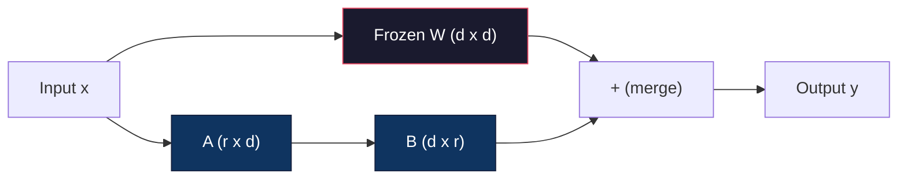
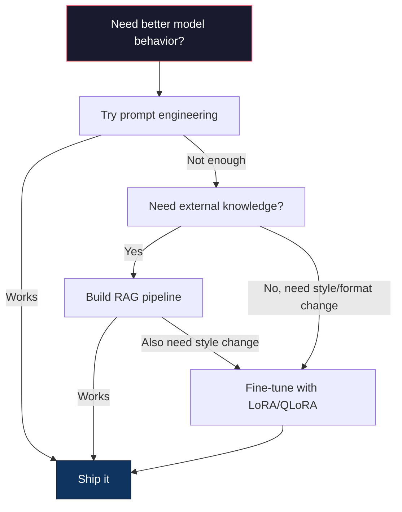

# Use LoRA & QLoRA  realizar o ajuste fino

> Para um modelo 7B fazer uma sintonização completa  precisa de 56GB de VRAM。 você não tem tanto。 a maioria das empresas também não têm。 LoRA  através do treinamento de menos de 1% de parâmetros, deixe-se-á sintonizar no meio de 6GB com um modelo。 isso não é um compromisso - em grande parte das tarefas pode alcançar a qualidade de sintonização completa。 todo o sistema de sintonização de código aberto é construído sobre essa técnica。

**Type:** Build
**Languages:** Python
**Prerequisites:** Phase 10, Lesson 06 (Instruction Tuning / SFT)
**Time:** ~75 minutes
**Related:**Fase 10 de zero-precursão SFT/DPO loop.

## Objectivo de aprendizagem
- 通过将低排适配矩阵(A 和 B) Inject into pre-trained model of attention layers to achieve LoRA
- 計算 LoRA 相比全细调的参数节省:rank r、d_model 维度时, train is 2*r*d 个参数, not d^2
- Utilize QLoRA(4 bits base quantizada + adaptadores LoRA)fine-tune um modelo, fazendo sua adaptação consumo de classe de memória GPU
- Para a implementação, comparar os adaptadores com os adaptadores sem

## 问题
Você tem um modelo básico. Llama 3 8B. Você quer que ele use o idioma da sua empresa para responder ao cliente.

Em fp16 cada parâmetro ocupa 2 bytes。 apenas carga de peso. Durante o treinamento, você também precisa de gradientes(16GB)、Adam's estados de otimização(momento + variação 需要32GB) bem como ativações。

A100 80GB 勉强能装下──两张 A100 Em provedores de nuvem 上每小时花费 $3-4。用 50,000 个样本训练 3 个 epochs 需要 6-10 小时。每次实验就是 $30-40: Para ajustar os hiperparâmetros, já gastaste 400 dólares antes de implementar qualquer coisa.

Se o expandir para Llama 3 70B, o número vai ficar assustador. Só pesam 140 GB.

Há também uma questão mais profunda. A ajuste perfeito de cada modelo é um peso de cada um. Se você ajustar os dados do suporte ao cliente, pode prejudicar a capacidade geral do modelo. Isso é chamado esquecimento catastrófico.

Você precisa de um método: treinar menos parâmetros, usar menos memória e não destruir o modelo.

## 概念
### LoRA: Adaptação de baixo grau

Edward Hu e colegas da Microsoft publicaram em junho de 2021 LoRA。Insight of paper is:fine-tuning period weight updates with low internal rank。You don't need to update a 4096x4096 weight matrix.

Matemática como abaixo:

```
y = Wx
```

Dentre eles, W é uma matriz d_out x d_in. Para a projeção de atenção 4096x4096, é 16,777,216 个参数.

LoRA 结 W,并添加一个低排分解:

```
y = Wx + BAx
```

Entre eles B é (d_out x r), A é (r x d_in)。ranqueio r 远小于 d - normalmente é 8、16 ou 32、

 Para 4096x4096 camada superior de r=16:
- Parâmetros primitivos: 4996 x 4096 = 16.777.216
- LoRA 参数:(4096 x 16) + (16 x 4096) = 65,536 + 65,536 = 131,072
-  reduzido proporção:131,072 / 16,777,216 = 0,78%

O seu treinamento foi de 0,78% de parâmetros, mas obteve uma qualidade de 95-100%.



A utiliza随机 Gaussian 初始化──B 初始化为零── isto significa contribuição do LoRA desde zero开始 -- modelo desde o comportamento original começar a treinar, então gradualmente aprender a se adaptar──

### O Fator de Escalada: Alfa

LoRA  introduz um fator de escalação alfa, para controlar a atualização de baixa posição sobre o grau de impacto da produção:

```
y = Wx + (alpha / r) * BAx
```

Quando alfa = r 时, escala é 1x。 quando alfa = 2r(常见默认值)

实践建议:
- alfa = 2 * rank é habitual na comunidade约定(原始论文在多数实验中使用 alfa = rank)
- alfa = rank 提供 1x escalação, conservado mas estável
- Alpha maior significa atualizações maiores a cada passo, pode aumentar a receita, também pode causar instabilidade

### Onde aplicar LoRA

Uma Transformadora tem muitas camadas lineares. Não é preciso dar a todas as camadas.

| Target Layers | Trainable Params (7B) | Quality |
|--------------|----------------------|---------|
| q_proj only | 4.7M | 好 |
| q_proj + v_proj | 9.4M | 更好 |
| q_proj + k_proj + v_proj + o_proj | 18.9M | 对 attention 最好 |
| All linear (attention + MLP) | 37.7M | 边际收益，参数量 2x |

O sistema de análise de dados é um sistema de análise de dados que permite a análise de dados e de dados.

### Seleção de classificação

Rango r  controlo de adaptação

| Rank | Trainable Params (per layer) | Best For |
|------|---------------------------|----------|
| 4 | 32,768 | 简单 classification、sentiment |
| 8 | 65,536 | 单领域 Q&A、summarization |
| 16 | 131,072 | 多领域任务、instruction following |
| 32 | 262,144 | 复杂 reasoning、代码生成 |
| 64 | 524,288 | 大多数任务收益递减 |
| 128 | 1,048,576 | 很少值得使用 |

Hu et al.  indicaram que, para tarefas simples, r=4  já pode capturar a maior parte da adaptação ⋅r=8 和 r=16 é a escolha mais comum na prática ⋅ R=64  muito pouco melhorou a qualidade, e começou a perder a memória 优势 ⋅

### QLoRA: Quantização de 4 bits + LoRA

Tim Dettmers e colegas da Universidade de Washington publicaram em maio de 2023 o QLoRA.

Isso vai mudar significativamente a memória.

| Method | Weight Memory (7B) | Training Memory (7B) | GPU Required |
|--------|-------------------|---------------------|-------------|
| Full fine-tune (fp16) | 14GB | ~56GB | 1x A100 80GB |
| LoRA (fp16 base) | 14GB | ~18GB | 1x A100 40GB |
| QLoRA (4-bit base) | 3.5GB | ~6GB | 1x RTX 3090 24GB |

QLoRA tem três contribuições técnicas:

**NF4 (Normal Float 4-bit)**Uma nova série de dados foi concebida para pesos de rede neural. Os pesos de rede neural se conformam à distribuição normal. O NF4 colocou seus 16 níveis de quantização em quantidades de distribuição normal padrão. Para os dados normalmente distribuídos, isso é o melhor em termos de informação. Em comparação com a quantização uniforme de 4 bits (INT4) ou Float4, a perda de informação é menor.

**Double quantization**Para o modelo 7B, esta quantização dupla quantizará essas constantes até fp8, reduzirá a carga de carga até 0,1 GB.

**Paged optimizers**Durante o treinamento, o optimizador na longa sequência estados ((Adam's momentum 和 variance) pode superar a memória da GPU。Otimizadores de página Usando memória unificada NVIDIA, em memória da GPU 耗尽时自动把优化器状态页到CPU RAM,并在需要时页回来──这能避免OOM crashes,代价是一些吞吐量──

### A questão da qualidade

減参数或量化基会损害质量吗?多篇论文的结果:

| Method | MMLU (5-shot) | MT-Bench | HumanEval |
|--------|--------------|----------|-----------|
| Full fine-tune (Llama 2 7B) | 48.3 | 6.72 | 14.6 |
| LoRA r=16 | 47.9 | 6.68 | 14.0 |
| QLoRA r=16 (NF4) | 47.5 | 6.61 | 13.4 |
| QLoRA r=64 (NF4) | 48.1 | 6.70 | 14.2 |

LoRA em r=16 , na maioria dos índices de referência, é igual a 1% em comparação com o ajuste completo, mas não usa 90% de memória.

### Custos reais

Em 50.000 个样本上细调 Llama 3 8B(3 épocas):

| Method | GPU | Time | Cost |
|--------|-----|------|------|
| Full fine-tune | 2x A100 80GB | 8 hours | ~$32 |
| LoRA r=16 | 1x A100 40GB | 4 hours | ~$8 |
| QLoRA r=16 | 1x RTX 4090 24GB | 6 hours | ~$5 |
| QLoRA r=16 (Unsloth) | 1x RTX 4090 24GB | 2.5 hours | ~$2 |
| QLoRA r=16 | 1x T4 16GB | 12 hours | ~$4 |

O custo de QLoRA em GPU de nível de consumo único não chega a um almoço. É por isso que o ajuste de peso aberto da comunidade surgiu em 2023, e é por isso que cada quadro de treinamento em 2026 está em conformidade para fornecer QLoRA.

### A pilha de PEFT 2026

| Framework | What it is | Pick when |
|-----------|-----------|-----------|
| **Hugging Face PEFT** | 规范的 LoRA/QLoRA/DoRA/IA3 library | 你想要原始控制权，并且 training loop 已经基于 `transformers.Trainer` |
| **TRL** | HF 的 reinforcement-from-feedback trainers（SFT, DPO, GRPO, PPO, ORPO） | 你在 SFT 后需要 DPO/GRPO；构建在 PEFT 之上 |
| **Unsloth** | forward/backward pass 的 Triton-kernel 重写 | 你想要 2-5x 加速 + 一半 VRAM 且无 accuracy loss；Llama/Mistral/Qwen 系列 |
| **Axolotl** | PEFT + TRL + DeepSpeed + Unsloth 之上的 YAML-config wrapper | 你想要可复现、版本控制的 training runs |
| **LLaMA-Factory** | PEFT + TRL 之上的 GUI/CLI/API | 你想要 zero-code fine-tuning；支持 100+ model families |
| **torchtune** | Native PyTorch recipes，无 `transformers` 依赖 | 你想要最少依赖，且组织已经标准化使用 PyTorch |

经验法则:研究用途或一次性实验 → PEFT──可重复的生产管 line── 启用 Unsloth kernels的 Axolotl──一次性原型── LLaMA-Factory──

### Adaptadores de fusão

Depois do treino, você tem duas coisas: um modelo base e um pequeno adaptador LoRA (normalmente 10-100MB)

1. **保持分离**:carregando modelo base, em que se carrega adaptador.

2. **永久合并**:计算 W' = W + (alpha/r) * BA,并把结果保存为一个新的全模型──merged model与原始模型 大小相同──没有推断过费──没有适配器 需要管理──

Se serve várias tarefas (((client support adapter、代码 adapter、翻译 adapter), manter separ separ separ separ.

Utilizando a combinação de vários adaptadores de alta fusão  técnica:

- **TIES-Merging**(Yadav et al. 2023): cortar 参数, resolver conflitos de sinais, então合并── reduzir adaptadores 之间的干扰──
- **DARE**(Yu et al. 2023): em fusão, antes de deixar de lado os parâmetros do adaptador,并重新缩放剩余部分──组合能力时出人意料地有效──
- **Task arithmetic**A partir de agora, o sistema de correção de dados pode ser usado para a correção de dados.

### Quando não se deve ajustar

A ajuste é a terceira opção, não a primeira.

**第一：prompt engineering。**写一个更好的系统提示――加入几次例――使用链思维――这没有成本,只需几分钟――如果提示已经能达到80%,你可能不需要细调――

**第二：RAG。**Se o modelo precisa saber os seus dados específicos, os documentos, a base de conhecimentos, o catálogo de produtos, a recuperação é mais fácil de fazer, mais conveniente, mais fácil de manter.

**第三：fine-tuning。**Quando você precisa de um modelo  adotar um estilo específico format ou padrão de raciocínio, e o prompting  não pode ser realizado quando o usar. Quando você precisa de uma saída estruturada coerente 时―― quando você precisa colocar um modelo maior destilação para um modelo menor 时―― quando a latência  é importante, e você suporta não de poucos tiros de prompting 带来的额外代币 时――




```figure
lora-params
```

## Construí-lo
Nós usamos PyTorch puro desde zero para realizar LoRA. Não há bibliotecas. Não há magia. Você vai construir a camada LoRA, injetá-la em um modelo, treinar-la, e colocar pesos.

### 步骤 1: A camada LoRA

```python
import torch
import torch.nn as nn
import math

class LoRALayer(nn.Module):
    def __init__(self, in_features, out_features, rank=8, alpha=16):
        super().__init__()
        self.rank = rank
        self.alpha = alpha
        self.scaling = alpha / rank

        self.A = nn.Parameter(torch.randn(in_features, rank) * (1 / math.sqrt(rank)))
        self.B = nn.Parameter(torch.zeros(rank, out_features))

    def forward(self, x):
        return (x @ self.A @ self.B) * self.scaling
```

Um uso de redução de valor de como inicialização.

### 步骤 2: Layer Linear LoRA-Wrapped

```python
class LinearWithLoRA(nn.Module):
    def __init__(self, linear, rank=8, alpha=16):
        super().__init__()
        self.linear = linear
        self.lora = LoRALayer(
            linear.in_features, linear.out_features, rank, alpha
        )

        for param in self.linear.parameters():
            param.requires_grad = False

    def forward(self, x):
        return self.linear(x) + self.lora(x)
```

Layer linear original 被结──只有 LoRA 参数(A 和 B) 是可训练的──

### 步骤 3: Injectar LoRA em um Modelo

```python
def inject_lora(model, target_modules, rank=8, alpha=16):
    for param in model.parameters():
        param.requires_grad = False

    lora_layers = {}
    for name, module in model.named_modules():
        if isinstance(module, nn.Linear):
            if any(t in name for t in target_modules):
                parent_name = ".".join(name.split(".")[:-1])
                child_name = name.split(".")[-1]
                parent = dict(model.named_modules())[parent_name]
                lora_linear = LinearWithLoRA(module, rank, alpha)
                setattr(parent, child_name, lora_linear)
                lora_layers[name] = lora_linear
    return lora_layers
```

Primeiro,结模型中每个参数──然后穿越模型树,找到与你的目标名匹配的线性层,并使用LoRA-wrapped 版本替换它们──LoRA A和B matrizes são as únicas parâmetros treináveis em todo o modelo──

### 步骤 4: Parâmetros de contagem

```python
def count_parameters(model):
    total = sum(p.numel() for p in model.parameters())
    trainable = sum(p.numel() for p in model.parameters() if p.requires_grad)
    frozen = total - trainable
    return {
        "total": total,
        "trainable": trainable,
        "frozen": frozen,
        "trainable_pct": 100 * trainable / total if total > 0 else 0
    }
```

### 步骤 5: Merge Pesos de volta

```python
def merge_lora_weights(model):
    for name, module in model.named_modules():
        if isinstance(module, LinearWithLoRA):
            with torch.no_grad():
                merged = (
                    module.lora.A @ module.lora.B
                ) * module.lora.scaling
                module.linear.weight.data += merged.T
            parent_name = ".".join(name.split(".")[:-1])
            child_name = name.split(".")[-1]
            if parent_name:
                parent = dict(model.named_modules())[parent_name]
            else:
                parent = model
            setattr(parent, child_name, module.linear)
```

合并后,LoRA camadas 消失──model 与原始模型 大小相同,adaptation 被进重量──没有推断过费──

### 步骤 6: Quantização QLoRA simulada

```python
def quantize_to_nf4(tensor, block_size=64):
    blocks = tensor.reshape(-1, block_size)
    scales = blocks.abs().max(dim=1, keepdim=True).values / 7.0
    scales = torch.clamp(scales, min=1e-8)
    quantized = torch.round(blocks / scales).clamp(-8, 7).to(torch.int8)
    return quantized, scales

def dequantize_from_nf4(quantized, scales, original_shape):
    dequantized = quantized.float() * scales
    return dequantized.reshape(original_shape)
```

Isto através de pesos  mapeados para 16 níveis de separação dentro de cada bloco de 64 elementos  para simulação de quantização de 4 bits ⋅ produção de nível QLoRA usando a biblioteca de bitsandbytes ⋅ GPU para implementar real NF4 ⋅

### 步骤 7: Loop de treinamento

```python
def train_lora(model, data, epochs=5, lr=1e-3, batch_size=4):
    optimizer = torch.optim.AdamW(
        [p for p in model.parameters() if p.requires_grad], lr=lr
    )
    criterion = nn.MSELoss()

    losses = []
    for epoch in range(epochs):
        epoch_loss = 0.0
        n_batches = 0
        indices = torch.randperm(len(data["inputs"]))

        for i in range(0, len(indices), batch_size):
            batch_idx = indices[i:i + batch_size]
            x = data["inputs"][batch_idx]
            y = data["targets"][batch_idx]

            output = model(x)
            loss = criterion(output, y)

            optimizer.zero_grad()
            loss.backward()
            optimizer.step()

            epoch_loss += loss.item()
            n_batches += 1

        avg_loss = epoch_loss / n_batches
        losses.append(avg_loss)

    return losses
```

### 步骤 8: Demo completa

```python
def demo():
    torch.manual_seed(42)
    d_model = 256
    n_classes = 10

    model = nn.Sequential(
        nn.Linear(d_model, 512),
        nn.ReLU(),
        nn.Linear(512, 512),
        nn.ReLU(),
        nn.Linear(512, n_classes),
    )

    n_samples = 500
    x = torch.randn(n_samples, d_model)
    y = torch.randint(0, n_classes, (n_samples,))
    y_onehot = torch.zeros(n_samples, n_classes).scatter_(1, y.unsqueeze(1), 1.0)

    data = {"inputs": x, "targets": y_onehot}

    params_before = count_parameters(model)

    lora_layers = inject_lora(
        model, target_modules=["0", "2"], rank=8, alpha=16
    )

    params_after = count_parameters(model)

    losses = train_lora(model, data, epochs=20, lr=1e-3)

    merge_lora_weights(model)
    params_merged = count_parameters(model)

    return {
        "params_before": params_before,
        "params_after": params_after,
        "params_merged": params_merged,
        "losses": losses,
    }
```

Esta demonstração  criar um pequeno modelo, colocar o LoRA em duas camadas, treiná-lo,并把 weights 合并回去──参数计数从完全训练可 降低到 LoRA training 期间约1%训练可,然后在合并后回到原始架构──

## Use-o
Em Abraçamento Face 生态中, para o modelo real usar LoRA aproximadamente apenas precisa de 20 行:

```python
from transformers import AutoModelForCausalLM, AutoTokenizer
from peft import LoraConfig, get_peft_model, TaskType

model = AutoModelForCausalLM.from_pretrained("meta-llama/Llama-3.1-8B")
tokenizer = AutoTokenizer.from_pretrained("meta-llama/Llama-3.1-8B")

lora_config = LoraConfig(
    task_type=TaskType.CAUSAL_LM,
    r=16,
    lora_alpha=32,
    lora_dropout=0.05,
    target_modules=["q_proj", "v_proj"],
)

model = get_peft_model(model, lora_config)
model.print_trainable_parameters()
```

Para QLoRA, adicionar quantização de bits e bytes:

```python
from transformers import BitsAndBytesConfig

bnb_config = BitsAndBytesConfig(
    load_in_4bit=True,
    bnb_4bit_quant_type="nf4",
    bnb_4bit_compute_dtype=torch.bfloat16,
    bnb_4bit_use_double_quant=True,
)

model = AutoModelForCausalLM.from_pretrained(
    "meta-llama/Llama-3.1-8B",
    quantization_config=bnb_config,
    device_map="auto",
)

model = get_peft_model(model, lora_config)
```

Assim, o mesmo ciclo de treinamento, o mesmo pipeline de dados, o modelo base, agora, com 4 bits, os adaptadores LoRA, com o treinamento fp16, o processo inteiro pode ser instalado em 6 GB.

Uso de um treinador de caras em abraços

```python
from transformers import TrainingArguments, Trainer
from datasets import load_dataset

dataset = load_dataset("tatsu-lab/alpaca", split="train[:5000]")

training_args = TrainingArguments(
    output_dir="./lora-llama",
    num_train_epochs=3,
    per_device_train_batch_size=4,
    gradient_accumulation_steps=4,
    learning_rate=2e-4,
    fp16=True,
    logging_steps=10,
    save_strategy="epoch",
    optim="paged_adamw_8bit",
)

trainer = Trainer(
    model=model,
    args=training_args,
    train_dataset=dataset,
)

trainer.train()

model.save_pretrained("./lora-adapter")
```

保存的适配器是10-100MB──base model 保持不变──你可以在 Hugging Face Hub上分享适配器,而无需重新分发完整模型──

## Entrega-o
本课产出:
- `outputs/prompt-lora-advisor.md`- Um prompt, ajudar-te a determinar a tarefa específica do LoRA, os módulos de alvo e os hiperparâmetros.
- `outputs/skill-fine-tuning-guide.md`- Uma habilidade, ensinar agentes a decidir quando e como ajustar a árvore de decisão

## 练习
1. **Rank ablation study。**Utilize ranks 2、4、8、16、32 和 64 运行 demo── desenhar a perda final vs rank── encontrar o resultado e a redução de pontos, isto é, o rank 翻倍不再让损失 减半的位置── para as características de 256 dim  上的简单分类任务, this should be located r=8-16 附近──

2. **Target module comparison。**Modificar a injecção, fazendo com que se diferenciem apenas a camada-alvo "0""", apenas a camada-alvo "2"", apenas a camada-alvo "4" e todas as três camadas.

3. **Quantization error analysis。**获取训练模型 在 quantize_to_nf4 / dequantize_from_nf4 前后的权重矩阵――计算平均平方错误、最大绝对错误,以及原始与重重重之间的相关性──尝试 block_size 取值 32、64、128 和 256──

4. **Multi-adapter serving。**Em diferentes grupos de dados (até índices versus índices impares) treinar dois adaptadores LoRA.

5. **Merge vs. unmerged inference。**Comparar igualmente 100 entradas em LoRA modelo em merge_lora_weights 前后的输出――验证输出相同(在 1e-5 的浮点耐受内) ・・・然后基准 两者的推断速度--合并 应该稍快,因为它是单次矩阵乘法,而不是两次──

## 关键术语
| Term | What people say | What it actually means |
|------|----------------|----------------------|
| LoRA | "Efficient fine-tuning" | Low-Rank Adaptation：冻结 base weights，训练两个小 matrices A 和 B，其乘积近似完整 weight update |
| QLoRA | "Fine-tune on a laptop" | Quantized LoRA：以 4-bit NF4 加载 base model，在其上用 fp16 训练 LoRA adapters，从而让 7B fine-tuning 能在 6GB VRAM 中完成 |
| Rank (r) | "How much the model can learn" | A 和 B matrices 的内部维度；控制表达能力与参数量之间的权衡 |
| Alpha | "LoRA learning rate" | 应用于 LoRA output 的 scaling factor；alpha/r 会缩放 adaptation 对 final output 的贡献 |
| NF4 | "4-bit quantization" | Normal Float 4：一种 4-bit data type，其 quantization levels 位于 normal distribution quantiles 上，对 Neural Network weights 最优 |
| Adapter | "The small trained part" | 作为单独文件保存的 LoRA A 和 B matrices（10-100MB），可以加载到 base model 的任意副本之上 |
| Target modules | "Which layers to LoRA" | 注入 LoRA adapters 的特定 linear layers（q_proj、v_proj 等） |
| Merging | "Bake it in" | 计算 W + (alpha/r) * BA 并替换原始 weight，从而消除 inference 时的 adapter overhead |
| Paged optimizers | "Don't OOM during training" | 当 GPU memory 耗尽时，将 optimizer states（Adam momentum、variance）offload 到 CPU |
| Catastrophic forgetting | "Fine-tuning broke everything else" | 更新所有 weights 导致 model 丢失先前学到的能力 |

## 延伸阅读
- Hu et al., "LoRA: Adaptação de baixo nível de grandes modelos de linguagem" (2021) -- 介绍低秩分解方法的原始论文,在 GPT-3 175B 上测试,rank 低至 4
- Dettmers et al., "QLoRA: Eficiente Fine-Tuning de Modelos de Língua Quantizada" (2023) --  introdução de NF4、 dupla quantização 和 paged optimizers, fazer单张 48GB GPU 上 fine-tune 65B 成为可能
- Documentação da biblioteca PEFT (huggingface.co/docs/peft) -- Abraçando o rosto 生态中 LoRA、QLoRA 及其他参数-efficient 方法的标准图书馆
- Yadav et al., "TIES-Merging: Resolving Interference When Merging Models" (2023) -- 在不降低质量情况下组合多个LoRA adaptadores 的技术
- [Rafailov et al., "Direct Preference Optimization: Your Language Model is Secretly a Reward Model" (NeurIPS 2023)](https://arxiv.org/abs/2305.18290)-- DPO 推导;SFT 后的偏好调整阶段,无需奖励模式──
- [TRL documentation](https://huggingface.co/docs/trl/)- Não .`SFTTrainer`- Não.`DPOTrainer`- Não.`KTOTrainer`E também com PEFT/bitsandbytes/Unsloth 集成面的官方参考──
- [Unsloth documentation](https://docs.unsloth.ai/)-- núcleos fundidos, permite ajustar o rendimento de memória 翻倍并将 memorização 减半;TRL 下方的性能层──
- [Axolotl documentation](https://axolotl-ai-cloud.github.io/axolotl/)-- JAML-configurado multi-GPU SFT/DPO/QLoRA treinador;相对对手写脚本的配置-as-code 替代方案──
