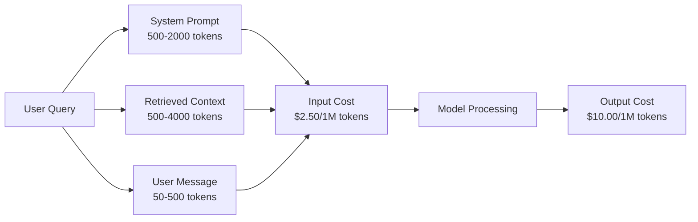
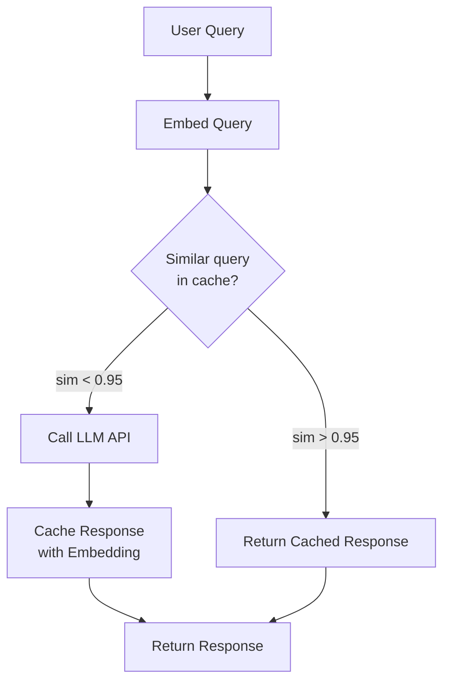
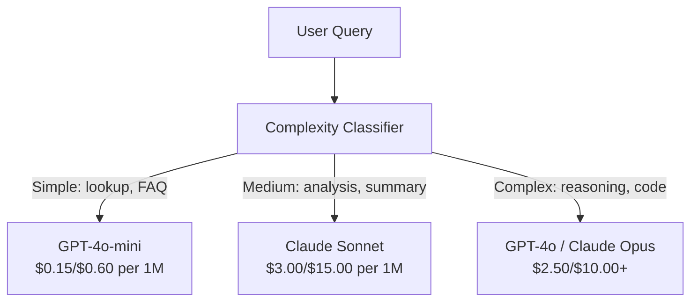

# 缓存、限流与成本优化

> A maioria das empresas iniciantes de IA não morre de um modelo ruim, mas de um modelo económico de unidade ruim. Uma vez, o GPT-4o 调用只花几分之一美分── 10.000 usuários cada qual faz 10调用每天, apenas tokens de entrada precisam gastar US $ 250 - Isso ainda não começou a receber US $ 1.──

**类型：**Construção
**语言：**Python
**前置要求：**Fase 11 Lição 09 (Calling for Function)
**时间：**- 45 minutos.
**相关：**Fase 11 · 15 (Prompt Caching)  本课涵盖应用层缓存(semântica cache、exacto hash cache、model routing) ――Lessão 15 涵盖 provider 层 prompt caching(Antropic cache_control、OpenAI automatic、Gemini CachedContent)──两者结合可降低50-95% 成本。

## Objectivo de aprendizagem

-                                                                                                                                                                                                                                                                                                                                                                                                                                                                                                                              
- 计算不同供应商的单请求成本,并实现 Token 感知流限与预算告警
- 构建成本优化层, contendo compressão rápida, roteamento de modelos (昂贵模型 vs 便宜模型) e armazenamento em cache de resposta
- design segmentação estratégias de cache, para diferentes tipos de consulta usar a correspondência exata, semântica semelhança e prefixo caching

## 问题

Você construiu um chatbot RAG. Funciona muito bem.

Então o livro chegou.

GPT-5 para cada milhão de tokens de entrada $5，每百万 output $15―Claude Opus 4.7 entrada $15 / output $75―Gemini 3 Pro entrada $1.25 / output $5―GPT-5-mini $0.25/$2── Abaixo preço apenas como exemplo; Always check provider 当前的价格页──

Aqui estão as matemáticas das empresas que vão matar:

- 10.000 日利用户
- Cada usuário 10 vezes por dia
- Cada consulta 1.000 tokens de entrada ((system prompt + contexto + mensagem do usuário)
- 500 tokens de saída por cada resposta

**每日 input 成本：**10 000 x 10 x 1000 / 1.000.000 x $2.50 = **$250/dia**
**每日 output 成本：**10 000 x 10 x 500 / 1 milhão x $10.00 = **$500/dia**
**每月总计：** **$22,500/month**

Isto é apenas LLM. Mais uma vez, Embeddings, Vector Database, Administração, Infraestrutura. Um chatbot por mês pode chegar a US$ 30.000.

O que é muito errado é que 40% a 60% dessas consultas são repetidas. Os usuários usam diferentes palavras para fazer perguntas sobre o mesmo problema.

Estás a pagar o preço total por sobra.

## 核心概念

### Um Mestrado em Direito Jurídico

Cada API 调用 tem cinco componentes de custo.



Os pedidos do sistema são um custo silencioso. Um sistema de 1.500 tokens é um pedido de cada pedido enviado, só esse prefixo é necessário gastar no milhão de pedidos.$3.75。每天 100K 请求时，这就是 $375 dias - US$ 11.250 por mês - e estes textos nunca mudam.

### Provedor Caching:内置折扣

Até 2026, três grandes provedores principais fornecerão caching rápido do lado do fornecedor, mas o mecanismo é diferente.

| Provider | 机制 | 折扣 | 最小值 | Cache Duration |
|----------|-----------|----------|---------|----------------|
| Anthropic | 显式 cache_control 标记 | cache hit 享 90% 折扣（写入多付 25%） | 1,024 tokens（Sonnet/Opus），2,048（Haiku） | 默认 5 分钟；扩展 1 小时（2x 写入溢价） |
| OpenAI | 自动 prefix matching | cache hit 享 50% 折扣 | 1,024 tokens | 尽力最多 1 小时 |
| Google Gemini | 显式 CachedContent API | ~75% 降幅（另加存储） | 4,096（Flash）/ 32,768（Pro） | 用户可配置 TTL |

**Anthropic 的方式**É evidente.`cache_control: {"type": "ephemeral"}`标记提示 中的部分──第一次请求支付25% 写入溢价──后续使用相同的预写的请求获得90%折──一个2000-Token的系统提示,正常成本 $0.005，cache hit 时成本 $0,000625―100K Peço poupança $437.50/dia―

**OpenAI 的方式**É automático. Qualquer prefixo de resposta correspondente ao pedido anterior obtém 50% de desconto. Não precisa de marcação.

### Caching semântico: sua própria definição

Caching do fornecedor apenas é aplicável ao mesmo prefixo. Caching semântico 处理更困难的情况:不同查询具有相同含义.

"Qual é a política de devolução?" 和 "Como eu devolvo um item?" 是不同字符串,但意相同──semantic cache 会对两个查询做 嵌入,计算 cosine similarity;如果相似性超过值(通常 0.92-0.95),就返回缓存响应──



Embedding 成本可以忽略不计──OpenAI's text-embedding-3-small 每百万代币 $0.02── Comparado com o LLM completo 调用相比, verificação缓存 quase não custa dinheiro──

### Caching exacto: hash e correspondência

对于确定性调用(temperatura=0、 identico modelo、 identico prompt),exact caching 更简单也更快──对完整的提示做 Hash,检查缓存,命中就返回──

É muito adequado.
- Sistema de resposta + conteúdo fixo + 相同用户查询
- Use the same tool definitions of Função chamada
- Com um arquivo foi processado várias vezes processamento de lote

### Limitação de taxa: proteger o seu orçamento

O limite não é apenas para ser justo. É sobre a existência.

**Token bucket algorithm：**Cada usuário obtém um balde com N tokens, e é completado por R por segundo. Uma solicitação será feita a partir do balde, consumindo tokens. Se o balde estiver em branco, a solicitação será rejeitada. Isso permite que o fluxo de dados seja completado por uma única vez.

**Per-user quotas：**按用户级设置每日/每月 Token 限量──

| Tier | Daily Token Limit | Max Requests/min | Model Access |
|------|------------------|------------------|-------------|
| Free | 50,000 | 10 | 仅 GPT-4o-mini |
| Pro | 500,000 | 60 | GPT-4o、Claude Sonnet |
| Enterprise | 5,000,000 | 300 | 所有模型 |

### Roteamento de modelo: colocar modelos adequados para tarefas adequadas

Não é que todas as consultas precisem de GPT-4o.

"A que horas a loja fecha?" Não preciso.$10/M-output 的模型。GPT-4o-mini 以 $O resultado de 0,60/M pode ser muito bem processado. O resultado de Claude Haiku pode ser também processado. Um classificador simples pode ser usado para fazer perguntas baratas, ou para fazer perguntas complexas, ou para fazer perguntas caras.



Um bom roteador pode economizar 40 a 70% no custo do modelo.

### Tracking de custos: saber o dinheiro está em onde

无法衡量,就无法优化.

- Marca de tempo
- Nome do modelo
- Tokens de entrada
- Tokens de saída
- Latência (ms)
- Custo calculado ($)
- Identificação de utilizador
- Caches de acidente/falta
- Categoria de pedido

Estes dados revelarão quais são as funções mais caras, quais são os mais consumidos pelos usuários e quais são os locais mais afetados pela existência.

### Batchings: descontos por lote

OpenAI's Batch API com 50% de desconto em diferentes pedidos de processamento.

Batchings 适用于:
- Noite entre arquivos
-  Classificação de lotes
- Cursos de avaliação
- Número de dados

Não é aplicável: real-time face to user's query (latência  muito importante)

### Alertas de orçamento e interruptores de circuito

O interruptor de circuito vai parar de gastar quando chegar ao limite. Sem ele, um bug ou abuso pode queimar o orçamento do mês inteiro em algumas horas.

设置三个值:
1. **Warning**(Budget 70%): Envio de informações
2. **Throttle**(orçamento 85%): apenas trocado para modelos mais baratos
3. **Stop**(Budget 95%): rejeitar novas solicitações, apenas retornar à caixa de resposta

### 优化

按顺序应用这些技术──每层都会与前层复合增益──

| Layer | Technique | Typical Savings | Implementation Effort |
|-------|-----------|----------------|----------------------|
| 1 | Provider prompt caching | 30-50% | 低（添加 cache markers） |
| 2 | Exact caching | 10-20% | 低（hash + dict） |
| 3 | Semantic caching | 15-30% | 中（embeddings + similarity） |
| 4 | Model routing | 40-70% | 中（classifier） |
| 5 | Rate limiting | 预算保护 | 低（token bucket） |
| 6 | Prompt compression | 10-30% | 中（重写 prompts） |
| 7 | Batching | 符合条件时 50% | 低（batch API） |

Uma aplicação de 1-5 níveis de aplicativos RAG, geralmente pode reduzir os custos.$22,500/month 降到 $4000-6000/mês. É a diferença entre a pista de combustão e a construção de negócios.

### "Problemas de segurança"

Abaixo está uma verdadeira desintegração do chatbot RAG de 10.000 DAU.

| Metric | Before Optimization | After Optimization | Savings |
|--------|--------------------|--------------------|---------|
| Monthly LLM cost | $22,500 | $5,200 | 77% |
| Avg cost per query | $0.0075 | $0.0017 | 77% |
| Cache hit rate | 0% | 52% | -- |
| Queries routed to mini | 0% | 65% | -- |
| P95 latency | 2,800ms | 900ms（cache hits: 50ms） | 68% |
| Monthly embedding cost | $0 | $180 | （新增成本） |
| Total monthly cost | $22,500 | $5,380 | 76% |

Embedding de cache semântico 成本($ 180/mês)


```figure
semantic-cache
```

## Construí-lo

### 步骤 1:Cálculadora de custos

Construir um conhecimento do modelo principal de preços atuais de Token 成本计算器──

```python
import hashlib
import time
import json
import math
from dataclasses import dataclass, field


MODEL_PRICING = {
    "gpt-4o": {"input": 2.50, "output": 10.00, "cached_input": 1.25},
    "gpt-4o-mini": {"input": 0.15, "output": 0.60, "cached_input": 0.075},
    "gpt-4.1": {"input": 2.00, "output": 8.00, "cached_input": 0.50},
    "gpt-4.1-mini": {"input": 0.40, "output": 1.60, "cached_input": 0.10},
    "gpt-4.1-nano": {"input": 0.10, "output": 0.40, "cached_input": 0.025},
    "o3": {"input": 2.00, "output": 8.00, "cached_input": 0.50},
    "o3-mini": {"input": 1.10, "output": 4.40, "cached_input": 0.55},
    "o4-mini": {"input": 1.10, "output": 4.40, "cached_input": 0.275},
    "claude-opus-4": {"input": 15.00, "output": 75.00, "cached_input": 1.50},
    "claude-sonnet-4": {"input": 3.00, "output": 15.00, "cached_input": 0.30},
    "claude-haiku-3.5": {"input": 0.80, "output": 4.00, "cached_input": 0.08},
    "gemini-2.5-pro": {"input": 1.25, "output": 10.00, "cached_input": 0.3125},
    "gemini-2.5-flash": {"input": 0.15, "output": 0.60, "cached_input": 0.0375},
}


def calculate_cost(model, input_tokens, output_tokens, cached_input_tokens=0):
    if model not in MODEL_PRICING:
        return {"error": f"Unknown model: {model}"}
    pricing = MODEL_PRICING[model]
    non_cached = input_tokens - cached_input_tokens
    input_cost = (non_cached / 1_000_000) * pricing["input"]
    cached_cost = (cached_input_tokens / 1_000_000) * pricing["cached_input"]
    output_cost = (output_tokens / 1_000_000) * pricing["output"]
    total = input_cost + cached_cost + output_cost
    return {
        "model": model,
        "input_tokens": input_tokens,
        "output_tokens": output_tokens,
        "cached_input_tokens": cached_input_tokens,
        "input_cost": round(input_cost, 6),
        "cached_input_cost": round(cached_cost, 6),
        "output_cost": round(output_cost, 6),
        "total_cost": round(total, 6),
    }
```

### 步骤 2:Cache exato

Para um prompt completo fazer Hash,并 para o mesmo pedido de retorno de cache resposta.

```python
class ExactCache:
    def __init__(self, max_size=1000, ttl_seconds=3600):
        self.cache = {}
        self.max_size = max_size
        self.ttl = ttl_seconds
        self.hits = 0
        self.misses = 0

    def _hash(self, model, messages, temperature):
        key_data = json.dumps({"model": model, "messages": messages, "temperature": temperature}, sort_keys=True)
        return hashlib.sha256(key_data.encode()).hexdigest()

    def get(self, model, messages, temperature=0.0):
        if temperature > 0:
            self.misses += 1
            return None
        key = self._hash(model, messages, temperature)
        if key in self.cache:
            entry = self.cache[key]
            if time.time() - entry["timestamp"] < self.ttl:
                self.hits += 1
                entry["access_count"] += 1
                return entry["response"]
            del self.cache[key]
        self.misses += 1
        return None

    def put(self, model, messages, temperature, response):
        if temperature > 0:
            return
        if len(self.cache) >= self.max_size:
            oldest_key = min(self.cache, key=lambda k: self.cache[k]["timestamp"])
            del self.cache[oldest_key]
        key = self._hash(model, messages, temperature)
        self.cache[key] = {
            "response": response,
            "timestamp": time.time(),
            "access_count": 1,
        }

    def stats(self):
        total = self.hits + self.misses
        return {
            "hits": self.hits,
            "misses": self.misses,
            "hit_rate": round(self.hits / total, 4) if total > 0 else 0,
            "cache_size": len(self.cache),
        }
```

### 步骤 3: Cache semântico

Para as consultas fazer Embedding, e a semelhança 超值时返回缓存响应──

```python
def simple_embed(text):
    words = text.lower().split()
    vocab = {}
    for w in words:
        vocab[w] = vocab.get(w, 0) + 1
    norm = math.sqrt(sum(v * v for v in vocab.values()))
    if norm == 0:
        return {}
    return {k: v / norm for k, v in vocab.items()}


def cosine_similarity(a, b):
    if not a or not b:
        return 0.0
    all_keys = set(a) | set(b)
    dot = sum(a.get(k, 0) * b.get(k, 0) for k in all_keys)
    return dot


class SemanticCache:
    def __init__(self, similarity_threshold=0.85, max_size=500, ttl_seconds=3600):
        self.entries = []
        self.threshold = similarity_threshold
        self.max_size = max_size
        self.ttl = ttl_seconds
        self.hits = 0
        self.misses = 0

    def get(self, query):
        query_embedding = simple_embed(query)
        now = time.time()
        best_match = None
        best_sim = 0.0
        for entry in self.entries:
            if now - entry["timestamp"] > self.ttl:
                continue
            sim = cosine_similarity(query_embedding, entry["embedding"])
            if sim > best_sim:
                best_sim = sim
                best_match = entry
        if best_match and best_sim >= self.threshold:
            self.hits += 1
            best_match["access_count"] += 1
            return {"response": best_match["response"], "similarity": round(best_sim, 4), "original_query": best_match["query"]}
        self.misses += 1
        return None

    def put(self, query, response):
        if len(self.entries) >= self.max_size:
            self.entries.sort(key=lambda e: e["timestamp"])
            self.entries.pop(0)
        self.entries.append({
            "query": query,
            "embedding": simple_embed(query),
            "response": response,
            "timestamp": time.time(),
            "access_count": 1,
        })

    def stats(self):
        total = self.hits + self.misses
        return {
            "hits": self.hits,
            "misses": self.misses,
            "hit_rate": round(self.hits / total, 4) if total > 0 else 0,
            "cache_size": len(self.entries),
        }
```

### 步骤 4: Limite de taxa

带 por usuário quotas de Token bucket rate limiter。

```python
class TokenBucketRateLimiter:
    def __init__(self):
        self.buckets = {}
        self.tiers = {
            "free": {"capacity": 50_000, "refill_rate": 500, "max_requests_per_min": 10},
            "pro": {"capacity": 500_000, "refill_rate": 5_000, "max_requests_per_min": 60},
            "enterprise": {"capacity": 5_000_000, "refill_rate": 50_000, "max_requests_per_min": 300},
        }

    def _get_bucket(self, user_id, tier="free"):
        if user_id not in self.buckets:
            tier_config = self.tiers.get(tier, self.tiers["free"])
            self.buckets[user_id] = {
                "tokens": tier_config["capacity"],
                "capacity": tier_config["capacity"],
                "refill_rate": tier_config["refill_rate"],
                "last_refill": time.time(),
                "request_timestamps": [],
                "max_rpm": tier_config["max_requests_per_min"],
                "tier": tier,
                "total_tokens_used": 0,
            }
        return self.buckets[user_id]

    def _refill(self, bucket):
        now = time.time()
        elapsed = now - bucket["last_refill"]
        refill = int(elapsed * bucket["refill_rate"])
        if refill > 0:
            bucket["tokens"] = min(bucket["capacity"], bucket["tokens"] + refill)
            bucket["last_refill"] = now

    def check(self, user_id, tokens_needed, tier="free"):
        bucket = self._get_bucket(user_id, tier)
        self._refill(bucket)
        now = time.time()
        bucket["request_timestamps"] = [t for t in bucket["request_timestamps"] if now - t < 60]
        if len(bucket["request_timestamps"]) >= bucket["max_rpm"]:
            return {"allowed": False, "reason": "rate_limit", "retry_after_seconds": 60 - (now - bucket["request_timestamps"][0])}
        if bucket["tokens"] < tokens_needed:
            deficit = tokens_needed - bucket["tokens"]
            wait = deficit / bucket["refill_rate"]
            return {"allowed": False, "reason": "token_limit", "tokens_available": bucket["tokens"], "retry_after_seconds": round(wait, 1)}
        return {"allowed": True, "tokens_available": bucket["tokens"]}

    def consume(self, user_id, tokens_used, tier="free"):
        bucket = self._get_bucket(user_id, tier)
        bucket["tokens"] -= tokens_used
        bucket["request_timestamps"].append(time.time())
        bucket["total_tokens_used"] += tokens_used

    def get_usage(self, user_id):
        if user_id not in self.buckets:
            return {"error": "User not found"}
        b = self.buckets[user_id]
        return {
            "user_id": user_id,
            "tier": b["tier"],
            "tokens_remaining": b["tokens"],
            "capacity": b["capacity"],
            "total_tokens_used": b["total_tokens_used"],
            "utilization": round(b["total_tokens_used"] / b["capacity"], 4) if b["capacity"] else 0,
        }
```

### 步骤 5:Cost Tracker

记录每次调用并计算运行中的总计――

```python
class CostTracker:
    def __init__(self, monthly_budget=1000.0):
        self.logs = []
        self.monthly_budget = monthly_budget
        self.alerts = []

    def log_call(self, model, input_tokens, output_tokens, cached_input_tokens=0, latency_ms=0, user_id="anonymous", cache_status="miss"):
        cost = calculate_cost(model, input_tokens, output_tokens, cached_input_tokens)
        entry = {
            "timestamp": time.time(),
            "model": model,
            "input_tokens": input_tokens,
            "output_tokens": output_tokens,
            "cached_input_tokens": cached_input_tokens,
            "latency_ms": latency_ms,
            "cost": cost["total_cost"],
            "user_id": user_id,
            "cache_status": cache_status,
        }
        self.logs.append(entry)
        self._check_budget()
        return entry

    def _check_budget(self):
        total = self.total_cost()
        pct = total / self.monthly_budget if self.monthly_budget > 0 else 0
        if pct >= 0.95 and not any(a["level"] == "stop" for a in self.alerts):
            self.alerts.append({"level": "stop", "message": f"Budget 95% consumed: ${total:.2f}/${self.monthly_budget:.2f}", "timestamp": time.time()})
        elif pct >= 0.85 and not any(a["level"] == "throttle" for a in self.alerts):
            self.alerts.append({"level": "throttle", "message": f"Budget 85% consumed: ${total:.2f}/${self.monthly_budget:.2f}", "timestamp": time.time()})
        elif pct >= 0.70 and not any(a["level"] == "warning" for a in self.alerts):
            self.alerts.append({"level": "warning", "message": f"Budget 70% consumed: ${total:.2f}/${self.monthly_budget:.2f}", "timestamp": time.time()})

    def total_cost(self):
        return round(sum(e["cost"] for e in self.logs), 6)

    def cost_by_model(self):
        by_model = {}
        for e in self.logs:
            m = e["model"]
            if m not in by_model:
                by_model[m] = {"calls": 0, "cost": 0, "input_tokens": 0, "output_tokens": 0}
            by_model[m]["calls"] += 1
            by_model[m]["cost"] = round(by_model[m]["cost"] + e["cost"], 6)
            by_model[m]["input_tokens"] += e["input_tokens"]
            by_model[m]["output_tokens"] += e["output_tokens"]
        return by_model

    def cache_savings(self):
        cache_hits = [e for e in self.logs if e["cache_status"] == "hit"]
        if not cache_hits:
            return {"saved": 0, "cache_hits": 0}
        saved = 0
        for e in cache_hits:
            full_cost = calculate_cost(e["model"], e["input_tokens"], e["output_tokens"])
            saved += full_cost["total_cost"]
        return {"saved": round(saved, 4), "cache_hits": len(cache_hits)}

    def summary(self):
        if not self.logs:
            return {"total_calls": 0, "total_cost": 0}
        total_latency = sum(e["latency_ms"] for e in self.logs)
        cache_hits = sum(1 for e in self.logs if e["cache_status"] == "hit")
        return {
            "total_calls": len(self.logs),
            "total_cost": self.total_cost(),
            "avg_cost_per_call": round(self.total_cost() / len(self.logs), 6),
            "avg_latency_ms": round(total_latency / len(self.logs), 1),
            "cache_hit_rate": round(cache_hits / len(self.logs), 4),
            "cost_by_model": self.cost_by_model(),
            "cache_savings": self.cache_savings(),
            "budget_remaining": round(self.monthly_budget - self.total_cost(), 2),
            "budget_utilization": round(self.total_cost() / self.monthly_budget, 4) if self.monthly_budget > 0 else 0,
            "alerts": self.alerts,
        }
```

### 步骤 6: Roteador Modelo

O modelo mais barato para lidar com a consulta será:

```python
SIMPLE_KEYWORDS = ["what time", "hours", "address", "phone", "price", "return policy", "hello", "hi", "thanks", "yes", "no"]
COMPLEX_KEYWORDS = ["analyze", "compare", "explain why", "write code", "debug", "architect", "design", "trade-off", "evaluate"]


def classify_complexity(query):
    q = query.lower()
    if len(q.split()) <= 5 or any(kw in q for kw in SIMPLE_KEYWORDS):
        return "simple"
    if any(kw in q for kw in COMPLEX_KEYWORDS):
        return "complex"
    return "medium"


def route_model(query, tier="pro"):
    complexity = classify_complexity(query)
    routing_table = {
        "simple": {"free": "gpt-4.1-nano", "pro": "gpt-4o-mini", "enterprise": "gpt-4o-mini"},
        "medium": {"free": "gpt-4o-mini", "pro": "claude-sonnet-4", "enterprise": "claude-sonnet-4"},
        "complex": {"free": "gpt-4o-mini", "pro": "gpt-4o", "enterprise": "claude-opus-4"},
    }
    model = routing_table[complexity].get(tier, "gpt-4o-mini")
    return {"query": query, "complexity": complexity, "model": model, "tier": tier}
```

### 步骤 7:运行 Demo

```python
def simulate_llm_call(model, query):
    input_tokens = len(query.split()) * 4 + 500
    output_tokens = 150 + (len(query.split()) * 2)
    latency = 200 + (output_tokens * 2)
    return {
        "model": model,
        "response": f"[Simulated {model} response to: {query[:50]}...]",
        "input_tokens": input_tokens,
        "output_tokens": output_tokens,
        "latency_ms": latency,
    }


def run_demo():
    print("=" * 60)
    print("  Caching, Rate Limiting & Cost Optimization Demo")
    print("=" * 60)

    print("\n--- Model Pricing ---")
    for model, pricing in list(MODEL_PRICING.items())[:6]:
        cost_1k = calculate_cost(model, 1000, 500)
        print(f"  {model}: ${cost_1k['total_cost']:.6f} per 1K in + 500 out")

    print("\n--- Cost Comparison: 100K Requests ---")
    for model in ["gpt-4o", "gpt-4o-mini", "claude-sonnet-4", "claude-haiku-3.5"]:
        cost = calculate_cost(model, 1000 * 100_000, 500 * 100_000)
        print(f"  {model}: ${cost['total_cost']:.2f}")

    print("\n--- Anthropic Cache Savings ---")
    no_cache = calculate_cost("claude-sonnet-4", 2000, 500, 0)
    with_cache = calculate_cost("claude-sonnet-4", 2000, 500, 1500)
    saving = no_cache["total_cost"] - with_cache["total_cost"]
    print(f"  Without cache: ${no_cache['total_cost']:.6f}")
    print(f"  With 1500 cached tokens: ${with_cache['total_cost']:.6f}")
    print(f"  Savings per call: ${saving:.6f} ({saving/no_cache['total_cost']*100:.1f}%)")

    exact_cache = ExactCache(max_size=100, ttl_seconds=300)
    semantic_cache = SemanticCache(similarity_threshold=0.75, max_size=100)
    rate_limiter = TokenBucketRateLimiter()
    tracker = CostTracker(monthly_budget=100.0)

    print("\n--- Exact Cache ---")
    messages_1 = [{"role": "user", "content": "What is the return policy?"}]
    result = exact_cache.get("gpt-4o-mini", messages_1, 0.0)
    print(f"  First lookup: {'HIT' if result else 'MISS'}")
    exact_cache.put("gpt-4o-mini", messages_1, 0.0, "You can return items within 30 days.")
    result = exact_cache.get("gpt-4o-mini", messages_1, 0.0)
    print(f"  Second lookup: {'HIT' if result else 'MISS'} -> {result}")
    result = exact_cache.get("gpt-4o-mini", messages_1, 0.7)
    print(f"  With temp=0.7: {'HIT' if result else 'MISS (non-deterministic, skip cache)'}")
    print(f"  Stats: {exact_cache.stats()}")

    print("\n--- Semantic Cache ---")
    test_queries = [
        ("What is the return policy?", "Items can be returned within 30 days with receipt."),
        ("How do I return an item?", None),
        ("What are your store hours?", "We are open 9am-9pm Monday through Saturday."),
        ("When does the store open?", None),
        ("Tell me about quantum computing", "Quantum computers use qubits..."),
        ("Explain quantum mechanics", None),
    ]
    for query, response in test_queries:
        cached = semantic_cache.get(query)
        if cached:
            print(f"  '{query[:40]}' -> CACHE HIT (sim={cached['similarity']}, original='{cached['original_query'][:40]}')")
        elif response:
            semantic_cache.put(query, response)
            print(f"  '{query[:40]}' -> MISS (stored)")
        else:
            print(f"  '{query[:40]}' -> MISS (no match)")
    print(f"  Stats: {semantic_cache.stats()}")

    print("\n--- Rate Limiting ---")
    for i in range(12):
        check = rate_limiter.check("user_1", 1000, "free")
        if check["allowed"]:
            rate_limiter.consume("user_1", 1000, "free")
        status = "OK" if check["allowed"] else f"BLOCKED ({check['reason']})"
        if i < 5 or not check["allowed"]:
            print(f"  Request {i+1}: {status}")
    print(f"  Usage: {rate_limiter.get_usage('user_1')}")

    print("\n--- Model Routing ---")
    routing_queries = [
        "What time do you close?",
        "Summarize this quarterly earnings report",
        "Analyze the trade-offs between microservices and monoliths",
        "Hello",
        "Write code for a binary search tree with deletion",
    ]
    for q in routing_queries:
        route = route_model(q, "pro")
        print(f"  '{q[:50]}' -> {route['model']} ({route['complexity']})")

    print("\n--- Full Pipeline: Before vs After Optimization ---")
    queries = [
        "What is the return policy?",
        "How do I return something?",
        "What are your hours?",
        "When do you open?",
        "Explain the difference between TCP and UDP",
        "Compare TCP vs UDP protocols",
        "Hello",
        "What is your phone number?",
        "Write a Python function to sort a list",
        "Analyze the pros and cons of serverless architecture",
    ]

    print("\n  [Before: no caching, single model (gpt-4o)]")
    tracker_before = CostTracker(monthly_budget=1000.0)
    for q in queries:
        result = simulate_llm_call("gpt-4o", q)
        tracker_before.log_call("gpt-4o", result["input_tokens"], result["output_tokens"], latency_ms=result["latency_ms"], cache_status="miss")
    before = tracker_before.summary()
    print(f"  Total cost: ${before['total_cost']:.6f}")
    print(f"  Avg cost/call: ${before['avg_cost_per_call']:.6f}")
    print(f"  Avg latency: {before['avg_latency_ms']}ms")

    print("\n  [After: caching + routing + rate limiting]")
    exact_c = ExactCache()
    semantic_c = SemanticCache(similarity_threshold=0.75)
    tracker_after = CostTracker(monthly_budget=1000.0)

    for q in queries:
        messages = [{"role": "user", "content": q}]
        cached = exact_c.get("gpt-4o", messages, 0.0)
        if cached:
            tracker_after.log_call("gpt-4o-mini", 0, 0, latency_ms=5, cache_status="hit")
            continue
        sem_cached = semantic_c.get(q)
        if sem_cached:
            tracker_after.log_call("gpt-4o-mini", 0, 0, latency_ms=15, cache_status="hit")
            continue
        route = route_model(q)
        result = simulate_llm_call(route["model"], q)
        tracker_after.log_call(route["model"], result["input_tokens"], result["output_tokens"], latency_ms=result["latency_ms"], cache_status="miss")
        exact_c.put(route["model"], messages, 0.0, result["response"])
        semantic_c.put(q, result["response"])

    after = tracker_after.summary()
    print(f"  Total cost: ${after['total_cost']:.6f}")
    print(f"  Avg cost/call: ${after['avg_cost_per_call']:.6f}")
    print(f"  Avg latency: {after['avg_latency_ms']}ms")
    print(f"  Cache hit rate: {after['cache_hit_rate']:.0%}")

    if before["total_cost"] > 0:
        savings_pct = (1 - after["total_cost"] / before["total_cost"]) * 100
        print(f"\n  SAVINGS: {savings_pct:.1f}% cost reduction")
        print(f"  Latency improvement: {(1 - after['avg_latency_ms'] / before['avg_latency_ms']) * 100:.1f}% faster")

    print("\n--- Budget Alerts Demo ---")
    alert_tracker = CostTracker(monthly_budget=0.01)
    for i in range(5):
        alert_tracker.log_call("gpt-4o", 5000, 2000, latency_ms=500)
    print(f"  Total spent: ${alert_tracker.total_cost():.6f} / ${alert_tracker.monthly_budget}")
    for alert in alert_tracker.alerts:
        print(f"  ALERT [{alert['level'].upper()}]: {alert['message']}")

    print("\n--- Cost Breakdown by Model ---")
    multi_tracker = CostTracker(monthly_budget=500.0)
    for _ in range(50):
        multi_tracker.log_call("gpt-4o-mini", 800, 200, latency_ms=150)
    for _ in range(30):
        multi_tracker.log_call("claude-sonnet-4", 1500, 500, latency_ms=400)
    for _ in range(10):
        multi_tracker.log_call("gpt-4o", 2000, 800, latency_ms=600)
    for _ in range(10):
        multi_tracker.log_call("claude-opus-4", 3000, 1000, latency_ms=1200)
    breakdown = multi_tracker.cost_by_model()
    for model, data in sorted(breakdown.items(), key=lambda x: x[1]["cost"], reverse=True):
        print(f"  {model}: {data['calls']} calls, ${data['cost']:.6f}, {data['input_tokens']:,} in / {data['output_tokens']:,} out")
    print(f"  Total: ${multi_tracker.total_cost():.6f}")

    print("\n" + "=" * 60)
    print("  Demo complete.")
    print("=" * 60)


if __name__ == "__main__":
    run_demo()
```

## Use-o

### Cachagem de Imedios Antropicos

```python
# import anthropic
#
# client = anthropic.Anthropic()
#
# response = client.messages.create(
#     model="claude-sonnet-4-20250514",
#     max_tokens=1024,
#     system=[
#         {
#             "type": "text",
#             "text": "You are a helpful customer support agent for Acme Corp...",
#             "cache_control": {"type": "ephemeral"},
#         }
#     ],
#     messages=[{"role": "user", "content": "What is the return policy?"}],
# )
#
# print(f"Input tokens: {response.usage.input_tokens}")
# print(f"Cache creation tokens: {response.usage.cache_creation_input_tokens}")
# print(f"Cache read tokens: {response.usage.cache_read_input_tokens}")
```

A primeira vez que a rede entra em cache ([[25% 溢价]]) , cada uma com o mesmo sistema de prefixo de prompt , a rede entra em cache ([[90%  desconto]]) , a câmara dura 5 minutos e é reabitada em cada vida.

### OpenAI Caching Automático

```python
# from openai import OpenAI
#
# client = OpenAI()
#
# response = client.chat.completions.create(
#     model="gpt-4o",
#     messages=[
#         {"role": "system", "content": "You are a helpful customer support agent..."},
#         {"role": "user", "content": "What is the return policy?"},
#     ],
# )
#
# print(f"Prompt tokens: {response.usage.prompt_tokens}")
# print(f"Cached tokens: {response.usage.prompt_tokens_details.cached_tokens}")
# print(f"Completion tokens: {response.usage.completion_tokens}")
```

OpenAI irá armazenar automaticamente qualquer 1.024 + tokens, desde que correspondam com o pedido de prazo recente, obterá 50% de desconto.`prompt_tokens_details.cached_tokens`Para verificar se é eficaz.

### API de lotes OpenAI

```python
# import json
# from openai import OpenAI
#
# client = OpenAI()
#
# requests = []
# for i, query in enumerate(queries):
#     requests.append({
#         "custom_id": f"request-{i}",
#         "method": "POST",
#         "url": "/v1/chat/completions",
#         "body": {
#             "model": "gpt-4o-mini",
#             "messages": [{"role": "user", "content": query}],
#         },
#     })
#
# with open("batch_input.jsonl", "w") as f:
#     for r in requests:
#         f.write(json.dumps(r) + "\n")
#
# batch_file = client.files.create(file=open("batch_input.jsonl", "rb"), purpose="batch")
# batch = client.batches.create(input_file_id=batch_file.id, endpoint="/v1/chat/completions", completion_window="24h")
# print(f"Batch ID: {batch.id}, Status: {batch.status}")
```

A API de lote para todos os tokens oferece um desconto fixo de 50%. O resultado será devolvido em 24 horas.

### Utilize Redis de produção Classe Cache Semântica

```python
# import redis
# import numpy as np
# from openai import OpenAI
#
# r = redis.Redis()
# client = OpenAI()
#
# def get_embedding(text):
#     response = client.embeddings.create(model="text-embedding-3-small", input=text)
#     return response.data[0].embedding
#
# def semantic_cache_lookup(query, threshold=0.95):
#     query_emb = np.array(get_embedding(query))
#     keys = r.keys("cache:emb:*")
#     best_sim, best_key = 0, None
#     for key in keys:
#         stored_emb = np.frombuffer(r.get(key), dtype=np.float32)
#         sim = np.dot(query_emb, stored_emb) / (np.linalg.norm(query_emb) * np.linalg.norm(stored_emb))
#         if sim > best_sim:
#             best_sim, best_key = sim, key
#     if best_sim >= threshold and best_key:
#         response_key = best_key.decode().replace("cache:emb:", "cache:resp:")
#         return r.get(response_key).decode()
#     return None
```

Em ambiente de produção, usar o índice de vetores ((Redis Vector Search、Pinecone ou pgvector) para fazer uma pesquisa de <1,000 条条条.

## Entrega-o

本课会产出 `outputs/prompt-cost-optimizer.md`-- Um prompt reutilizablo, para analisar a sua aplicação de LLM, e dar recomendações específicas de otimização de custos de poupança prevista.

Ele vai voltar a aparecer.`outputs/skill-cost-patterns.md`-- um quadro de decisão, usado para escolher a sua estratégia de cache adequada, configuração de limitação de taxa e regras de roteamento de modelos,

## 练习

1. **为 semantic cache 实现 LRU eviction。**Para cada entrada, acompanhe o último tempo de acesso, e cache cache满时淘汰 o último tempo de acesso, comparar taxas de sucesso de duas estratégias para 100 consultas.

2. **构建成本预测工具。**给定一份 API 调用日志(CostTracker logs), baseado nos últimos 7 天平均值预测月度成本──考虑工作日/周末模式──

3. **实现分层 semantic caching。**Use two similarity thresholds:0.98 Use for high-confidence hits(immediately return),0.90 Use for medium-confidence hits(带免责声明返回:"Baseado em uma pergunta anterior semelhante...")──追踪每次 hits 来自哪个层,并衡量用户满意度差异──

4. **构建 model routing classifier。**Use um classificador baseado em embutidos  substituir um classificador baseado em palavras-chave。 para 50 条 já marcadas consultas(simples/médias/complexas) fazer Embedding, então através de procurar exemplos de marcadas mais recentes para classificar novas consultas。 use um conjunto de testes de 20 条 consultas medir a precisão da classificação。

5. **实现带降级等级的 circuit breaker。**预算70% 时记录警告──85% 时自动将所有路由 切换到最便宜模型(gpt-4o-mini)──95% 时只提供缓存响应并拒绝新查询──通过针对1.00$ 预算模拟 1,000 个请求进行测试,并验证每个值都能正确触发──

## 关键术语

| Term | 人们常说 | 它实际含义 |
|------|----------------|----------------------|
| Prompt caching | "Cache the system prompt" | Provider-level caching，重复 prompt prefixes 会获得折扣（Anthropic 90%，OpenAI 50%）-- OpenAI 不需要改代码，Anthropic 需要显式 markers |
| Semantic caching | "Smart caching" | 对 query 做 Embedding，计算与过去 queries 的 similarity，如果 similarity 超过阈值就返回缓存响应 -- 能捕捉 exact matching 漏掉的改写表达 |
| Exact caching | "Hash caching" | 对完整 prompt（model + messages + temperature）做 Hash，并对相同输入返回缓存响应 -- 只适用于 temperature=0 的确定性调用 |
| Token bucket | "Rate limiter" | 一种算法：每个用户有一个包含 N 个 tokens 的 bucket，并以每秒 R 的速率补充 -- 允许最多 N 的突发，同时强制平均速率为 R |
| Model routing | "Cheapskate routing" | 使用 classifier 将简单 queries 发送到便宜模型（GPT-4o-mini、Haiku），将复杂 queries 发送到昂贵模型（GPT-4o、Opus）-- 可节省 40-70% 模型成本 |
| Cost tracking | "Metering" | 记录每次 API 调用的 model、tokens、latency、cost 和 user ID，让你精确知道钱花在哪里、哪些功能最贵 |
| Circuit breaker | "Kill switch" | 当支出接近预算限制时，自动降级服务（更便宜模型、仅缓存）或完全停止请求 |
| Batch API | "Bulk discount" | OpenAI 的异步处理，享 50% 折扣 -- 最多提交 50,000 个请求，24 小时内获得结果 |
| Prompt compression | "Token diet" | 重写 system prompts 和 context，在保留含义的同时使用更少 tokens -- 更短的 prompts 成本更低，而且通常表现更好 |
| Cache hit rate | "Cache efficiency" | 从缓存服务而不是调用 LLM 的请求百分比 -- 生产 chatbot 中 40-60% 很常见，成本按比例节省 |

## 延伸阅读

- [Anthropic Prompt Caching Guide](https://docs.anthropic.com/en/docs/build-with-claude/prompt-caching)-- Antropic 显式 cache_control markers、 pricing 和 cache lifetime behavior 的官方文档
- [OpenAI Prompt Caching](https://platform.openai.com/docs/guides/prompt-caching)-- Auto-caso de OpenAI 如何通过使用字段 验证 cache hits,以及最小预写长
- [OpenAI Batch API](https://platform.openai.com/docs/guides/batch)-- 异步处理 50% 折扣、JSONL format、24 horas de conclusão de janelas
- [GPTCache](https://github.com/zilliztech/GPTCache)-- Open Source semântica biblioteca de cache, suportado vários tipos de inserção de backends、 lojas vector e políticas de despejo
- [Martian Model Router](https://docs.withmartian.com)-- 生产级模型路由,可自动选择能处理每个查询的最便宜模型
- [Not Diamond](https://www.notdiamond.ai)--  baseado em modelo de roteador ML, irá de seus padrões de tráfego 中学习, em fornecedor  Optimização de custos / qualidade tradeoffs
- [Helicone](https://www.helicone.ai)-- Plataforma de observabilidade do LLM, em forma de camada proxy  fornecer rastreamento de custos, caching, limitação de taxas e alertas orçamentais
- [Dean & Barroso, "The Tail at Scale" (CACM 2013)](https://research.google/pubs/the-tail-at-scale/)-- latência, transmissão, percentil TTFT/TPOT, e pedidos cobertos; "escolher o modelo mais barato que ainda atenda ao modelo de custo de P95"
- [Kwon et al., "Efficient Memory Management for Large Language Model Serving with PagedAttention" (SOSP 2023)](https://arxiv.org/abs/2309.06180)-- vLLM 论文; explicar por que paged KV-cache + batching contínuo em throughput acima de servidores ingênuos 快 24×, ou seja, "caching e custo" 之下下下下下下下下层
- [Dao et al., "FlashAttention-2: Faster Attention with Better Parallelism and Work Partitioning" (ICLR 2024)](https://arxiv.org/abs/2307.08691)-- Com o caching rápido 正交的内核级 成本降低;可与投机解码 和 GQA 一起阅读, obter uma curva de custo completa 图景──
