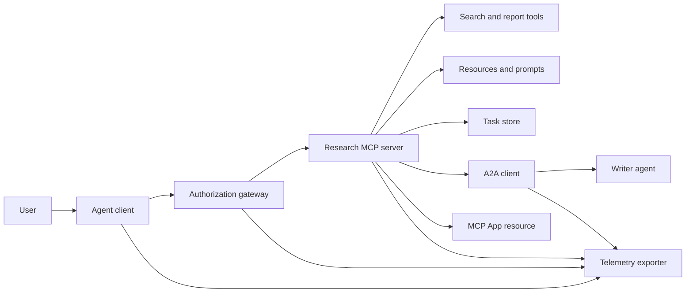
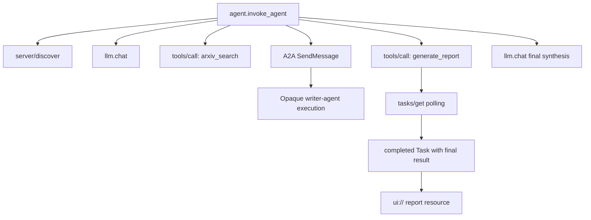
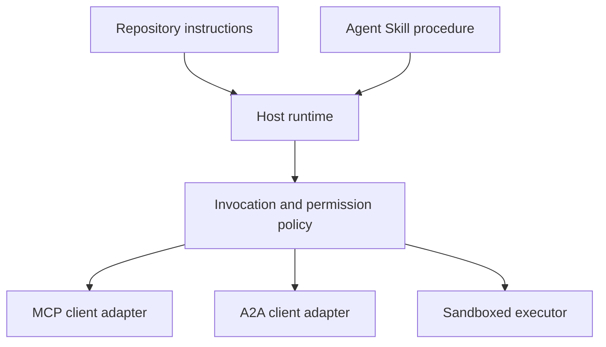

# 综合实战项目:无状态工具生态系统

> O sistema de agente de produção é um conjunto de simples conjuntos de fronteiras claras e não característicos.

**Type:** Build
**Languages:** Python (stdlib, in-process simulation)
**Prerequisites:** Phase 13 · 01 through 22, using MCP revision `2026-07-28`
**Time:** ~120 minutes

## Objectivo de aprendizagem

- O processo de desenvolvimento de um sistema de controle de dados e de dados de dados é um processo de desenvolvimento de dados e de dados de dados.
- Em cada MCP, solicitações de implementação de um protocolo de qualidade, de identidade e capacidades de clientes, de total descontinuidade da dependência da transferência de dados.
- Em调用前主动执行服务发现,并通过官方任务 扩展稳健驱动长耗时工作──
- 清晰区分符合协议形态的本地模拟 (simulação em forma de protocolo) com real MCP、A2A、OAuth 及 OpenTelemetry 生产实现──
- Mapear de forma precisa cada limite de abstração no simulador até que seja necessário substituir os componentes físicos na produção.
- 确保 `AGENTS.md`、Agente Habilidade、运行时适配器、工具 及安全策略 及安全策略 及安全策略 及安全策略 及安全策略 及安全策略 及安全策略 及安全策略 及安全策略 及安全策略 及安全策略 及安全策略 及安全策略 及安全策略 及安全策略 及安全策略 及安全策略 及安全策略 及安全策略 及安全策略 及安全策略 及安全策略 及安全策略 及安全策略 及安全策略 及安全策略 及安全策略 及安全策略 及安全策略 及安全策略 及安全策略 及安全策略 及安全策略 及安全策略 及安全策略 及安全策略 及安全策略 及安全策略 及安全策略
- 明确指出哪些技术断言可以直接由本地输出证明,哪些必须依赖于真实端到端集成测试──

## 问题

Design a academic research and report generation system: user request query about agent 通信协议的论文── system query论文目录、委托撰写总结、生成分析报告、返回 UI 交互资源,并完整记录系统执行的链路踪迹──

Esta frase parece simples, mas na verdade oculta vários acordos independentes:

- 面向模型的工具方案 声明;
- 无状态请求信封与服务发现契约;
- 针对主体(actor) 、scope 和工具 身份的网关决策;
- 长周期任务操作契约;
- 跨 agent 委托协作协议(A2A);
- O transporte de dados entre o hospedeiro e a aplicação do MCP (MCP App)
- 链路追踪上下文传播与导出;
- Cópia de utilização padrão de operação

`code/main.py`Utilizando puramente Python  funções e alfabetos tornam a fronteira acima clara. Não abre a rede de monitoramento, não realiza a solicitação real de arXiv, não executa a autoria real, não utiliza o serviço A2A, nem o MCP App, nem o MCP App, nem o MCP App, nem o MCP App, nem o MCP App. Isso permite controlar o fluxo de dados de remoção e compreensão, evitando simultaneamente o erro de orientar os modelos locais para serviços de produção em conformidade com as normas.

## 概念

### 目标架构



A estrutura é um conjunto conceitual do modelo de protocolo de padrões públicos, não sendo uma realização interna privada de qualquer produto exclusivo.

### 目标 distribuído seguimento



Em real produção, cada rede salta-se em todos os lugares. Todos os lugares devem ser correctamente divulgados.

### 当前协议交互表面

Utilizando o nome do método definido no actual, não pode ser usado na memória do antigo projecto:

| 边界 | 当前标准交互表面 | 本实战项目的本地模拟实现 |
|---|---|---|
| MCP 服务发现 | 强制性的 `server/discover` | 返回版本、capabilities 和服务器身份的直接函数 |
| MCP 请求上下文 | 每个 `params._meta` 均携带版本、capabilities 及客户端信息 | 传递给每次模拟调用的全新请求元数据 |
| MCP 工具调用 | `tools/call` | Python 本地函数直接分发 |
| MCP 任务轮询 | `io.modelcontextprotocol/tasks` 扩展与 `tasks/get` | 先返回处理中的任务句柄，后返回内联最终结果的完成任务 |
| A2A 跨代理委托 | gRPC 和 JSON-RPC 中为 `SendMessage`；HTTP+JSON 中为 `POST /message:send` | 无远程调用与人为延迟的单层嵌套 Span |
| MCP App 调用宿主工具 | `app.callServerTool({ name, arguments })` | 无实时通信桥梁的纯 HTML 字符串 |
| OAuth 鉴权 | 授权服务器、受保护资源元数据、Audience 与 Scope 校验 | 静态 Token 字典查找与 Scope 集合判断 |
| OpenTelemetry | SDK、传播器（Propagator）、导出器（Exporter）及收集器（Collector） | 纯内存 Span 字典数组 |

O protocolo é apenas um exemplo do nível mais externo. O teste de produção deve abranger a sequenciação de câblos de rede real, a sequenciação de erros de certificação, a eliminação de interrupções, a reexibição de tempo e a compatibilidade de várias versões do protocolo.

### 无状态 MCP 重构集成边界

`2026-07-28`Modificação da versão completa de transferência da sessão do acordo e`initialize`- Não .`notifications/initialized`握手阶段── simultâneo abolido `Mcp-Session-Id`Todos os pedidos estão aqui.`params._meta`中携带如下命名空间字段:

```json
{
  "io.modelcontextprotocol/protocolVersion": "2026-07-28",
  "io.modelcontextprotocol/clientCapabilities": {
    "extensions": {
      "io.modelcontextprotocol/tasks": {}
    }
  },
  "io.modelcontextprotocol/clientInfo": {
    "name": "capstone-client",
    "version": "1.0.0"
  }
}
```

 serviços devem ser realizados `server/discover`◊ resultados de uso `resultType: "complete"`; retornar tarefas                                                                                                                                                                                                                                                                                                                                                                                                                                                                                                                         `resultType: "task"`Todos os resultados devem estar presentes.`_meta.io.modelcontextprotocol/serverInfo`中表示服务器自身身份──

As tarefas 扩展包含 `tasks/get`- Não.`tasks/update`E também`tasks/cancel`◊ Ferramenta 首次调用可以返回 `resultType: "task"`; e posterior inquérito `tasks/get`Voltar a ser um homem.`resultType: "complete"`, e completado `Task`O projecto de desenvolvimento de um novo sistema de gestão de empresas e de empresas de investimento`tasks/result`Com`tasks/list`已已完全移除. 客户端必须在可能收到任务句柄的同一个请求中声明支持 `io.modelcontextprotocol/tasks`扩展;若未声明,服务端将返回 `-32021`错误, e em `requiredCapabilities`No entanto, a Comissão não aceitou a proposta de alteração.

### Segurança (Seguir)

O ambiente de produção deve ser reforçado:

-  Autorizar a utilização forçada de OAuth do tipo de cliente que necessita de protecção com PKCE;
- Por isso , o acesso a um token é obrigatório .
- 网关 权限  角色基于严格核验被调调的工具与范围;
-  acesso a API de acesso de acesso de acesso de acesso de acesso de acesso de acesso de acesso de acesso de acesso de acesso de acesso de acesso de acesso de acesso de acesso de acesso de acesso de acesso de acesso de acesso de acesso de acesso de acesso de acesso de acesso de acesso de acesso de acesso de acesso de acesso de acesso de acesso de acesso de acesso de acesso de acesso de acesso de acesso de acesso de acesso de acesso de acesso de acesso de acesso de acesso de acesso de acesso de acesso de acesso de acesso de acesso de acesso de acesso de acesso de acesso de acesso de acesso de acesso de acesso de acesso de acesso de acesso de acesso de acesso de acesso de acesso de acesso de acesso de acesso de acesso de acesso de acesso de acesso de acesso de acesso de acesso de acesso de acesso de acesso de acesso de acesso de acesso de acesso de acesso de acesso de acesso de acesso de acesso de acesso de acesso de acesso de acesso de acesso de acesso de acesso de acesso de acesso de acesso de acesso de acesso de acesso de acesso de acesso de acesso de acesso de acesso de acesso de acesso de acesso de acesso de acesso de acesso de acesso de acesso de acesso de acesso de acesso de acesso de acesso de acesso de acesso de acesso de acesso de acesso de acesso de acesso de acesso de acesso de acesso de acesso de acesso de acesso de acesso de acesso de acesso de acesso de acesso de acesso de acesso de acesso de acesso de acesso de acesso de acesso de acesso de acesso de acesso de acesso de acesso de acesso de acesso de acesso de acesso de acesso de acesso de acesso de acesso de acesso de acesso de acesso de acesso de acesso de acesso de acesso de acesso de acesso de acesso de acesso de acesso de acesso de acesso de acesso de acesso de acesso de acesso de acesso de acesso de acesso de acesso de acesso de acesso de acesso de acesso de acesso de acesso de acesso de acesso de acesso de acesso de acesso de acesso de acesso de acesso de acesso de acesso de acesso de acesso de acesso de acesso de acesso de acesso de acesso de acesso de acesso de acesso de acesso de acesso de acesso de acesso de acesso de acesso de acesso de acesso de acesso de acesso de acesso de acesso de acesso de acesso de acesso de acesso de acesso de acesso de acesso de acesso de acesso de acesso de acesso de acesso de acesso de acesso de acesso de acesso de acesso de acesso de acesso de acesso de acesso de acesso de acesso de acesso de acesso de acesso de acesso de acesso de acesso de acesso de acesso de acesso de acesso de acesso de
- 严格锁定并审查 tool 描述元数据清单(Manifest);
-  a aplicação integral da Lei dos Dois, em relação à entrada de dados sensíveis e a importantes influências externas;
- No âmbito de um processo isolado, o sistema de execução deve limitar o consumo de documentos, processos, redes, credenciamentos e recursos, que devem ser limitados pelo Ministério das Habilidades Exteriores.

Este curso de código de exemplo apenas realiza a estática Token、Scope 校验以及描述哈希, destinado a esclarecer a estratégia de fluxo, não pode substituir a segurança de produção.

### As habilidades são regras de operação, e não de transmissão de rede.

A Agent Skill é usada para dizer como avançar no processo de pesquisa, como prever o que as ferramentas correspondem, quais acordos, quais certificados de auditoria de processo e quando terminar a tarefa, mas não pode criar um servidor MCP em espaço, estabelecer um acordo A2A, estabelecer um acordo de conexão, emitir um escopo de autorização ou construir um código-chafe.



Quando o programa operacional precisa citar um conjunto de documentos de recursos, deve ser desenvolvido em forma completa de um catálogo de habilidades.

###  cursos produtos dados são local adaptador

O índice de catálogo e o dispositivo de instalação deste curso podem ser identificados como:`skill-*.md`O resolutor de soluções de solução de problemas de qualidade pode ser usado para resolver problemas de qualidade, mas não para resolver problemas de qualidade.

```yaml
---
name: ecosystem-blueprint
description: Produce a full Phase 13 ecosystem architecture for a product need.
version: "1.0.0"
phase: "13"
lesson: "23"
tags: [mcp, capstone, ecosystem, architecture, a2a, otel]
---
```

`name`Com`description`É possível transferir padrão de identidade central.`version`- Não.`phase`- Não.`lesson`和 `tags`É orientado para o programa de curso.`tags`Escrever para um único número de linhas, para que`--tag capstone`- É verdade.

标准的可移植目录  Habilidades utilizáveis `metadata`字典存放自定义扩展数据── mas, em um único arquivo do armazém, se`version`Ou `tags`嵌套缩进写入 `metadata`内部,极简解析器会直接忽略,导致无法提取版本号且标签过失效──

### Em comparação com o ambiente de produção real

| 架构分层 | `code/main.py` 实现 | 生产落地替换方案 | 必须出示的验收证据 |
|---|---|---|---|
| 服务发现 | `server_discover()` 加静态 `TOOLS` | `server/discover` 配合带缓存的 `tools/list` | 报文轨迹、确定性排序与 Schema 校验 |
| 身份认证 | 基于 Token 的内存字典 | 独立的 OAuth 授权服务器与资源服务器验证 | 签发者、受众、Scope、过期与故障降级测试 |
| 授权鉴权 | Scope 集合成员判定 | 绑定主体、tool、目标和租户的网关策略 | 允许与拒绝分支的完整审计日志用例 |
| 论文检索 | 静态论文测试夹具（Fixtures） | 真实检索 API 或专门的 MCP Server | 数据溯源、排序打分与网络异常测试 |
| 异步任务 | 本地句柄加立即 `tasks/get` | 持久化 `io.modelcontextprotocol/tasks` 存储，实现 get/update/cancel 与 TTL | 状态迁移、用户输入、取消及宕机恢复测试 |
| 跨 Agent 委托 | 本地 Sleep 加嵌套 Span | 真实的 A2A 客户端与远程 Agent Card | 契约校验、超时重试与不透明执行测试 |
| 前端交互 App | HTML 字符串与 URI 协议头 | MCP Apps 资源与官方 `App` 通信桥梁 | CSP 安全策略、权限受控、tool 调用与浏览器渲染测试 |
| 链路遥测 | 内存 Python 字典列表 | 完整的 OTel SDK 与远程导出器（Exporter） | 收集端接收凭证与父子 Span 关联断言 |
| 执行沙箱 | 无 | 宿主强制隔离的安全沙箱执行器 | 沙箱逃逸、出站网络、敏感凭证与资源上限测试 |

O comparativo é constituído por uma linha de ligação entre os sistemas.

### Fase 13

| 课次区间 | 核心贡献与架构职责 |
|---|---|
| 01-05 | Tool 接口标准、模型调用、Schema 设计、结构化输出及确定性校验 |
| 06-14 | 无状态 MCP 请求信封、服务发现、底层传输、资源、Prompt、扩展及 Apps |
| 15-18 | 防投毒安全防线、OAuth 鉴权、网关路由、Registry 准入及生产部署落地 |
| 19 | A2A 协议：跨代理的消息传递与异步任务协作 |
| 20 | 基于 OpenTelemetry 的 GenAI 分布式链路追踪设计 |
| 21 | 面向大模型供应商的智能路由与降级分流层 |
| 22 | 可移植 Agent Skill 契约规范与运行时安全边界 |

```figure
t3-capstone-chain
```

## 动手构建

运行进程内综合实战模拟脚本:

```bash
cd phases/13-tools-and-protocols/23-capstone-tool-ecosystem
python3 code/main.py
```

重点审查:

1. `server/discover`O que é que eu disse?`2026-07-28`协议版本以及 Tasks 扩展能力──
2. Alice conseguiu ler bem o artigo e gerar o relatório, enquanto Bob apenas tinha um pedido de inscrição no Scope que foi rejeitado.
3. Com o mesmo arranjo, todos os locais Span 均共享唯一Trace ID,并准确记录了父级 Span ID──
4. 報告生成操作首先返回任务句柄──随后`tasks/get`                                                                                                                                                                                                                                                                                                                                                                                                                                                                                                                             `ui://`资源引用──
5. Agente de redação encarregado  manter sua execução black box opacidade, editor apenas registar fora através das fronteiras 
6. 控制台输出没有冒充发生了真实网络请求、OAuth 换标、遥测收集器网络导出、浏览器染或沙箱隔离──

O processo de execução continua em duas fases, gerando duas cadeias de rastreamento de raízes independentes.

## Use-o

按部就班将模拟层替换为生产级真实组件:

1. - Não .`server_discover()`和静态 tool 列表替换为标准的 `server/discover`Com`tools/list`网络请求──在每个请求中完整携带协议版本、客户端身份和能力──
2. 将静态 Token 字典替换为遵循 RFC 标准的独立授权服务器与受保护资源验证中间件──
3. 完整接入 `io.modelcontextprotocol/tasks`扩展,测试 `tasks/get`- Não.`tasks/update`- Não.`tasks/cancel`、超时时间、TTL 清理及进程重启恢复──坚决不增加已废弃的`tasks/result`Ou `tasks/list`- Não.
4. O código será substituído por um código capaz de resolver a cartão de agente e enviar mensagens para o cliente real.
5. Utilize oficial SDK  desenvolvimento                                                                                                                                                                                                                                                                                                                                                                                                                                                                                                                       `app.callServerTool`规范发起反向工具调用──
6. A partir de agora, o grupo de pesquisa tem como objetivo identificar os dados de dados que podem ser encontrados no seu site.
7. Todos os instrumentos de execução e execução do guião serão incorporados no artigo 26.o do Regulamento da Sala de Segurança para a Operação.
8. O programa de funcionamento será incluído no catálogo de nível de competências, e será aprovado no âmbito da publicação do artigo 27.o.

Cada uma das camadas de substituição, todos devem ser preparados para o teste de integração através da fronteira física real.

## Entrega-o

本课交付 `outputs/skill-ecosystem-blueprint.md` É um plano de estrutura de um único documento, que exige uma descrição completa de um único bloco de páginas, que exija a seleção de componentes básicos, a segurança, a comissão trans-agente, a distância de observação, a organização de estrutura de pacote e as condições de transporte mais severas.

Como é um único documento, portanto, não pode transportar referências, scripts, ativos ou avaliações de teste.

## 课后深练习

1. 运行 `code/main.py`◊ detalhes de facto verificados no local de produção, e ainda em produção, as afirmações de provas de teste de integração real.
2. Em simulador, adicione um segundo lado estático, define duas ferramentas de mesmo nome 发生命名冲突时的解决规则── em seguida, substituirá as duas listas de código duro para o real `tools/list`- Não.
3. O código do agente de redação será substituído por um verdadeiro servidor de teste A2A.
4. Para o estado de tarefa de desenvolvimento de processos reinicializáveis de armazenamento de armazenamento, prova que o cliente pode passar.`tasks/get`恢复执行、遵守 `pollIntervalMs`轮询间隔, e não depende `tasks/result`de um trabalho realizado, o que é o resultado final do trabalho realizado.
5. Construir um aplicativo MCP extremamente simples, em configuração rigorosa CSP e estratégias de limitação de poder explícito verificando no ambiente do navegador real `app.callServerTool`De ligação.
6. A partir de agora, o sistema de dados será executado em um único modo:
7. Crie um documento para a regulamentação da R&D`AGENTS.md`, bem como um pacote de procedimentos independentes de habilidades para a orientação da investigação de literatura.

## 关键术语

| 术语 | 通俗说法 | 精确工程含义 |
|---|---|---|
| 实战项目（Capstone） | "把所有东西串起来" | 分阶段构建的集成系统，其本地模拟与真实线上边界保持绝对清晰 |
| 协议形态模拟（Protocol-shaped simulation） | "差不多就是个 MCP" | 在本地构建的与协议数据结构高度相似的代码，但未实现底层的网络传输契约 |
| Tasks 扩展 | "长耗时 tool 调用" | 可选的 `io.modelcontextprotocol/tasks` 扩展规范，定义了持久化标识、轮询、客户端补全、最终结果与取消机制 |
| 不透明边界（Opacity boundary） | "丢给另一个 agent 处理" | 调用方仅能看到公开声明的接口与交付成果，无法窥探其内部思维链与私有状态 |
| 运行时适配器（Runtime adapter） | "接入 Skill 的胶水代码" | 宿主层负责将通用可移植的操作规程映射到服务发现、交互调用、工具权限、安全策略及上下文管理的代码 |
| 集成证据（Integration evidence） | "测试跑通了" | 完整的报文日志、交付产物或接收端实测数据，确凿证明系统跨越了真实的物理边界 |

## 延伸阅读

- [MCP 2026-07-28 核心规范](https://modelcontextprotocol.io/specification/2026-07-28)- Profundidade de domínio sobre as solicitações de desuso de estado, a descoberta de serviços, a utilização de ferramentas, o reconhecimento e as normas de transmissão de nível inferior.
- [MCP 2026-07-28 关键变更日志](https://modelcontextprotocol.io/specification/2026-07-28/changelog)- 了解会话移移、逐请求元数据、MRTR、官方扩展及废弃特性的发展细节──
- [MCP Tasks 扩展规范草案](https://tasks.extensions.modelcontextprotocol.io/specification/draft/tasks)- Aplicando`tasks/get`- Não.`tasks/update`- Não.`tasks/cancel`及 missão final do resultado do processo de transformação.
- [MCP Apps 官方 SDK](https://github.com/modelcontextprotocol/ext-apps/blob/main/docs/overview.md)- Compreender .`App`类及 `app.callServerTool`De um lado, o que é que eu faço?
- [A2A 跨代理协议最新规范](https://a2a-protocol.org/latest/)- Conhecer os padrões de autoridade de Agentes Cartões, mensagens, missões, serviços, serviços e redes de transporte de dados.
- [OpenTelemetry GenAI 语义约定](https://opentelemetry.io/docs/specs/semconv/gen-ai/)-                                                                                                                                                                                                                                                                                                                                                                                                                                                                                                                             
- [Agent Skills 规范官方文档](https://agentskills.io/specification)- 掌握本实战项目中规则中规则抽象层所依赖的可移植包结构契约──
