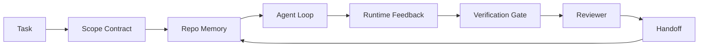

# Agente de Engenharia do Banquete: Por que o modelo de capacidade forte ainda vai falhar

>                                                                                                                                                                                                                                                               

**Type:** Learn + Build
**Languages:** Python (stdlib)
**Prerequisites:** Phase 14 · 01 (Agent Loop), Phase 14 · 26 (Failure Modes)
**Time:** ~45 minutes

## Objectivo de aprendizagem
- 区分模型能力与执行可靠性──
- "Quando o agente decide se pode entregar sete superfícies de banco de trabalho"...
- Em um pequeno repo 任务上比较只快速运行与工作桌指导运行──
- produção de um relatório de modo de falha, que irá mapear cada superfície de falta de sintomas que a causam.

## 问题
Você colocou um modelo de fronteira  colocar em repo real, deixá-lo adicionar o certificado de entrada  Ele abriu quatro arquivos, escreveu código aparentemente razoável, declarou sucesso, então parou  Você executou o teste  dois fracassaram  O terceiro arquivo modificado e o certificado estão completamente irrelevantes  Não há nenhum agente de registro  supõe o que  primeiro tentou o que, ou ainda há algo a ser concluído 

O modelo não é incompreendente com Python. Ele não sabe o que é que deve ser feito. Ele não sabe o que é que deve ser feito.

Não é um bug do modelo. É um bug do banco de trabalho. A superfície do agente está em falta.

## 概念
O banco de trabalho é um modelo de trabalho em conjunto durante a tarefa.

| Surface | 它承载什么 | 缺失时的失败 |
|---------|------------|--------------|
| Instructions | 启动规则、禁止动作、完成定义 | Agent 猜测交付意味着什么 |
| State | 当前任务、已触碰文件、blockers、下一步动作 | 每个 session 都从零开始 |
| Scope | 允许文件、禁止文件、验收标准 | 修改泄漏到无关代码 |
| Feedback | 捕获进 loop 的真实命令输出 | Agent 在 400 上宣布成功 |
| Verification | Tests、lint、smoke run、scope check | “看起来不错”进入 main |
| Review | 由不同角色执行的第二遍检查 | Builder 批改自己的作业 |
| Handoff | 改了什么、为什么改、还剩什么 | 下一个 session 重新发现一切 |

banco de trabalho  independente do modelo。 você pode substituir o modelo并保留这些表面──你不能替换表面 还保持可靠性──



Este loop está fechado em um arquivo de estado, e não no histórico de bate-papo.

### Banquinho de trabalho e engenharia rápida

Prompting  dizer ao modelo esta rodada que você quer.

### Em relação ao quadro de trabalho

framework  fornecer tempo de execução(LangGraph、AutoGen、Agents SDK)  banco de trabalho  fornecer um trabalho em um agente durante esse tempo de execução。 ambos são necessários。 esta mini-track 讲的是第二个。

### A partir de primitivas, em vez de taxonomias de fornecedores.

Agora há uma grande quantidade de artigos sobre engenharia de harness. Eddy Osmani, OpenAI, Anthropic, LangChain, Martin Fowler, MongoDB, HumanLayer, Augment Code, Thoughtworks, Walkinglabs, uma lista incrível, bem como artigos contínuos sobre Medium e Hacker News estão em discussão. Eles contêm o que contém para a borda do harness.

Antes de tirar o agente, este é o rótulo. Uma vez executado o agente é através do tempo, processo e máquina de cálculo. Para torná-lo confiável, você precisa de qualquer sistema de produção.

| Primitive | 它是什么 | 它为 agent 承载什么 |
|-----------|----------|---------------------|
| Function | 类型化 handler。尽可能保持纯。拥有自己的 inputs 和 outputs。 | 一次 tool call、一次 rule check、一个 verification step、一次模型调用 |
| Worker | 拥有一个或多个 functions 和 lifecycle 的长生命周期进程 | builder、reviewer、verifier、一个 MCP server |
| Trigger | 调用 function 的事件源 | Agent loop tick、HTTP request、queue message、cron、file change、hook |
| Runtime | 决定什么在哪里运行、使用什么 timeouts 和 resources 的边界 | Claude Code 的 process、LangGraph 的 runtime、一个 worker container |
| HTTP / RPC | caller 与 worker 之间的网络线缆 | Tool-call protocol、MCP request、model API |
| Queue | trigger 与 worker 之间的持久 buffer；back-pressure、retry、idempotency | task board、feedback log、review inbox |
| Session persistence | 在 crashes、restarts、model swaps 后仍保留的 state | `agent_state.json`、checkpoints、KV stores、repo 本身 |
| Authorization policy | 谁能以什么 scope 调用什么 function | allowed/forbidden files、approval boundaries、MCP capability lists |

Agora, coloque sete superfícies de trabalho em cima destas primitivas.

- **Instructions** política + metadados funcionais。Regras são verificações(funções)―router(`AGENTS.md`) é acompanhado na política de arranque de tempo de execução.
- **State** persistência de sessão──tempo de execução Cada passo都会读取的键存储──File、KV或DB;persistência semântica 重要,storage backend 不重要──
- **Scope** Política de autorização de cada missão  permitidos/proibidos globos é ACL  necessidades de aprovação é permitência grid 
- **Feedback** 写入 queue 写入 queue 写入 queue 写入 queue 写入 queue 写入 queue 写入 queue 写入 queue 写入 queue 写入 queue 写入 queue 写入 queue 写入 queue 写入 queue 写入 queue 写入 queue 写入 queue 写入 queue 写入 queue 写入 queue 写入 queue 写入 queue 写入 queue 写入 queue 写入 queue 写入 queue 写入 queue 写入 queu 写在线 写入 写入 写入 写入 写入 写入 写入 写入 写入 写入 写入 写入 写入 写入 写入 写入 写入 写入 写入 写入 写入 写入 写入 写入 写入 写入 写入 写入 写入 写入 写入 写入 写入 写入 写入 写入 写入 写入 写入 写入 写入 写入 写入 写入 写 写入 写入 写 写 写 写 写 写 写 写 写 写 写 写 写 写 写 写 写 写 写 写 写 写 写 写 写 写 写 写 写 写 写 写 写 写 写 写 写 写 写 写 写 写 写 写 写 写 写 写 写 写 写 写 写 写 写 写 写 写 写 写 写 写 写 写 写 写 写   写 写   写 写 写 写 写 写    写     写      写            写                               写      写
- **Verification** Uma função― para entradas 确定性― por tarefa close 触发―失败时关闭―
- **Review** Um trabalhador independente, com autorização apenas para ler artefatos de construção, com autorização apenas para escrever relatórios de revisão.
- **Handoff** O gatilho de início da sessão final irá emitir um registro permanente.

Loop de agente 本身就是一個工作者,它消费事件 (eventos),调用函数 (de acordo com o processo de verificação, revisão, entrega), escrever registros (reconhecimento), emitir gatilhos (trigger)

### 流行模式,转换为 primitivos

Cada tipo de modelo de arneses em circulação pode ser dividido em oito primitivas.

| Vendor or community pattern | 它实际是什么 |
|------------------------------|--------------|
| Ralph Loop（Claude Code、Codex、agentic_harness book）— 当 agent 试图过早停止时，把原始意图重新注入一个新的 context window | 一个将 task 以干净 context 重新入队的 trigger；session persistence 负责把目标向前传递 |
| Plan / Execute / Verify (PEV) | 三个 workers，每个角色一个，通过 state 和 phases 之间的 queue 通信 |
| Harness-compute separation（OpenAI Agents SDK，April 2026）— 将 control plane 与 execution plane 分开 | 对 control-plane / data-plane 的重新表述。比 agent 标签早几十年就存在 |
| Open Agent Passport（OAP，March 2026）— 在执行前根据声明式 policy 签名并审计每次 tool call | 由 pre-action worker 强制执行的 authorization policy，并带有 signed audit queue |
| Guides and Sensors（Birgitta Böckeler / Thoughtworks）— feedforward rules + feedback observability | Authorization policy + verification functions + observability traces |
| Progressive compaction, 5-stage（Claude Code reverse engineering，April 2026） | 一个 state-management worker，像 cron 一样在 session persistence 上运行，使其保持在 budget 内 |
| Hooks / middleware（LangChain、Claude Code）— 拦截 model 和 tool calls | 包裹 runtime invocation path 的 triggers + functions |
| Skills as Markdown with progressive disclosure（Anthropic、Flue） | 一个 function registry，其中 function metadata 会 just-in-time 加载到 context 中 |
| Sandbox agents（Codex、Sandcastle、Vercel Sandbox） | compute plane：具备隔离 filesystem、network 和 lifecycle 的 runtime |
| MCP servers | 通过稳定 RPC 暴露 functions 的 workers，capability lists 作为 authorization |

Cada item da tabela, é um agente 社区 até chegar a um primitivo de nomes já existentes em sistemas distribuídos, e depois dar-lhe um novo nome.

### Receitas  na prática explicou o que

A afirmação de aproveitamento sobre modelo agora tem dados. Vale a pena entender, pois também é um argumento de contradição, desde que um modelo mais inteligente seja o único argumento de honestidade.

- Terminal Bench 2.0  同一个模型,只利用变化 就让一个编码代理从前30 之外提升到第五名(LangChain,*Anatomy of an Agent Harness*) 
- Vercel   removeu 80% das ferramentas de seu agente; taxa de sucesso de 80%                                                                                                                                                                                                                                                                                                                                                                                                                                                                                                        
- Harvey  agentes legais  apenas através da otimização de aproveitamento 就让精度 翻倍以上(MongoDB) 
- 88% dos projetos de agentes de IA em empresas não podem entrar em produção.
- Um estudo de referência de 2025 em três frameworks de código aberto populares 上 relatou cerca de 50% da conclusão de tarefas; long-context WebAgent em condições de longo contexto Abaixo de 40-50%  cair para 10% abaixo, principalmente devido a ciclos infinitos e perda de objetivos (((Os escritos no início do ano de 2026 são amplamente discutidos)

O ponto não é o arsenal 永遠勝利出── o modelo absorverá os truques de arsenal com o tempo── o ponto é hoje, suportar o trabalho em torno do modelo, e não dentro do modelo; assumir essas cargas primitivas, é o que cada sistema de produção sempre precisa──

### vendedor escritos 止步的地方

Esta parte não precisa de clientes.

- A *Anatomy of an Agent Harness* da LangChain contém dez componentes  prompts, tools, hooks, sandboxes, orchestration, memory, skills, subagents, bem como um runtime dumb loop── não tem filas de nome ‒ como unidade de implantação de trabalhadores ‒ trigger semantics、 como persistência de sessão de ponto de atenção independente, ou política de autorização── ela coloca o harness como um objeto que você configura, e não um sistema de depósito ‒
- Addy Osmani de * Agente Arnes Engenharia *  propôs `Agent = Model + Harness`O quadro e o padrão de ratchet, mas não explicam mais o que o arame é constituído por.
- Antropic 和 OpenAI sobre superfícies  discussed deepest, but still stuck in their runtime 内── Abril 2026 Agentes SDK harness-computing separation anúncio é o primeiro comprovado controle-plano / data-plane separado fornecedor peça── essa é uma ideia primitiva, não é algo novo──
- O arnesamento será usado para configurar objetos (Jaymin West's *Agentic Engineering*, capítulo 6), uma das palavras mais poderosas é que o arnesamento é o principal limite de segurança em um sistema de agências.
- Os fios de notícias de hackers 一直抵达同一个地方── Abril 2026 os fios *O arameiro do agente pertence à caixa de areia* 认为 harness 应该位于更像是一个处在一切之外、并基于背景 和用户 授权访问的超级浏览器──这是再次作为独立平面的授权政策──

Você não precisa se opor a nenhum desses artigos, também pode ver falhas. Eles estão escrevendo uma descrição do sistema já existente.`AGENTS.md`Também não é bom a fila de ausência.

Assim, quando você ouve em outros lugares harness engineering 时, traduzi-lo em primitivos。Prompts 和 rules is policy and functions。Scaffolding is runtime。Guardrails is authorization + verification。Hooks are triggers。Memória is session persistence。Ralph Loop is requeue。Subagents are workers。Sandboxes are computing planes。Words will change;工程 won't。Workbench is agent-facing UX; e capaz de se levantar na próxima vez sobre o arsenal da reformulação do vendor, essenciais são funções、workers、trigers、runtimes、queues、persist 和 policy 被正确连接在一起。


```figure
wb-seven-surfaces
```

## Construí-lo
`code/main.py`会把一个微型 repo task 运行两次. A primeira é apenas um prompt, a segunda é conectada a sete superfícies.

A tarefa de repo 刻意设计得很小: dá um único arquivo FastAPI-style handler 添加输入验证,并写一个通过测试――

- Não .

```
python3 code/main.py
```

输出: 两次运行的横边日志,一个总结                                                                                                                                                                                                                                                                                                                                                                                                                                                                                                             `failure_modes.json`, e o veredicto da corrida do banco de trabalho.

O agente é um pequeno estúdio baseado em regras; o foco é nas superfícies, e não no modelo. No resto desta mini-track, você vai reconstruir cada superfície como um artefato real e recorrente.

## Use-o
Há já em realidade superfícies de banco de trabalho, até mesmo que ninguém as chame assim:

- **Claude Code, Codex, Cursor.** `AGENTS.md`和 `CLAUDE.md`É a superfície das instruções. Os comandos de slash são o escopo.
- **LangGraph, OpenAI Agents SDK.**Os pontos de controlo e as lojas de sessões são a superfície do estado.
- **真实 repo 上的 CI。**Testes、lint 和 type-check é verificação。PR template é entrega。CODEOWNERS é revisão。

A engenharia de banco de trabalho é uma regra: tornar essas superfícies ρηματικά、可复用化, em vez de deixar cada equipe a redescobrir-as por si mesma.

## Entrega-o
`outputs/skill-workbench-audit.md`É uma habilidade portátil, usada para auditar as sete superfícies de banco de trabalho existentes, e relatar quais são as deficiências, quais são as partes disponíveis, quais são as condições de saúde.

## 练习
1. 选择一个你已经运行代理的 repo――把七个表面从0(缺失) 到2(健康)打分――你最弱的表面是什么?
2. 扩展 `main.py`, Deixe-se executar apenas imediatamente também produzir uma falsa declaração de sucesso.
3. Para o seu próprio produto adicionar o 8o nível. Explica por que não pode ser incluído em um dos 7 existentes.
4. Usar outro agente de alucinação para escrever o extra-documentário. Refazer o novo roteiro.
5. A fase 14 · 26 está em cinco modos de falha repetitivos de cada indústria.

## 关键术语
| Term | What people say | What it actually means |
|------|----------------|------------------------|
| Workbench | “那套 setup” | 围绕模型设计的 engineered surfaces，使工作可靠 |
| Surface | “一个 doc” 或 “一个 script” | agent 每一轮读取或写入的命名、machine-readable input |
| System of record | “那些 notes” | chat history 消失后 agent 视为 truth 的文件 |
| Definition of done | “Acceptance” | 一个客观、file-backed 的 checklist，agent 无法伪造 |
| Workbench audit | “Repo readiness check” | 在工作开始前遍历七个 surfaces，标记缺失部分 |

## 延伸阅读
Para decidir se é necessário adotar um conceito, primeiro traduzi-lo para o primitivo (função, trabalhador, desencadeador, tempo de execução, HTTP/RPC, fila, persistência, política).

Enquadros do fornecedor:

- [Addy Osmani, Agent Harness Engineering](https://addyosmani.com/blog/agent-harness-engineering/)- Não .`Agent = Model + Harness`E o padrão de ratchet; infraestrutura parte inferior
- [LangChain, The Anatomy of an Agent Harness](https://blog.langchain.com/the-anatomy-of-an-agent-harness/) 十一个组件:prompts,tools,hooks,orquestração, sandboxes,memória,habilidades,sub-gêneros, tempo de execução,省略 queues,deployment,authz
- [OpenAI, Harness engineering: leveraging Codex in an agent-first world](https://openai.com/index/harness-engineering/) Codex 团队 sobre o seu tempo de execução  Surface surround
- [OpenAI, Unrolling the Codex agent loop](https://openai.com/index/unrolling-the-codex-agent-loop/) 将 agente loop 归约为函数调上一个 `while`
- [Anthropic, Effective harnesses for long-running agents](https://www.anthropic.com/engineering/effective-harnesses-for-long-running-agents) Superfícies de longo horizonte em tempo de execução específico
- [Anthropic, Harness design for long-running application development](https://www.anthropic.com/engineering/harness-design-long-running-apps)  aplicativo tipo de design
- [LangChain Deep Agents harness capabilities](https://docs.langchain.com/oss/python/deepagents/harness) Superfície de configuração de tempo de execução

Há detalhes disponíveis para o profissional:

- [Martin Fowler / Birgitta Böckeler, Harness engineering for coding agent users](https://martinfowler.com/articles/harness-engineering.html) guias(feedforward) + sensores(feedback);
- [HumanLayer, Skill Issue: Harness Engineering for Coding Agents](https://www.humanlayer.dev/blog/skill-issue-harness-engineering-for-coding-agents)   isto não é um problema de modelo, mas de configuração  问题
- [MongoDB, The Agent Harness: Why the LLM Is the Smallest Part of Your Agent System](https://www.mongodb.com/company/blog/technical/agent-harness-why-llm-is-smallest-part-of-your-agent-system)- Prova: Vercel 80% a 100%, Harvey 2x precisão, Terminal Bench Top 30 a Top 5
- [Augment Code, Harness Engineering for AI Coding Agents](https://www.augmentcode.com/guides/harness-engineering-ai-coding-agents) restrição-primeira passagem
- [Sequoia podcast, Harrison Chase on Context Engineering Long-Horizon Agents](https://sequoiacap.com/podcast/context-engineering-our-way-to-long-horizon-agents-langchains-harrison-chase/) preocupações com o tempo de execução 高于 preocupações com o modelo

书籍、论文与参考实施:

- [Jaymin West, Agentic Engineering — Chapter 6: Harnesses](https://www.jayminwest.com/agentic-engineering-book/6-harnesses) tratamento de comprimento do livro,将 harness 视为 primária fronteira de segurança
- [preprints.org, Harness Engineering for Language Agents (March 2026)](https://www.preprints.org/manuscript/202603.1756) 将其作为控制 / agency / runtime 的学术框架
- [walkinglabs/awesome-harness-engineering](https://github.com/walkinglabs/awesome-harness-engineering)  跨文脈、評估、observability、orchestration 的整理閱讀名單
- [ai-boost/awesome-harness-engineering](https://github.com/ai-boost/awesome-harness-engineering)  Outra lista curada(ferramentas,valores, memória,MCP,permissões)
- [andrewgarst/agentic_harness](https://github.com/andrewgarst/agentic_harness) implementação de referência pronta para produção, com memória com back-up Redis, e suíte de avaliação
- [HKUDS/OpenHarness](https://github.com/HKUDS/OpenHarness) Interior agente pessoal de arame de agente aberto

Vale a pena ler seus diferenciais e não o consenso de Hacker News  discuss:

- [HN: Effective harnesses for long-running agents](https://news.ycombinator.com/item?id=46081704)
- [HN: Improving 15 LLMs at Coding in One Afternoon. Only the Harness Changed](https://news.ycombinator.com/item?id=46988596)
- [HN: The agent harness belongs outside the sandbox](https://news.ycombinator.com/item?id=47990675) 主张将授权 作为独立平面

Referências cruzadas dentro deste currículo:

- Fase 14 · 23  OpenTelemetry Convenções da GenAI: literatura dos sensores
- Fase 14 · 26  七个表面 设计来吸收的故障模式目录
- Fase 14 · 27  位于 política de autorização primitiva 上的快速注射防御
- Fase 14 · 29  Horários de execução da produção ((queue、evento、cron):
