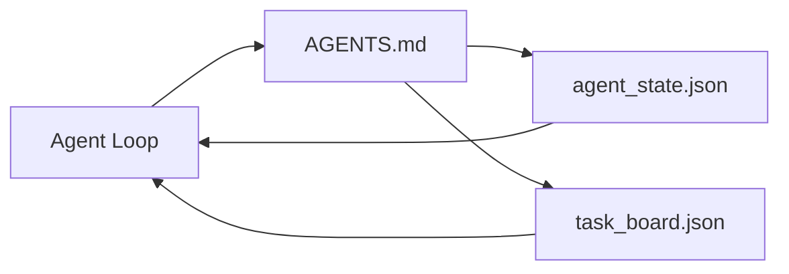

# Último Agente de Trabalho

> O menor banco de trabalho disponível  apenas três arquivos: um roteador de instruções ▌ um arquivo de estado, bem como um painel de tarefas ▌ tudo o resto está sobre eles ▌ Se um repo  não suportar estes três, não há nenhum modelo que possa salvá-lo ▌

**Type:** Build
**Languages:** Python (stdlib)
**Prerequisites:** Phase 14 · 31（为什么强大的模型仍然失败）
**Time:** ~45 分钟

## Objectivo de aprendizagem
- 定义构构成最小可行工作台的三个文件──
- Explica por que um router raiz curto vence um único longo`AGENTS.md`- Não.
- Construir um agente Cada rodada pode ser lida e escrita no fim do arquivo de estado.
- Construir um cronograma de bate-papo independente, também pode apoiar várias sessões, trabalho de um conselho de tarefas.

## 问题
A maioria das equipes vai passar por escrever um 3000 de.`AGENTS.md`Para construir um banco de trabalho, então considere-se concluído. O modelo o carrega, ignora as partes inconfundíveis, e permanece na mesma superfície que sempre falhou.

Você precisa de algo oposto. Um pequeno documento raiz, apenas para relacionar o agente.

Três documentos. Cada documento tem uma função. Cada documento é legível de máquina e pode ser desenvolvido para um sistema real.

## 概念


### Agentes.md é roteador, não manual.

- Muito bem .`AGENTS.md`É muito curto.

- Arquivo de estado (你在哪里)
- O quadro de tarefas (( ainda sobra)
- Mais profundas regras`docs/agent-rules.md`- Não.
- Comando de verificação (How do you know it can work)

O conteúdo de longa duração é colocado em documentos de nível mais profundo, apenas quando necessário para ser carregado.

### agent_state.json é um sistema de registos

Estado 携带:active task id、被触及的文件、已做出的假设、阻止者,以及下一步行动──Agenta Cada turno de todos os dias vai lê-lo── 下一轮 读取它,而不是重放聊天──

O estado existe em documentos, pois o histórico do chat é inconfiável. As sessões terminam. As conversas serão cortadas.

### task_board.json é fila

Tabela de tarefas  Porta cada tarefa, estado `todo | in_progress | done | blocked`Quando o estado é em vão, é a fila de agentes que vão buscar missões; quando se pergunta se o agente está a caminho, é também a fila de leituras.

O Conselho de Administração tem uma missão, um objetivo, um proprietário.`builder`- Não.`reviewer`Ou `human`O Conselho tem o propósito de manter-se pequeno: quando ele cresce para exceder uma tela, você encontra um problema de planejamento, e não um problema de conselho.

### Três documentos são o fundo, não o limite.

后续课程将添加范围合同、反运行者、验证门、审查员清单和交付包──


```figure
wb-three-files
```

## Construí-lo
`code/main.py`会把最小工作桌 写入一个空 repo,并演示单轮代理转,它会:

1. 读取 `agent_state.json`- Não.
2. Se o estado é em vão, é assim.`task_board.json`- Não. - Não.
3. Em âmbito de aplicação, "Não se pode tocar a um único documento".
4. Escrever o estado de um novo texto.

- Não .

```
python3 code/main.py
```

O livro será criado ao lado de si mesmo.`workdir/`, coloque estes três documentos, executar uma rodada, e depois imprimir a diferença.

## Use-o
No âmbito dos produtos de produção, os mesmos três documentos aparecem com nomes diferentes:

- **Claude Code:**- Não .`AGENTS.md`Ou `CLAUDE.md`Como roteador, usá-lo.`.claude/state.json`Lojas de estilo como estado, com ganchos como quadro.
- **Codex / Cursor:**Regras do espaço de trabalho como roteador, memória de sessão como estado, barra lateral do chat 中的排列任务 作为板──
- **Custom Python agent:**É o que acabaste de escrever.

O nome vai mudar.

## Modelo de produção em real

Quando três padrões são superados até o banco de trabalho mínimo, ele pode experimentar a realização de monorepos.

**带 nearest-wins precedence 的嵌套 `AGENTS.md`。**A OpenAI publicou 88 em seu repo principal .`AGENTS.md`文件, cada subcomponente 一个;;Codex、Cursor、Claude Code 和 Copilot 都会从当前工作文件一路向 repo root 遍历,并连接沿途找到的每个 `AGENTS.md`◊ Subdirectório 文件扩展 root file──Codex 添加了 `AGENTS.override.md`, para substituir e não para expandir; mecanismo de sobreposição é específico do Codex, fazer ferramenta cruzada 工作时应避免使用──Augment Code's measurement results才是关键:最好`AGENTS.md`O arquivo que vem com eleva a qualidade, equivalente a um upgrade de Haiku para Opus; o pior arquivo vai fazer a saída de um arquivo completamente sem ele.

**即使看起来像 coverage，也要拒绝的 anti-patterns。**相互冲突的指示 会把 agent 从互动模式 降至贪模式(ICLR 2026 AMBIG-SWE:48.8% → 28% resolução rate);应给优先事项 编号,而不是把它们平铺堆叠――不可验证的风格规则(遵循Google Python Style Guide) Se não houver um comando de execução,就会让 agent自行想象遵守; cada条 style rule 都应配上精确的 lint command;;以风格开头而不是以命令开头,会埋没验证路径;comandos 在前风格 在后风格 在后风格 在后风格 在后风格 在后风格 在后风格 在后风格 在后风格 在后风格 在后风格 在后风格 在后风格 在后风格 在后风格 在后风格 在后风格 在后风格 在后风格 在后风格 在后风格 在后风格 在后风格 在后风格 在后风格 在后风格 在后风格 在后风格 写内容浪费环境预算;简洁会是一种特性

**Cross-tool symlinks。**Um único arquivo raiz                                                                                                                                                                                                                                                                                                                                                                                                                                                                                                                       `ln -s AGENTS.md CLAUDE.md`- Não.`ln -s AGENTS.md .github/copilot-instructions.md`- Não.`ln -s AGENTS.md .cursorrules`), pode deixar cada agente de codificação usar a mesma fonte de verdade.`nx ai-setup`Será baseado em uma única configuração, entre o Claude Code, o Cursor, o Copilot, o Gemini, o Codex e o OpenCode, para realizar automaticamente esta coisa.

## Entrega-o
`outputs/skill-minimal-workbench.md`A reunião será realizada em três reuniões de trabalho:`AGENTS.md`Roteador – um contendo chaves correctas `agent_state.json`, bem como um utilizado de atrasos de início `task_board.json`- Não.

## 练习
1. - Não .`agent_state.json`- Adicione um .`last_run`Se o documento for anterior a 24 horas, exceto se o operador confirmar, o operador recusará o seu funcionamento.
2. 给任务板 添加一个 `priority`campo,并修改拉拉,使其总是选择优先级最高的 `todo`- Não.
3. - Não .`task_board.json`迁移到JSON Lines,让每个任务占一行,并让变异在版本控制中保持清晰──
4. 编写一个 `lint_workbench.py`- Não .`AGENTS.md`80  行, ou citação de documentos inexistentes 时失败
5. Julgue qual dos três documentos perdeu o maior dano.

## 关键术语
| Term | What people say | What it actually means |
|------|----------------|------------------------|
| Router | `AGENTS.md` | 指向更深层 docs 和 files 的简短 root file |
| State file | "The notes" | 记录 agent 所在位置的 machine-readable 记录，每一轮都会写入 |
| Task board | "The backlog" | 带有 status、owner、acceptance 的工作 JSON queue |
| System of record | "Source of truth" | 当 chat 消失时，workbench 视为权威的文件 |

## 延伸阅读
- [agents.md — the open spec](https://agents.md/) 被 Cursor、Codex、Claude Code、Copilot、Gemini、OpenCode  Adopção
- [Augment Code, A good AGENTS.md is a model upgrade. A bad one is worse than no docs at all](https://www.augmentcode.com/blog/how-to-write-good-agents-dot-md-files) 测得的质量提升
- [Blake Crosley, AGENTS.md Patterns: What Actually Changes Agent Behavior](https://blakecrosley.com/blog/agents-md-patterns)O que é válido e o que é inefficiente
- [Datadog Frontend, Steering AI Agents in Monorepos with AGENTS.md](https://dev.to/datadog-frontend-dev/steering-ai-agents-in-monorepos-with-agentsmd-13g0) prática de prioridade aninhada
- [Nx Blog, Teach Your AI Agent How to Work in a Monorepo](https://nx.dev/blog/nx-ai-agent-skills) 跨六种工具的单源生成
- [The Prompt Shelf, AGENTS.md Best Practices: Structure, Scope, and Real Examples](https://thepromptshelf.dev/blog/agents-md-best-practices/) 能经受审的部分订单
- [Anthropic, Claude Code subagents and session store](https://docs.anthropic.com/en/docs/agents-and-tools/claude-code/sub-agents)
- Fase 14 · 31  Este mínimo de modos de falha de absorção
- Fase 14 · 34  本课预览 do esquema de estado duradouro
