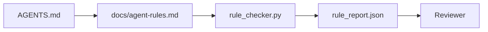

# O agente instrução como um conjunto executável

> O trabalho da base de dados é um processo de avaliação e de avaliação, que é um processo de avaliação e de avaliação.

**类型：**Construção
**语言：**Python (stdlib)
**前置要求：**Fase 14 · 32 (Pantel de trabalho mínimo)
**时间：**Cerca de 50 minutos

## Objectivo de aprendizagem

- A direção e as regras de funcionamento são separadas.
- A partir de agora, o sistema de controlo de dados deve ser aplicado em todos os dispositivos.
- 实现一规则检查器, usar um conjunto de regras para avaliar uma operação.
- 让规则集便于变化, para que o auditoria possa ver o que aconteceu.

## 问题

típico`AGENTS.md`Ele disse ao agente que precisava ter cuidado e fazer um teste completo, bem como não ter certeza sobre a questão. Três dias depois, o agente entregou uma alteração sem teste, escreveu um registro proibido e nunca perguntou, porque ele não sabia onde estava a fronteira.

Quando as instruções são operacionais, elas são fortes; quando as instruções são apenas visuais, elas são fracas.

## 概念

As regras devem ser colocadas.`docs/agent-rules.md`Centro, distante do curto de rotadores raizes.



### 覆盖大多数规则的五个类别

| 类别 | 规则回答的问题 | 示例 |
|----------|---------------------------|---------|
| Startup | 工作开始前必须满足什么？ | “state file exists and is fresh” |
| Forbidden | 什么事情绝对不能发生？ | “do not edit `scripts/release.sh`” |
| Definition of done | 什么能证明任务已完成？ | “pytest exits 0 and acceptance line passes” |
| Uncertainty | Agent 不确定时该做什么？ | “open a question note instead of guessing” |
| Approval | 什么需要人工审批？ | “any new dependency, any prod write” |

Não pode ser incluído em uma das cinco categorias de regras, normalmente deve ser dividido em duas regras.

### Regras são leitíveis

Cada regra tem um tipo, uma categoria, uma descrição e um.`check`字段,指向 `rule_checker.py`Uma função do meio, o que significa que o sistema de controle é adicionado; o sistema de controle cresce com o trabalho.

### 规则便于不同

規則在一个Markdown文件中,每条规则占据一个标题──重命名在不同中可见──新规则放在其类别的顶部──过时规则应删除,而不是注释掉,因为工作台才是真相来源,不是团队上个季度感受如何的聊天记录──

### 规则与框架 guardrails

框架 guardrails(OpenAI Agents SDK guardrails、LangGraph interrupts)                                                                                                                                                                                                                                                    

### Divulgação progressiva: 図書, em vez de百科全書

`AGENTS.md`Vai continuar a mudar, porque a cada incidente vai haver uma nova regra, mas raramente há um incidente vai eliminar uma regra.

修复方式不是写一个更短的文件,而是写一个分层的文件――router根必须小到每一个会议都能读完,并且只保存指针――内容深度放在主题文件里,只有当任务触及应对主题时才加载――给代理一个地图,而不是全本百科全书,让它自己走到需要的页面――

```text
AGENTS.md                  # router，少于 50 行：这个 repo 是什么、去哪里看、5 条硬规则
docs/
  agent-rules.md           # 完整规则集（本课）
  architecture.md          # 任务触及 module boundaries 时加载
  testing.md               # 任务编写或运行 tests 时加载
  deploy.md                # 只在 release 工作中加载，并受 approval rule 保护
feature_list.json          # backlog（Phase 14 · 36）
```

| Tier | 存放位置 | 读取时机 | 大小预算 |
|------|----------|----------|----------|
| Router | `AGENTS.md` | 每个 session，始终读取 | 少于约 50 行 |
| Rules | `docs/agent-rules.md` | 每个 session 启动时 | 每个 category 一屏 |
| Topic docs | `docs/<topic>.md` | 只有任务触及该主题时 | 需要多深就多深 |

O primeiro é o teste de acessibilidade: o agente deve sair do roteador, o máximo dos dois saltos para chegar a qualquer regra, então o roteador deve seguir o caminho link para cada tópico doc, em vez de usar a prosa 模糊描述。 o segundo é o teste de frescura: roteador 足足短, o revisor vai estar em cada PR 里重读它, é o único meio de prevenir que ele 长回百科全书的指针效果比缺缺一条规则更糟糕, então o link quebrado entre o roteador é a violação da inicialização-check。


```figure
wb-rule-checkoff
```

## Construí-lo

`code/main.py`提供:

- `agent-rules.md`Parser,将规则加载到数据类 中──
- `rule_checker.py`风格的检查函数, cada `check`引用对应一个.
- Um agente demo é executado, viola as duas regras, e uma vez consegue capturar essas violações através de um exame.

- Não .

```
python3 code/main.py
```

输出:解析后的规则集、运行 追踪、 pass/fail de cada regra, bem como manter a existência do scripting`rule_report.json`- Não.

## Modelo de produção

Há três modelos que podem diferenciar um conjunto de regras que pode durar um trimestre, de um conjunto de regras que pode durar uma semana.

**编写时标注严重性。**Cada regra está com ele.`severity`- Não .`block`- Não.`warn`Ou `info` Reporteiro;`block`Na maioria dos times, o início da avaliação da gravidade é mais rápido, mas depois, sob pressão do final de prazo, é mais fraco; na redação, a marcação obriga a equipe a pre-classificação.`block`规则的过失 签入                                                                                                                                                                                                                                                                                                                                                                                                                                                                                                                     `overrides.jsonl`Registo de auditoria:

**规则过期作为强制机制。**Cada regra está com ele.`expires_at`Quando uma lei não expirar durante 60 dias sem qualquer violação, o inspector emitirá um aviso; na próxima avaliação de trimestre, ele irá explicar os motivos para a retenção ou para a sua redução.`info`Data da Revisão do Código de Produção de AI da Cloudflare (data de 5169 repo operação 131.246 vezes revisão) mostra que, com regras de prazo definidas, o mecanismo de expiração pode permanecer dentro de cada repo 30 条 条 条 条 条 条                                                                                                                                                                                                                                                                                                                                                                                                                                                         

**Markdown 作为 source，JSON 作为 cache。** `agent-rules.md`É autor de documentos de manutenção;`agent-rules.lock.json`É um sistema de controle em um caminho quente.`package.json`- Não .`package-lock.json`和 `Cargo.toml`- Não .`Cargo.lock`É o mesmo.

## Use-o

Em produção:

- Claude Code、Codex、Cursor  quando começar a sessão  ler regras, e rejeitar a operação  quando citá-las.
- Os guardrails do SDK de OpenAI Agents serão registrados para o mesmo tipo de check-up para os guardrails de entrada e saída.
- LangGraph interrompe o nodo em execução  infração às regras 触发──interrupt handler 读取规则,询问人类,然后恢复──

Este conjunto de regras pode ser transferido entre os três, pois é apenas um marcador de funções.

## Entrega-o

`outputs/skill-rule-set-builder.md`O proprietário do projeto de entrevista, classificará suas instruções de散文式现存分类到五类,并输出带版本的`agent-rules.md`Adição de um teste de máquina.

## 练习

1. Se o seu produto realmente precisa de uma sexta categoria, adicione-o. Explica por que não pode ser incluído nessa categoria.
2. 扩展检查器,让规则可以携带严重性(`block`- Não.`warn`- Não.`info`), não permitem que os relatórios sejam gravemente agrupados.
3. Quando o agente opera com a maior severidade do bloco, as regras falham, então a construção falha.
4. Por cada regra adicionar um expiry字段──90 天内 没有检查失败后,该规则进入评审──
5. - Não .`AGENTS.md`, e reescrevê-lo em cinco categorias de regras.

## 关键术语

| 术语 | 人们的说法 | 它实际意味着什么 |
|------|----------------|------------------------|
| Operational rule | “一条真正的指令” | 工作台可在运行时检查的规则 |
| Aspirational rule | “谨慎一点” | 没有检查的规则；要么删除，要么升级 |
| Definition of done | “Acceptance” | 证明任务已完成的客观、基于文件的证据 |
| Block severity | “硬规则” | 违规会中止运行；没有 operator 不能静默处理 |
| Rule expiry | “过时规则清理” | 在 N 天内没有失败的规则可以考虑退役 |

## 延伸阅读

- [OpenAI Agents SDK guardrails](https://platform.openai.com/docs/guides/agents-sdk/guardrails)
- [LangGraph interrupts](https://langchain-ai.github.io/langgraph/how-tos/human_in_the_loop/breakpoints/)
- [Anthropic, Building Effective Agents](https://www.anthropic.com/research/building-effective-agents)
- [Rick Hightower, Agent RuleZ: A Deterministic Policy Engine](https://medium.com/@richardhightower/agent-rulez-a-deterministic-policy-engine-for-ai-coding-agents-9489e0561edf) Bloqueio/alerta/informação  gravidade
- [Cloudflare, Orchestrating AI Code Review at Scale](https://blog.cloudflare.com/ai-code-review/) 131k 次 运行,规则组合经验
- [microservices.io, GenAI development platform — part 1: guardrails](https://microservices.io/post/architecture/2026/03/09/genai-development-platform-part-1-development-guardrails.html) 规则 规则 规则 规则 规则 规则 规则 规则 规则 规则 规则 规则 规则 规则 规则 规则 规则 规则 规则 规则 规则 规则 规则 规则 规则 规则 规则 规则 规则 规则 规则 规则 规则 规则 规则 规则 规则 规则 规则 规则 规则 规则 规则 规则 规则 规则 规则 规则 规则 规则 规则 规则 规则 规则 规则 规则 规则 规则 规则 规则 规则 规则 规则 规则 规则 规则 规则 规则 规则 规则 规则 规则 规则 规则 规则 规则 规则 规则 规则 规则 规则 规则 规则 规则 规则 规则 规则 规则 规则 规则 规则 规则 规则 规则 规则 规则 规则 规则 规则 规则 规
- [Type-Checked Compliance: Deterministic Guardrails (arXiv 2604.01483)](https://arxiv.org/pdf/2604.01483) Lean 4  como regra-como-check  的上限
- [logi-cmd/agent-guardrails](https://github.com/logi-cmd/agent-guardrails) merger-gate 实现: scope、mutation testing、violation budgets
- Fase 14 · 32  O conjunto de regras de trabalho mínimo
- Fase 14 · 38  Portão de verificação do relatório de regras de consumo
- Fase 14 · 39  Agente de revisão das normas de conformidade
