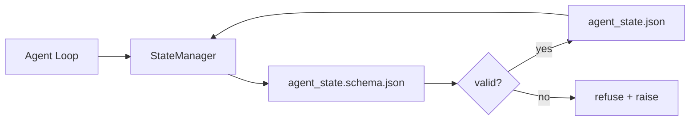

# Memória de reposição e estado duradouro

> História do chat é fácil de perder. O relato é duradouro. O banco de trabalho irá armazenar o estado do agente em arquivos de versão, assim.

**Type:** Build
**Languages:** Python (stdlib + `jsonschema` optional)
**Prerequisites:** Phase 14 · 32 (Minimal Workbench)
**Time:** ~60 minutes

## Objectivo de aprendizagem
- 定義什么属于 repo memory,什么属于聊天史──
- Por`agent_state.json`和 `task_board.json`编写 JSON Schemas──
- Construir um gerente de estado, utilizado para carregamento, verificação, mudança e perpetuidade de estado.
- Use schema 在坏写入破坏工作桌 之前拒绝它们──

## 问题
O agente  completa uma sessão―Chat  fecha¬¬¬¬¬¬¬¬¬¬¬¬¬¬¬¬¬¬¬¬¬¬¬¬¬¬¬¬¬¬¬¬¬¬¬¬¬¬¬¬¬¬¬¬¬¬¬¬¬¬¬¬¬¬¬¬¬¬¬¬¬¬¬¬¬¬¬¬¬¬¬¬¬¬¬¬¬¬¬¬¬¬¬¬¬¬¬¬¬¬¬¬¬¬¬¬¬¬¬¬¬¬¬¬¬¬¬¬¬¬¬¬¬¬¬¬¬¬¬¬¬¬¬¬¬¬¬¬¬¬¬¬¬¬¬¬¬¬¬¬¬¬¬¬¬¬¬¬¬¬¬¬¬¬¬¬¬¬¬¬¬¬¬¬¬¬¬¬¬¬¬¬¬¬¬¬¬¬¬¬¬¬¬¬¬¬¬¬¬¬¬¬¬¬¬¬¬¬¬¬¬¬¬¬¬¬¬¬¬¬¬¬¬¬¬¬¬¬¬¬¬¬¬¬¬¬¬¬¬¬¬¬¬¬¬¬¬¬¬¬¬¬¬¬¬¬¬¬¬¬¬¬¬¬¬¬¬¬¬¬¬¬¬¬¬¬¬¬¬¬¬¬¬¬¬¬¬¬¬¬¬¬¬¬¬¬¬¬¬¬¬¬¬¬¬¬¬¬¬¬¬¬¬¬¬¬¬¬¬¬¬¬¬¬¬¬¬¬¬¬¬¬¬¬¬¬¬¬¬¬¬¬¬¬¬¬¬¬¬¬¬¬¬¬¬¬¬¬¬¬¬¬¬¬¬¬¬¬¬¬¬¬¬¬¬¬¬¬¬¬¬¬¬¬¬¬¬¬¬¬¬¬¬¬¬¬¬¬¬¬¬¬¬¬¬¬¬¬¬¬¬¬¬¬¬¬¬¬¬¬¬¬¬¬¬¬¬¬¬¬¬¬¬¬¬¬¬¬¬¬¬¬¬¬¬¬¬¬¬¬¬¬¬¬¬¬¬¬¬¬¬¬¬¬¬¬¬¬¬¬¬¬¬¬¬¬¬¬¬¬¬¬¬¬¬¬¬¬¬¬¬¬¬¬¬¬¬¬¬¬¬¬¬¬¬¬¬¬¬

O modo de modificação do workbench é o modo de memória repo: state existence repo inside repo JSON 文件里, according to schema 写入,以原子方式持久化,并且在代码审查中对对差 友好。Chat 是临时 feed;repo 是记录系统。

## 概念


### O que pertence à memória repo

| 属于 | 不属于 |
|---------|-----------------|
| Active task id | 原始 chat transcripts |
| 本 session 触碰过的文件 | Token-level reasoning traces |
| agent 做出的假设 | "The user seemed frustrated" |
| 未解决的 blockers | Sampled completions |
| 下一步 action | Vendor-specific model ids |

判断标准是持久性: três meses depois em CI 重新运行时, isto também é útil?

### Estado do primeiro esquema

O JSON Schema é um acordo. Sem ele, cada agente vai criar um novo parágrafo, cada revisor vai aprender um novo formato, cada script deve ser especial para a versão anterior.

schema 覆盖:

- - Não, não.
- 允许的  permitem`status`Valores
- 禁止的值(例如 arrays 的 `null`)。
- Constrangimentos de padrão`T-\d{3,}`)。
- Utilizado em campo de versão de migrações.

### Atomic escreve

Estado 写入需要能承受部分失败:写入tempfile,fsync,然后改名覆盖目标――estado arquivo é fonte de verdade; escrever até metade do estado arquivo 比没有文件更糟──

### Migrações

Quando o esquema  muda  quando, em schema bump 旁边交付一个迁移脚本──状态文件 带有 带有 `schema_version`campo;gerente irá recusar-se a carregar a versão não-movível do arquivo.


```figure
wb-state-persist
```

## Construí-lo
`code/main.py`实现:

- `agent_state.schema.json`和 `task_board.schema.json`- Não.
- Um validador de stdlib só usado (JSON Schema 子集:required、type、enum、pattern、items)
- 带有原子 temp-and-rename 写入的 `StateManager.load`- Não.`StateManager.update`- Não.`StateManager.commit`- Não.
- Uma demonstração: "Cambio de estado", "Portação", "Recargação", "Mostração de ida e volta".

- Não .

```
python3 code/main.py
```

O script 会写入 `workdir/agent_state.json`和 `workdir/task_board.json`, através de dois turnos, transformá-los, e em cada passo imprimir o estado de verificação.

## Modelo de produção em real

Quatro modos podem transformar o mínimo da aula em monorepo multi-agente, algo aceitável.

**Atomic temp-and-rename 不是可选项。**Um relatório de bugs do projeto Hive de março de 2026 explicitamente registrou esse modo de falha:`state.json` através `write_text()`写入,并且例外 被捕获后静默忽略──部分写入让会议 在没有信号的情况下基于损坏状态 恢复──修复永远是:在与目标相似的目录中使用`tempfile.mkstemp`, escrever,`fsync`- Não .`os.replace`(Em POSIX e Windows acima são renome atomico)`atomic_write`É o que faço.

**每个非幂等 tool call 都要有 idempotency keys。**Se o agente em调用 tool 之后、checkpoint 结果之前崩,恢复过程会重试该工具调用――对读安全;对电子邮件、DB inserts、file uploads 危险――模式是:在执行前将每个工具调用 ID 记录到`pending_calls.jsonl` Revisão da ID; se existir, salto de modificação e uso de resultado em cache.

**将大型 artifacts 与 state 分离。**Não coloque CSVs, transcrições ou arquivos gerados em`agent_state.json` vai artifício 保存为单独文件(或上传到物体存储),state 中只保留路径──Checkpoints 保持小而快;artifacts 独立增长──

**Event sourcing 用于 audit，snapshots 用于 resume。**Cada mutação é adicionada ao registro de eventos.`state.events.jsonl`); instantâneo regular até `state.json`◊ Resume 读取 snapshot, em seguida, reproduzir snapshot timestamp 后所有事件── Isso consumirá mais discos, mas permite que você tome decisões de agente de repetição por letra, isso é importante para a execução de longos horizontes 至关重要──Postgres 内部用于WAL também é uma formação mesma──

**Schema migrations，否则拒绝加载。** `schema_version`Quando o gerente carrega uma versão desconhecida do arquivo, ele recusa a leitura.`tools/migrate_state.py`Em cada arranque, o que acontece?

## Use-o
Em produção:

- **LangGraph checkpointers。**O chequepointer irá manter o estado do gráfico em SQLite, Postgres ou backend personalizado.
- **Letta memory blocks。**带结构化方案的持续块 (Pase 14 · 08) ⋅同样纪律,作用域是长期的人物──
- **OpenAI Agents SDK session store。**Backends plugáveis, schema-consciente.

## Entrega-o
`outputs/skill-state-schema.md`会生成一对项目特定JSON Schema(state + board) 、一个连接到原子写的Python `StateManager`, e um andaime de migração, para garantir que a próxima colisão do esquema não estrague o banco de trabalho.

## 练习
1. - Adicione um .`last_human_touch`Tempestamp. Rejeitar edição humana.
2. 扩展 validator 以支持 `oneOf`, tal tarefa pode ser construção de tarefa, também pode ser revisão de tarefa, e ambos possuem diferentes campos necessários.
3. 添加 `schema_version`campo,并编写从v1到v2 的迁移(将 `blockers`重命名为 `risks`)。
4. Vai armazenar o backend do arquivo local  transferir para SQLite 保持`StateManager`A API não muda.
5. Deixe dois agentes escreverem uma corrida de 50 ms, juntamente com o mesmo arquivo de estado.

## 关键术语
| Term | What people say | What it actually means |
|------|----------------|------------------------|
| Repo memory | "Notes file" | 按 schema 存储在 repo 的 tracked files 中的 state |
| Schema-first | "Validate inputs" | 先定义契约再写 writer，拒绝漂移 |
| Atomic write | "Just rename" | 写入 temp，fsync，rename，因此 partial failures 无法破坏 |
| Migration | "Schema bump" | 将 vN state 转换为 v(N+1) state 的 script |
| System of record | "Source of truth" | workbench 视为权威的 artifact |

## 延伸阅读
- [JSON Schema specification](https://json-schema.org/specification.html)
- [LangGraph checkpointers](https://langchain-ai.github.io/langgraph/concepts/persistence/)
- [Letta memory blocks](https://docs.letta.com/concepts/memory)
- [Fast.io, AI Agent State Checkpointing: A Practical Guide](https://fast.io/resources/ai-agent-state-checkpointing/) primeiro ponto de controlo de esquema
- [Fast.io, AI Agent Workflow State Persistence: Best Practices 2026](https://fast.io/resources/ai-agent-workflow-state-persistence/) controlo de simultânea  TTL  fornecimento de eventos
- [Hive Issue #6263 — non-atomic state.json writes silently ignored](https://github.com/aden-hive/hive/issues/6263) real projeto 中的失败模式
- [eunomia, Checkpoint/Restore Systems: Evolution, Techniques, Applications](https://eunomia.dev/blog/2025/05/11/checkpointrestore-systems-evolution-techniques-and-applications-in-ai-agents/) De OS 历史 应用于 agentes de CR primitivas
- [Indium, 7 State Persistence Strategies for Long-Running AI Agents in 2026](https://www.indium.tech/blog/7-state-persistence-strategies-ai-agents-2026/)
- [Microsoft Agent Framework, Compaction](https://learn.microsoft.com/en-us/agent-framework/agents/conversations/compaction) Gestor de pontos de controlo do fornecedor
- Fase 14 · 08  Blocos de memória e cálculo do tempo de sono
- Fase 14 · 32  本课为其方案化三档次最低
- Fase 14 · 40  Do mesmo esquema 读取的转发包
