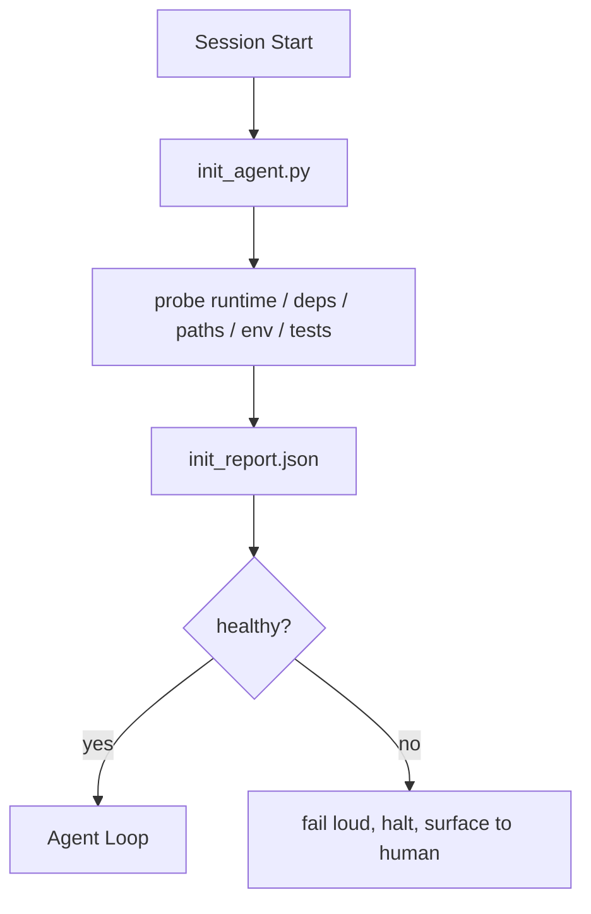

# O guião inicial do agente

> Cada sessão de início a frio tem de pagar um preço. O agente vai ler o mesmo documento, tentar o mesmo processo de pesquisa, e encontrar o mesmo caminho.

**Type:** Build
**Languages:** Python (stdlib)
**先修要求：**Fase 14 · 32 (Banco de Trabalho mínimo), Fase 14 · 34 (Repo Memory)
**Time:** ~45 分钟

## Objectivo de aprendizagem
- O agente de identificação não deve repetir o trabalho realizado em cada sessão.
- Construir um script de inicialização de determinação, para explorar o tempo de execução, dependências e saúde do repo.
- O resultado da pesquisa é permanente, deixe o agente lê-la, em vez de re-executar a pesquisa.
- Quando o inicial é falhado, é necessário que o resultado seja rápido e forneça uma única posição de busca.

## 问题
打开一个会议──Agent 猜测 Python version──Guess test command──为了 encontrar o ponto de entrada, list出 repo root 五次──尝试 importar um pacote que ainda não foi instalado──询问用户配置文件 在哪里──等到它真正开始编辑时,已经有十万 Token 花在本本应由一个脚本完成的设置工作 上──

修复方式是使用一个初始化脚本: é executado antes de ser executado por um agente, e é escrito para um agente 启动时读取的`init_report.json`- Não.

## 概念


### Ini script 探查什么

| Probe | 为什么重要 |
|-------|------------|
| Runtime versions | 错误的 Python 或 Node version 意味着悄无声息的错误版本 bug |
| Dependency availability | 缺失的 package 如果到后面才发现，成本会是现在捕获它的十倍 |
| Test command | Agent 必须知道如何 verify；如果 command 缺失，workbench 就坏了 |
| Repo paths | Hard-coded paths 会漂移；一次性解析并固定下来 |
| Environment variables | 缺失 `OPENAI_API_KEY` 是一个 failure surface，而不是 runtime mystery |
| State + board freshness | 崩溃 session 留下的陈旧 state 是一个 footgun |
| Last-known-good commit | 作为 session 结束时 handoff diff 的锚点 |

### Rapidamente, não conseguimos, não conseguimos.

A prova  fracassou significa parar de se apresentar ao ser humano. Não diga que o agente vai se fazer bem claro.

### Idempotente

连续运行两次──第二次除刷新时间标签 之外应该是没有开机――Idempotency 让你可以将脚本连接到CI、hooks或预任务 slash命令──

### Init versus regras de inicialização

Regras (Fase 14 · 33)                                                                                                                                                                                                                                                                                                                                                                                                                                                                                                                      


```figure
wb-init-probes
```

## Construí-lo
`code/main.py`Realizada .`init_agent.py`- Não .

- Cinco sondas: versão Python, passando`importlib.util.find_spec`列出的依赖性、test command resolvability、required env vars、state file freshness──
- Cada sonda volta .`(name, status, detail)`- Não.
- O scriptwriting contém um conjunto completo de sondas.`init_report.json`, e em qualquer investigação de gravidade de bloco , falha quando é um estado de zero.

- Não .

```
python3 code/main.py
```

Escrever as sondas, escrever`init_report.json`, em caminho feliz, de volta para zero, ou de volta para zero, de volta para zero, quando falha e lista de sondas falhadas.

## Modelo de produção em real

Três modos podem fazer a distinção entre script inicial e ritual.

**Last-known-good commit anchoring.**Vai estar empenhado em fazer uma fusão com o sucesso anterior`LKG`Se o arquivo for investigado, se o arquivo for diferente, se o arquivo for superior ao orçamento, se o arquivo for rejeitado, não será necessário que o ser humano confirme a nova linha de base.

**Lock files with TTL.**Em primeiro sucesso da investigação , depois de passar .`prereqs.lock`◊后续运行会在 N 小时内信任该锁(默认 24h),并跳过昂贵的探测器──init script 会先读取锁; se ainda for fresco,且依赖性表达式 hash 匹配,就在短路──这与Docker 用于层缓存模式相同:idempotent probe + content hash = skip──

**No network, no LLM, no surprises in the hot path.**As sondas iniciais são de ponta de certeza. Adoptamos LLM para classificar falhas, ou visitar serviços externos para verificar licenças de sonda. Não é uma sonda; é um fluxo de trabalho. Se uma sonda em execução seca exceder três segundos, considere-a como cheiro de banco de trabalho, e a moverá para fora ou para armazenar os resultados.

## Use-o
Em produção:

- **Claude Code hooks.** `pre-task`Hook 调用 init script, e foi derrotado quando recusou iniciar o Agente.
- **GitHub Actions.** `setup-agent`O trabalho de um agente depende dele.
- **Docker entrypoint.**Contêiner de agente em execução de um agente runtime 之前运行 init script;失败时呈现日志──

O script init é portátil, pois não utiliza qualquer quadro específico.

## Entrega-o
`outputs/skill-init-script.md`O projeto de entrevistas, a sua criação, a sua criação, a sua criação, a sua criação, a sua criação, a sua criação, a sua criação, a sua criação, a sua criação, a sua criação, a sua criação, a sua criação, a sua criação, a sua criação, a sua criação, a sua criação, a sua criação, a sua criação, a sua criação, a sua criação, a sua criação, a sua criação, a sua criação, a sua criação, a sua criação e a sua criação, a sua criação, a sua criação e a sua criação, a sua criação, a sua criação e a sua criação de projetos específicos.`init_agent.py`, e um fluxo de trabalho de informação antes de qualquer passo do agente.

## 练习
1. Adicione uma sonda, usada para diferenciar o compromisso anterior e o compromisso de última vez conhecido; se o compromisso for superior a 50 documentos, rejeite iniciar.
2. Vou fazer o script, deixe-o escrever.`prereqs.lock`Ficha, e bloqueia 超過七天時拒絕啟動──
3. - Adicione um .`--fix`A bandeira, automaticamente instalada, não tem dependências de desenvolvimento, mas não foi aprovada, não modifica as dependências de tempo de execução.
4. Vai transferir as sondas das funções codificadas para o registro YAML.
5. Para cada sonda, adicionar o orçamento de tempo.

## 关键术语
| Term | 人们会怎么说 | 它实际意味着什么 |
|------|--------------|------------------|
| Probe | “一个 check” | 返回 `(name, status, detail)` 的确定性函数 |
| Init report | “Setup output” | 与 state 放在一起、写有 probe results 的 JSON |
| Idempotent | “可以安全重新运行” | 连续两次运行会生成除 timestamp 外完全相同的 reports |
| Fail loud | “不要吞掉” | 停止并呈现给 human；没有 silent fallback |
| Setup tax | “Bootstrap cost” | Agent 每个 session 为重新发现显而易见信息所花费的 Token |

## 延伸阅读
- [Anthropic, Effective harnesses for long-running agents](https://www.anthropic.com/engineering/effective-harnesses-for-long-running-agents)
- [GitHub Actions, composite actions for setup](https://docs.github.com/en/actions/sharing-automations/creating-actions/creating-a-composite-action)
- [microservices.io, GenAI 开发平台：guardrails](https://microservices.io/post/architecture/2026/03/09/genai-development-platform-part-1-development-guardrails.html) pré-comit + CI 检查作为 init
- [Augment Code, How to Build Your AGENTS.md (2026)](https://www.augmentcode.com/guides/how-to-build-agents-md) expectativas iniciais
- [Codex Blog, Codex CLI Context Compaction](https://codex.danielvaughan.com/2026/03/31/codex-cli-context-compaction-architecture/) sessão começa como compactação consciente init
- Fase 14 · 33  Este script é um conjunto de regras de inicialização
- Fase 14 · 34  O arquivo de estado do programa
- Fase 14 · 38  script init  fornecimento de gate de verificação
- Fase 14 · 40  消费 init relatório de última vez conhecida-bom de entrega
