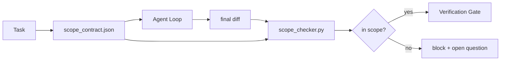

# O âmbito do contrato e a fronteira das missões

> modelo Não sabe o que é o trabalho em que termina. O contrato de alcance é um arquivo por tarefa, para explicar o trabalho a partir de onde começar, onde terminar, e assim que o limite de trabalho seja revertido.

**类型:**Construir
**语言:**Python (stdlib)
**先修:**Fase 14 · 32 (Punto de trabalho mínimo), Fase 14 · 33 (Regras como restrições)
**时间:**- 50 minutos.

## Objectivo de aprendizagem

- Escrever um contrato de alcance, deixar o agente em sua missão começar a ler, fazer o verificador em sua missão terminar a ler.
-  especificar arquivos permitidos,arquivos proibidos,critérios de aceitação, plano de reestruturação e limites de aprovação.
-  Realizar um verificador de alcance, que será diferente do contrato em comparação e marcar violação.
- 让范围 creep 可见、自动化且可审查──

## 问题

O agente vai-se arrastar. A tarefa é reparar o bug de login. Diferentemente, o usuário de dados pode ser identificado como um "piloto de login", ou seja, um "piloto de dados", ou seja, um "piloto de dados".

O escopo de escopo é o modo de falha mais pouco controlado do trabalho do agente, pois o agente irá honestamente contar cada passo.

## 概念



### O âmbito do contrato contém

| Field | Purpose |
|-------|---------|
| `task_id` | 链接到 board 上的 task |
| `goal` | reviewer 可以验证的一句话 |
| `allowed_files` | agent 可以写入的 globs |
| `forbidden_files` | agent 即使意外也不得触碰的 globs |
| `acceptance_criteria` | 证明完成的 test commands 或 assertion lines |
| `rollback_plan` | 如果需要 halt，operator 可以执行的一段说明 |
| `approvals_required` | scope 外需要明确 human sign-off 的 actions |

Não há nada .`forbidden_files`O contrato é incompleto. O espaço negativo é metade do contrato.

### Use globos, em vez de caminhos crus

Real repo 会移动文件──把合同 固定到球s(`app/**/*.py`- Não .`tests/test_signup*.py`), tal sessão                                                                                                                                                                                                                                                                                                                                                                                                                                                                                                                         

### O rollback é parte do escopo .

列出如何滚回会迫使合同作者思考可能出什么问题──不能滚回的合同是不应批准的合同──

### Verificação do escopo é verificação de diferença

Agente 写出 diff―checker 读取 diff― allowed globe、 prohibited globe, bem como qualquer lista de comandos de aceitação já executados― cada violação  都是一个带标签的发现,verification gate可以拒绝它──

### Escala de aplicação dos dois tipos de altitude: lista de características e contrato de tarefas

O contrato de alcance é limitado a uma tarefa. Não é limitado ao projeto inteiro. O agente pode ficar perfeitamente no contrato.

Segundo nível requer seu próprio primitivo: uma sessão  iniciação 读取`feature_list.json`△ é o backlog do projeto △ é um processo de leitura △ é um processo de leitura △ é um processo de leitura △ é um processo de leitura △ é um processo de leitura △ é um processo de leitura △ é um processo de leitura △ é um processo de leitura △ é um processo de leitura △ é um processo de leitura △ é um processo de leitura △ é um processo de leitura △ é um processo de leitura △ é um processo de leitura △ é um processo de leitura ∞ é um processo de leitura ∞ é um processo de leitura ∞ é um processo de leitura ∞`status`Por`todo`Feature, o fazer.`id`写入活 scope contract,并被禁止在同一个会议中启动第二个功能. 一次只做一个功能.   不再是提示里代理可以绕过去一句话,而一个写在磁盘上的值,也是 gate 可以执行的检查.

```json
{
  "project": "knowledge-base",
  "active": "import-pdf",
  "features": [
    { "id": "import-pdf", "status": "in_progress", "goal": "import a PDF into the library", "done_when": "pytest tests/test_import.py && a sample PDF appears in the library view" },
    { "id": "full-text-search", "status": "todo", "goal": "search document text and rank hits", "done_when": "query returns ranked results with snippets" },
    { "id": "cite-answers", "status": "todo", "goal": "answers carry source citations", "done_when": "every answer renders at least one clickable citation" }
  ]
}
```

| Field | Purpose |
|-------|---------|
| `active` | 当前 session 唯一允许触及的 feature；为空时表示选择一个并设置它 |
| `features[].id` | scope contract 的 `task_id` 指向的稳定 slug |
| `features[].status` | `todo`、`in_progress`、`done`、`blocked`；同一时间最多一个 `in_progress` |
| `features[].goal` | reviewer 能验证的一句话 |
| `features[].done_when` | 将 `in_progress` 翻转为 `done` 的 acceptance line |

两条规则让这个名单成为承重结构,而不是装饰.`at most one in_progress`Essa invariante 本身就是起動チェック(Fase 14 · 33): Se a lista 里出现两个,session 会拒绝启动,直到人类 解决──第二,feature list is a file, not a chat message, because chat 会滚出文脈,而文件会跨会议、跨代理 持久存在──handoff(Fase 14 · 40) 将把完成的 feature status 写回`done`Então, a próxima sessão é a de ver o que está na tabela, e não o que está no resto.

contrato com lista                                                                                                                                                                                                                                                                                                                                                                                                                                                                                                                           `allowed_files`O recurso ativo deve estar dentro do alcance do que é tocado, não pode ser ultrapassado.


```figure
wb-scope-bounce
```

## Construí-lo

`code/main.py`实现:

- `scope_contract.json`schema(JSON Schema 的子集, global arrays)
- Um parsador diferente, vai tocar arquivos e executar comandos`RunSummary`- Não.
- Um .`scope_check`, de acordo com o contrato                                                                                                                                                                                                                                                                                                                                                                                                                                                                                                                        `(violations, in_scope, off_scope)`- Não.
- Dois jogos de demonstração: um para manter o alcance, outro para fazer o creep.

运行:

```
python3 code/main.py
```

O veredicto de cada um, bem como a conservação.`scope_report.json`- Não.

## Padrões de produção

O profissional de um agente de regulação (exemplo: o agente de regulação, o agente de regulação, o agente de regulação, o agente de regulação, o agente de regulação, o agente de regulação, o agente de regulação, o agente de regulação, o agente de regulação, o agente de regulação, o agente de regulação, o agente de regulação, o agente de regulação, o agente de regulação, o agente de regulação, o agente de regulação, o agente de regulação, o agente de regulação, o agente de regulação, o agente de regulação, o agente de regulação, o agente de regulação, o agente de regulação, o agente de regulação, o agente de regulação, o agente de regulação, o agente de regulação, o agente de regulação, o agente de regulação, o agente de regulação, o agente de regulação, o agente de regulação, o agente de regulação, o agente de regulação, o agente de regulação, o agente de regulação, o agente de regulação, o agente de regulação, etc.

**Violation budgets，而不是 binary failures。** `agent-guardrails`(Claude Code、Cursor、Windsurf、Codex 经由 MCP使用的OSS merge gate) para cada tarefa 提供 `violationBudget`O orçamento é um dos principais instrumentos de apoio financeiro da União Europeia.`violationSeverity: "error" | "warning"`O orçamento decide se o portal será adotado ou será detestado pela sua equipa.

**按 path family 做 severity asymmetry。**Para o`docs/**`O que escreve fora do alcance é normalmente`warn`;对 `scripts/**`- Não.`migrations/**`- Não.`config/prod/**`O que é que é o " off-scope " ?`block`◊ Essa assimetria ◊ deve existir no contrato, e não no tempo de execução, porque é project-specific, e cada tarefa vai mudar ◊

**Time 和 network budgets 与 file budgets 并列。** `time_budget_minutes`campo 约束 relógio de parede; tempo de execução em caso de não reaprovação recusa continuar a superá-lo.`network_egress`permitido  impedir agente  acesso não pertence às API externas da missão  estes também são escopo 维度; globos de arquivos são necessários, mas não suficientes

**Multi-contract merge semantics（least privilege）。**Quando dois contratos de âmbito de aplicação são aceitos, por exemplo, um contrato de âmbito de projecto, além de um contrato específico de tarefa, as regras de fusão são:**intersect** `allowed_files`(dois contratos devem permitir esta via),**union** `forbidden_files`(qualquer um pode ser proibido),`time_budget_minutes`取最严格值 (min),`approvals_required`- Não.`network_egress`- Não.`None`Indicar não aplicação,`[]`- Não.`[...]`Expressão de autorização;merger 时,`None`让位于另一侧,两个列表取交集,否认-all 保持否认-all──把这一点写入合同方案,这样合并就是机械且可审查的──

## Use-o

Padrões de produção:

- **Claude Code slash commands.** `/scope`comando 写入合同,并将其固定为会议背景──Subagents 在行动前读取合同──
- **GitHub PRs.**O contrato será enviado para o corpo de relações públicas como um arquivo JSON, ou como um artefato verificado.
- **LangGraph interrupts.**O operador de inquérito humano é necessário ampliar o contrato ou o agente é necessário retroceder.

contrato 随任务 流转――当任务 关闭时,合同 会归档到 `outputs/scope/closed/`- Não.

## Entrega-o

`outputs/skill-scope-contract.md`O processo de análise de dados é o seguinte:

## 练习

1. - Adicione um .`network_egress`campo,列出允许的外部主机──拒绝触碰其他主机的运行──
2. - O chequeiro de extensão, deixe-o em frente.`docs/**`软失败、对 `scripts/**`硬失败――说明这种不对称的理由──
3. Use regras estáticas definidas ((no use LLM)`goal`campo 推导 `allowed_files`O primeiro caso de ponta, que problema?
4. 添加 `time_budget_minutes`, e o relógio de parede 超越它后拒绝继续──
5. Para o mesmo diferença de executar dois contratos. Quando ambos são aplicáveis, o que é a verdadeira semântica de fusão?

## 关键术语

| Term | What people say | What it actually means |
|------|----------------|------------------------|
| Scope contract | “任务 brief” | per-task JSON，列出 allowed/forbidden files、acceptance、rollback |
| Scope creep | “它还 touched 了...” | 同一 task 中发生了 contract 外的文件变更 |
| Rollback plan | “我们可以 revert” | 用于 halt 的一段 operator runbook |
| Approval boundary | “需要 sign-off” | contract 中列出的、需要明确 human approval 的 action |
| Diff check | “Path audit” | 将 touched files 与 contract globs 比较 |

## 延伸阅读

- [LangGraph human-in-the-loop 中断](https://langchain-ai.github.io/langgraph/concepts/human_in_the_loop/)
- [OpenAI Agents SDK tool approval policies](https://platform.openai.com/docs/guides/agents-sdk)
- [logi-cmd/agent-guardrails — merge gates 与 scope validation](https://github.com/logi-cmd/agent-guardrails) orçamentos de violação  níveis de gravidade
- [Dev|Journal, Preventing AI Agent Configuration Drift with Agent Contract Testing](https://earezki.com/ai-news/2026-05-05-i-built-a-tiny-ci-tool-to-keep-ai-agent-configs-from-drifting-in-my-repo/) 无外部 deps 的 `--strict`modo
- [Agentic Coding Is Not a Trap (production logs)](https://dev.to/jtorchia/agentic-coding-is-not-a-trap-i-answered-the-viral-hn-post-with-my-own-production-logs-33d9) receitas de especmaxing:52% → 21%
- [OpenCode permission globs](https://opencode.ai/docs/agents/) 细粒度 per permissão
- [Knostic, AI Coding Agent Security: Threat Models and Protection Strategies](https://www.knostic.ai/blog/ai-coding-agent-security)  Como o menor privilégio  部分的范围
- [Augment Code, AI Spec Template](https://www.augmentcode.com/guides/ai-spec-template) Sistema de fronteiras de três níveis ((deve/pergunte/nunca)
- Fase 14 · 27  Com fechaduras de alcance 配套的快速注射防御
- Fase 14 · 33  Este contrato  para cada tarefa  conjunto de regras especializadas
- Fase 14 · 38  verificador 汇报进入的验证门
