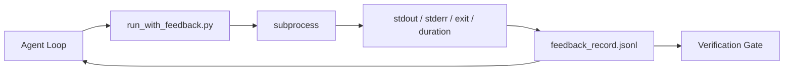

# Loops de Feedback de Tempo de Execução

> Não há nenhuma saída de comando real do Agente, apenas pode adivinhar. O executor de feedback vai colocar o código de saída e o tempo de execução em um registro estruturado, para que o Agente possa reagir de acordo com o fato, e não com a sua própria reação de previsão.

**Type:** Build
**Languages:** Python (stdlib)
**先修要求：**Fase 14 · 32 (Banco de Trabalho mínimo), Fase 14 · 35 (Escrito inicial)
**Time:** ~50 minutes

## Objectivo de aprendizagem
- 区分 runtime feedback e telemetria de observabilidade
- Construir um feedback runner, usá-lo para encomendar comandos shell e manter um registro estruturado permanente.
- Para determinar a forma de cortar as grandes saídas, deixe o ciclo manter-se no orçamento de tokens.
- Quando o feedback                                                                                                                                                                                                                                                                                                                                                                                                                                                                                                                           

## 问题
O agente diz que está executando testes. Todas as testes foram aprovadas. A realidade é que nenhum teste foi executado. O agente imagina que o comando foi executado, mas nunca leu o resultado.

O corredor de feedback irá eliminar essa lacuna. Cada comando vai passar pelo corredor. Cada registro contém o comando. Capturado.

## 概念


### Registro de feedback contém

| Field | 为什么重要 |
|-------|----------------|
| `command` | 精确 argv，避免 shell expansion 意外 |
| `stdout_tail` | 最后 N 行，确定性截断 |
| `stderr_tail` | 最后 N 行，与 stdout 分开 |
| `exit_code` | 明确无歧义的成功信号 |
| `duration_ms` | 暴露缓慢探测和失控进程 |
| `started_at` | 用于 replay 的 timestamp |
| `agent_note` | Agent 写下的一行预期说明 |

### Truncation é determinante

50 MB de log 会 destruir o ciclo. O corredor 会 manter a cabeça e a cauda,并加入 `...truncated N lines...`marcador; é de certeza, portanto, o mesmo output总会产生相同记录── não fazer amostragem; Agente 需要看到的部分(最终错误、最终总结) está localizado na cauda──

### Feedback versus telemetria

Telemetria (Fase 14 · 23, OTel GenAI convenções) para os operadores humanos 跨时间审查 runs。Feedback Used for this next run\\'\\'s下一轮── eles compartilham alguns campos, mas estão em diferentes documentos, retenção também diferente。

### Não há comentários , recusa-se a avançar .

Se um corredor sair antes de sair, o registro contém`exit_code: null`和 `error: <reason>`O ciclo de agentes deve ser rejeitado.`null`上 exit声称成功──没有出口,就没有进步── não há saída, não há progresso.


```figure
wb-feedback-loop
```

## Construí-lo
`code/main.py`实现:

- `run_with_feedback(command, agent_note)`: embalagem `subprocess.run`, captar estdout/stderr/exit/durada, determinação de corte,并追加到 `feedback_record.jsonl`- Não.
- Um pequeno carregador, vai transmitir JSONL para a lista Python.
- Uma demonstração, executar três comandos, e imprimir o último registro de cada comando.

运行:

```
python3 code/main.py
```

输出: 三条 registo de feedback 会追加到 `feedback_record.jsonl`,并 inline 印印每条的最后一条──跨多次重运尾这个文件,可以看循环如何积累──

## Padrões de produção em produção

Há três padrões que podem fazer um corredor ficar mais forte.

**写入时 redaction，而不是读取时 redaction。**Qualquer contacto com o seu amigo ou amigo pode revelar segredos.`^Bearer `- Não.`password=`- Não.`api[_-]?key=`- Não.`AKIA[0-9A-Z]{16}`(AWS)`xox[baprs]-`(Slack) 行──读取时编辑是脚枪;文件在磁盘上才是攻击者能获取的东西──每季度根据生产运行时间中观察到的秘密格式 审核编辑模式──

**Rotation policy，而不是单个文件。**- Não .`feedback_record.jsonl`limit para cada arquivo 1 MB; Rotar para `.1`- Não.`.2`, abandonado .`.5`◦ Loop do agente apenas para ler os documentos atuais, portanto, custo de execução Há limites.  Armazenamento de artefatos CI  Obter um conjunto completo rotativo  Sem rotação  Cada chamada de carregador fica em engarrafamento.

**用于 retry chains 的 parent-command id。**Cada registro tem um .`command_id`Retiro           `parent_command_id`O processo de revisão é um processo de revisão, que consiste em executar uma análise de dados, de dados e de dados, de dados e de dados, de dados e de dados, de dados e de dados, de dados e de dados, de dados e de dados, de dados e de dados, de dados e de dados, de dados e de dados, de dados e de dados, de dados e de dados, de dados e de dados, de dados e de dados, de dados e de dados, de dados e de dados, de dados e de dados, de dados e de dados, de dados e de dados, de dados e de dados, de dados e de dados, de dados e de dados, de dados e de dados, de dados e de dados, de dados e de dados, de dados e de dados, de dados e de dados, de dados e de dados, de dados e de dados, de dados e de dados, de dados e de dados, de dados e de dados, de dados e de dados, de dados e de dados, de dados e de dados, de dados e de dados, de dados e de dados, de dados e de dados, de dados e de dados, de dados e de dados, de dados, de dados e de dados, de dados e de dados, de dados, de dados, de dados e de dados, de dados, de dados, de dados, de dados, de dados, de dados, de dados, de dados, de dados, de dados, de dados, de dados, de dados, de dados, de dados, de dados, de dados, de dados, de dados, de dados, de dados, de dados, de dados, de dados, de dados, de dados, de dados, de dados, de dados, de dados, de dados, de dados, de dados, de dados, de dados, de dados, de dados, de dados, de dados, de dados, de dados, de dados, de dados, de dados, de dados, de dados, de dados, de dados, de dados, de dados, de dados, de dados, de dados, de dados, de, de dados, de, de, de dados, de, de, de, de, de, de, de, de, de, de, de, de, de, de, de, de, de, de, de, de, de, de, de, de, de, de, de

## Use-o
Padrões de produção:

- **Claude Code Bash tool。**Esta ferramenta já capturou o estdout, estderr, saída e duração.
- **LangGraph nodes。**Vai colocar qualquer nó de concha em um runner, deixando o registro em um estado de grafico.
- **CI logs。**Colocar o JSONL em sua loja de artefatos CI; os revisores podem reproduzir qualquer comando, sem precisar reiniciar a sessão.

Corredor é uma embalagem fina; ele pode passar por cada migração de quadro, porque ele detém forma de registro.

## Entrega-o
`outputs/skill-feedback-runner.md` 会生成一个项目具体 `run_with_feedback.py`, contendo o orçamento de truncamento correcto ∞ conectado ao escritor JSONL do banco de trabalho, bem como o agente de cada rodada de leitura ∞

## 练习
1. Por ano, o registro é feito.`cwd`campo, assim, o mesmo comando de diferentes directórios de operação pode ser distinguido.
2. - Adicione um .`redaction`Passo, despedaçamento`^Bearer `Ou `password=`Já está a fazer o teste.
3. Por volta de girar até`.1`- Não.`.2`文件,将 `feedback_record.jsonl`总大小限制为 1 MB──为 rotation policy 辩护──
4. 添加 `parent_command_id`, Deixe tentar novamente cadeias 可见: Qual comando  generou o próximo comando 消费的输入──
5. Colocar o tubo JSONL em uma pequena TUI, alta luz de saída não zero.

## 关键术语
| Term | 人们常说 | 实际含义 |
|------|----------------|------------------------|
| Feedback record | “Run log” | 包含 command、output、exit、duration 的结构化 JSONL entry |
| Tail truncation | “Trim the log” | 确定性 head+tail 捕获，让 records 适配 token budget |
| Refuse-on-null | “Block on missing data” | 当 `exit_code` 为 null 时，loop 不得推进 |
| Agent note | “Expectation tag” | Agent 在读取结果前写下的一行预测 |
| Telemetry split | “Two log files” | Feedback 用于下一轮，telemetry 用于 operator |

## 延伸阅读
- [OpenTelemetry GenAI semantic conventions](https://opentelemetry.io/docs/specs/semconv/gen-ai/)
- [Anthropic, Effective harnesses for long-running agents](https://www.anthropic.com/engineering/effective-harnesses-for-long-running-agents)
- [Guardrails AI x MLflow — deterministic safety, PII, quality validators](https://guardrailsai.com/blog/guardrails-mlflow) Os padrões de redação  como testes de regressão
- [Aport.io, Best AI Agent Guardrails 2026: Pre-Action Authorization Compared](https://aport.io/blog/best-ai-agent-guardrails-2026-pre-action-authorization-compared/) ferramenta 前/后捕获
- [Andrii Furmanets, 2026 年的 AI Agents：面向 Tools、Memory、Evals、Guardrails 的实用架构](https://andriifurmanets.com/blogs/ai-agents-2026-practical-architecture-tools-memory-evals-guardrails) Interface visual
- Fase 14 · 23  Convenções OTel GenAI
- Fase 14 · 24  Plataformas de observação de agentes ((Langfuse, Phoenix, Opik)
- Fase 14 · 33                                                                                                                                                                                                                                                                                                                                                                                                                                                                                                                        
- Fase 14 · 38  读取 JSONL de porta de verificação
