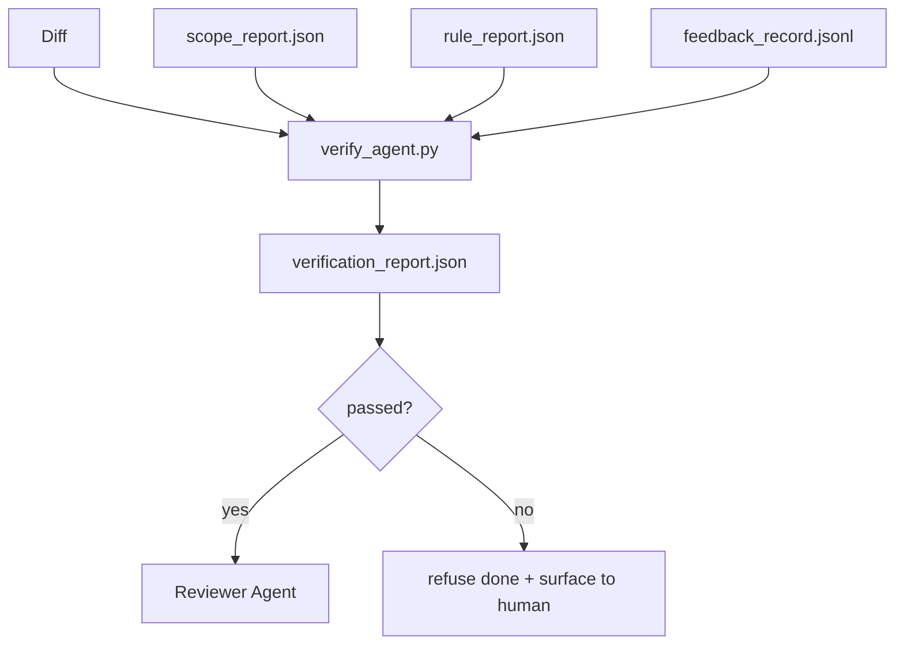

# Portões de verificação

> O agente não pode marcar seu próprio trabalho para concluir. O portal de verificação irá ler o âmbito do contrato.

**Type:** Build
**Languages:** Python (stdlib)
**Prerequisites:** Phase 14 · 33 (Rules), Phase 14 · 36 (Scope), Phase 14 · 37 (Feedback)
**Time:** ~55 分钟

## Objectivo de aprendizagem
- A função de determinação de um portal de verificação define-se como a função de função de determinação de artefatos de banco de trabalho.
- O relatório de regra, o relatório de âmbito, os registos de feedback e as diferenças, serão transformados num veredicto.
- 输出审核代理和CI 都能读取的 `verification_report.json`- Não.
- Se houver qualquer falha de gravidade de bloco, não há excepção para recusar a tarefa.

## 问题
Agentes 太容易宣称成功──三种失败形态最常见:

- Parece-me errado. O modelo leu a sua diferença e depois percebeu que é verdadeira.
- 测试通过了──说得很自信──但没有测试实际运行的记录──
-  satisfação da aceitação  critérios de aceitação são explicados suficientemente facilmente, até que qualquer coisa como se estivesse concluída  tudo esteja concluído

O sistema de revisão de um banco de trabalho é um portal de verificação, ele lê agentes  já gerados artefatos  nem faz julgamentos.

## 概念


### Porta 检查什么

| Check | Source artifact | Severity |
|-------|-----------------|----------|
| 所有 acceptance commands 都已运行 | `feedback_record.jsonl` | block |
| 所有 acceptance commands 都以零退出码结束 | `feedback_record.jsonl` | block |
| Scope check 没有 forbidden writes | `scope_report.json` | block |
| Scope check 没有 off-scope writes | `scope_report.json` | block or warn |
| 所有 block-severity rules 都通过 | `rule_report.json` | block |
| feedback 中没有 `null` exit codes | `feedback_record.jsonl` | block |
| Touched files 匹配 `scope.allowed_files` | both | warn |

`warn`Encontrar o veredicto 添注释;`block`Encontrar 会阻止 `passed: true`- Não.

### 确定性, não probabilidade

Para o mesmo conjunto de artefatos, cada vez todos devem produzir o mesmo veredicto. Não há juízes de LLM.

### Um relatório, um caminho.

Cada tarefa encerrada, o portal da cidade vai fazer uma.`verification_report.json`, escrever`outputs/verification/<task_id>.json`❖ CI 消费同一路──使用不同路的多个门 会分叉真理源──

###  Não há excepção rejeição

Os resultados da gravidade do bloco não podem ser superados por agentes.`override_reason`和 `overridden_by`O ID do usuário. O override é uma vez, não é um agente.


```figure
wb-gate-sequence
```

## Construí-lo
`code/main.py`实现:

- Cada carregador de artefactos de entrada, todos em seu local, faz com que este curso se contém.
- Um .`verify(task_id, artifacts) -> VerdictReport`Função pura.
- Uma impressora, mostrando os resultados de cada verificação e o final de passagem / falha.
- Três cenários de tarefa: demografia: passagem limpa, escopo de acesso, falta de aceitação.

- Não .

```
python3 code/main.py
```

输出: três relatórios de veredicto, cada um guardado até o guião lado.

## Modelo de produção em real

Quatro padrões vão mudar a porta de um outro trabalho de linho para a ponta decisiva.

**Defense-in-depth，而不是 single gate。**Análise de status do CI → Análise de status do CI → Análise de status do CI → Análise de status do authz do instrumento → Porta de pre-mergimento. Cada camada é determinada, portanto, falha do nível 1 será capturada.

**通过确定性 check 做 defense，model-judge 只处理细微差别。**Antropic's 2026 Hybrid Norm pairing:可验证 rewards ((units tests、schema checks、exit codes) respondercode 是否解决了问题?LLM rubricas 回答code 是否可读、安全、符合风格?gate 运行第一类;reviewer(Fase 14 · 39)运行第二类──混用它们会让信号塌──

**签名 override log，而不是 Slack threads。**Cada vez que o passar , a cidade vai estar a`outputs/verification/overrides.jsonl`Na saída de uma linha, contém:estampagem de tempo, busca de código, razão, assinatura do usuário, atual compromisso do HEAD, tempo de execução, rejeita qualquer falta de assinatura, transmissão de um sinal de auditoria, por exemplo, acompanhamento, esta é a política de transmissão e a linha de interação entre o cinema de transmissão.

**将 coverage floor 作为一等 check。** `coverage_report.json`- Vai entrar um .`coverage_floor`(de preferência 80%) verificação. Se a cobertura da avaliação for inferior ao nível, ou inferior ao nível da fusão da última vez, a porta falhará.

**`--strict` mode 会将 warns 提升为 blocks。**para as filiais de liberação  PRs de bloqueio de navios ou triagem pós-incidente,`--strict`Vai deixar cada aviso tornar-se um fracasso difícil. Esta bandeira não é totalmente aceita, porque tudo é estritamente aplicado.

## Use-o
Padrões de produção:

- **CI step。** `verify_agent`O trabalho foi feito para o agente.`passed: true`A protecção da fusão vai ser rejeitada.
- **Pre-handoff hook。**Não há veredicto verde, não há entrega.
- **Manual triage。**Quando o agente afirma ser bem sucedido e o ser humano duvida, os operadores vão ler o relatório.

O portão é o fluxo do banco de trabalho.

## Entrega-o
`outputs/skill-verification-gate.md`Será que o portão connect a um projeto específico: quais comandos de aceitação  irá entrar, quais regras são severidade de bloco, quais escritos fora do escopo  serão tolerados, superar o registro de auditoria  como armazenar

## 练习
1. - Adicione um .`coverage_floor`Verificar: o comando de teste  deve gerar um relatório de cobertura, e atingir pelo menos 80%― decidir qual artefato  transportar piso―.
2. 支持 `--strict`modo, vai cada `warn`提升为 `block` registar o modo rigoroso 适合作为默认值的场景──
3. 让 gate além do JSON 另外生成Markdown summary──论证 哪些 fields 应属于总结──
4. - Adicione um .`time_since_last_human_touch`Verifique: bateria humana                                                                                                                                                                                                                                                                                                                                                                                                                                                                                                                        
5. Em seu produto, o agente real diferem em seu portão de funcionamento. Quantos resultados são reais, quanto é ruído?

## 关键术语
| Term | What people say | What it actually means |
|------|----------------|------------------------|
| Verification gate | “阻止事情的 check” | 作用于 workbench artifacts 的确定性函数，生成 pass/fail verdict |
| Block severity | “Hard fail” | 会阻止 `passed: true` 并要求签名 override 的 finding |
| Override log | “我们为什么放行它” | 带有 reason 和 user id 的签名条目，由 review 审计 |
| Acceptance command | “证明” | 一个 shell command，其零退出码就是 `done` 的含义 |
| One report path | “Source of truth” | `outputs/verification/<task_id>.json`，由 CI 和 humans 共同消费 |

## 延伸阅读
- [Anthropic, Harness design for long-running application development](https://www.anthropic.com/engineering/harness-design-long-running-apps)
- [OpenAI Agents SDK guardrails](https://platform.openai.com/docs/guides/agents-sdk/guardrails)
- [microservices.io, GenAI dev platform: guardrails](https://microservices.io/post/architecture/2026/03/09/genai-development-platform-part-1-development-guardrails.html) Pre-compromisso e defesa em profundidade entre CI
- [ICMD, The 2026 Playbook for Agentic AI Ops](https://icmd.app/article/the-2026-playbook-for-agentic-ai-ops-guardrails-costs-and-reliability-at-scale-1776661990431) porta de aprovação 阶梯(projeto → aprovação → auto abaixo dos limiares)
- [Type-Checked Compliance: Deterministic Guardrails (arXiv 2604.01483)](https://arxiv.org/pdf/2604.01483) Lean 4 作为确定性盖टिंग 的上界
- [logi-cmd/agent-guardrails — merge gate 规范](https://github.com/logi-cmd/agent-guardrails) Ámbito de aplicação + portas de teste de mutação
- [Guardrails AI x MLflow](https://guardrailsai.com/blog/guardrails-mlflow) validadores deterministas como CI 评分器
- [Akira, Real-Time Guardrails for Agentic Systems](https://www.akira.ai/blog/real-time-guardrails-agentic-systems) ferramenta 调用前/后的门
- Fase 14 · 27  defesas de injecção rápida ((gate of adversarial pair)
- Fase 14 · 36  Este é o âmbito do contrato de execução
- Fase 14 · 37                                                                                                                                                                                                                                                             
- Fase 14 · 39  porta de mão até o agente revisor
