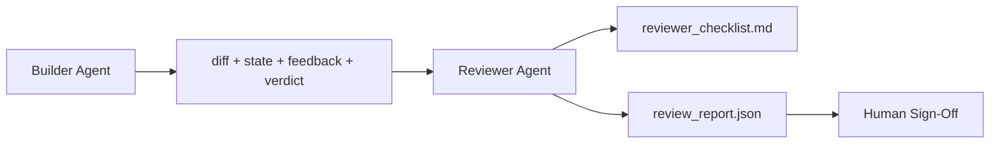

# Agente de revisão: Construtor e Marqueiro separados

> O revisor é um segundo ciclo, usando diferentes sistemas de prompt 、 diferentes objetivos, e para o construtor todo o conteúdo produzido é apenas de acesso à leitura.

**Type:** Build
**Languages:** Python (stdlib)
**Prerequisites:** Phase 14 · 38 (Verification Gate)
**Time:** ~55 分钟

## Objectivo de aprendizagem
- Explicar por que um agente não pode examinar com confiança o seu trabalho.
- Construir um agente de revisão 循环, consome artefatos de construtores,并输出结构化审查报告──
- 编写一个评论员条目,按具体维度评分,而不是凭感──
- Vai entrar o revisor na mesa de trabalho, fazer uma revisão artificial.

## 问题
Você fez o agente reparar um bug. Ele editou quatro documentos, executou testes, e reportou completos.`passed: true`Duos dias depois descobriste que a solução é a outra metade do bug, e não a metade correta.

A aceitação é necessária, mas não é suficiente. O revisor vai perguntar aceitação não pode fazer a questão: se isso resolveu o problema corretamente? se ele ampliou o escopo sem explicação? se ele registra as suposições que devem ser questionadas? se ele deixa o banco de trabalho em uma sessão seguinte em estado de aceitação?

## 概念


### Rubrico de revisor

5 dimensões, cada dimensão avaliada 0 a 2

| Dimension | Question |
|-----------|----------|
| Problem fit | 这个变更是否解决了任务所陈述的问题，而不是相近的问题？ |
| Scope discipline | 编辑是否限制在 contract 内，或者 contract 的扩展是否是有意为之？ |
| Assumptions | 所有隐藏 assumptions 是否都写在了某个可 review 的地方？ |
| Verification quality | acceptance command 是否真的证明了目标，还是只证明了一个更弱的版本？ |
| Handoff readiness | 下一个 session 是否能从当前状态干净地接手？ |

总分 10 分──低于 7 分是软失败;低于 5 分是硬失败──

### O revisor é um papel independente, não um modelo independente.

Você pode usar o modelo do mesmo que o construidor 运行评论器──关键约束是角色分离: diferentes sistemas de prompt, diferentes entradas, para o diferencial 没有写权限──姿态的变化就是信号的变化──

### revisor 不能编辑 diff

reviewer 读取 diff、state、feedback、verdict──它写了一个报告──它不补差──如果报告说修复这个,下一轮建设者转去做修复;reviewer 回到 review──混合角色会破坏这个段间隔──

### Rubrico de revisor em relação ao portal de verificação

O processo de verificação da determinação foi concluído em 31 de janeiro de 2008, quando o processo de verificação foi concluído em 31 de janeiro de 2008.


```figure
wb-builder-marker
```

## Construí-lo
`code/main.py`实现:

- Um .`ReviewerInputs`Dataclass, usado para fazer um revisor de artefatos.
- Uma rubrica pontuação, cada dimensão uma função. Cada função são determinantes, e para o curso usar o grau de stub.
- Um .`review_report.json`O escritor, contém cinco partes, um veredicto e uma decisão.`pass`- Não.`soft_fail`- Não.`hard_fail`)。
- 两个示例案例:一个干净的变更,以及一个测试正确,问题错误的变更──

运行:

```
python3 code/main.py
```

输出:两份复习报告 写入磁盘,并显示在控制台中一张维度分数表──

## Modelo de produção em real

Evidências são as seguintes: Cloudflare em 2026 em abril de AI Code Review sistema, em 30 dias transcorrendo 5.169  repos、48,095                                                                                                                                                                                                                                                                                                                                                                                                                                                                                         

Quatro padrões para que possa ser escalado.

**Specialist pool, not one big reviewer.**Para os reposs solos, um revisor de 5 dimensões de rubrica 足足足。 uma vez que a base de código tem superfícies de segurança-críticas, desempenho-críticas, e docs, vamos separá-los em prompts, ainda menores especialistas, coordenadores fazer fazer fazer de novo; especialistas de não funcionar em rubrica completa, modelo-tier separação também naturalmente formação: especialistas convenientes, coordenador caro。

**Bias mitigation as design requirement, not optimization.**Jueiros do LLM 会表现出四类稳定偏见(Adnan Masood,2026年 4 月):bias de posição(GPT-4 在 (A,B) 与 (B,A) 排序上约40%不一致) Verbosity bias(更长输出有约15%得分通胀) ‧自我偏好(jueys 偏好同样模型家族的输出) ‧autoridade(jueys 会高估对知名作者的引用) ‧缓解方式:同时评估两种排序,只计算一致获胜;使用明确奖励简洁的1-4尺度;跨模型家庭 轮换评委;评分前移除作者姓名──

**Calibration set, not vibes.**preparar um conjunto de 10 a 20 tarefas históricas ▌e há conhecidos veredictos corretos ▌por cada modificação imediata ▌depois de todos os executar revisor ▌se a concordância com os registros históricos for inferior a 80%, rubro em revisor publicado ▌precisa de revisão ▌de cada equipe, eventualmente, será redescoberto este ponto; é melhor começar por fazer isso ▌

**Hybrid norm with the gate.**O processo de verificação foi concluído em 20 de janeiro de 2026. O processo de verificação foi concluído em 20 de janeiro de 2026.

## Use-o
Padrões de produção:

- **Claude Code subagents.**O sub-revisor em construção de um site de publicações publicadas em PR com notas rubricas.
- **OpenAI Agents SDK handoffs.**Construtor em tarefa completa entrega ao revisor. O revisor pode levar com ele uma lista de resultados.
- **Two-model pairing.**Construidor 运行在更快、更便宜的模型 上──Reviewer 运行在更强的模型 上, usando menor contexto, focar no julgamento──

O revisor é quando os seres humanos não conseguem realizar pessoalmente cada revisão.

## Entrega-o
`outputs/skill-reviewer-agent.md`生成一个项目专用评论员条目、一个接入建设者文物的评论员代理 stub, bem como a integração com a porta de verificação,让人工评论从书面报告开始,而不是从空白页开始──

## 练习
1. Adicione o sexto domínio do seu produto                                                                                                                                                                                                                                                                                                                                                                                                                                                                                                                     
2. Utilizando duas espécies diferentes de instruções de sistema (terceiro, verbo) operando revisor, qual tipo de relatório produzirá um relatório humano?
3. Para cada dimensão adicionada`confidence`O relatório foi rejeitado em caso de confiança mínima de 0,6 horas.
4. Construir um conjunto de calibração: 10 个带有已知正确判决的历史任务 close-outs.  Complicar-se a eles.
5. Adicionar um requer mais evidências Affordance:revisor pode em avaliações requer construidor 运行某特定 test──合适的后退是什么,才能避免循环?

## 关键术语
| Term | What people say | What it actually means |
|------|----------------|------------------------|
| Reviewer rubric | “Checklist” | 五维 0-2 评分，每个维度都有一个书面问题 |
| Soft fail | “Needs revisions” | 总分低于 7；builder 获得需要处理的 findings |
| Hard fail | “Reject” | 总分低于 5，或任一维度为 0；暂停并呈现给 human |
| Role separation | “Different prompt” | 同一个 model 可以承担两个角色；关键约束是 inputs 和 posture |
| Confidence floor | “Don't ship low-signal reports” | 当 rubric 不确定时，拒绝输出 verdict |

## 延伸阅读
- [OpenAI Agents SDK handoffs](https://platform.openai.com/docs/guides/agents-sdk/handoffs)
- [Anthropic Claude Code subagents](https://docs.anthropic.com/en/docs/agents-and-tools/claude-code/sub-agents)
- [Cloudflare, Orchestrating AI Code Review at Scale](https://blog.cloudflare.com/ai-code-review/) 7 个 especialista + coordenador 架构,30 天 131k 次 runs
- [Agent-as-a-Judge: Evaluating Agents with Agents (OpenReview / ICLR)](https://openreview.net/forum?id=DeVm3YUnpj) DevAI,366 requisitos de solução hierárquica
- [Adnan Masood, Rubric-Based Evaluations and LLM-as-a-Judge: Methodologies, Biases, Empirical Validation](https://medium.com/@adnanmasood/rubric-based-evals-llm-as-a-judge-methodologies-and-empirical-validation-in-domain-context-71936b989e80) 4 tipos de preconceitos e métodos de suavização
- [MLflow, LLM-as-a-Judge Evaluation](https://mlflow.org/llm-as-a-judge) Utilizado para ferramentas de produção separadas do construtor/evaluador
- [LangChain, How to Calibrate LLM-as-a-Judge with Human Corrections](https://www.langchain.com/articles/llm-as-a-judge) Fluxo de trabalho definido pela calibração
- [Evidently AI, LLM-as-a-judge: a complete guide](https://www.evidentlyai.com/llm-guide/llm-as-a-judge)
- [Arize, LLM as a Judge — Primer and Pre-Built Evaluators](https://arize.com/llm-as-a-judge/)
- Fase 14 · 05  Auto-refinamento e CRITICIAS (linha de base de auto-revisão de um único agente)
- Fase 14 · 30  Desenvolvimento de agente Eval-driven (Generador de conjuntos de calibração)
- Fase 14 · 38  revisor 读取的验证门
- Fase 14 · 40  Relatório do revisor 输入的交付包
