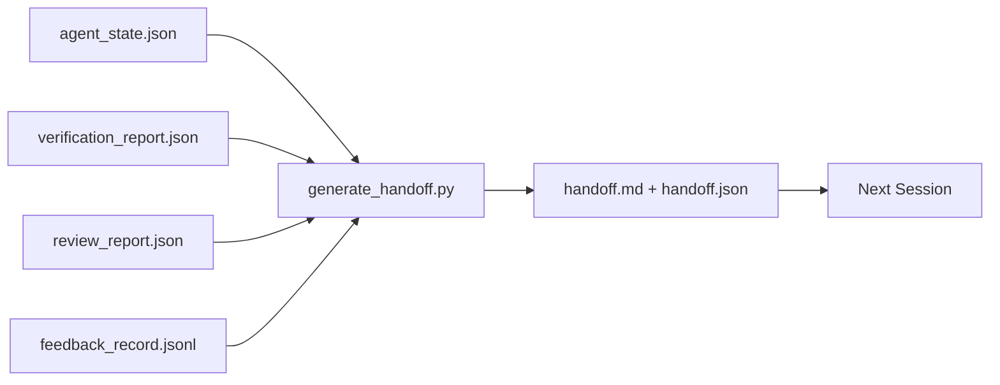

# Transmissão de várias sessões

> Sessão deve terminar. O trabalho ainda não terminou. O pacote de entrega é um artefato, ele leva o agente a trabalhar durante uma hora.

**类型:**Construir
**语言:**Python (stdlib)
**先修:**Fase 14 · 34 (Repo Memory), Fase 14 · 38 (Verificação), Fase 14 · 39 (Reviewer)
**时间:**- 50 minutos.

## Objectivo de aprendizagem

- Identificar cada pacote de entrega todos precisam de sete parágrafos.
- De artefatos de banco de trabalho 生成 hand-off, em vez de manuscritos ilustrativos文字。
- O que é o "Handover"
- 让下一个会议的第一动作具有确定性──

## 问题

A sessão acabou. O agente disse: "Bem, nós fizemos progressos". A sessão seguinte abriu. O agente seguinte perguntou: "O que é que aconteceu na última sessão?" A resposta do primeiro agente já não foi encontrada. O agente seguinte reencontra o problema, reinicializa a mesma ordem, reinicializa o humano. Perguntou a mesma questão, e passou 30 minutos, apenas para recuperar a sessão anterior.

                                                                                                                                                                                                                                                              

## 概念



### Cada entrega tem sete passagens.

| Field | 它回答的问题 |
|-------|---------------------|
| `summary` | 一段话说明完成了什么 |
| `changed_files` | 一眼看清 diff |
| `commands_run` | 实际执行过什么 |
| `failed_attempts` | 尝试过什么，以及为什么没有成功 |
| `open_risks` | 下个 session 可能踩到什么坑，附 severity |
| `next_action` | 下个 session 采取的第一个具体步骤 |
| `verdict_pointer` | 指向 verification + review reports 的路径 |

`next_action`字段是承重字段── 一包含所有内容但缺少 `next_action`O relatório de status é o de entrega, não o de entrega.

### A entrega é gerada, não escrita.

Handwriting handoff,就是在困难日子里会被跳过的 handoff──Generador 读取工作桌文物并输出包──A responsabilidade do agente é deixar o trabalho em um estado geral, não escrever um resumo pessoalmente──

### 两种形式: leitível pelo homem e leitível pela máquina

`handoff.md`供人 阅读。`handoff.json`供下一个代理 加载── ambas provêm do mesmo grupo de artefatos de origem── se aparecerem diferenças, em JSON 为准──

### Registro de feedback 裁剪

- Não .`feedback_record.jsonl`Talvez haja centenas de artigos de registro. Só carregamos o último K 条, bem como todos os artigos de saída. Se necessário, podemos carregar o log completo, mas o pacote                                                                                                                                                                                                                                                                                                                                                                                                                                                                                     

### 留下干净 estado

Handoff  descrição de trabalho; estado limpo 让工作可恢复── eles não são a mesma coisa── se a próxima sessão 打开时面对是半截差、agent 忘了的临时文件、游离分支,以及尚未真正运行就报错的测试, então再完美`handoff.md`Também não tem valor. O próximo agente vai passar 10 minutos a limpar o que deixou numa sessão, em vez de continuar a construir. Este custo vai aumentar em cada sessão do ciclo de vida da missão.

Portanto, a sessão não termina quando o recurso pode funcionar, mas quando o banco de trabalho está no gerador pode ser resumido, a próxima sessão pode ser confiável quando o estado de confiança termina.

| Check | Clean means | Dirty blocks because |
|-------|-------------|----------------------|
| Working tree | 每个变更都已 commit，或明确 stash 并附带说明 | 半截 diff 会被下一个 agent 看成有意图的工作 |
| Temp artifacts | 没有 `*.tmp`、scratch dirs、debug prints 或留下的注释块 | 游离文件会污染 diff 和下一个 agent 的 mental model |
| Tests | 绿色，或红色但在 `open_risks` 中命名了失败 | 沉默的红色 test 是下一个 session 会踩进去的陷阱 |
| Feature board | `feature_list.json` status 反映真实状态（Phase 14 · 36） | 过期 board 会把下一个 session 派去做已经完成的工作 |
| Branch | 位于预期 branch，没有 detached HEAD，没有 orphan branches | 错误 branch 会让下一个 session 的第一个 commit 落到错误位置 |

Limpeza 阶段会产出一个 `clean_state.json`, entre eles, lista de problemas de bloqueio;空列表是手机生成器 写包 前要断言的前置条件──建立在脏树上的手机不是手机,而是转发混乱── dois artefatos 成对出现:


```figure
wb-handoff-packet
```

## Construí-lo

`code/main.py`实现:

- Um carregador, vai estado, veredicto, revisão e feedback 汇总进单个 `WorkbenchSnapshot`- Não.
- Um .`generate_handoff(snapshot) -> (markdown, payload)`Função:
- Um filtro, selecionar as últimas entradas de feedback K 条, adicionadas a todas as saídas não-zero.
- Uma demonstração, escrita ao lado do roteiro.`handoff.md`和 `handoff.json`- Não.

- Não .

```
python3 code/main.py
```

输出: corpo impresso, bem como dois documentos no disco.

## Modelo de produção

O Codex CLI、Claude Code 和 OpenCode oferecem diferentes esquemas de compactação; estruturação do pacote de transferência está localizada no topo.

**Compaction 策略各不相同；packet schema 不变。**O Codex CLI POST /v1/responses/compact é um blob de AES opaco do lado do servidor ((OpenAI models 的快速路径);fallback é um resumo de um local handoff, como `_summary`O código de claude alcança 95% no contexto de uma compilação progressiva.

**Fresh-session handoff 不是 compaction。**Compação 延长一会;handoff 干净地关闭一会,并启动下一个── Hermes Issue #20372 的框架(2026 年 4 月) 是对的: quando a compressão em local 开始降低质量时,Agent 应写一个紧缩的交付,结束会议,并在新背景恢复──paket 让这种转换变得便宜──错误做法是直压到质量崩;修复方式是为早期的干净的交付 预留预算──

**每个 branch 和 topic 只保留一个 active handoff。**Coordenação multi-agente  Crash Mais é por causa de entregas obsoletas, em vez de um mau modelo de saída Always containing `branch`- Não.`last_known_good_commit`, bem como `active | superseded | archived`之一的 `status`❖ As entregas estão arquivadas; apenas a atividade de que ação é a seguinte sessão― é a diferença entre as entregas como notas e as entregas como estado―

**在 50-75% context 之前收尾，不要等到撞墙。**Manual de jogo de modo de escrita (CCLUDE.md + HANDOVER.md) Relatório, que a sessão em contexto orçamento de 50-75%  terminar, em vez de 95% 时, efetô-feito melhor.

## Use-o

Modelo de produção:

- **Session-end hook。**runtime 在用户关闭聊天 时触发发发电机──packet 写入 `outputs/handoff/<session_id>/`- Não.
- **PR template。**O marcador do gerador também pode ser usado como um órgão de relações públicas.
- **Cross-agent handoff。**Usando um produto construir (Claude Code), usando outro continuar (Codex) (Paket é um pacote de linguagem).

Pacote 小、规则、生成成本低──节省下来的成本会随着每次会议的复利增长──

##  Publicá-lo

`outputs/skill-handoff-generator.md`Vai gerar um gerador de caminhos de artefatos de um projeto adaptado, um gancho de fim de sessão, e um agente seguinte.`handoff.json`Esquema

## 练习

1. - Adicione um .`assumptions_to_validate`字段, expostos construtores registados, mas o revisor 评分 没有超过 1 的每一个假设──
2. Para corridas falhadas 和 passando corridas Use different ways cut feedback summary──为这种不对称辩护──
3. 加入一个 问题的人文列表――一个问题进入包,而不是进入聊天消息的值是什么?
4. 让发电机 具备 idempotent:运行两次会产生相同的包――要成立,需要什么内容保持稳定?
5. Adicione uma secção Prequisito da próxima sessão, especifique o que será feito na próxima sessão.

## 关键术语

| Term | 人们常说 | 实际含义 |
|------|----------------|------------------------|
| Handoff packet | “Session summary” | 携带七个字段的生成 artifact，同时包含 markdown 和 JSON |
| Next action | “首先做什么” | 启动下一个 session 的一个具体步骤 |
| Feedback trim | “Log summary” | 最后 K 条 records 加上每个非零 exit |
| Status report | “我们做了什么” | 缺少 `next_action` 的文档；有用，但不是 handoff |
| Verdict pointer | “Receipt” | 指向 verification + review reports 的路径，用于 traceability |

## 延伸阅读

- [Anthropic，面向 long-running agents 的有效 harnesses](https://www.anthropic.com/engineering/effective-harnesses-for-long-running-agents)
- [OpenAI Agents SDK handoffs](https://platform.openai.com/docs/guides/agents-sdk/handoffs)
- [Codex Blog，Codex CLI Context Compaction：架构、配置、管理长会话](https://codex.danielvaughan.com/2026/03/31/codex-cli-context-compaction-architecture/) POST /v1/responsas/compact 和 local fallback
- [Justin3go，Shedding Heavy Memories：Context Compaction in Codex, Claude Code, OpenCode](https://justin3go.com/en/posts/2026/04/09-context-compaction-in-codex-claude-code-and-opencode) Compacção de três vendedores em relação
- [JD Hodges，Claude Handoff Prompt：如何跨 Sessions 保持 Context (2026)](https://www.jdhodges.com/blog/ai-session-handoffs-keep-context-across-conversations/) CLAUDE.md + HANDOVER.md,50-75% orçamento contextual
- [Mervin Praison，Managing Handoffs in Multi-Agent Coding Sessions：Fresh Context Without Losing Continuity](https://mer.vin/2026/04/managing-handoffs-in-multi-agent-coding-sessions-fresh-context-without-losing-continuity/) sistemas distribuídos 视角
- [Hermes Issue #20372 — compression 变得有风险时自动 fresh-session handoff](https://github.com/NousResearch/hermes-agent/issues/20372)
- [Hermes Issue #499 — Context Compaction Quality Overhaul](https://github.com/NousResearch/hermes-agent/issues/499) Codex CLI 中面向 handoff
- [Microsoft Agent Framework，Compaction](https://learn.microsoft.com/en-us/agent-framework/agents/conversations/compaction)
- [OpenCode，Context Management and Compaction](https://deepwiki.com/sst/opencode/2.4-context-management-and-compaction)
- [LangChain，Context Engineering for Agents](https://www.langchain.com/blog/context-engineering-for-agents)
- Fase 14 · 34  gerador 读取的状态文件
- Fase 14 · 38  pacotes indicadores de veredicto de verificação
- Fase 14 · 39  打包进包包进 的评论员报告
