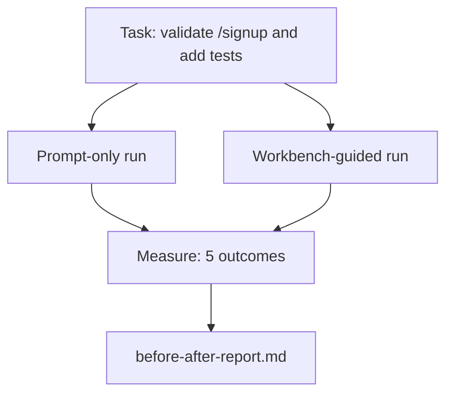

# Em real Repo 上 use Workbench

> Se não puder suportar a verificação de código base real, não terá valor.

**Type:** Build
**Languages:** Python (stdlib)
**Prerequisites:** Phases 14 · 32 to 14 · 40
**Time:** ~60 minutes

## Objectivo de aprendizagem
- A partir de agora, o sistema de trabalho pode ser usado para a criação de um novo sistema de trabalho.
- Vai executar duas vezes a mesma tarefa, apenas de forma rápida e com orientação de banco de trabalho, e medir cinco resultados.
- 阅读前/后报告,并判断哪些表面提供最大杆──
- Mas o meu modelo já é suficientemente bom para o trabalho.

## 问题
Em tarefa de brinquedo, fazer uma demonstração, não convencer ninguém. O valor da mesa de trabalho deve ser realizado em um repo de sentido real, quando uma tarefa de sentido real é realizada: menos falha, menos reversão, e produzir um pacote de uso na próxima sessão.

Esta aula fornece este repo com um sentido real, e permite que a mesma tarefa atravesse dois canais.

## 概念


### A aplicação de amostra

`sample_app/`Um dos menores processadores FastAPI:

- `app.py`, contendo`/signup`(尚無核准)
- `test_app.py`, contém um teste de caminho feliz.
- `README.md`和 `scripts/release.sh`, como isco de zona proibida.

### A tarefa

> Por`/signup`Adicionar validação de entrada: rejeitar apenas a senha de 8 caracteres, retornar com o envelope de erro digitado de 422── adicionar um teste para provar um novo comportamento──

### Os dois oleodutos

Só para o momento:

1. 阅读 README。
2. 阅读 `app.py`- Não.
3. 编辑文件──
4. 声称完成──

Guia de mesa de trabalho:

1. 运行 init script (Lessão 35)
2. 阅读 âmbito de contrato (Lessão 36)
3. 读取 estado ((Lessão 34)。
4. Apenas editar o que é permitido.
5. 通过 feedback runner 运行 aceitação comando ((Lessão 37)。
6. 运行 gate of verification (portal de verificação)
7. 运行 reviewer (Lessão 39)
8. Fazer a entrega da lição 40.

### 衡量五个结果

| Outcome | Why it matters |
|---------|----------------|
| `tests_actually_run` | 大多数“tests passed”声明都无法验证 |
| `acceptance_met` | 证明目标达成的 test 必须就是实际运行过的 test |
| `files_outside_scope` | Scope creep 是主要的静默 failure |
| `handoff_quality` | 下一次 session 会为此付出代价或从中受益 |
| `reviewer_total` | 在 gate 之上的定性判断 |


```figure
wb-ab-runs
```

## Construí-lo
`code/main.py`针对同样样应用 fixture 编排两条管道──两条管道 都是脚本的(loop 中没有LLM),因此测量可复现──该脚本会将比较 写入 写入 `before-after-report.md`和 `comparison.json`- Não.

运行:

```
python3 code/main.py
```

输出: por pipeline  mostrar a tabela de consola do resultado, salvar até o relatório de marcado de script 旁边, bem como fornecer o JSON para o uso de pessoas que fazem gráficos.

## Padrões de produção em produção

A questão dos duvidosos é: o banco de trabalho o que é de grande ajuda?Os números de 2026 têm mais poder de persuasão do que explicar

**Terminal Bench Top-30 到 Top-5，使用同一个 model。**LangChain de *Anatomia de um Agente Harness*(2026 年 4 月): um agente de codificação 仅通过改变 harness,就从终端杆 2.0 的 30 名开外跃升到第 5 名──同一个模型──不同的表面──25 个名次的差距──

**Vercel 通过删除 tools 从 80% 到 100%。**Vercel  relatório, eliminação de 80% de seus agentes ferramentas                                                                                                                                                                                                                                                                                                                                                                                                                                                                                                                

**Harvey 仅靠 harness 实现 2x accuracy。**Agentes legais  através da otimização do uso                                                                                                                                                                                                                                                                                                                                                                                                                                                                                                                  

**88% 的企业 AI agent projects 未能进入 production。**O artigo de preprints.org de *Harness Engineering for Language Agents* (em inglês) (em 2026: 3 月) vai ser atribuído ao tempo de execução, e não ao raciocínio: estado estável, tentativa de retomada fraca, contexto de excesso de inflação, e dificuldade de recuperação de erros intermédios.

**Long-context collapse。**O WebAgent base de 40-50% de sucesso em longo contexto  condições caem para 10% abaixo, a principal razão é infinito loops e perda de gols;; Ralph Loop e pacotes de entrega é para absorver estes problemas e existência;;

**False negatives 仍然存在。**As tarefas factuais de um passo único, lints de uma linha, formatos de execução, qualquer modelo, já se escreveu o seu conteúdo, estes usam apenas um ponto de referência, o que deve ser verdadeiramente listado, de modo que o banco de trabalho não será descrito como um excesso de design.

O resultado não é o arremesso, mas o número de modelos demonstra isso.

## Use-o
Quando ocorrerem as seguintes situações, pode-se citar esta aula como processo:

- Alguém pergunta por que todos os PRs têm .`agent-rules.md`O contrato de âmbito de aplicação
- O grupo pensa que este sprint vai acabar com a porta de verificação.
- Um novo produto de agente é lançado, e você precisa de um benchmark portátil para determinar se é realmente um custo de vida.

O número é mais distante do que a explicação.

## Entrega-o
`outputs/skill-workbench-benchmark.md`É um harness de avaliação portátil, pode deixar qualquer agente produto em um projeto  seu próprio aplicativo de amostra 上跑过两条管线,并报告五个结果──

## 练习
1. 添加第六个结果: tempo-to-first-meaningful-edit── como fazer isso?
2. Em sua base de códigos, uma tarefa real do segundo dia, comparação de desempenho.
3. Adicionar um pass negativo falso: lista-out apenas-pronto 本会更快、workbench overhead is real cost 之任务──然后为继续保留工作板 辩护──
4. Vai ser um agente de roteiro, substituído por um verdadeiro LLM. Qual será o resultado?
5. Escrever um resumo para não engenheiros. O que pode ser conservado?

## 关键术语
| Term | What people say | What it actually means |
|------|----------------|------------------------|
| Sample app | “Toy repo” | 足够小，但也足够现实，能够演练全部七个 surface |
| Pipeline | “Workflow” | agent 遵循的 surface read/write 有序序列 |
| Before/after report | “The receipts” | 你交给怀疑者的 artifact |
| False negative | “Workbench overkill” | prompt-only 更快的任务；诚实列出它们很有用 |
| Workbench benchmark | “Reliability score” | 在你的 codebase 上运行 comparison 的 portable harness |

## 延伸阅读
- [LangChain, The Anatomy of an Agent Harness](https://blog.langchain.com/the-anatomy-of-an-agent-harness/) Terminal Bench Top-30 até Top-5
- [MongoDB, The Agent Harness: Why the LLM Is the Smallest Part of Your Agent System](https://www.mongodb.com/company/blog/technical/agent-harness-why-llm-is-smallest-part-of-your-agent-system) Vercel + Harvey 数字
- [preprints.org, Harness Engineering for Language Agents](https://www.preprints.org/manuscript/202603.1756) 88%  taxa de falhas empresariais  causas raizes do tempo de funcionamento
- [HN: Improving 15 LLMs at Coding in One Afternoon. Only the Harness Changed](https://news.ycombinator.com/item?id=46988596) 在 15 个模型 上复现
- [Cloudflare, Orchestrating AI Code Review at Scale](https://blog.cloudflare.com/ai-code-review/) produção 中 30 天 / 131k revisões
- [Anthropic, Building Effective Agents](https://www.anthropic.com/research/building-effective-agents)
- Fases 14 · 32 a 14 · 40  本课端到端演练的表面
- Fase 14 · 19  SWE-bench、GAIA、AgentBench, como referências macroeconómicas complementares para esta aula
- Fase 14 · 30  Desenvolvimento de agente orientado por avaliação, com um mesmo arnés pode ser conectado entre
