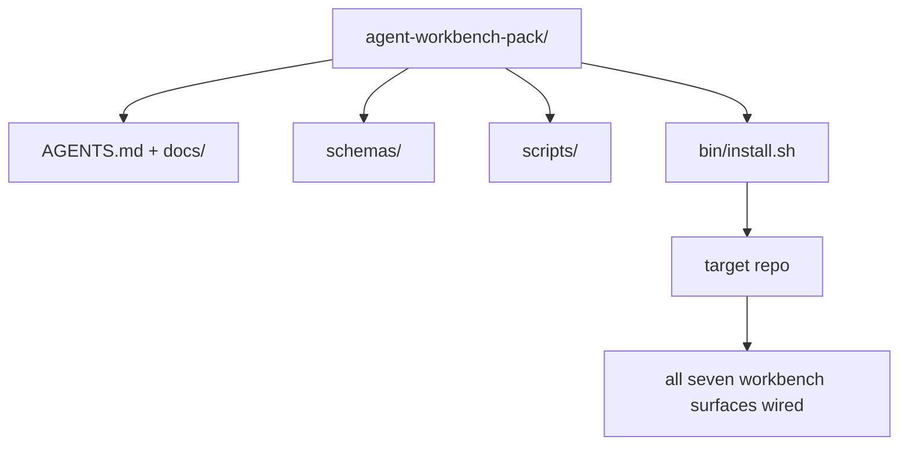

# Capstone: entregar um pacote de trabalho de agente de reposição

> Esta mini-track é uma que pode ser colocada em qualquer pacote de repo.`cp -r`E depois, na manhã seguinte, deixamos o agente trabalhar. Esta pedra fundamental é o artefato que realmente entregou o curso.

**类型：**Construir
**语言：**Python (stdlib)
**前置要求：**Fases 14 · 31 até 14 · 41
**时间：**- 75 minutos.

## Objectivo de aprendizagem

- O trabalho de um banco de trabalho é feito em um conjunto de sete áreas.
- Fixar esquema、script 和 modelo, fazer novo repo  obter uma linha de base já disponível―
- Adicione um script de instalação, coloque este pacote de forma diferente.
- Decidir o que fica na embalagem, o que fica na parte externa, e fazer a diferença para cada um.

## 问题

Um Workbench que existe no Google Doc, Chat History e três scriptes apenas esquecidos, um Workbench que será reconstruído todos os meses. A solução é um pacote com versões: um repo ou catálogo, que contém superfície, esquema, script, bem como um instaltador de comando para executar.

Quando a aula terminar, você vai entregar no disco.`outputs/agent-workbench-pack/`, e um que pode colocá-lo em qualquer repo de destino .`bin/install.sh`- Não.

## 概念



### Layout do pacote

```
outputs/agent-workbench-pack/
├── AGENTS.md
├── docs/
│   ├── agent-rules.md
│   ├── reliability-policy.md
│   ├── handoff-protocol.md
│   └── reviewer-rubric.md
├── schemas/
│   ├── agent_state.schema.json
│   ├── task_board.schema.json
│   └── scope_contract.schema.json
├── scripts/
│   ├── init_agent.py
│   ├── run_with_feedback.py
│   ├── verify_agent.py
│   └── generate_handoff.py
├── bin/
│   └── install.sh
└── README.md
```

### O que deixe, o que põe de fora

Deixe-me aqui:

- Esquema de superfície.
- Os quatro guiões acima são o tempo de execução.
- Quatro documentos... são regras e rubricas...

 colocar fora:

- 项目特定任务──任务属于目标 repo 的董事会, não pertence ao pacote──
- 供应商 SDK 调用──这个包与框架无关──
- Embordagem 文案── Este pacote  colocado na equipa já tem embarque 旁边, em vez de colocar dentro ⋅

### Instalador

Um breve .`bin/install.sh`(ou `bin/install.py`):

1. Não há nada .`--force`时, rejeitar a cobertura de instalação até que haja um pacote.
2. Vai empacotar o pacote em repo.
3. Se existisse`.github/workflows/`, então, entras em CI.
4. 打印后续步骤: preencher o painel de preenchimento 设置接受命令 运行 init script──

### 版本管理

Esta mala leva-a com ela .`VERSION`文件──需要迁移的 schema bump 和脚本 变更会出现重大突破──仅 doc 的变更会出现突破补丁──目标 repo 的 文件──需要迁移的 schema bump 和脚本──变更会出现重大突破──仅 doc 的变更会出现突破补丁──目标 repo 的 文件──需要迁移的 schema bump 和脚本──变更会出现重大突破──只有 doc 的变更会出现突破补丁──目标 repo 的 文件──需要迁移的方案和脚本──目标 repo 的 文件── 文件── 文件── 文件── 文件── 文件── 文件── 文件── 文件── 文件── 文件── 文件── 文件── 文件── 文件── 文件── 文件── 文件── 文件── 文件── 文件── 文件── 文件── 文件── 文件── 文件── 文件── 文件── 文件── 文件── 文件── 文件── 文件── 文件── 文件── 文件── 文件── 文件── 文件── 文件── 文件── 文件── 文件── 文件── 文件── 文件── 文件── 文件── 文件── 文件── 文件── 文件── 文件── 文件── 文件── 文件── 文件── 文件── 文件── 文件── 文件── 文件── 文件── 文件── 文件── 文件── 文件── 文件── 文件── 文件── 文件── 文件── 文件── 文件── 文件──   文件`agent_state.json`记录 it initiation 时对应的包版──


```figure
wb-pack-install
```

## Construí-lo

`code/main.py`Vou fazer a pacotada ao lado da aula.`outputs/agent-workbench-pack/`Em meio, não use esta mini-track como um programa de aprendizagem, bem como o documento que já escreveu.

- Não .

```
python3 code/main.py
```

Esse script vai copiar e fixar a superfície, escrever no README, imprimir a árvore de pacotes, e depois zero.

## Modelo de produção

Um pacote só tem valor quando é capaz de suportar uma garrafa e não é amigável para cima.

**`VERSION` 是 contract，不是 marketing。**O maior problema é a migração de estado. O menor problema é a reatividade do checker. O problema é o de um parche.`.workbench-version`写入目标 repo; se objetivo de bloqueio e de pacotamento `VERSION`Não coincidência,`lint_pack.py`É isso que eu quero.`npm`- Não.`Cargo`和 `pyproject.toml`O agente não vai mudar estas regras.

**跨工具分发的单一来源。**Nx  fornecer um `nx ai-setup`, de um único configurador  colocação `AGENTS.md`- Não.`CLAUDE.md`- Não.`.cursor/rules/`- Não.`.github/copilot-instructions.md`和一个MCP server──这个包也应该这样做;installator 输出 symlink(`ln -s AGENTS.md CLAUDE.md`), deixe um único facto de ser originado por cada agente de codificação.

**`uninstall.sh` 会在存在非平凡 state 时拒绝执行。** Descarregar este pacote Não pode excluir usuário `agent_state.json`- Não.`task_board.json`Ou `outputs/`❖ Uninstaller 会 eliminar schema、script、doc 和 `AGENTS.md`(带 `--keep-agents-md`Opt-out), e se o arquivo de estado tiver qualquer alteração não enviada, é rejeitado continuar.

**Skill-as-publishable。SkillKit-style 分发。**Este pacote  como habilidade SkillKit 交付:`skillkit install agent-workbench-pack`O pacote de repo é a fonte de fato; o SkillKit é a divisão de dados; o vendedor bloqueia vai desaparecer; sete superfícies  manter imutável.

## Use-o

Pacote de entrega em três locais:

- **作为一个你放进 repo 的目录。** `cp -r outputs/agent-workbench-pack /path/to/repo`- Não.
- **作为一个公开 template repo。**Forca e personalização,并用 `VERSION`Controlar a deriva.
- **作为一个 SkillKit skill。**Entre no teu agente, deixe-me pôr uma ordem.

O pacote é uma receita.

## Entrega-o

`outputs/skill-workbench-pack.md`A partir de agora, a Comissão irá criar um pacote de regulamentações para os projectos: regra, regra, regra, regra, regra, regra, regra, regra, regra, regra, regra, regra, regra, regra, regra, regra, regra, regra, regra, regra, regra, regra, regra, regra, regra, regra, regra, regra, regra, regra, regra, regra, regra, regra, regra, regra, regra, regra, regra, regra, regra, regra, regra, regra, regra, regra, regra, regra, regra, regra, regra, regra, regra, regra, regra, regra, regra, regra, regra, regra, regra, regra, regra, regra, regra, regra, regra, regra, regra, regra, regra, regra, regra, regra, regra, regra, regra, regra, regra, regra, regra, regra, regra, regra, regra, regra, regra, regra, regra, regra, regra, regra, regra, regra, regra, regra, regra, regra, regra, regra, regra, regra, regra, regra, regra, regra, regra, regra, regra, regra, regra, regra, regra, regra, regra, regra, regra, regra, regra, regra, regra, regra, regra, regra, regra, regra, regra, regra, regra, regra, regra, regra, regra, regra, regra, regra, regra, regra, regra, regra, regra, regra, regra, regra, regra, regra, regra, regra, regra, regra, regra, regra, regra, regra, regra, regra, regra, regra, regra, regra, regra, regra, regra, reg

## 练习

1. Decidir qual é o quinto documento que vale a pena elevar para o pacote canônico.
2. Usar Python re-instalar,并添加 `--dry-run`A sua ergonomia é muito mais elevada do que a da bash.
3. - Adicione um .`bin/uninstall.sh`Não é normal. O que é anormal?
4. - Adicione um .`lint_pack.py`, embalagem     `VERSION`时失败──把它连入包──自备备用机的CI──
5. Escrever um manual de trabalho manual para o pacote. O que é que pode ser feito para minimizar o tempo de inatividade?

## 关键术语

| 术语 | 人们常说 | 它实际含义 |
|------|----------------|------------------------|
| Workbench pack | “starter kit” | 一个带版本的目录，携带全部七个 surface |
| Installer | “Setup script” | 以幂等方式放置 pack 的 `bin/install.sh` |
| Pack version | “VERSION” | schema/script 变更使用 major bump，仅 doc 变更使用 patch |
| Drop-in pack | “cp -r and go” | Pack 在第一天无需按 repo 定制即可工作 |
| Forkable template | “GitHub template” | GitHub 的 “Use this template” 可以从中 clone 的公开 repo |

## 延伸阅读

- Fases 14 · 31 até 14 · 41  Esta embalagem 打包 de cada superfície
- [SkillKit](https://github.com/rohitg00/skillkit) Em 32 agentes de IA instalar esta habilidade
- [Nx Blog, Teach Your AI Agent How to Work in a Monorepo](https://nx.dev/blog/nx-ai-agent-skills) 跨六种工具的单一来源发电机
- [agents.md — the open spec](https://agents.md/) Roteador do seu pacote  deve implementar o conteúdo
- [HKUDS/OpenHarness](https://github.com/HKUDS/OpenHarness) de pacotes equivalentes
- [andrewgarst/agentic_harness](https://github.com/andrewgarst/agentic_harness) 带 eval suite de Redis apoiado 参考实现
- [Augment Code, A good AGENTS.md is a model upgrade](https://www.augmentcode.com/blog/how-to-write-good-agents-dot-md-files) embalagem doc 
- [Anthropic, Effective harnesses for long-running agents](https://www.anthropic.com/engineering/effective-harnesses-for-long-running-agents)
- [Anthropic, Harness design for long-running application development](https://www.anthropic.com/engineering/harness-design-long-running-apps)
- Fase 14 · 30  消费 这个包 的验证门 的评估驱动代理开发
- Fase 14 · 41  Esta embalagem deve ser melhorada antes/após o referencial
