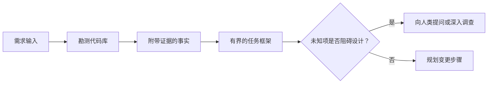

# Em Agente 写代码前框定任务

> 编码智能体(Coding Agent) pode realizar muito rapidamente uma tarefa clara―― também pode realizar muito rapidamente uma tarefa confusa―― ambas as velocidades são completamente iguais, mas o preço é muito diferente――

**Type:** Learn + Build
**Languages:** Python (stdlib)
**Prerequisites:** Phase 14 第 31 课与第 36 课
**Time:** ~60 分钟

## Objectivo de aprendizagem

- Antes de modificar o código, a necessidade original será transformada em um quadro de tarefas com limites definidos.
- A partir daí, o código-fonte será utilizado para a análise de dados e de dados.
- 明确定义 permitir a modificação de rotas, proibir o toque de rotas e a aceitação de provas.
- 判断何时代码勘测(Reconhecimento) já está suficientemente, pode realizar oficialmente o trabalho。

## 代价高昂的失败

 aumentar a segurança de correio postal  parece muito claro, mas na realidade não é o caso. Este único teste deve ser colocado na camada API ̊ nível de serviço do domínio ou nível de base de dados?

Uma capacidade muito forte de um corpo inteligente usa uma escolha razoável para preencher esses espaços vazios.

Assim, a primeira unidade do trabalho do código intelectual não é a modificação direta do código, mas a criação de um quadro de tarefas baseado na verdadeira evidência da biblioteca de código.

## 任务框架(Task Frame)

Um quadro de tarefas práticas contém seis elementos fundamentais:

| 字段 | 核心问题 |
|---|---|
| 目标（Goal） | 必须改变哪些可观测的行为？ |
| 代码库事实（Repository facts） | 你在代码、测试、配置或历史提交中验证了什么？ |
| 允许修改路径（Allowed paths） | 变更允许落在哪些位置？ |
| 禁止触碰路径（Forbidden paths） | 哪些文件与目录必须保持原样？ |
| 验收证据（Acceptance evidence） | 哪些具体命令或观测现象能证明目标已达成？ |
| 未知项（Unknowns） | 哪些决策仍需补充证据或依赖人类判断？ |

O facto deve ser acompanhado de um certificado de autenticidade. Quando se trata de um comportamento em movimento, o resultado da execução de um pedido é mais estável.



## 勘测旨在寻找约束

Não tente ler toda a biblioteca de código. Você deve procurar que possa lidar com as diferentes superfícies de fronteiras do seu conjunto.

1. A actuação do comportamento e a sua utilização.
2. O mais recente já existe teste de uso.
3. 公共契约或序列化后的数据结构──
4. 管辖该路径的项目规范与指令──
5. 构建与验证命令──
6. Muitas mudanças similares ao que já foram realizadas, desde o modelo de código local de desenvolvimento.

Quando cada decisão no plano já tem evidências objetivas, já está autorizado a tomar decisões, ou está classificado como um projeto conhecido, a exploração pode parar.

## Não sei o que é que está acontecendo

O desconhecido é o espaço de informação controlado; enquanto o não-provado é uma suposição sobre o espaço não controlado.

Para cada um dos grupos de conhecimento:

- **可探查的（Discoverable）：**O código-banco em si ou o sistema em funcionamento pode dar respostas.
- **可自决的（Decidable）：**O CICH concedeu ao corpo inteligente o direito de escolha própria.
- **需人类判断的（Human）：**A escolha alterará o comportamento do produto, o custo, o risco do sistema ou a compatibilidade externa.
- **延后处理的（Deferred）：**A seleção ultrapassa o alcance do actual pedaço, pertence a não-objetivos (non-goals)

O corpo inteligente deve tratar de forma autónoma os itens desconhecidos exploráveis e autorizados a decidir; mas, quando se encontram com itens desconhecidos que necessitam de julgamento humano, devem ser suspensos e confirmados antes que a decisão seja consolidada no código.

## 实现之前先定验收标准

Antes de escrever o correcto, primeiro escrever a prova de conclusão.

- Uma ordem de teste de unidade ou de teste de integração específica;
- O processo de operação do navegador de ponta a ponta de um visual designado e de um estado de previsão;
- Uma solicitação de rede e um acordo de resposta totalmente adequado;
- Uma medida de desempenho que atinja um determinado valor;
- Uma verificação de que não houve documentos irrelevantes modificados:

 Test pass não é um programa de prova válido.

## Construí-lo

A experiência deste curso vai criar um.`TaskFrame`Os dados relativos à avaliação dos resultados e à avaliação dos resultados são apresentados em conformidade com o artigo 5.o, n.o 1, do Regulamento (CE) n.o 1069/2009 do Conselho.`outputs/task-frame.md`- Não.

Em curso:

```bash
python3 code/main.py
python3 -m unittest discover code/tests -v
```

尝试通过四种方式故意破坏示例: eliminar objetivos, eliminar factbili­cees, fabricar permutas e proibir camadas de sobreposição, bem como eliminar ordens de recepção.

## Em used

Antes de fazer o seguinte:

1. O objetivo é o de apresentar um comportamento específico, e não uma modificação de um documento.
2. 记录两到三条带有确凭证的代码库事实──
3. 指定最小的允许修改路径集合──
4. 明确写出禁止触碰的负空间 (Negativo espaço)
5. 编写能够宣告任务闭环的验证命令或观测手段──
6. 列出你目前未查清且没有决定权的决策项── não tiverem o poder de decidir

O quadro de tarefas deve ser exibido de forma completa dentro de uma tela. Se ultrapassar uma tela, a tarefa pode muito provavelmente incluir várias alterações independentemente verificáveis, deve ser dividido.

## 练习

1. Para você, um bug real em uma base de códigos define um quadro de tarefas, e o processo inteiro não apresenta nenhuma solução específica.
2. 找出任务框架中的一条实际上只是主张的主张,用客观证据取代它──
3. A maior parte das decisões humanas devem ser tomadas por pessoas desconhecidas.
4. O que é necessário para a aplicação de um sistema de segurança é a utilização de um sistema de segurança de segurança de um sistema de segurança de segurança de um sistema de segurança de segurança de um sistema de segurança de segurança de um sistema de segurança de segurança de um sistema de segurança de segurança de um sistema de segurança de segurança de um sistema de segurança de segurança de um sistema de segurança de segurança de um sistema de segurança de segurança de um sistema de segurança de segurança de um sistema de segurança de segurança de um sistema de segurança de segurança de um sistema de segurança de segurança de um sistema de segurança de segurança de um sistema de segurança de segurança de um sistema de segurança de segurança de um sistema de segurança de segurança de um sistema de segurança de segurança de segurança de um sistema de segurança de segurança de segurança de um sistema de segurança de segurança de segurança de segurança de um sistema de segurança de segurança de segurança de segurança de segurança de um sistema de segurança de segurança de segurança de segurança de segurança de segurança de um sistema de segurança de segurança de segurança de segurança de segurança de segurança de segurança de segurança de segurança de segurança de segurança de segurança de segurança de segurança de segurança de segurança de segurança de segurança de segurança de segurança de segurança de segurança de segurança de segurança de segurança de segurança de segurança de segurança de segurança de segurança de segurança de segurança de segurança de segurança de segurança de segurança de segurança.
5. Em recebimento de certificados, adicionar um documento de reconhecimento de alcance utilizado para a prevenção de alterações no âmbito da fronteira (Scope receipt)

## 延伸阅读

- [Nuseibeh and Easterbrook, Requirements Engineering: A Roadmap](https://www.cs.toronto.edu/~sme/papers/2000/ICSE2000.pdf)O programa de desenvolvimento de software é um dos principais objetivos do mundo real.
- [Yang et al., SWE-agent: Agent-Computer Interfaces Enable Automated Software Engineering](https://arxiv.org/abs/2405.15793)A teoria de que o código é um sistema de ligação e ligação ao corpo inteligente tem um impacto decisivo sobre o seu desempenho de trabalho.

## 交付物与沉

Por favor, mantenha bem a produção.`outputs/task-frame.md` é um ingresso direto da seguinte secção, onde o quadro será transformado em um plano de execução baseado em evidências
