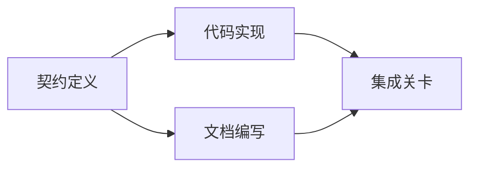

# Construir um plano de execução baseado em evidências

> O plano não é uma lista de espera mais bonita (ou lista de tarefas a fazer) e é uma lista de dependências: cada uma das alterações tem um fundamento, cada ponto terminal tem uma prova de verificação clara.

**Type:** Learn + Build
**Languages:** Python (stdlib)
**Prerequisites:** Phase 14 第 43 课
**Time:** ~65 分钟

## Objectivo de aprendizagem

- Transformar o quadro de tarefas em um projeto de trabalho com evidências objetivas e provas de verificação.
- Execução de uma ordem de construção dependente do gráfico, e não de um passo linear de forma escrita.
- Antes de modificar o código, verifica a falta de fatos, dependências desconhecidas e dependências de ciclo.
- 区分哪些步骤可以并行执行,哪些步骤必须按序等. 区分哪些步骤可以并行执行,哪些步骤必须按序等.

## Por que os planos do corpo inteligente sempre falham ?

O plano de vulnerabilidade é apenas para o futuro, para reiterar as necessidades dos usuários:

1. 更新API♪
2. 添加测试──
3. - Não.

Não há nenhuma indicação sobre o que é que é que é que é que é que é que é que é que é que é que é que é que é que é que é que é que é que é que é que é que é que é que é que é que é que é que é que é que é que é que é que é que é que é que é que é que é que é que é que é que é que é que é que é que é que é que é que é que é que é que é que é que é que é que é que é que é que é que é que é que é que é que é que é que é que é que é que é que é que é que é que é que é que é que é que é que é que é que é que é que é que é que é que é que é que é que é que é que é que é que é que é que é que é que é que é que é que é que é que é que é que é que é que é que é que é que é que é que é que é que é que é que é que é que é que é que é que é que é que é que é que é que é que é que é que é que é que é que é que é que é que é que é que é que é que é que é que é que é que é que é que é que é que é que é que é que é que é que é que é que é que é que é que é que é que é que é que é que é que é que é que é que é que é que é que é que é que é que é que é que é que é que é que é que é que é que é que é que é que é que é que é que é que é que é que é que é que é que é que é que é que é que é que é que é que é que é que é que é que é que é que é que é que é que é que é que é que é que é que é que é que é que é que é que é que é que é que é que é que é que é que é que é que é que é que é que é que é que é que é que é que é que é que é que é que é que é que é que é que é que é que é que é que é que é que é que é que é que é que é que é que

Um plano sólido para cada item de trabalho (PROTECT)

| 承诺要素 | 核心作用 |
|---|---|
| 标识符（Identifier） | 用于依赖声明与会话交接（Handoff）的稳定引用 |
| 变更内容（Change） | 最小颗粒度的行为或契约改动 |
| 事实证据（Evidence） | 证明该变更合情合理且必要据实的代码库证据 |
| 前置依赖（Dependencies） | 必须率先完成并成立的前置工作项 |
| 验收证明（Proof） | 能够确凿宣告该工作项闭环的检查手段 |

## Planeamento de acordos antes de serem concretizados

Quando vários códigos diferentes dependem da mesma forma de agir, é necessário definir a mesma forma de agir. Assim, os testes, realizações e realizações podem compartilhar a mesma forma de agir, em vez de cada um criar quatro versões incompatíveis.



Este quadro de dependência revela claramente a possibilidade de desenvolvimento de segurança: após o contrato fixado, a implementação do código e a redação de documentos podem ser desenvolvidas em conjunto, enquanto a fase final de integração espera que ambos estejam prontos.

## Os dados de facto devem ter capacidade de mudar o plano.

O facto de a código-bácuas não ter qualquer efeito é que ela deve poder realmente influenciar o planejamento do trabalho:

-  encontrar funções auxiliares existentes, eliminando assim a estratégia de abstração do novo projeto original.
- A existência de testes de compatibilidade, o plano de urgência deve aumentar a migração de dados por um passo.
- 部署环境的约束,将模式(Schema) mudar mais de uma tarefa independente.
- O formato do tipo de resposta pública, alterou a sequência de implementação do código e de redação do arquivo.

Se uma chamada prova não pode mudar o seu plano, é provável que não seja prova válida para apoiar essa decisão.

## 面向会话中断而设计

编码智能体的会话往往会无预警中断── um plano com recuperabilidade (Resulamável), a sua dimensão de trabalho é suficientemente detalhada para que outro encontro possa decidir imediatamente:

- 哪项工作已完成;
- 哪项验收证明已经跑通;
- 哪些产物文件已修改;
- 哪些 dependencies have already been lifted blocked;
- O próximo trabalho que podemos executar com segurança é o quê?

Não deixe o estado de execução apenas em um quadro de seleção na janela de conversação.

## 计划有效性校验

Em conformidade com o artigo 1.o, n.o 1, do Regulamento (CE) n.o 1069/2009 do Conselho, de 15 de dezembro de 2009, o Conselho adoptou um regulamento relativo à aplicação do Regulamento (CE) n.o 1069/2009 do Conselho, de 15 de dezembro de 2009, que estabelece as regras aplicáveis ao regime de segurança dos trabalhadores e aos trabalhadores.

- existência de um identificador de trabalho de re-re-re-re-re-re-re-re-re-re-re-re-re-re-re-re-re-re-re-re-re-re-re-re-re-re-re-re-re-re-re-re-re-re-re-re-re-re-re-re-re-re-re-re-re-re-re-re-re-re-re-re-re-re-re-re-re-re-re-re-re-re-re-re-re-re-re-re-re-re-re-re-re-re-re-re-re-re-re-re-re-re-re-re-re-re-re-re-re-re-re-re-re-re-re-re-re-re-re-re-re-re-re-re-re-re-re-re-re-re-re-re-re-re-re-re-re-re-re-re-re-re-re-re-re-re-re-re-re-re-re-re-re-re-re-re-re-re-re-re-re-re-re-re-re-re-re-re-re-re-re-re-re-re-re-re-re-re-re-re-re-re-re-re-re-re-re-re-re-re-re-re-re-re-re-re-re-re-re-re-re-re-re-re-re-re-re-re-re-re-re-re-re-re-re-re-re-re-re-re-re-re-re-re-re-re-re-re-re-re-re-re-re-re-re-re-re-re-re-re-re-re-re-re-re-re-re-re-re-re-re-re-re-re-re-re-re-re-re-re-re-re-re-re-re-re-re-re-re-re-
-  falta de provas de facto de um projecto de trabalho;
- 某工作项缺乏验收证明;
- Dependência de um projecto que não existe;
- Dependência do ciclo de dependência;
- Antes de a incerteza relativa ser eliminada, já foi organizada a primeira operação irreversível.

Os cinco primeiros exames podem ser executados automaticamente através de procedimentos de mecanização; o último requer um poder de julgamento de engenharia, que deve ser claramente enfatizado na avaliação.

## Construí-lo

`code/main.py`建模了工作项,校验其证凭证,通过拓排序计算执行波次(Execution Waves),并将结果写入 `outputs/evidence-plan.json`- Não.

运行命令:

```bash
python3 code/main.py
python3 -m unittest discover code/tests -v
```

Neste exemplo, serão geradas três fases de execução: primeiro executar um contrato definido; depois executar um código com o arquivo editado e executado; e depois executar um código integrado.

## 配合编码智能体使用

Antes de permitir que o Intelligente modifique o código de arquivo, exija que ele primeiro produz o plano.

1. Cada caminho e comportamento tem um código específico.
2. Cada trabalho tem uma prova de conclusão única e clara.
3. Dependendo do facto de o trabalho ser caro ou irreversível, adiar-se-á até à eliminação da incerteza sobre a sua dependência.

A aprovação é um plano específico e claro, e não uma frase em branco.

## 练习

1. Adicionar um trabalho de migração de base de dados que precisa de aprovação humana.
2. Construir um ciclo de dependência, e explicar as diferenças de produtos escondidos por trás dele.
3. 拆分一包含两条不同证明命令的工作项──
4. Adicionar um que possa ser executado na segunda onda e não tocar em qualquer trabalho já existente.
5. A programação será feita em formato de Markdown, mantendo JSON como uma única fonte de dados.

## 延伸阅读

- [Nuseibeh and Easterbrook, Requirements Engineering: A Roadmap](https://www.cs.toronto.edu/~sme/papers/2000/ICSE2000.pdf)A investigação da relação entre objetivos, normas, consenso e desenvolvimento.
- [Barry Boehm, A Spiral Model of Software Development and Enhancement](https://dl.acm.org/doi/10.1145/12944.12948)O processo de desenvolvimento e de desenvolvimento de sistemas de informação e comunicação de informação (R&D) é um processo de desenvolvimento e de desenvolvimento de dados.

## 交付物与沉

Por favor, mantenha bem a produção.`outputs/evidence-plan.json` será como base do acordo entre os encarregados das tarefas da seguinte secção.
