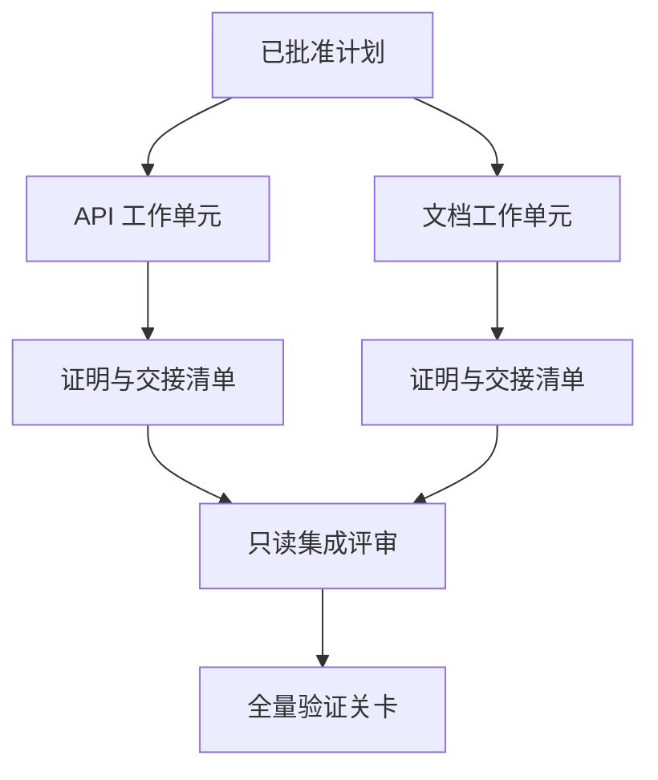

# Agente encarregado de um acordo de separação e de concessão

> E os corpos inteligentes só conseguem economizar tempo físico quando trabalham realmente independentemente um do outro.

**Type:** Learn + Build
**Languages:** Python (stdlib)
**Prerequisites:** Phase 14 第 39 课与第 44 课
**Time:** ~70 分钟

## Objectivo de aprendizagem

- De acordo com a verdadeira independência, a tarefa de julgamento e a execução são razoáveis.
- Para cada unidade de trabalho, o trabalhador é atribuído o direito de alterar o seu documento e a prova de que o trabalho está concluído.
- Baseada na dependência do cálculo de segurança de execução
- 设计合并契约 (Contrato de fusão) para a segurança de fusão de vários produtos de trabalho inteligentes.

## Exibição de testes

Não basta apenas porque há mais inteligência disponível para executar tarefas cegas. Só quando se atende ao menos uma das seguintes condições, o delegado é razoável:

- ∆os inquéritos podem resolver independentemente diferentes questões desconhecidas;
-  dois códigos que permitam a interação de documentos e de documentos que não se sobrepõem;
- 评审智能体 (revisor) capaz de realizar inspecções independentemente sob a premissa de não modificar os produtos;
- Os exames externos mais longos podem ser realizados no local e no local.

Quando vários organismos inteligentes precisam modificar o mesmo documento, dependendo de uma mesma decisão não resolvida, ou dependendo do mesmo ambiente flexível, devem manter-se em linha de execução.

## 工作单元就是一份契约 (trabalho é um trabalho é um acordo)

Cada unidade de trabalho encarregada precisa de especificar:

| 字段 | 含义 |
|---|---|
| 目标（Goal） | 单一可观测的结果 |
| 负责人（Owner） | 单一负责执行的工作智能体 |
| 路径（Paths） | 排他的写入所有权 |
| 前置依赖（Dependencies） | 启动前必须已完工的前置单元 |
| 证明（Proof） | 返回给集成者的确凿验证证据 |
| 交接清单（Handoff） | 已修改的文件、已做出的决策以及残留风险 |

 Processamento  não é um trabalho qualificado   `app/accounts.py`Em implementar o exame de reapreciação e através de testes especializados para o contabilidade, demonstrar que é a unidade de trabalho qualificada.

## Sistema de três níveis de separação

1. **文件系统隔离（Filesystem isolation）：**独立工作树 (de trabalho) ou sala de trabalho, para evitar acidentes
2. **所有权隔离（Ownership isolation）：**严格的契约限制, impedir que dois seres inteligentes alterem intencionalmente o mesmo caminho.
3. **状态隔离（State isolation）：**Registros de registros e de saídas independentes, impedindo que um corpo inteligente cobre outro corpo inteligente.

O processo de separação não pode resolver o problema da propriedade de design. Os dois arquitetos de trabalho ainda podem surgir em conflito entre si.



## 集成者不负责重构代码

As funções do integrador devem ser:

1.  a confirmação de que os resultados de cada comunicação estão estritamente dentro do âmbito de sua distribuição;
2. 认真审查验证证的输出, não apenas resumo do trabalho intelectual do cego que o próprio organismo escreveu;
3. 按照依赖关系的时间序依次合并改动;
4. 运行覆盖跨单元的全量验证关卡;
5.  resolução em rejeitar qualquer extensão do escudo;
6. Registrar os conflitos para novas decisões que precisam ser resolvidas, em vez de modificações silenciosas em privado.

Se a fase de integração precisar reescrever a maior parte do produto de código de um trabalho inteligente, explicar que a descomposição inicial da tarefa em si é errada.

## O papel da humanidade e do corpo inteligente

O encargo de tarefas não significa abandonar a capacidade humana de julgamento. O homem ainda é firme no domínio das decisões centrais que alteram o comportamento externo do sistema, os níveis de risco, as competências de segurança ou trazem custos irreversíveis.

É isso.**校准型自主（Calibrated Autonomy）**O sistema, em evidências suficientes e fáceis de revirar, dá ao corpo inteligente uma elevada liberdade, e, consequentemente, os principais elementos são obrigados a estabelecer um sistema de controlo humano.

## Construí-lo

O programa de experimentação deste curso irá examinar os caminhos de sobreposição, verificar a dependência, executar as ondas de segurança do cálculo e emitir os resultados.`outputs/delegation-plan.json`- Não.

运行命令:

```bash
python3 code/main.py
python3 -m unittest discover code/tests -v
```

尝试修改文档单元, deixe-o possuir `app/`O programa deve ser interceptado e comunicado automaticamente, uma vez que existem sobreposições entre o programa e a API.

## 练习

1. Dividir um negócio real em duas unidades de trabalho independentes e um papel integrador.
2. Encontrar um esquema de separação de linhas que pareça aparentemente independente, mas na realidade se ajunta, explicitamente indicando que elas compartilham decisões secretas.
3. 增加一个只读的研究型智能体 (Research Worker), seu produto é um facto.
4. 增加一个合并关卡(Merge Gate),对照所有工作单元契约检查最终修改的文件集合──
5. Por isso, a aplicação de um sistema de gestão de dados deve ser efetuada de forma a que o sistema de gestão de dados possa ser efetuado de forma adequada.

## 延伸阅读

- [Reid Smith, The Contract Net Protocol](https://doi.org/10.1109/TC.1980.1675516): distribuída de tarefas distribuição e resultados de formação clássica de estudos anteriores.
- [Eric Horvitz, Principles of Mixed-Initiative User Interfaces](https://dl.acm.org/doi/10.1145/302979.303030)O relatório da Comissão sobre a aplicação da legislação sobre a segurança dos trabalhadores e dos trabalhadores, que foi elaborado em Dezembro de 2003, foi publicado em

## 交付物与沉

Por favor, mantenha bem a produção.`outputs/delegation-plan.json`O documento contava com as razões pelas quais o sistema de separação era seguro, e com as quais a integração tinha de ser aprovada.
