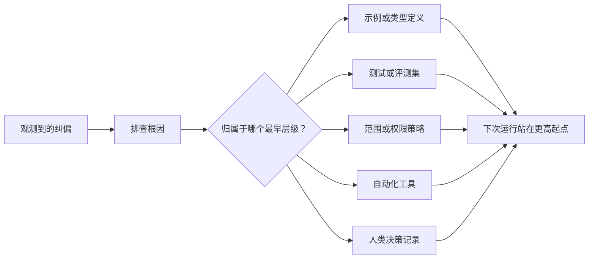

# A cada agente , a transformação para melhoria do sistema

> O simples manuseio de correções no registro de bate-papo só pode ser corrigido na execução anterior. Ao mesmo tempo que se depender do teste, da estratégia de fronteira, do exemplo ou do mecanismo de controle das ferramentas, pode fazer com que cada execução posterior seja melhor.

**Type:** Learn + Build
**Languages:** Python (stdlib)
**Prerequisites:** Phase 14 第 37 至 41 课
**Time:** ~65 分钟

## Objectivo de aprendizagem

- O sistema de controle de sistemas de longo prazo será transformado em um mecanismo de correção temporária de corpos inteligentes.
- Colocar cada mecanismo de controle em um nível mais inicial para evitar a repetição do problema.
- Utilize características de impressão de dedo estável para a aprendizagem de repetidas absorções.
- 及时退役那些不再应对现实风险的旧控制规则──

## A correção em si é uma prova valiosa .

Quando você diz ao corpo inteligente que não deve editar o arquivo, você na verdade já descobriu: existentes limites de alcance (limitado por escopo) falta de restrições executáveis. Quando você observa que o formato de saída está errado, você na verdade encontra falta de exemplos padrão ou teste de automação. Quando a configuração ambiental reaparece, você percebe que o conhecimento inicial do ambiente deve estar no guião de automação.

 deve ser vista como uma observação de falhas do próprio sistema de trabalho, em vez de como um erro de linguagem simples quando escrito.

## 提升沉                                                                                                                                                                                                                                                             

 seguir as seguintes prioridades de controlo:

| 频发故障类型 | 长效沉淀去处 |
|---|---|
| 错误计算结果或代码回归 | 自动化测试或评测集（Test / Evaluation） |
| 超范围越界或不安全操作 | 范围契约或权限策略（Scope / Permission Policy） |
| 重复出现的环境配置或命令错误 | 自动化脚本或专用工具（Automation / Tool） |
| 重复出现的输出格式错误 | 标准规范示例外加数据校验器（Canonical Example + Validator） |
| 模糊不清的本地工程惯例 | 附带具体场景检查的指令（Instruction + Scenario Check） |
| 产品层面的分歧与争议 | 人类决策记录（Human Decision Record） |

Quanto mais cedo o mecanismo de controle for efetivo, mais baixo o custo. Uma definição de tipo de estado de ineficacia a nível do tipo de sistema é muito mais forte do que a crítica de reexame de código posterior; um teste de unidade direcionado é muito mais eficaz do que o de escrever um artigo em contato com o sistema.



## O Registo do Ratchet)

完整的记录应包含:

- 故障表象 (Sintoma)
- 根因分析 (causa raiz);
- 造成的后果(Conseqüência);
- 重复出现次数 (contagem de recorrências);
- Sistema de controlo escolhido (Solected control mechanism)
- O mecanismo de controlo é verificado através de uma verificação;
- 责任人(proprietário);
- 审查或退役日期(Revisão / data de aposentadoria)

Não deve ser permanente cada preferência pessoal temporária. Apenas quando a frequência de repetição ou a gravidade dos efeitos potenciais do problema é suficiente para provar a racionalidade de uma manutenção de longo prazo, a questão pode ser promovida a um mecanismo de controle permanente.

## 区分根因与表象

 O corpo inteligente modificou README apenas como um símbolo.

- 任务框架 permite modificar todo o código-fonte do catálogo;
- Os documentos são considerados como sendo sempre editáveis com segurança;
- O plano de execução irá realizar as funções ligadas ao elaboração de documentos;
- 两个工作智能体存在重叠文件所有权── existem dois trabalhos inteligentes existentes sobre os quais existem documentos.

Diferentes raízes de resposta são diferentes de todos os meios de controle. Se apenas a proibição de escrever um texto de cópia de um exemplo for feita de forma mecânica, a próxima vez que surgir um problema do mesmo tipo em forma de um pequeno alteramento, o sistema continuará a falhar novamente.

## Regras de controlo

As regras de controle antigas geram conflitos, aumentam na janela de texto, e consolidam os sistemas antigos que já não existem. Todas as regras que são submetidas à carga necessitam de revisão periódica. Em casos seguintes, deve-se eliminar ou reescrever:

- A estrutura de base já mudou;
- A sua substituição será realizada por um mecanismo de controlo executável mais forte;
- Durante um período de tempo bastante longo, este falho nunca voltou a ocorrer;
- Os obstáculos e as fricções resultantes da regra já ultrapassaram o risco de sua própria prevenção.

O objetivo do engenharia não é escrever os documentos de instruções mais longos, mas usar mecanismos de sistema minimizados para manter o poder de julgamento do engenharia que não é fácil de obter.

## Construí-lo

O programa experimental deste curso irá fazer uma classificação de correções, elevar-as para um mecanismo de controle, gerar impressões digitais para repetição de projetos e escrever os resultados.`outputs/feedback-ratchet.json`- Não.

运行命令:

```bash
python3 code/main.py
python3 -m unittest discover code/tests -v
```

尝试输入两条表述不同但根因相同纠偏记录――持续优化归化逻辑,直到它们能够合并为一个统一的控制机制,同时又不错合并无关故障――

## 练习

1. A partir da última edição, escolhemos cinco artigos de correção e reversão, analisando e classificando-os em um nível de execução real.
2. Reconstruir um texto de regras de ensaio em um ensaio automatizado executável.
3. 增加后果权重 (peso de consequência) avaliação, fazendo com que graves erros de alta risco também possam ser imediatamente elevados para controle permanente.
4. Em experiência de saída, cada mecanismo de controle é complementado por responsável e retirado de serviço.
5.  revise uma instrução existente de inteligência e suprima-a sob a premissa de que existe um mecanismo de controle mais forte.

## 延伸阅读

- [Basili, Caldiera, and Rombach, The Goal Question Metric Approach](https://www.cs.toronto.edu/~sme/CSC444F/handouts/GQM-paper.pdf)O estudo foi realizado em uma área de investigação e investigação.
- [Shinn et al., Reflexion](https://arxiv.org/abs/2303.11366)Introdução: Como utilizar o controle de rastreamento para melhorar a qualidade da decisão e não necessitar de um modelo de controle de peso.
- [Madaan et al., Self-Refine](https://arxiv.org/abs/2303.17651)O que é o que se passa com o trabalho?

## 交付物与沉

Por favor, mantenha bem a produção.`outputs/feedback-ratchet.json` É um resultado final do caminho de engenharia de assistência inteligente, e também um futuro desenvolvimento adicional da entrada central do Workbench
