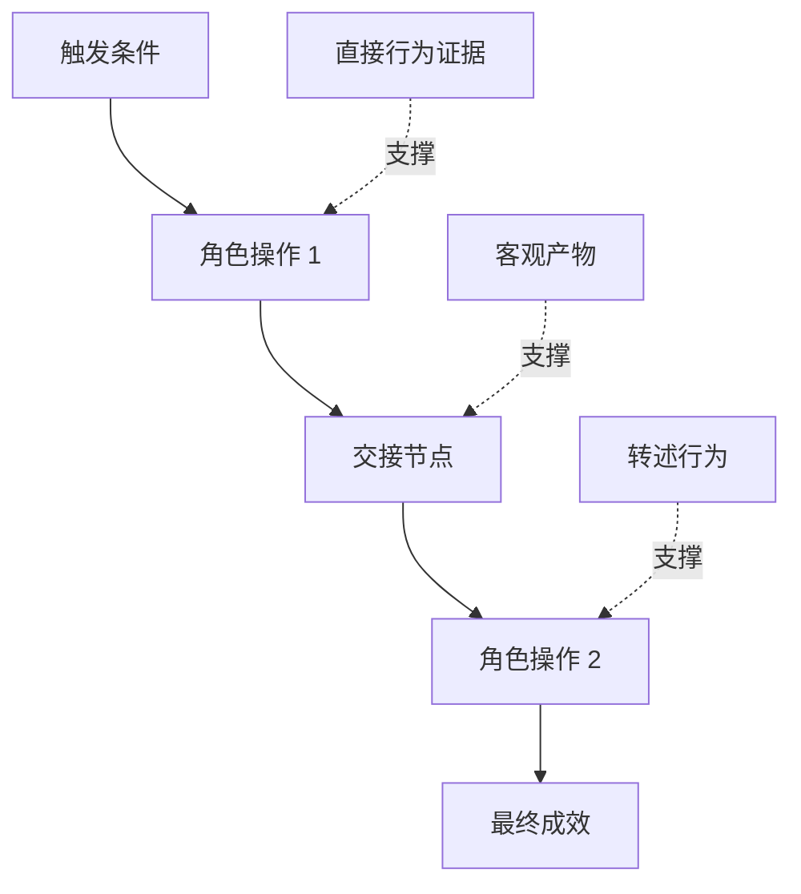

# 发掘人们真正执行的工作流

> As necessidades reais nunca se sentam na sala de conferências, como você vem para coletar.

**Type:** Learn + Build
**Languages:** Python (stdlib)
**Prerequisites:** Phase 14 第 47 课
**Time:** ~70 分钟

## Objectivo de aprendizagem

- A estrutura de trabalho existente será baseada na sequência de operações de verificação.
-  rigorosa distinção entre observação directa dos fatos e comportamento de transcrição ou de conclusão.
- 定位流程中的摩擦阻力(Fricção) 交接节点(Handoffs) 审批权限(Autoridade)
-  manterem a visibilidade evidente da sua proposta, mas não facilmente transformá-la directamente em necessidade de duração

## A partir de sistemas existentes

Não comece a perguntar ao usuário o que ele quer que seja. O que você deve fazer é voltar a ver o que aconteceu.

 para cada passo no fluxo de trabalho, registar os seguintes parágrafos:

| 字段 | 示例 |
|---|---|
| 执行角色（Actor） | 值班工程师 |
| 触发条件（Trigger） | 生产环境告警到达 |
| 具体操作（Action） | 打开告警详情，随后在监控看板中搜索 |
| 输入信息（Input） | 告警 Payload 与发布记录 |
| 产出结果（Output） | 疑似故障服务及责任人 |
| 摩擦阻力（Friction） | 在三个不同运维工具之间来回切换上下文 |
| 审批权限（Authority） | 事故指挥官批准执行写入操作 |
| 支撑证据（Evidence） | 屏幕录像、事故复盘日志、运维手册 |

O verdadeiro fluxo de trabalho é muito mais amplo do que a interface que se vê na tela. Ele inclui o tempo de espera, a cópia de adesivos, a conversa pessoal, o processo de aprovação, a recuperação de erros, bem como os pequenos movimentos que as pessoas já tinham o hábito de fazer e até não tinham atenção.

## A prova é de um nível forte e fraco .

建立简单的证据阶梯(Lada de provas):

1. **直接行为（Direct behavior）：**现场观测、系统调用追踪(Trace) 、屏幕录屏或系统事件日志──
2. **客观产物（Artifact）：**工单记录、运维手册、审计日志、表单或已完成成果文件──
3. **转述行为（Reported behavior）：**As pessoas falam sobre o que costumam fazer.
4. **主观推断（Inference）：**A equipa diz que é muito provável que aconteça.

Estas quatro fontes de informação têm valor, mas apenas as duas primeiras podem confirmar diretamente o comportamento real atual.



## 重点搜寻四大要素

- **摩擦阻力（Friction）：**Re-inscrição ou recuperação de falhas de dados.
- **隐性状态（Hidden state）：**só permanece no cérebro do empregado factos de informação em registros de conversação ou notas pessoais pessoais
- **审批权限（Authority）：**O direito de tomar decisões significativas de alto impacto para pessoas específicas ou sistemas de controlo.
- **异常分支（Exceptions）：**Normal processo ocorre interrupção, não mais de acordo com a situação da margem de funcionamento do trabalho.

A IA funciona por isso frequentemente em contato com o tratamento anormal, muitas vezes é porque inicialmente foi projetada apenas para o ideal de tudo o que se passa.

## Não se esqueça de pedir uma média de matas.

 dois usuários adotam processos de operação claramente diferentes, de forma frequente e por razões muito justificadas. Antes de compreenderem plenamente a sua profundidade, devem conservar completamente estas divisões, pois elas podem representar:

- Diferentes funções e responsabilidades organizacionais;
- Diferentes níveis de tolerância ao risco;
- O processo anterior é substituído pelo novo processo atual;
-  diferença entre experiência profissional e qualificação;
- As estratégias de negócios e os governos são diferentes.

Um fluxo de trabalho em que a pessoa é forçada a trabalhar, não consegue descrever ninguém.

## Construí-lo

O programa de experiências deste curso é baseado em cada passo do processo de trabalho, registando os resultados, registando a ordem e a confiança de execução do estudo, calculaindo a proporção de evidências diretas (direct-evidence ratio), e anotando os resultados.`outputs/workflow-evidence.json`- Não.

运行命令:

```bash
python3 code/main.py
python3 -m unittest discover code/tests -v
```

尝试增加一条部署记录缺失的异常分支路径── manter a ordem do processo dominante invariable,并清晰记录该分支的起点位置──

## 练习

1. Não entrevistar ninguém, apenas com um sistema de funcionamento de um dia de trabalho completo.
2. Entrevista a um utilizador real, marcando a sua participação em todos os seus postos de trabalho, ainda falta de evidências de apoio direto ao público.
3. 增加一处权限审批边界 (limitadas por autoridade)
4.  para a mesma situação, produzir dois diferentes fluxos variáveis, sem forçá-los a juntarem-se.
5. Descobrir uma nova função de uma proposta: embora, superficialmente, elimine um passo visível, não se trata completamente do trabalho oculto por trás.

## 延伸阅读

- [Nuseibeh and Easterbrook, Requirements Engineering: A Roadmap](https://www.cs.toronto.edu/~sme/papers/2000/ICSE2000.pdf)A primeira é a de que a procura de informação é muito mais importante do que a de que se trata.
- [Gotel and Finkelstein, An Analysis of the Requirements Traceability Problem](https://doi.org/10.1109/ICRE.1994.292398)O estudo foi realizado em uma área de investigação e pesquisa de dados.

## 交付物与沉

Por favor, mantenha bem a produção.`outputs/workflow-evidence.json` In the next section of the lesson, ele transformará o que observou em resistência à fricção e incerteza em um mapa de suposição.
