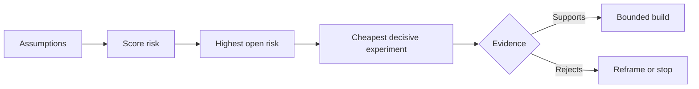

# 理假设并优先化解最高风险

> O mapa de estrada (ou mapa de produtos) geralmente oculta incerteza na lista de funções; enquanto o mapa de suposição (ou mapa de supressão) revela que, antes que essas funções sejam construídas, é necessário primeiro verificar quais são as condições pré-concebidas.

**Type:** Learn + Build
**Languages:** Python (stdlib)
**Prerequisites:** Phase 14 lesson 48
**Time:** ~65 minutes

## Objectivo de aprendizagem

- O trabalho proposto será desfeito e transformado em hipóteses claras e evidentes.
- É um dos principais aspectos da política de segurança social da União Europeia.
- O que é que é o que se passa?
- Usar provas e conclusões de decisão determinadas para substituir as hipóteses já testadas.

## Cada construção é uma aposta.

O valor de um conjunto de ferramentas de rastreamento de incidentes (Incident Tool) pode depender do facto de cada uma das seguintes hipóteses de antecedência estarem todas válidas:

-  o aviso abaixo contém informações suficientes para identificar o serviço de falha;
- 工程师信任 they did not personally recommend the result of the recommendation;
-  o tempo de resposta previsto é essencial a nível de transporte;
- Pode aceder aos dados necessários sob a premissa de não introduzir direitos de segurança da Autoridade insegura;
- A frequência de ocorrência do fluxo de trabalho é suficientemente elevada para demonstrar que o custo de manutenção do sistema é razoável.

Estes não são simples código para realizar tarefas de implementação, mas sim para tornar a construção valiosa (valorosa) ▌avaliavel (utiliável) ▌facível (facível) e segura (segura).

## 假设的类别

| 类别 | 核心问题 |
|---|---|
| 价值（Value） | 产出的最终结果是否足够重要？ |
| 可用性（Usability） | 用户能否理解并据此采取行动？ |
| 可行性（Feasibility） | 现有系统能否利用可获取的数据和约束产出该结果？ |
| 存续性（Viability） | 组织能否长期承受其成本、归属权与运维负担？ |
| 安全性（Safety） | 系统出现故障时是否不会造成无法接受的后果？ |

O que é chamado de "falsificação" é uma suposição que é logicamente possível verificar os fatos observados. Essa função é muito útil e não pode ser testada.

## 风险并非单一维度的数字

Esta experiência, de 1 a 5%, avalia três dimensões:

- **影响（Impact）：**Se esta suposição não for válida, a quantidade de danos causados ao sistema ou ao negócio.
- **不确定性（Uncertainty）：**A fraqueza da evidência de que se tem acesso.
- **不可逆性（Irreversibility）：**Só após a realização de um compromisso ou investimento significativo é que se descobrem custos de devolução errados.

A avaliação de exemplo irá influenciar a incerteza, multiplicando-a com a irreversão. Essa fórmula não é uma norma de todos, o seu objetivo é obrigar a equipe a esclarecer claramente por que uma coisa desconhecida deve ser priorizada por outra.



## design experiments, e não cerimônias de confirmação

Uma experiência de verdadeiramente valor tem os seguintes elementos:

- Uma possibilidade de ser falsificada;
- Um grupo de público real ou uma amostra representativa;
- Um resultado de observação visual;
- valor de avaliação previamente definido;
-  a viagem de decisão para o próximo passo definido por cada um dos seus elementos de prova definidos.

 evitando o tipo de projeto que só serve para provar que a equipe tem a capacidade de fazer essa ideia  testes de confirmação ritual tipo 

## 可逆性会改变构建顺序

Os resultados são graves e irreversíveis: a seleção precisa obter mais cedo o apoio de evidências.

O ritmo de avanço da construção do sistema deve estar em conformidade com o ritmo da solução de incerteza.

## 动手实现

Esta experiência se baseia em hipóteses de classificação, de separação entre as afirmações verificadas e indefinidas, de seleção das hipóteses indefinidas mais arriscadas, e geração.`outputs/assumption-map.json`- Não.

```bash
python3 code/main.py
python3 -m unittest discover code/tests -v
```

Modificar o estado da prova na hipótese de maior risco, observar o sistema de recomendação da próxima experiência será como o comportamento se ajustar.

## 课后练习

1. Para você está pronto para construir um função escrever cinco hipóteses-chave.
2. 补充一条你原本的功能列表中遗漏的安全假设──
3. Determinar um que te deixe decidir acabar com a construção da sua duração.
4. Substituir um teste original de grande porte por um teste de menor custo e de maior determinação.
5. Em relação à classificação de risco e à classificação de produtos originais, explique o porquê de existirem erros.

## 延伸阅读

- [Barry Boehm, A Spiral Model of Software Development and Enhancement](https://dl.acm.org/doi/10.1145/12944.12948), explorar um ciclo de desenvolvimento de risco em fase de desenvolvimento mais profunda e de desenvolvimento de incertezas.
- [Dardenne, van Lamsweerde, and Fickas, Goal-Directed Requirements Acquisition](https://doi.org/10.1016/0167-6423(93)90021-G), explorar os objetivos do sistema de refinamento ao mesmo tempo que os obstáculos e os constrangimentos de exposição gradual.

## 交付物沉

- Não .`outputs/assumption-map.json` A seguinte secção irá ajudar a escolha do documento a produzir o mínimo de provas decisivas.
