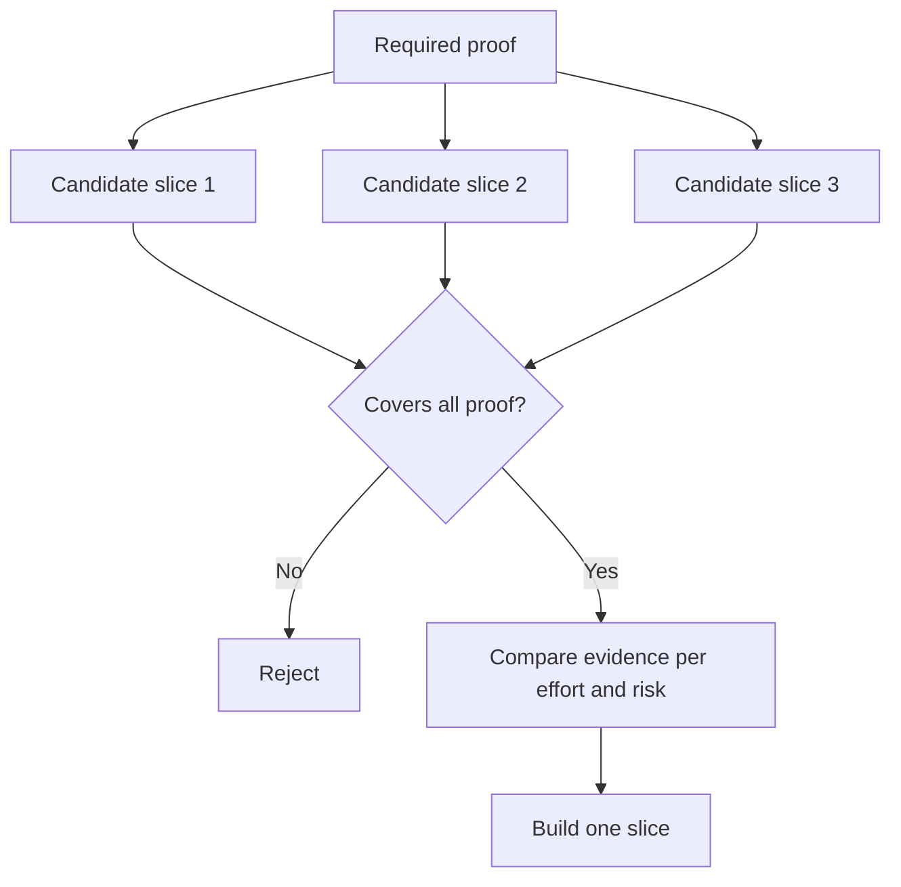

# 选择能够改变决策的最小片

> Só quando um pequeno problema é capaz de provar um problema fundamental, a simplificação só tem valor.

**Type:** Learn + Build
**Languages:** Python (stdlib)
**Prerequisites:** Phase 14 lesson 49
**Time:** ~65 minutes

## Objectivo de aprendizagem

- De acordo com a suposta suposta prova de que o corte é um pedaço de papel.
- 权衡结果价值 (R$) ∞ ∞ ∞ ∞ ∞ ∞ ∞ ∞ ∞ ∞ ∞ ∞ ∞ ∞ ∞ ∞ ∞ ∞ ∞ ∞ ∞ ∞ ∞ ∞ ∞ ∞ ∞ ∞ ∞ ∞ ∞ ∞ ∞ ∞ ∞ ∞ ∞ ∞ ∞ ∞ ∞ ∞ ∞ ∞ ∞ ∞ ∞ ∞ ∞ ∞ ∞ ∞ ∞ ∞ ∞ ∞ ∞ ∞ ∞ ∞ ∞ ∞ ∞ ∞ ∞ ∞ ∞ ∞ ∞ ∞ ∞ ∞ ∞ ∞ ∞ ∞ ∞ ∞ ∞ ∞ ∞ ∞ ∞ ∞ ∞ ∞ ∞ ∞ ∞ ∞ ∞ ∞ ∞ ∞ ∞ ∞ ∞ ∞ ∞ ∞ ∞ ∞ ∞ ∞ ∞ ∞ ∞ ∞ ∞ ∞ ∞ ∞ ∞ ∞ ∞ ∞ ∞ ∞ ∞ ∞ ∞ ∞ ∞ ∞ ∞ ∞ ∞ ∞ ∞ ∞ ∞ ∞ ∞ ∞ ∞ ∞ ∞ ∞ ∞ ∞ ∞ ∞ ∞ ∞ ∞ ∞ ∞ ∞ ∞ ∞ ∞ ∞ ∞ ∞ ∞ ∞ ∞ ∞ ∞ ∞ ∞ ∞ ∞ ∞ ∞ ∞ ∞ ∞ ∞ ∞ ∞ ∞ ∞ ∞ ∞ ∞ ∞ ∞ ∞ ∞ ∞ ∞ ∞ ∞
-  prioritariamente escolher evidências reais, e não prematuramente fazerem promessas ambientais de nascimento.
- Decidir ou não decidir aqueles que tentam evitar o trabalho

## O " vertical " significa " de ponta a ponta "

垂直切片 (垂直切片) é o mínimo fluxo de trabalho real necessário para um determinado resultado de uma observação. Pode ser muito estreito em termos de número de usuários, tamanho de dados, ciclo de execução e alcance de funções, mas não pode excluir a incerteza central do teste.

exemplo:

- Baseado em 10 erros reais de apenas leitura, pode verificar a precisão do serviço e a confiança do operador.
- A base de dados sintéticos é construída em um exato painel de instrumentos, que pode verificar a compreensão da interface, mas não pode testar completamente a viabilidade de obter dados.
- O sistema de reparação de falhas totalmente automática no ambiente de produção, tentando testar todas as partes de uma vez, trouxe um risco insuportável de grande destruição.

## Previamente definido

提取风险最高的未决假设,将将其转化为必要证据集 (需证据集) ── 候选片片只有在完全覆盖该证据集时,才具备入选资格 (需证据集) ──

Em seguida, a avaliação comparativa entre as peças aprovadas foi efectuada:

| 评估维度 | 期望方向 |
|---|---|
| 产出价值（Outcome value） | 越大越好 |
| 化解的不确定性（Uncertainty reduced） | 越多越好 |
| 研发投入（Effort） | 越小越好 |
| 潜在后果（Consequence） | 越轻越好 |
| 可逆性（Reversibility） | 越高越好 |

O modelo de avaliação utilizado nesta experiência está tentando manter-se simples, pois a qualificação para entrar em curso é muito mais importante do que o cálculo digital em si mesmo.



## 常见的伪极小值陷

- **纯界面极小值（UI-only minimum）：** evitar a obtenção e o funcionamento de dados mais importantes.
- **纯基础设施极小值（Infrastructure-only minimum）：**A tecnologia provou ser viável, mas não conseguiu verificar o valor do utilizador.
- **纯顺境极小值（Happy-path minimum）：**刻意省略构成大部分风险的异常边界处理──
- **演示极小值（Demo minimum）：**O produto foi apresentado com uma demonstração muito convincente, mas não pode fornecer uma avaliação quantitativa real.
- **平台化极小值（Platform minimum）：**Antes de um único fluxo de trabalho ter confirmado o seu valor, a construção de componentes de reutilização geral foi prematura.

## 预先设定停止规则 (previamente estabelecer regras de suspensão)

Antes de começar a realizar, é necessário escrever o texto explicando se o teste fracassar:

-  abandonar o resultado esperado;
- mudança de grupo de usuários ou de cenário de negócios;
- 测试替代的技术机制;
-  recolher provas de nível inferior de qualidade superior;
-  poder de execução do sistema mais restrito

Se os resultados de cada teste forem orientados para a construção, então esse pedaço não é uma experiência real.

## 动手实现

Esta experiência foi realizada com base em provas necessárias.`outputs/slice-decision.json`- Não.

```bash
python3 code/main.py
python3 -m unittest discover code/tests -v
```

Tente adicionar um custo mais baixo, mas apenas pode verificar um único elemento necessário para a suposta supressão. Observe-o, mesmo que o valor total seja muito alto, por que ainda será diretamente qualificado para interdição.

## 课后练习

1.  para o mesmo resultado esperado, desenhar três peças de verificação de diferentes níveis de risco de consequências.
2. Antes de avaliar os pedaços de candidatos, lista claramente os seus elementos de prova necessários.
3. 尝试裁撤一项功能, ao mesmo tempo que se assegura de poderem conservar importantes provas decisionais.
4. Por isso, o programa de teste deve ser complementado por um artigo que estabelece regras de suspensão de execução.
5.  encontrar uma razão para adiar o teste de um pedaço de material após o reinicio do componente da plataforma comum

## 延伸阅读

- [Barry Boehm, A Spiral Model of Software Development and Enhancement](https://dl.acm.org/doi/10.1145/12944.12948), explorar como fazer cada ciclo de desenvolvimento se adequar aos riscos que devem ser resolvidos no presente.
- [Lenarduzzi and Taibi, MVP Explained: A Systematic Mapping Study on the Definitions of Minimal Viable Product](https://arxiv.org/abs/1609.07592), em ciência da ciência, a definição de um sistema de análise de software é definida como um sistema de análise de dados.

## 交付物沉

- Não .`outputs/slice-decision.json`O documento registra o que é o que é capaz de mudar a decisão baseado em evidências de que o menor pedaço é capaz de mudar a decisão.
