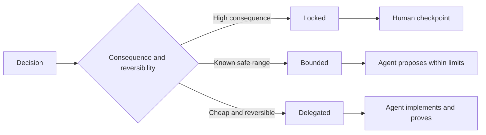

#  redacção de regras de tarefas de conservação do direito de decisão independente

> As normas de valor devem ser fixadas em constante e prova de verificação, mantendo-se abertas à opção de realização reversível.

**Type:** Learn + Build
**Languages:** Python (stdlib)
**Prerequisites:** Phase 14 lesson 50
**Time:** ~75 minutes

## Objectivo de aprendizagem

- O resultado é o resultado da análise de dados e de dados.
- O processo de decisão é dividido em três tipos:
- Em escolher um ciclo de baixo custo e altamente reversível, reservar plenamente o direito de decisão independente do Agente.
- Em casos de graves consequências ou de destruição do comportamento público, estabelecerem-se forçosamente pontos de verificação de auditoria artificial (Human Checkpoints).

## Dois tipos de extremidades más.

规范不足 (Undetermined) 的任务迫使 Agent 凭空猜测系统行为;而过度规范 (Over specified) 的任务则让 Agent 机械照抄可能本身就存在缺陷的具体设计――

O programa de transição é:**可执行契约（Executable Contract）**- Não .

| 规范要素 | 核心作用 |
|---|---|
| 预期产出（Outcome） | 可直接观测的最终交付结果 |
| 不变量（Invariants） | 必须始终严格成立的前置与后置约束 |
| 范例（Examples） | 能够直观展现真实意图的具体用例 |
| 非目标（Non-goals） | 明确刻意排除在外的周边行为 |
| 决策策略（Decision policy） | 标明哪些选择属于锁定、受限或完全委派 |
| 验证证据（Proof） | 任务验收前必须提供的测试或观测实据 |

## 3 tipos de decisão

- **锁定（Locked）：**严禁 Agente 擅自选择;; aplicável à public兼容性、写权限、安全红线、不可逆成本或核心产品承诺──
- **受限（Bounded）：**允许 Agente em zonas de segurança definidas de forma clara.
- **委派（Delegated）：** Autorizado Agente                                                                                                                                                                                                                                                                                                                                                                                                                                                                                                                        



##  através de comportamentos específicos

Usando exemplos específicos, transmitir intenções, muito mais eficientes do que o que é um composto de palavras-chave.

范例不能替代不变量: casos de sucesso aprovados por vez única, não podem ser comprovados por regras de segurança generais.

## Os certificados de verificação devem corresponder à categoria de declaração

- 单元测试(Unit Test) para provar a função local契约。
- 传输协议测试 (Wire Test) para provar a sequência e o comportamento de comunicação em rede.
- 浏览器旅程(Browser Journey) para provar o end-to-end do usuário interface roteiro。
- 重放测试集(Replay Set) para provar o sistema em representação de um cenário em que o corpo inteiro aparece.
- 审计日志(Log de auditoria) para uso em sistemas de prova de limites de competência

Não deve ser considerado o teste de nível inferior como prova de aceitação de declarações de nível superior.

## 刻意保留合理的未知空间

                                                                                                                                                                                                                                                              

Com a acumulação de evidências de conhecimento, as normas devem evoluir com o tempo.

## 动手实现

Esta experiência, cada dimensão do protocolo de experimentação, verifica a legalidade do modelo de decisão, e gera`outputs/executable-specification.json`- Não.

```bash
python3 code/main.py
python3 -m unittest discover code/tests -v
```

 tentar liberar o direito de escrever o ambiente de produção de  bloquear  ajustar  comission                                                                                                                                                                                                                                                

## 课后练习

1. Transformar um legado de um trabalho em seis dimensões do acordo de normas.
2. Usando um artigo de regras de constante variação adicionar dois exemplos típicos, substituindo-se por três instruções de descrição.
3. Cada decisão da tarefa de marcação é feita por uma explicação de escolha de cada lugar bloqueado ou limitado.
4. Por exemplo, a norma de um certificado de verificação de um certificado de verificação de um certificado de verificação de um certificado de verificação de um certificado de verificação de um certificado de verificação de um certificado de verificação de um certificado de verificação de um certificado de verificação de um certificado de verificação de um certificado de verificação de um certificado de verificação de um certificado de verificação de um certificado de verificação de um certificado de verificação de um certificado de verificação de um certificado de verificação de um certificado de verificação de um certificado de verificação de um certificado de verificação de um certificado de verificação de um certificado de verificação de um certificado de verificação de um certificado de verificação de um certificado de verificação de um certificado de verificação de um certificado de verificação de um certificado de verificação de um certificado de verificação de um certificado de um certificado de verificação de um certificado de verificação de um certificado de um certificado de verificação de um certificado de um certificado de verificação de um certificado de um certificado de um certificado de verificação de um certificado de um certificado de um certificado de um certificado de um certificado de um certificado de identificação de um certificado de identificação de um certificado de um certificado de um certificado de um certificado de um certificado de identificação de um certificado de um certificado de um certificado de um certificado de um certificado de um certificado de um certificado de um certificado de um certificado de um certificado de um certificado de um certificado de um certificado de um certificado de um certificado de um certificado de um certificado de um certificado de um certificado de um certificado de um certificado de um certificado de um certificado de um certificado de um certificado de um certificado de um certificado de um certificado de um certificado de um certificado de um certificado de um certificado de um certificado de um certificado de um certificado de um certificado de um certificado de um certificado de um certificado de um certificado de um certificado de um certificado de um certificado de um certificado de um certificado de um certificado de um certificado de um certificado de um certificado de um certificado de um certificado de um certificado de um certificado de um certificado de um certificado de um certificado de um de um de um de um de um de um de um de um de um de um de um de um de um de um de um de um de um de um de um de um de um de um de um de um de um de um de um de um de um de um de um de um de um de um de um de um de
5. 找出一条既无实证支又不论依据的冗余束并将其删除──

## 延伸阅读

- [Nuseibeh and Easterbrook, Requirements Engineering: A Roadmap](https://www.cs.toronto.edu/~sme/papers/2000/ICSE2000.pdf),descussão de objetivos, precisão de regras, verificação, consenso e desenvolvimento de relações entre os sistemas.
- [Zave and Jackson, Four Dark Corners of Requirements Engineering](https://doi.org/10.1145/237432.237434), aprofundar o teor de ambientes, as necessidades do sistema e as normas técnicas,
- [Gotel and Finkelstein, An Analysis of the Requirements Traceability Problem](https://doi.org/10.1109/ICRE.1994.292398), explorar como conservar as causas e a sua traçabilidade da necessidade gerada.

## 交付物沉

- Não .`outputs/executable-specification.json` será um acordo de cooperação em conjunto com os agentes de codificação e os avaliadores humanos.
