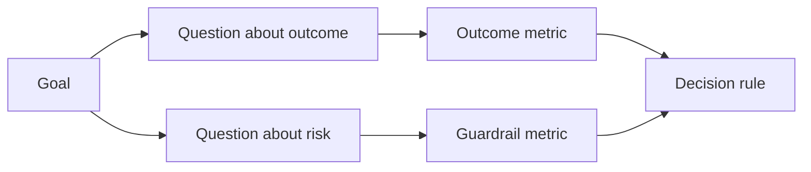

# Em resultados de produção de resultados de design

> Os indicadores de medida devem servir a tomar decisões de acção, e não apenas como decoração de um painel de instrumentos.

**Type:** Learn + Build
**Languages:** Python (stdlib)
**Prerequisites:** Phase 14 lessons 47 and 51
**Time:** ~70 minutes

## Objectivo de aprendizagem

- A partir dos objectivos de resultados previstos, é possível identificar os principais problemas e indicadores de medida.
- Durante a observação dos resultados reais, previamente, a definição de valor, a janela de tempo, a fonte de dados e a direção de otimização.
- A produção de indicadores e os cuidados de indicadores de segurança e de medidas de segurança
- A avaliação deve ser feita de forma adequada às decisões concretas necessárias para a construção da obra.

## 目標、問題與指标 (Objetivo 问题与指标)

Desde o objetivo (Objetivo)

>  redução do tempo necessário para o serviço de localização afectada, sem aumentar qualquer operação insegura

推导出问题:

- A velocidade de localização é muito rápida.
-  Precision rate de serviço de localização é elevado?
- O processo de diagnóstico é sempre puramente lectivo?
- O fluxo de trabalho levou a um alarme frequentemente negligenciado ou a um aumento da carga dos operadores?

                                                                                                                                                                                                                                                                                                                                                                                           



## Cada indicador precisa de um acordo de regulamentação.

Cada indicador deve ter:

| 契约字段 | 示例 |
|---|---|
| 指标名称（Name） | `median_identification_seconds` |
| 方向（Direction） | 至多不超过（at most） |
| 阈值（Threshold） | 120 |
| 窗口（Window） | 10 次故障事件重放 |
| 数据源（Source） | 重放事件日志 |
| 统计样本（Population） | 参与试点的在岗工程师 |
| 类别（Kind） | 成果指标（outcome）或护栏指标（guardrail） |

Se faltam fontes de dados e janelas estatísticas, qualquer número não pode ser reproduzido; se faltam valores pré-configurados, os indicadores não podem impulsionar decisões definidas.

## Indicadores de resultados, índices de protecção e índices de medida

- **成果指标（Outcome metric）：**O estado de melhoria esperado é realmente melhorado?
- **护栏指标（Guardrail）：**As condições de segurança e de conexão fixas sempre se mantêm?
- **制衡指标（Counter-metric）：**Será que a optimização local vai transferir custos ou destruições ocultas para outros sectores?

 para o fluxo de trabalho de falhas, a luz é insuficiente.  Precisão, produção, escrita, interceptação de operações, carga de trabalho e perda de alertas dos operadores, constituem uma barreira de segurança para evitar a rápida conclusão de erros catastróficos.

## Oficinas de informação e informações

离线重放(Offline Replay) muito adequado para inspecção de realidade e cobertura de cenários de margem;受控试点(Bunded Pilot)

始终选择能够支当前决策的最低成本证据――绝不能仅仅因为代码已经写好就商定将真实用户暴露于未知风险――

## A medida de decisão

Antes de ver os resultados estatísticos, é necessário primeiro determinar a via de acção através de falhas e situações de confusão.

Demonstração de regras:

- 通过(Pass): taxa de precisão de localização de serviços não inferior a 0,9, e o tempo de localização não superior a 120 segundos;
- 失败(Fail): ocorre qualquer operação de produção ilegal, ou a taxa de determinação de localização é inferior a 0,75;
- 模糊(Ambiguo): desempenho embora tenha um pequeno aumento, mas a dimensão é muito grande, precisa de expandir e re-examinar o conjunto de amostras.

## 动手实现

Este ensaio avalia a integridade do plano de medição de experiência, contém o valor da fronteira, registra os indicadores de falta, e produz.`outputs/measurement-report.json`- Não.

```bash
python3 code/main.py
python3 -m unittest discover code/tests -v
```

尝试删除在度量计划中的护指标, observe por que, mesmo que os índices de resultados continuem a existir, todo o programa continuará a ser considerado ilegal por um sistema.

## 课后练习

1. A partir do mesmo objectivo de resultados, são apresentadas três questões de foco diferentes:
2. 补一条能够捕获因当前优化导致其他角色负担加重的衡量指标――
3. Para cada indicador, especifique a sua fonte de dados, o grupo de amostras estatísticas e a janela de tempo.
4. Antes de gerar um valor real, pre-escrever a decisão de três casos:
5. Encontrar uma estatística fácil, mas fundamentalmente incapaz de alterar qualquer indicador de decisão, e excluí-la.

## 延伸阅读

- [Basili, Software Modeling and Measurement: The Goal/Question/Metric Paradigm](https://drum.lib.umd.edu/items/8119803a-362b-42ec-b6ce-2311713e7236), Introdução a como, a partir de objectivos definidos, se pode desenvolver um sistema de medidas executável (GQM) 范式) 
- [Basili, Caldiera, and Rombach, The Goal Question Metric Approach](https://www.cs.toronto.edu/~sme/CSC444F/handouts/GQM-paper.pdf), explicando que o método será utilizado como uma prática de um sistema de melhoria contínua e de encerramento.

## 交付物沉

- Não .`outputs/measurement-report.json` Ele será introduzido no primeiro tipo (prototipo) 试点 (piloto) 试点 (produzir) 试点 (produzir) 试点 (produzir) 试点 (produzir) 试点 (produzir) 试点 (produzir) 试点 (produzir) 试点 (produzir) 试点 (produzir) 试点 (produzir) 试点 (produzir) 试点 (produzir) 试点 (produzir) 试点 (produzir) 试点 (produzir) 试点 (produzir) 试点 (produzir) 试点 (produzir) 试点 (produzir) 试点 (produzir) 试点) 试点 (produzir) 试点 (produzir) 试点) 试点 (produzir) 试点) 试点 (produzir) 试点) 试点 (produzir) 试点)
