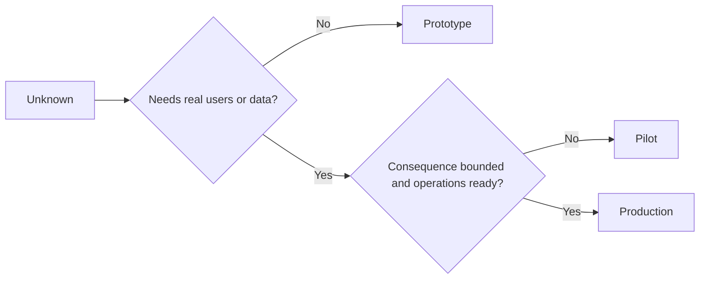

# 审慎择原型、试点还是生产

> Eles representam ambientes cognitivos claramente diferentes, e não simples diferenças de precisão.

**Type:** Learn + Build
**Languages:** Python (stdlib)
**Prerequisites:** Phase 14 lessons 50 to 52
**Time:** ~70 minutes

## Objectivo de aprendizagem

- De acordo com o tipo desconhecido, a amplitude do público, a sensibilidade dos dados, a destruição de resultados e a maturidade do funcionamento, a seleção prudente da fase de construção.
-  definir medidas de controlo de cada fase (Controls) 
- Prevenir o desenvolvimento do sistema original para o sistema de produção em situação de falta de responsabilidade humana.
- Na prova e na operação de segurança plena já existem, o sistema de produção real é concedido em segundo lugar.

## Três questões fundamentais

| 阶段 | 核心问题 |
|---|---|
| 原型（Prototype） | 该技术机制到底能不能产生预期的实证结果？ |
| 试点（Pilot） | 在受控真实受众与真实工况下，它能否安全稳定运行？ |
| 生产（Production） | 组织能否按照既定的可靠性与风险承诺，持续对该系统承担长期责任？ |

Um protótipo altamente técnico, ainda pode ser projetado para uso de resíduos abandonados; um piloto pode usar dados de produção reais, mas sua escala de público e poderes de operação devem ser rigorosamente limitados; e apenas quando a organização formalmente assume a responsabilidade de longo prazo, a fase de produção só realmente abre o início.

## O primeiro estágio

Quando é necessário resolver as hipóteses desconhecidas sem introduzir dados de produção real ou de usuário real, adotar o primeiro estágio.

- 随时可废弃 (Discardable);
- 严格隔离(Isolado);
- 功能边界狭窄 (comportamento estreito);
- 核心验证问题显式明确 (explicitar explicitamente sobre a questão de aprendizagem);
- Não faz falsas promessas de segurança.

O mecanismo em si ainda não provou que vale a pena entrar na próxima fase, não optimize prematuramente a estrutura do sistema inteiro.

## 试点阶段

Quando as hipóteses desconhecidas devem depender de um comportamento de operação real, de dados reais ou de um fluxo de trabalho real para verificar, mas a destruição de resultados ou de funcionamento ainda não é suficiente para suportar a publicação completa, adotar uma fase de teste.

Um teste de qualificação deve possuir:

- Indicação de um número de participantes;
- 明确 responsável pela humanidade;
-  Ciclo de funcionamento e competências de operação estritamente restritos;
-  Auditoria de rastreamento e programa de rápida recuperação;
- Indicadores de resultados e de valor de indicadores de apoio;
- Definir o regime de retirada de empresas para expansão, modificação ou encerramento total.

## Produção

O processo de produção não é apenas igual a um código de execução de implementação:

- 明确的服务等级目标(SLO);
- Responsabilidade de tratamento de incidentes de trabalho e de falhas;
- Revisão dos domínios de segurança e privacidade;
- O controlo da capacidade de produção e de absorção;
- Mecanismo completo de recuperação de volumes e de capacidade;
- 7x24 小时全天候监控;
- 清晰的退役与下线路径──



## 阶段漂移陷

Quando o código-fonte original, em um contexto de não estabelecimento de um sistema de responsabilidade e de operação, obtiver as permissões de operação de dados sensíveis ou de núcleo do usuário real, torna-se extremamente perigoso.**阶段漂移（Stage Drift）** deve ser forçado a definir as fronteiras de rigidez do modelo e do ponto de partida no sistema de configuração, controle de competências, indicadores de distância e no arquivo de arquitetura apenas pendurar uma versão de teste na interface

O sistema deve ser capaz de ser observado e experimentado diretamente no seu próprio estado de funcionamento.

## 动手实现

Esta experiência, baseada na decisão, recomenda automaticamente a fase adequada, retorna às medidas de controlo necessárias para cada fase,并输出 `outputs/stage-decisions.json`- Não.

```bash
python3 code/main.py
python3 -m unittest discover code/tests -v
```

O estudo de um modelo de teste deve ser modificado para um resultado de baixa destruição e com capacidade de desenvolvimento e maturidade.

## 课后练习

1.  em conformidade com o conhecimento exploratória (e não apenas o estado de implementação de código), re-classificar os três projetos existentes em sua cabeça:
2.  redação de um documento que contenha 果断终止 果断选项的试点退出准则──
3.  aumentar uma medida de controlo técnico, evitando fundamentalmente o contacto do código-primo com os dados do ambiente de produção.
4.  encontrar o primeiro elemento que se refere ao sistema realmente transformado em responsabilidade de produção de nível de transporte e de responsabilidade.
5. Para um teste limitado, desenhar um conjunto completo de rotulagem de operações.

## 延伸阅读

- [Barry Boehm, A Spiral Model of Software Development and Enhancement](https://dl.acm.org/doi/10.1145/12944.12948), explorar como fazer com que os recursos investidos por geração se adequem ao nível de risco já definido.
- [Fagerholm et al., Building Blocks for Continuous Experimentation](https://doi.org/10.1145/2601248.2601276), , , , , , , , , , , , , , , , , , , , , , , , , , , , , , , , , , , , , , , , , , , , , , , , , , , , , , , , , , , , , , , , , , , , , , , , , , , , , , , , , , , , , , , , , , , , , , , , , , , , , , , , , , , , , , , , , , , , , , , , , , , , , , , , , , , , , , , , , , , , , , , , , , , , , , , , , , , , , , , , , , , , , , , , , , , , , , , , , , , , , , , , , , , , , , , , , , , , , , , , , , , , , , , , , , , , , , , , , , , , , , , , , , , , , , , , , , , , , , , , , , , , , , , , , , , , , , , , , , , , , , , , , , , , , , , , , , , , , , , , , , , , , , , , , , , , , , , , , , , , , , , , , , , , , , , , , , , , , , , , , , , , , , , , , , , , , , , , , , , , , , , , , , , , , , , , , , , , , , , , , , , , , , , , , , , , , , , , , , , , , , , , , , , , , , , , , , , , , , , , , , , , , , , , , , , , , , , , , , , , , , , , , , , , , , , , , , , , , , , , , , , , , , , , , , , , , , , , , , , , , , , , , , , , , , , , , , , , , , , , , , , , , , , , , , , , , , , , , , , , , , , , , , , , , ,

## 交付物沉

- Não .`outputs/stage-decisions.json`O documento conta com as razões de que foram escolhidas as fases, bem como as medidas de controlo que devem ser implementadas antes de entrar na fase seguinte.
