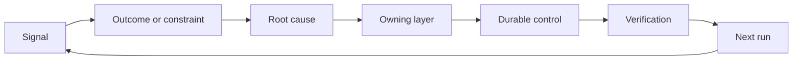

#  Construção de uma rota de reinserção e de retirada

> A publicação de código encerrou o ciclo de construção do período atual, e abriu um ciclo de aprendizagem de longo prazo.

**Type:** Learn + Build
**Languages:** Python (stdlib)
**Prerequisites:** Phase 14 lessons 46 and 53
**Time:** ~75 minutes

## Objectivo de aprendizagem

- Transformar os eventos de falhas, avaliações de dados, comportamento e correção de erros em ações de responsabilidade.
- A partir de agora, o sistema de segurança será aplicado em todos os sistemas de segurança.
- O risco de recaída deve ser classificado de forma prioritária, de acordo com a gravidade e a frequência de recaída.
- Para cada sistema de controlo, fixarem-se as condições de retirada (Condição de aposentadoria)

## A própria infraestrutura

Uma equipe pode coletar uma grande quantidade de sistemas de rastreamento de cadeias, registros de avaliação, registros de suporte e diários de falhas, mas não pode tirar qualquer aprendizado cognitivo.**晋级通道（Promotion）**A partir de observações, os dados são apresentados em um único e único documento.

O último ciclo do "Ratchet Feedback" é:

1. Observar até sinais de observação concretos;
2. Relacionar a produção prevista com resultados, condições de restrição ou hipóteses de pré-imposição;
3. Identificar os níveis mais subjacentes do sistema de responsabilidade da indução;
4. 实施受控的持久化改进;
5. 验证 事故复发的概率已切实降低;
6. 定期复审该控制机制是否应继续保留──

## 精准路由至应对责任层级

| 信号类型 | 归属目的地 |
|---|---|
| 误报、功能倒退、错误输出结果 | 评测集（Evaluation）或自动化测试 |
| 上下文缺失、重复劳动、过时事实 | 上下文数据源或检索路由策略 |
| 不安全操作或越权漏洞 | 安全策略（Policy）或权限硬边界 |
| 超时、重试风暴、依赖服务不可用 | 运行时控制（Runtime Control） |
| 新的产品需求或尚未决断的权衡取舍 | 经过规范成型（Shaped）的待办项 |

Quando os testes automatizados ou as limitações de dureza são suficientes para que o erro seja completamente impossível, não adicione mais um parágrafo de sugestão no Prompt.



## A responsabilidade pertence a si mesma como parte do mecanismo de controlo.

Cada projecto de acção deve ter claramente:

- 唯一的人类责任人 (o único proprietário);
-  a classificação prioritária com base na avaliação global das consequências da destruição e da frequência de reincidência;
- 拟修改的目标系统组件 (Artifact) 拟修改的目标系统组件 (Artifact)
- provar o esquema de verificação da modificação efetivamente efetiva;
- O sistema de controlo de dados deve ser executado em conformidade com o artigo 10.o, n.o 1.
- 明确的退役条件 (Condição de aposentadoria)

Um programa de melhoria sem ninguém reconhecer, o seu volume é apenas um episódio de um pequeno espetáculo de observação.

## 果断退役过时的控制机制 果断退役过时的控制机制

Contrariamente ao sistema pesado, as estratégias e os controles continuam a acumular-se.

- As alterações fundamentais ocorreram na estrutura dos sistemas ou no fluxo de trabalho dos negócios;
- O mecanismo de invariabilidade do nível inferior já substituiu completamente as instruções de texto do nível superior;
- Durante a janela de tempo prevista, o falha de prevenção nunca mais surgiu;
- A regulamentação de controlo impede a frequência de desenvolvimento normal das actividades, já ultrapassando os benefícios que lhe são trazidos pela prevenção de perigos.

O controle de retirada também precisa de apoio real, não pode ser apenas porque parece que o ano passou muito tempo.

## 打通 produto construção e código de agente

O mesmo mecanismo de rotas pode servir simultaneamente a negócios de produtos e desenvolvimento de inteligência em dois circuitos:

- ▌o desenvolvimento do plano de produção de produtos ou de medidas;
- Otimizar o funcionamento do Agente de codificação, o teste de automação de motor, a carga de dados, o domínio de operação, o manual ou o mecanismo de ligação de automação;
- 線上真故障既能促成产品功能边界调整,也能促成 Agente 工作台的加固──

É por isso que o quadro de missões não está na fase de encerramento da codificação antes da declaração, mas atravessa cada vez que o sistema aceita mudanças.

## 动手实现

Esta experiência foi realizada para classificar os sinais de teste, criar rotas de ação de atribuição de responsabilidade, em ordem de prioridade, e de saída.`outputs/feedback-backlog.json`- Não.

```bash
python3 code/main.py
python3 -m unittest discover code/tests -v
```

尝试添加一个运行时超时信号,验证它将被正确路由至运行时控制层,而不是泛化混入通用需求待机列表.

## 课后练习

1. A partir de agora, o sistema de correção de dados será aplicado em todos os dispositivos de correção de dados.
2. Identificar que é capaz de impedir de forma fundamental a sua reaparição no nível mais baixo do sistema.
3. Para experimentar a produção de ações complementares, os comandos de verificação automática ou os indicadores de observação são realmente realizáveis.
4. Para um artigo de estratégias de segurança existentes, estabelecer condições de retirada claras.
5. A partir daí, o sistema de aprendizagem de correção de um tipo de aprendizagem é capaz de fazer uma análise de um tipo de aprendizagem de correção de um tipo de aprendizagem de aprendizagem de correção de um tipo de aprendizagem de aprendizagem de aprendizagem de aprendizagem.

## 延伸阅读

- [Basili, Caldiera, and Rombach, The Goal Question Metric Approach](https://www.cs.toronto.edu/~sme/CSC444F/handouts/GQM-paper.pdf), explorar como, através de mecanismos de medição orientados para o objectivo, se pode alcançar a compreensão contínua de nível organizacional.
- [Fagerholm et al., Building Blocks for Continuous Experimentation](https://doi.org/10.1145/2601248.2601276), análise de dados e evidências concretas de que a tecnologia e a organização estão ligadas ao desenvolvimento contínuo do produto.
- [Nuseibeh and Easterbrook, Requirements Engineering: A Roadmap](https://www.cs.toronto.edu/~sme/papers/2000/ICSE2000.pdf), explicação das necessidades como o desenvolvimento do processo de desenvolvimento através do ciclo de vida do sistema inteiro.

## 交付物沉

- Não .`outputs/feedback-backlog.json` é o produto de avaliação e entrega  é o produto de conclusão e entrega  é o produto de conclusão do processo de aprendizagem, também abre o próximo ponto de entrada do quadro de produção prevista 
