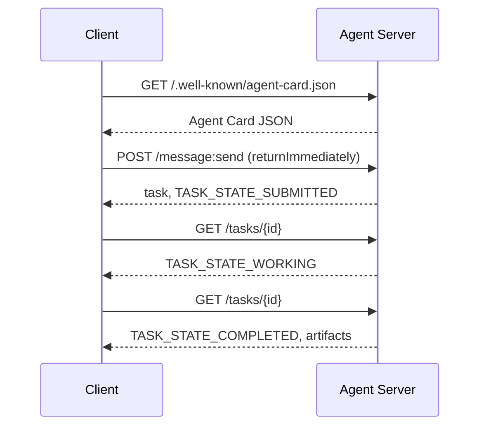

# A2A  智能体间通信协议(Protocolo Agente-Agente)

> O Google lançou o A2A em abril de 2025; até abril de 2026, a norma oficial foi desenvolvida até 1.0.1, e obteve o apoio de mais de 150 organizações, incluindo AWS, Microsoft, Salesforce etc. A2A é o protocolo de complementaridade horizontal do MCP: MCP focalizado em torno de um ponto em relação a um agente, enquanto o A2A focalizado em torno de um ponto em relação a um agente.

**Type:** Learn + Build
**Languages:** Python (stdlib, `http.server`, `json`)
**Prerequisites:** Phase 16 · 04（原语模型）
**Time:** ~75 分钟

## 问题背景

Quando seu agente precisa ser chamado para ser implantado em outro sistema ou outra organização, como deve comunicar? Você pode expor um ponto de extremo HTTP exclusivo, definir um esquema JSON personalizado e esperar que o outro possa ser chamado de acordo com suas regras.

A2A para essa transmissão forneceu um protocolo de linha de uso geral (Wire Protocol) ⋅ define a descoberta de serviços padrão, o abstracto de tarefas padrão, a ligação de transmissão padrão e o produto de saída padrão, como a estrutura HTTP+REST para o corpo inteligente.

## 核心概念

### Quatro grandes elementos

**Agent Card（智能体名片）。**- Deposito .`/.well-known/agent-card.json`JSON 文档, para descrição completa Agente:名称、Skills、`supportedInterfaces`(端点 URL、协议绑定、协议版本) 、默认输入和输出媒体类型, bem como os requisitos de identificação de direitos de`securitySchemes`Com`securityRequirements`(■■■■■■■■■■■■■■■■■■■■■■■■■■■■■■■■■■■■■■■■■■■■■■■■■■■■■■■■■■■■■■■■■■■■■■■■■■■■■■■■■■■■■■■■■■■■■■■■■■■■■■■■■■■■■■■■■■■■■■■■■■■■■■■■■■■■■■■■■■■■■■■■■■■■■■■■■■■■■■■■■■■■■■■■■■■■■■■■■■■■■■■■■■■■■■■■■■■■■■■■■■■■■■■■■■■■■■■■■■■■■■■■■■■■■■■■■■■■■■■■■■■■■■■■■■■■■■■■■■■■■■■■■■■■■■■■■■■■■■■■■■■■■■■■■■■■■■■■■■■■■■■■■■■■■■■■■■■■■■■■■■■■■■■■■■■■■■■■■■■■■■■■■■■■■■■■■■■■■■■■■■■■■■■■■■■■■■■■■■■■■■■■■■■■■■■■■■■■■■■■■■■■■■■■■■■■■■■■■■■■■■■■■■■■■■■■■■■■■■■■■■■■■■■■■■■■■■■■■■■■■■■■■■■■■■■■■■■■■■■■■■■■■■■■■■■■■■■■■■■■■■■■■■■■■

```http
GET /.well-known/agent-card.json HTTP/1.1
Host: agent.example.com
```

```json
{
  "name": "code-review-agent",
  "description": "审查 Python 与 TypeScript 代码。",
  "version": "1.0.0",
  "supportedInterfaces": [
    {
      "url": "https://agent.example.com",
      "protocolBinding": "HTTP+JSON",
      "protocolVersion": "1.0"
    }
  ],
  "capabilities": {"streaming": false, "pushNotifications": false},
  "securitySchemes": {
    "bearer": {"httpAuthSecurityScheme": {"scheme": "Bearer"}}
  },
  "securityRequirements": [{"schemes": {"bearer": {"list": []}}}],
  "defaultInputModes": ["text/plain", "application/json"],
  "defaultOutputModes": ["application/json"],
  "skills": [
    {
      "id": "review-python",
      "name": "审查 Python 代码",
      "description": "审查传入的 Python 源码并给出改进建议。",
      "tags": ["code-review", "python"]
    },
    {
      "id": "review-typescript",
      "name": "审查 TypeScript 代码",
      "description": "审查传入的 TypeScript 源码并给出类型与逻辑改进建议。",
      "tags": ["code-review", "typescript"]
    }
  ]
}
```

**Task（任务）。**基本工作委托单元── um objeto com um ciclo de vida diferente:`TASK_STATE_SUBMITTED`→ `TASK_STATE_WORKING`→ `TASK_STATE_COMPLETED`- Não .`TASK_STATE_FAILED`- Não .`TASK_STATE_CANCELED` Cliente enviar mensagem, servidor  criar tarefa, em seguida, Cliente                                                                                                                                                                                                                                                                                                                                                                                                                                                                                                        

**Artifact（产物）。**A tarefa                                                                                                                                                                                                                                                                                                                                                                                                                                                                                                                           `text`- Não.`raw`- Não.`url`Ou `data`之一并可指明其 `mediaType`- Não.

**不透明生命周期（Opaque Lifecycle）。**A2A 绝不规定远程代理 *内部*如何完成任务──Client 仅观察状态转换与最终产品;被调用方完全自由选择任何底层模型和框架──

### MCP e A2A

- **MCP**:Agente  Ferramentação。Agente 借助 JSON-RPC 读写工具 Server,核心完全无状态。
- **A2A**Agente  Agente, em conjunto, são os dois parceiros de comunicação que possuem intelectualidade intelectual completa e capacidade de julgamento independente.

Em produção de sistemas multi-inteligentes, os dois são colaboradores: A2A para o terminal em seu lado para o uso de ferramentas MCP de configuração local.

### 发现与调用时序



Os seguintes roteiros seguem HTTP+JSON                                                                                                                                                                                                                                                                                                                                                                                                                                                                                                                   `A2A-Version: 1.0`Peliculação em caso de aprovação`SendMessage`O cliente está a ser bloqueado até o fim da missão.`configuration.returnImmediately`Para que o objetivo seja alcançado imediatamente.

对于流式传输:`POST /message:stream`返回 Servidor-Enviado Eventos(首先输出 `task`, posteriormente ,`statusUpdate`Com`artifactUpdate`事件), e `/tasks/{id}:subscribe`则用于重新附加到运行中的任务――流在任务进入终态时正常关闭,报文中不包含单独的 `final`- Não.

### Identidade e segurança (autor)

A2A Orig生支持三种主流安全模式:

- **Bearer Token**:OAuth2 或不透明 Token (((`httpAuthSecurityScheme`Ou `oauth2SecurityScheme`)。
- **mTLS**O TLS é um sistema de identificação de dados.`mtlsSecurityScheme`)。
- **API Key**: localiza requisit head、URL question parameter ou Cookie in the key(`apiKeySecurityScheme`)。

认证规则在 Agente Card 中公布:`securitySchemes`命名方案,`securityRequirements`条例调用方必须满足的要求──

```figure
sw-agent-card-discovery
```

## 动手实践

`code/main.py`Baseado em A2A 1.0 HTTP+JSON  Binding Protocol, puramente usando Python  Standard库 `http.server`Com`json`实现极简的A2A Server与 Client──Server 功能包括:

-  exposição `/.well-known/agent-card.json`O artigo 2.o
-  aceitar `POST /message:send`调用;
- 管理 Tasks  status机转换;
- Em`GET /tasks/{id}`A produção é de volta.

Funções do cliente incluem:

- 拉取并解析 Cartão de Agente;
- 发送带有 `returnImmediately`O que é que é o problema?
- 持续轮询直至任务完成;
- 读取并验证最终 Artifact──

运行命令:

```bash
python3 code/main.py
```

O script inicia o servidor no segundo caminho, e depois o cliente inicia o processo completo de manipulação, exibição direta, descoberta, submissão, consulta e obtenção de produtos.

## 交付物

本课交付 `outputs/skill-a2a-integrator.md` Para o planejamento de um plano completo de A2A                                                                                                                                                                                                                                                                                                                                                                                                                                                                                                               

## 核心专业术语

| 术语 | 规范定义 |
|------|---------|
| A2A | 跨系统异构智能体间互相调用的对等开放协议 |
| Agent Card | 暴露于 `/.well-known/agent-card.json` 的元数据卡片，声明技能、端点与鉴权要求 |
| Task | 具备明确生命周期、完成时生成产物的异步工作单元 |
| Artifact | 任务产出的具名、带类型结果（文本、结构化 JSON、音视频媒体等） |
| 不透明生命周期 (Opaque lifecycle) | 内部解决过程对调用方隐藏，仅对外暴露状态流转与产物 |
| 服务发现 (Discovery) | 通过发起 `GET /.well-known/agent-card.json` 获取名片并了解支持能力 |
| MCP 对比 A2A | MCP 属于垂直的 Agent 与工具交互，A2A 属于水平的 Agent 间对等协作 |

## 延伸阅读

- [A2A 规范主站](https://a2a-protocol.org/latest/specification/) 官方权威规范
- [A2A v1.0.1 源码发布](https://github.com/a2aproject/A2A/tree/v1.0.1) Esta aula segue o código-codificação de acordos e normas
- [Google Developers Blog — A2A 发布说明](https://developers.googleblog.com/en/a2a-a-new-era-of-agent-interoperability/) 官方设计背景
