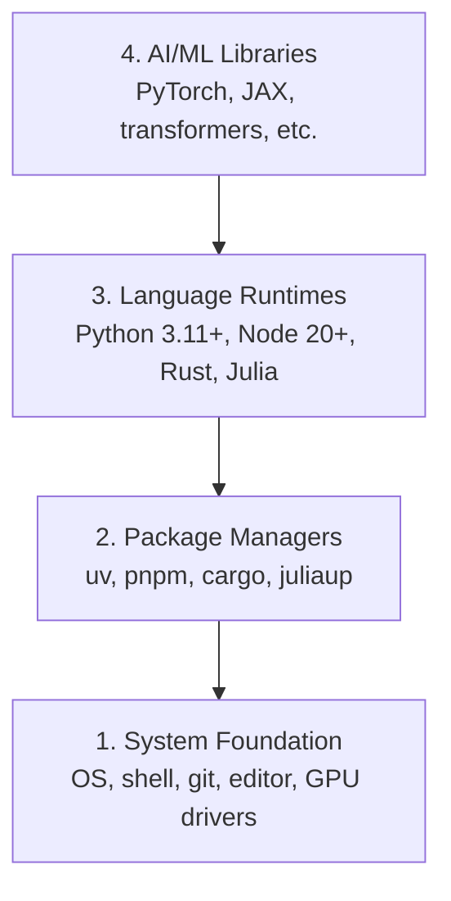

# Dev Çevre

> Senin aletlerin düşünce tarzını şekillendirecek. Bir kere ayarlama, doğru ayarlama.

**Type:** Build
**Languages:** Python, Node.js, Rust
**Prerequisites:** None
**Time:** ~45 分钟

## Öğrenme hedefi
- From零开始设置 Python 3.11+、Node.js 20+ 和 Rust toolchains
- Virtual ortamları ve paket yöneticilerini yapılandırmak, yeniden yapılandırılabilir yapılandırmalar gerçekleştirmek için
- CUDA/MPS 验证 GPU erişim,并运行一个测试 Tensor operasyon
- Sistem, paket, çalıştırma zamanları, yapay zeka kütüphaneleri

## 问题
Python,TypeScript,Rust,Julia ile 200+ bölüm AI mühendisliği derslerini öğreneceksiniz. Eğer çevreniz kötüse, her bölüm öğrenmek yerine mücadele ve araç haline gelir.

Çoğu insan çevre ayarını atlar. Sonra birkaç saat harcarlar. İçe aktarım hatalarını düzeltirler. Versiyon çatışmaları ve eksik CUDA sürücüleri.

## 概念
Bir AI mühendisliği ortamı dört katlı:



Biz alt üstü yüklüyoruz. Her katın alt katından kaynaklanıyor.


```figure
s0-env-stack
```

## Yapın onu.
### 步骤 1: Sistem Temel

Sistemini kontrol et ve temel bileşenleri yükle.

```bash
# macOS
xcode-select --install
brew install git curl wget

# Ubuntu/Debian
sudo apt update && sudo apt install -y build-essential git curl wget

# Windows (use WSL2)
wsl --install -d Ubuntu-24.04
```

### 步骤 2: Python ve UV

Biz kullanıyoruz .`uv`Pip 快 10-100x, ve otomatik olarak sanal ortamları işleyecektir.

```bash
curl -LsSf https://astral.sh/uv/install.sh | sh

uv python install 3.12

uv venv
source .venv/bin/activate  # or .venv\Scripts\activate on Windows

uv pip install numpy matplotlib jupyter
```

验证:

```python
import sys
print(f"Python {sys.version}")

import numpy as np
print(f"NumPy {np.__version__}")
a = np.array([1, 2, 3])
print(f"Vector: {a}, dot product with itself: {np.dot(a, a)}")
```

### 步骤 3: pnpm ile Node.js

TypeScript'te kullanılıyor.

```bash
curl -fsSL https://fnm.vercel.app/install | bash
fnm install 22
fnm use 22

npm install -g pnpm

node -e "console.log('Node', process.version)"
```

### 4 adım: Kırıklık

Performans-kritik 课程(inkressi システム)

```bash
curl --proto '=https' --tlsv1.2 -sSf https://sh.rustup.rs | sh

rustc --version
cargo --version
```

### 步骤 5: Julia (Önemli)

Julia'nın iyi matematikli ağır dersleri var.

```bash
curl -fsSL https://install.julialang.org | sh

julia -e 'println("Julia ", VERSION)'
```

### 步骤 6:GPU 设置( Eğer varsa)

```bash
# NVIDIA
nvidia-smi

# Install PyTorch with CUDA
uv pip install torch torchvision torchaudio --index-url https://download.pytorch.org/whl/cu124
```

```python
import torch
print(f"CUDA available: {torch.cuda.is_available()}")
if torch.cuda.is_available():
    print(f"GPU: {torch.cuda.get_device_name(0)}")
```

没有 GPU?没有问题──大多数课程可在CPU上运行──对于训练重的课程,使用Google Colab或云 GPUs──

### Adım 7: Her şeyi kontrol et

运行验证脚本:

```bash
python phases/00-setup-and-tooling/01-dev-environment/code/verify.py
```

## Kullan
Bu programın her bölümünde kullanılabilecek bir ortam hazır. Aşağıda her yerde kullanılabilecek bir içeriği bulunmaktadır:

| Language | Used In | Package Manager |
|----------|---------|-----------------|
| Python | Phases 1-12 (ML, DL, NLP, Vision, Audio, LLMs) | uv |
| TypeScript | Phases 13-17 (Tools, Agents, Swarms, Infra) | pnpm |
| Rust | Phases 12, 15-17 (Performance-critical systems) | cargo |
| Julia | Phase 1 (Math foundations) | Pkg |

## - Söyle.
Bu dersi, herkesin kendi kuruluşunu kontrol etmek için kullanabileceği bir test kitabı oluşturdu.

- Bakın .`outputs/prompt-env-check.md`Bu, bir de hızlı ve yardımcı AI asistanlarının çevre sorunlarını teşhis etmesine yardımcı olabilir.

## 练习
1. 运行验证脚本并修复 herhangi bir başarısızlık
2. Bu derste Python sanal ortamı oluşturun ve PyTorch'u yükleyin.
3. Tüm dört dilde "Merhaba dünya" yazın.
