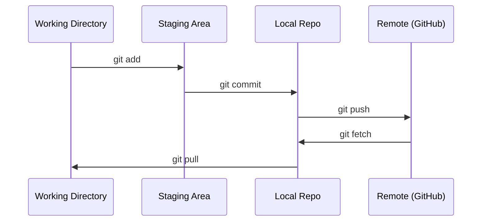

# Git & İşbirliği

> Versiyon kontrolü seçeneği değil. Burada inşa ettiğin her deney, her model, her ders izlenmelidir.

**Type:** Learn
**Languages:** --
**Prerequisites:** Phase 0, Lesson 01
**Time:** ~30 分钟

## Öğrenme hedefi
- 配置 git identity,并使用 add、commit 和 push 的日常工作流
- Ayrılık deneyleri için, bölgeleri birleştirmek ve ana bölgeyi bozmaktan kaçınmak için.
- Bir tane yaz .`.gitignore`, model kontrol noktalarını ve büyük ikili dosyaları ortadan kaldırmak
- Kullanım`git log`浏览 commit tarihi, proje gelişimini anlamak

## 问题
20 aşama boyunca yüzlerce kod dosyası yazacaksın. Sürüm kontrolü olmadan, iş kaybedeceksin. Geri çekilemez şeyleri yok edeceksin.

Git, bir araçtır. GitHub, bir kodtur. Bu ders sadece bu ders için gerekli olan içeriği kapsar.

## 概念


Üç şey hatırlıyorum:
1. 经常保存(`git commit`)
2. Uzakaya it`git push`)
3. Deneyimler için bir şubesi oluşturmak`git checkout -b experiment`)


```figure
s0-commit-dag
```

## Yapın onu.
### 步骤 1: git yapılandır

```bash
git config --global user.name "Your Name"
git config --global user.email "you@example.com"
```

### 步骤 2: günlük iş akışı

```bash
git status
git add file.py
git commit -m "Add perceptron implementation"
git push origin main
```

### 3 adım: deney için oluşturun

```bash
git checkout -b experiment/new-optimizer

# ... make changes, commit ...

git checkout main
git merge experiment/new-optimizer
```

### 4 adım: Bu dersini kullan

```bash
git clone https://github.com/rohitg00/ai-engineering-from-scratch.git
cd ai-engineering-from-scratch

git checkout -b my-progress
# work through lessons, commit your code
git push origin my-progress
```

## Kullan
Bu ders için, sadece şu emirlere ihtiyacın var:

| Command | When |
|---------|------|
| `git clone` | 获取 course repo |
| `git add` + `git commit` | 保存你的工作 |
| `git push` | 备份到 GitHub |
| `git checkout -b` | 在不破坏 main 的情况下尝试东西 |
| `git log --oneline` | 查看你做过什么 |

Bu derslere temel oluşturma, çerez seçme veya alt modüller gerekmez.

## 练习
1. Bu repoyu klon edin, bir isim oluşturun.`my-progress`Şubesi, bir dosya oluştur, yükle, it it.
2. Bir tane oluştur .`.gitignore`, kontrol nokta dosyalarını kaldırmak`.pt`- Evet.`.pth`- Evet.`.safetensors`)
3. Kullan .`git log --oneline`Bu repo'nun commit tarihi ile ilgili dersleri okuyun.

## 关键术语
| Term | What people say | What it actually means |
|------|----------------|----------------------|
| Commit | “保存” | 你的整个 project 在某个时间点的 snapshot |
| Branch | “一个副本” | 指向某个 commit 的 pointer，会随着你的工作向前移动 |
| Merge | “合并 code” | 把一个 branch 的 changes 应用到另一个 branch |
| Remote | “云端” | 托管在其他地方的 repo 副本（GitHub、GitLab） |
