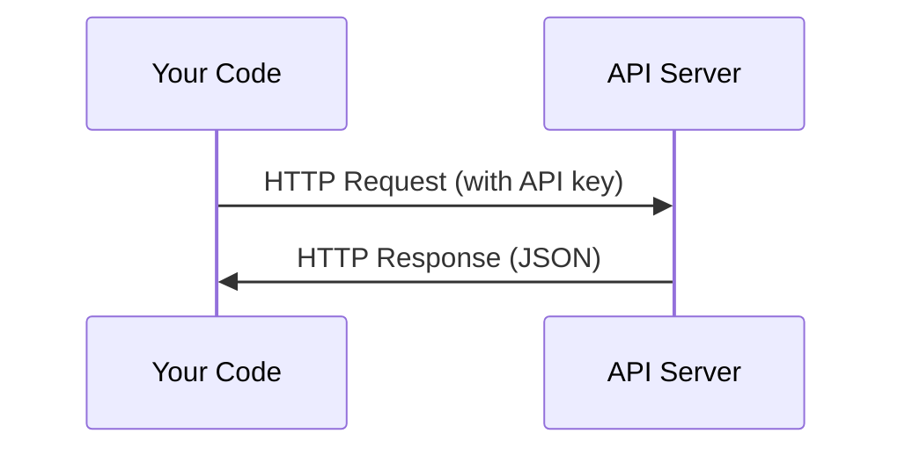

# API & Anahtarları

> Her AI API'nin çalışma biçimi aynı: istek göndermek, cevap almak.

**Type:** Build
**Languages:** Python, TypeScript
**Prerequisites:** Phase 0, Lesson 01
**Time:** ~30 分钟

## Öğrenme hedefi
- Çevre değişkenlerini kullan`.env`dosyalar Güvenli depolama API anahtarları
- Aynı zamanda Anthropic Python SDK ile çiğ HTTP kullanın
- SDK ve ham HTTP'nin sorgu / yanıt biçimlerini karşılaştırın, böylece debugging
- 识别并处理常见API hataları, doğrulama ve oran sınırları dahil

## 问题
11'inci aşamada, LLM API'lerini kullanmaya başlayacaksınız. Antropik, Open AI, Google. 13-16 aşamada bu API'lerin ajanlarını döngülerdeki bir şekilde kullanmaya başlayacaksınız. API anahtarlarının nasıl çalıştığını, nasıl güvenli bir şekilde saklandığını ve ilk API çağrınızı nasıl başlatıldığını bilmelisiniz.

## 概念


Her API çağrısı var:
1. Bir son nokta (URL)
2. Bir API anahtarı(kitayetleme)
3. Bir istek vücudu (((what you want))
4. Bir cevap vücudu (((what get)


```figure
s0-secret-inject
```

## Yapın onu.
### 步骤 1: Güvenli depolama API anahtarları

绝不要把API keys 放进代码――环境变量――

```bash
export ANTHROPIC_API_KEY="sk-ant-..."
export OPENAI_API_KEY="sk-..."
```

Ya da kullan `.env`Dosya (((değiştir `.gitignore`):

```
ANTHROPIC_API_KEY=sk-ant-...
OPENAI_API_KEY=sk-...
```

### 步骤 2:第一次 API 调用 (Python)

```python
import anthropic

client = anthropic.Anthropic()

response = client.messages.create(
    model="claude-sonnet-4-20250514",
    max_tokens=256,
    messages=[{"role": "user", "content": "What is a neural network in one sentence?"}]
)

print(response.content[0].text)
```

### 步骤 3: 第一次 API 调用 (TypeScript)

```typescript
import Anthropic from "@anthropic-ai/sdk";

const client = new Anthropic();

const response = await client.messages.create({
  model: "claude-sonnet-4-20250514",
  max_tokens: 256,
  messages: [{ role: "user", content: "What is a neural network in one sentence?" }],
});

console.log(response.content[0].text);
```

### 步骤 4: Raw HTTP (SDK yok)

```python
import os
import urllib.request
import json

url = "https://api.anthropic.com/v1/messages"
headers = {
    "Content-Type": "application/json",
    "x-api-key": os.environ["ANTHROPIC_API_KEY"],
    "anthropic-version": "2023-06-01",
}
body = json.dumps({
    "model": "claude-sonnet-4-20250514",
    "max_tokens": 256,
    "messages": [{"role": "user", "content": "What is a neural network in one sentence?"}],
}).encode()

req = urllib.request.Request(url, data=body, headers=headers, method="POST")
with urllib.request.urlopen(req) as resp:
    result = json.loads(resp.read())
    print(result["content"][0]["text"])
```

Bu SDK'ların arkasında yapıldığı şey. HTTP çağrısını anlamak ve debugging'e yardımcı olmak.

## Kullan
对于本课程:

| API | When you need it | Free tier |
|-----|-----------------|-----------|
| Anthropic (Claude) | Phases 11-16（agents, tools） | 注册赠送 $5 credit |
| OpenAI | Phase 11（comparison） | 注册赠送 $5 credit |
| Hugging Face | Phases 4-10（models, datasets） | Free |

Şimdi tüm ayarlamalara ihtiyacın yok.

## - Söyle.
Bu ders 会产出:
- `outputs/prompt-api-troubleshooter.md`- 诊断常见 API hataları

## 练习
1. Bir Antropik API anahtarı al ve ilk API çağrını başlat.
2. 尝试 raw HTTP 版本,并将响应格式与SDK 版本进行比较
3. Yapılan hatalar için API anahtarı kullanmak,

## 关键术语
| Term | What people say | What it actually means |
|------|----------------|----------------------|
| API key | "Password for the API" | 一个唯一字符串，用于标识你的 account 并授权 requests |
| Rate limit | "They're throttling me" | 每分钟/每小时最大 requests 数量，用于防止滥用并确保公平使用 |
| Token | "A word"（在 API 语境中） | 一个 billing unit：input 和 output Tokens 会被分别计数并收费 |
| Streaming | "Real-time responses" | 逐词获取 response，而不是等待完整 response |
