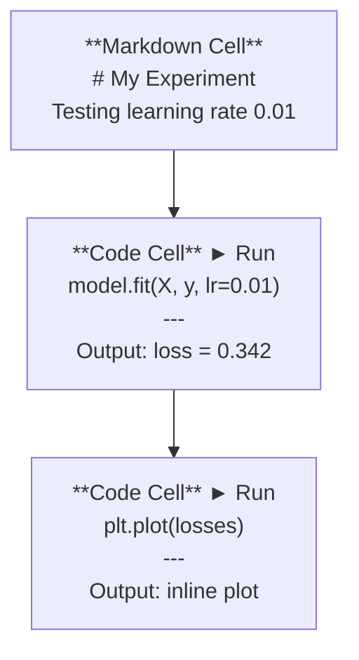
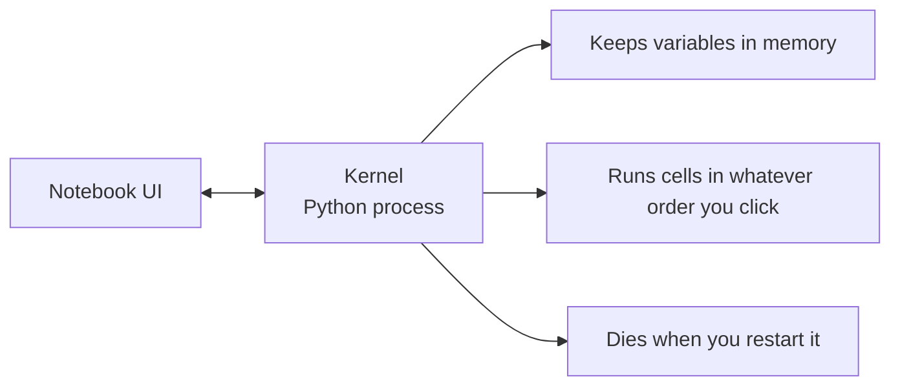

# Jupyter Not defterleri

> Not defterleri, AI mühendisliği deneyidir. Burada prototip yaparsın, sonra etkin kısmını üretime taşıyorsun.

**类型：**Yapım
**语言：**Python
**前置要求：**Eğitim 0
**时间：**30 dakika kadar .

## Öğrenme hedefi

- JupyterLab、Jupyter Notebook, veya Jupyter uzantısı ile VS kodu yükle
- Büyü komutlarını kullanın.`%timeit`- Evet.`%%time`- Evet.`%matplotlib inline`) referans değerlendirmesi ve görülebilirlik
- 区分何时使用笔记本、何时使用脚本,并应用在笔记本中探索,在脚本中交付的工作流
- 识别并避免常见笔记本 陷:乱序执行、隐藏状态和内存泄漏

## 问题

Her AI makalesi、tutorial 和 Kaggle yarışması, Jupyter not defterlerini kullanıyor. Bunlar, size bir bölüm çalıştırma kodunu, iç içerikli kodunu, çıkışını, karışık kodunu ve açıklamasını gösterir.

Ama not defterleri gerçekten bir tuzağa düşmüştür. İnsanlar bunları her şey için kullanıyor. Bunlar da çok iyi olmayan şeyler.

## 概念

Not defteri bir grup birimden oluşan bir liste.



Kernel, bir hücreyi çalıştırdığında, kodunu çekirdeğe gönderir, çekirdeği kodunu gerçekleştirir ve sonuçları gönderir. Tüm hücreler aynı çekirdeği paylaşır, bu yüzden değişim hücreler arasında saklanır.



You're on what order You're on what order You're on what order You're on what order You're on what order You're on what order You're on what order You're on what order You're on what order You're on what order You're on what order You're on what order You're on what order You're on what order You're on what order You're on what order You're on what order You're on what order You're on what order You're on what's on what's on what's on what's on what's on what's on what's on the way  You're on what're on the way  You're on the way  You're on the way 


```figure
s0-cell-order
```

## Yapım

### 步骤 1: 选择你的界面

Üç种选择,同一种格式:

| Interface | Install | Best for |
|-----------|---------|----------|
| JupyterLab | `pip install jupyterlab` then `jupyter lab` | 完整 IDE 体验、多标签、文件浏览器、terminal |
| Jupyter Notebook | `pip install notebook` then `jupyter notebook` | 简单、轻量、一次一个 notebook |
| VS Code | Install "Jupyter" extension | 已在你的 editor 中、git 集成、debugging |

Üç kişi okudum yazmakla beraber`.ipynb`文件──选你喜欢的即可──JupyterLab, AI çalışmalarında en yaygın seçimdir──

```bash
pip install jupyterlab
jupyter lab
```

### 步骤 2: 重要键盘快捷键

İki modda çalışacaksın.`Escape`进入 command mode ((左侧蓝色),按 `Enter`进入 edit mode(绿色)。

**Command mode（最常用）：**

| Key | Action |
|-----|--------|
| `Shift+Enter` | 运行 cell，移动到下一个 |
| `A` | 在上方插入 cell |
| `B` | 在下方插入 cell |
| `DD` | 删除 cell |
| `M` | 转换为 markdown |
| `Y` | 转换为 code |
| `Z` | 撤销 cell 操作 |
| `Ctrl+Shift+H` | 显示所有快捷键 |

**Edit mode：**

| Key | Action |
|-----|--------|
| `Tab` | Autocomplete |
| `Shift+Tab` | 显示函数签名 |
| `Ctrl+/` | 切换 comment |

`Shift+Enter`Her gün binlerce hızlı anahtar kullanırsın.

### 步骤 3: Hücre tipi

**Code cells**Python'u gösterir ve çıkartır:

```python
import numpy as np
data = np.random.randn(1000)
data.mean(), data.std()
```

输出:`(0.0032, 0.9987)`

**Markdown cells**染格式化文本──用它们记录你正在做什么以及为什么这样做──支持标题、大胆、 italic、LaTeX math(`$E = mc^2$`)、tablolar 和 görüntüler

### 步骤 4: Sihirli komutlar

Bunlar Python değil. Jupiter'in özel emirleri.`%`(Sit çizgi sihir) veya `%%`- Başlangıç.

**为你的代码计时：**

```python
%timeit np.random.randn(10000)
```

输出:`45.2 us +/- 1.3 us per loop`

```python
%%time
model.fit(X_train, y_train, epochs=10)
```

输出:`Wall time: 2.34 s`

`%timeit`Çok kez çalışıyorum.`%%time`Sadece bir kez kullanın.`%timeit`Mikrobenchmarks yapın, kullanın.`%%time`Eğitim koşularını yap.

**启用 inline plots：**

```python
%matplotlib inline
```

Şimdi her biri .`plt.plot()`Ya da`plt.show()`Şehir doğrudan defterde yer alır.

**不离开 notebook 安装 packages：**

```python
!pip install scikit-learn
```

`!`Ön会运行任意 shell komutu

**检查环境变量：**

```python
%env CUDA_VISIBLE_DEVICES
```

### 步骤 5: Inline 显示 zengin çıkış

Not defterleri otomatik olarak hücrede son ifadeleri gösterir. Ama sen de kontrol edebilirsin:

```python
import pandas as pd

df = pd.DataFrame({
    "model": ["Linear", "Random Forest", "Neural Net"],
    "accuracy": [0.72, 0.89, 0.94],
    "training_time": [0.1, 2.3, 45.6]
})
df
```

Bu, bir HTML tabloyu şekillendirir, metin çöplüğü değil.

```python
import matplotlib.pyplot as plt

plt.figure(figsize=(8, 4))
plt.plot([1, 2, 3, 4], [1, 4, 2, 3])
plt.title("Inline Plot")
plt.show()
```

Planı hücreye göre görüyoruz. İşte not defterleri.

Resimler için:

```python
from IPython.display import Image, display
display(Image(filename="architecture.png"))
```

### 步骤 6: Google Colab

Colab, cloud端'un ücretsiz Jupyter notbukudur. GPU, preinstalled kütüphaneleri ve Google Drive'ı oluşturur.

1. Önceki[colab.research.google.com](https://colab.research.google.com)
2. 上传本课程中的任意 `.ipynb`文件
3. Çalışma zamanı > Çalışma süresi tipi > T4 GPU(免费)

Colab ile yerli Jupyter arasındaki fark:
- Dosyalar 会在会议之间保留(保存到驱动或下载)
- 预装:mumpy、pandas、matplotlib、torch、tensorflow、sklearn
- Kullanım`from google.colab import files`上传/ download dosyaları
- Kullanım`from google.colab import drive; drive.mount('/content/drive')`Kalıcı depolama
- Ücretsiz seanslar 90 dakikada hareketsiz kalır .

## kullanımı

### Not defterleri vs. Scripts:何时使用哪一个

| Use notebooks for | Use scripts for |
|-------------------|-----------------|
| 探索 dataset | Training pipelines |
| Prototype model | Reusable utilities |
| 可视化结果 | 任何包含 `if __name__` 的东西 |
| 解释你的工作 | 按计划运行的 code |
| 快速 experiments | Production code |
| Course exercises | Packages and libraries |

规则:**在 notebooks 中探索，在 scripts 中交付**- Evet.

AI 中常见工作流:
1. Not defterinde bilgiyi araştır
2. Not defterinde prototip modeliniz
3. Bir kez yapılırsa kodumu taşı.`.py`dosyalar
4. Bunları koy.`.py`Dosyaları yeniden içeriye aktarın.

### 常见陷

**乱序执行。**Cell 5, Cell 2, Cell 7 tekrar çalıştır. Not defteri makinenizde kullanılabilir. Ama diğerleri de yukarıdan aşağıya çalışırken bozuk olur.

**隐藏状态。**Bir hücreyi sildiğinize göre, oluşturduğu değişim hâlâ kayda kalıyor. Not defteri görünüşe göre temiz, ama bir hücreye bağlı.

**内存泄漏。**4GB veri kümesi yükle, eğitim modeli yeniden yükle, başka bir veri kümesi yeniden yükle.`del variable_name`和 `gc.collect()`, veya çekirdeği yeniden başlatmak

## 交付

Bu ders:
- `outputs/prompt-notebook-helper.md`, için 问题

## 练习

1. 打开 JupyterLab,创建一个笔记本,并使用 `%timeit`Liste anlayışını numpy ile karşılaştırır 100.000 个随机数组 创建时的差
2. ✓ ✓ ✓ ✓ ✓ ✓ ✓ ✓ ✓ ✓ ✓ ✓ ✓ ✓ ✓ ✓ ✓ ✓ ✓ ✓ ✓ ✓ ✓ ✓ ✓ ✓ ✓ ✓ ✓ ✓ ✓ ✓ ✓ ✓ ✓ ✓ ✓ ✓ ✓ ✓ ✓ ✓ ✓ ✓ ✓ ✓ ✓ ✓ ✓ ✓ ✓ ✓ ✓ ✓ ✓ ✓ ✓ ✓ ✓ ✓ ✓ ✓ ✓ ✓ ✓ ✓ ✓ ✓ ✓ ✓ ✓ ✓ ✓ ✓ ✓ ✓ ✓ ✓ ✓ ✓ ✓ ✓ ✓ ✓ ✓ ✓ ✓ ✓ ✓ ✓ ✓ ✓ ✓ ✓ ✓ ✓ ✓ ✓ ✓ ✓ ✓ ✓ ✓ ✓ ✓ ✓ ✓ ✓ ✓ ✓ ✓ ✓ ✓ ✓ ✓ ✓ ✓ ✓ ✓ ✓ ✓ ✓ ✓ ✓ ✓ ✓ ✓ ✓ ✓ ✓ ✓ ✓ ✓ ✓ ✓ ✓ ✓ ✓ ✓ ✓ ✓ ✓ ✓ ✓ ✓ ✓ ✓ ✓ ✓ ✓ ✓ ✓ ✓ ✓ ✓ ✓ ✓ ✓ ✓ ✓ ✓ ✓ ✓ ✓ ✓ ✓ ✓ ✓ ✓ ✓ ✓ ✓ ✓ ✓ ✓ ✓ ✓ ✓ ✓ ✓ ✓ ✓ ✓ ✓ ✓ ✓ ✓ ✓ ✓ ✓ ✓ ✓ ✓ ✓ ✓ ✓ ✓ ✓ ✓ ✓ ✓ ✓ ✓    ✓ ✓ ✓ ✓ ✓         ✓   ✓ ✓ ✓                                                                         
3. - Ne ?`code/notebook_tips.py`İçeri kod  Colab notbukuna yapıştır  İçeri,并使用免费GPU 运行

## 关键术语

| Term | What people say | What it actually means |
|------|----------------|----------------------|
| Kernel | “运行我代码的东西” | 一个独立的 Python process，用来执行 cells 并在内存中保存变量 |
| Cell | “一个 code block” | Notebook 中可独立运行的单元，可以是 code 或 markdown |
| Magic command | “Jupyter 技巧” | 以 `%` 或 `%%` 为前缀、用于控制 notebook 环境的特殊命令 |
| `.ipynb` | “Notebook file” | 一个包含 cells、outputs 和 metadata 的 JSON 文件。代表 IPython Notebook |

## 延伸阅读

- [JupyterLab Docs](https://jupyterlab.readthedocs.io/)查看完整功能集
- [Google Colab FAQ](https://research.google.com/colaboratory/faq.html)查看 Colab 特定限制与功能
- [28 Jupyter Notebook Tips](https://www.dataquest.io/blog/jupyter-notebook-tips-tricks-shortcuts/)查看进阶快捷键
