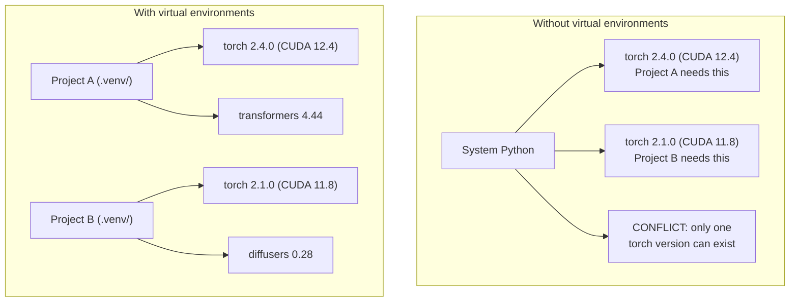

# Python Çevreleri

> bağımlılık cehennemi, gerçek varlık ve varlık.

**Type:** Build
**Languages:** Shell
**Prerequisites:** Phase 0, Lesson 01
**Time:** ~30 分钟

## Öğrenme Hedefleri

- Kullanım`uv`- Evet.`venv`Ya da`conda`Yapısal ortamlar oluşturmak
- 编写带有可选依赖性群的 `pyproject.toml`, kilitleme dosyaları oluşturur ,
- 诊断并修复常见陷:global installs、pip/conda 混用、CUDA versiyon eşleşmezliği
- Çatışma bağımlılıkları için projeler aşamalara göre ayrılmış çevre stratejisini gerçekleştirmek

## 问题

Bir ince ayarlama projesi için PyTorch 2.4..下周, bir başka projesi için PyTorch 2.1 gerekiyor çünkü CUDA yapısı sabitlenmiştir.

Bu bağımlılık cehennemi. AI/ML işlerinde sıklıkla olur çünkü:

- PyTorch、JAX 和 TensorFlow her biri kendi CUDA bağlarını taşır
- Model kütüphaneleri belirli çerçeve sürümlerini sabitleyecek
- Tüm bölge`pip install`会覆盖 Önceki İçerik
- CUDA 11.8 inşa ediyor 不能与 CUDA 12.x sürücüleri 配合使用,反之亦然

Çözüm: Her projenin kendi ayrılık ortamı ve kendi paketleri vardır.

## 概念




```figure
s0-env-isolation
```

## Yapın

### 选项 1:uv venv(推)

`uv`en hızlı Python paket yöneticisi (pipe 快 10-100 倍) ⋅ bir araçta sanal ortamları, Python sürümleri ve bağımlılık çözünürlüğünü işlemelidir.

```bash
curl -LsSf https://astral.sh/uv/install.sh | sh

uv python install 3.12

cd your-project
uv venv
source .venv/bin/activate
```

Paketleri:

```bash
uv pip install torch numpy
```

Bir adım oluşturmak `pyproject.toml`Proje:

```bash
uv init my-ai-project
cd my-ai-project
uv add torch numpy matplotlib
```

### 选项 2:venv(内置)

Eğer yüklenemezsen`uv`Python'un kendi kendine.`venv`- ...

```bash
python3 -m venv .venv
source .venv/bin/activate  # Linux/macOS
.venv\Scripts\activate     # Windows

pip install torch numpy
```

- Hayır .`uv`- Ama Python'un yerlerini kurduğumda çalışıyorum.

### 选项 3:conda(需要时使用)

Conda  yönetmek CUDA araç kümeleri、cuDNN 和 C kütüphaneleri 等非 Python bağımlılıkları──在以下情况下使用它:

- CUDA araç kitinin özel bir versiyonu gerekiyor ama sistem genelinde kurulmak istemiyor.
- Paylaşılan küme üzerinde sistem paketlerini yükleyemezsiniz
- Bir kütüphanenin kurulum açıklaması

```bash
# Install miniconda (not the full Anaconda)
curl -LsSf https://repo.anaconda.com/miniconda/Miniconda3-latest-Linux-x86_64.sh -o miniconda.sh
bash miniconda.sh -b

conda create -n myproject python=3.12
conda activate myproject

conda install pytorch torchvision torchaudio pytorch-cuda=12.4 -c pytorch -c nvidia
```

Bir kural: Eğer bir ortamda bir kontayı kullanıyorsanız, bu ortamda bulunan tüm paketleri kullanın.`pip install`Bu da bağımlılık çatışmasını ve çok acı verici bir durumdur.

### Bu ders: Faseye göre strateji

Tüm sınıf için bir ortam oluşturabilirsiniz. Bunu yapmayın. Farklı aşamalara ihtiyaç vardır.

策略:

```
ai-engineering-from-scratch/
├── .venv/                    <-- phases 0-3 共用的轻量 env
├── phases/
│   ├── 04-neural-networks/
│   │   └── .venv/            <-- PyTorch env
│   ├── 05-cnns/
│   │   └── .venv/            <-- 同一个 PyTorch env（symlink 或 shared）
│   ├── 08-transformers/
│   │   └── .venv/            <-- 可能需要不同的 transformer versions
│   └── 11-llm-apis/
│       └── .venv/            <-- API SDKs，不需要 torch
```

`code/env_setup.sh`Orta Yazı Programı Bu Sınıfın Temel Çevresini Oluşturmak İçin

## pyproject.toml 基础

Her Python projesi bir tane olmalı .`pyproject.toml`Bir dosya ile değiştirildi.`setup.py`- Evet.`setup.cfg`和 `requirements.txt`- Evet.

```toml
[project]
name = "ai-engineering-from-scratch"
version = "0.1.0"
requires-python = ">=3.11"
dependencies = [
    "numpy>=1.26",
    "matplotlib>=3.8",
    "jupyter>=1.0",
    "scikit-learn>=1.4",
]

[project.optional-dependencies]
torch = ["torch>=2.3", "torchvision>=0.18"]
llm = ["anthropic>=0.39", "openai>=1.50"]
```

Sonra da:

```bash
uv pip install -e ".[torch]"    # base + PyTorch
uv pip install -e ".[llm]"     # base + LLM SDKs
uv pip install -e ".[torch,llm]" # everything
```

## Kilitleme dosyaları

Kilitleme dosyası her bağımlılığı (transitif bağımlılıklar dahil) kesin bir sürümde sabitleyecektir. Bu da tekrarlanabilirliği garanti eder: kilitleme dosyasından herhangi bir kişi tamamen aynı paketleri alır.

```bash
# uv generates uv.lock automatically when using uv add
uv add numpy

# pip-tools approach
uv pip compile pyproject.toml -o requirements.lock
uv pip install -r requirements.lock
```

Kilit dosyanızı git'e kadar devreye sokun. Başkaları da kilit dosyasını koparıp yükledikten sonra, tamamen uyumlu versiyonlar elde edeceğiz.

## 常见错误

### 1. Tüm yerler

```bash
pip install torch  # BAD: installs to system Python

source .venv/bin/activate
pip install torch  # GOOD: installs to virtual environment
```

Paketlerini kontrol et.

```bash
which python       # should show .venv/bin/python, not /usr/bin/python
which pip           # should show .venv/bin/pip
```

### 2. 混用 pip 和 conda

```bash
conda create -n myenv python=3.12
conda activate myenv
conda install pytorch -c pytorch
pip install some-other-package   # BAD: can break conda's dependency tracking
conda install some-other-package # GOOD: let conda manage everything
```

Eğer bir konda içinde bir bomba kullanıyorsan, önce tüm bomba paketlerini yükle, sonra da bomba paketlerini yeniden yükle.

### 3. 忘记 etkinleştir

```bash
python train.py           # uses system Python, missing packages
source .venv/bin/activate
python train.py           # uses project Python, packages found
```

应显示环境 adı:

```
(.venv) $ python train.py
```

### 4. Git . .venv commit git

```bash
echo ".venv/" >> .gitignore
```

Sanal ortamlar genellikle 200MB-2GB'dir. Yerel ve makineler arasında aktarılamaz.`pyproject.toml`Ve kilitli dosya.

### 5. CUDA sürüm eşleşmez

```bash
nvidia-smi                # shows driver CUDA version (e.g., 12.4)
python -c "import torch; print(torch.version.cuda)"  # shows PyTorch CUDA version

# These must be compatible.
# PyTorch CUDA version must be <= driver CUDA version.
```

## Kullan

运行 setup script  oluşturun ders ortamınız:

```bash
bash phases/00-setup-and-tooling/06-python-environments/code/env_setup.sh
```

Bu repo kökü içinde olacak bir tane oluştur .`.venv`,并安装和验证 çekirdek bağımlılıkları。

## 练习

1. 运行  İşlem`env_setup.sh`Tüm kontrollerin onaylandığını belirtti .
2.  create a second virtual environment, install among them different versions of numpy,并 confirm two environments  mutually isolated  birbirinden ayrılan iki ortamı oluşturmak
3. Aynı zamanda PyTorch ve Anthropic SDK projesinin de bir parçası olmak için .`pyproject.toml`
4. Bu yüzden tüm bölge bir paket yükle, onu kontrol et ve sonra yükle.

## 关键术语

| Term | What people say | What it actually means |
|------|----------------|----------------------|
| Virtual environment | “A venv” | 一个隔离目录，包含 Python interpreter 和 packages，并与 system Python 分离 |
| Lockfile | “Pinned dependencies” | 一个列出每个 package 及其精确 version 的文件，保证跨机器安装一致 |
| pyproject.toml | “The new setup.py” | 标准 Python project 配置文件，替代 setup.py/setup.cfg/requirements.txt |
| Transitive dependency | “A dependency of a dependency” | Package B 依赖 C；如果你安装依赖 B 的 A，那么 C 就是 A 的 transitive dependency |
| CUDA mismatch | “My GPU isn't working” | PyTorch 编译所用的 CUDA version 与你的 GPU driver 支持的版本不同 |
