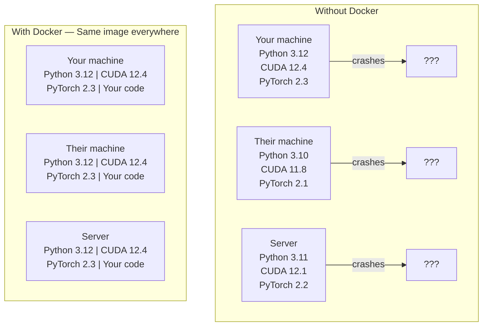

# AI için Docker

> Kontanerler makineme binerken geçmişte kalıyor.

**Type:** Build
**Languages:** Docker
**Prerequisites:** Phase 0, Lessons 01 and 03
**Time:** ~60 分钟

## Öğrenme Hedefleri

- Docker dosyasından  GPU'nun Docker görüntüsünü etkinleştirin, CUDA、PyTorch ve AI kütüphaneleri içerir
- Konteyner yeniden inşa etmek için  host dizinleri  olarak ayıklar  arasında sürdürülmüş modeller DATASET ve kod
-  Configuration NVIDIA Container Toolkit , let containers 内部 GPU'lara erişilebilir
- kullan Docker Yapılandırmak 编排多服务 AI uygulamaları(inference sunucu + vektör veritabanı)

## 问题

Siz bilgisayarınızda PyTorch 2.3、CUDA 12.4 和 Python 3.12 kullanıyorsunuz. Bir model eğitimi alıyorsunuz. İş arkadaşlarınız PyTorch 2.1、CUDA 11.8 和 Python 3.10 kullanıyor.

AI projeleri bağımlılık kabuslarıdır. Python, PyTorch, CUDA sürücüleri, cuDNN, sistem düzeydeki C kütüphaneleri ve flash-attn gibi özel paketler gibi tipik bir yığın vardır.

## 概念

Docker, kodunuzu, çalıştırma zamanını, kütüphaneleri ve sistem araçlarını konteyner olarak adlandırılan bir ayrılık biriminde paketleyecek. Sadece kendi çekirdeğini çalıştırmak yerine, sunucu işletim sistemi çekirdeğini paylaşıyor.



### Neden AI projeleri çoğu projenin yerine Docker 'a daha fazla ihtiyaç duyar ?

1. **GPU drivers 很脆弱。**CUDA 12.4 kodu 不能在 CUDA 11.8 上运行──Docker 会隔离容器内 CUDA araç kümesinden, NVIDIA Container Toolkit üzerinden ortak host GPU sürücüsü──

2. **Model weights 很大。**Bir 7B parametre modeli fp16'da 14 GB'da bulunur. Her yeniden inşa edilince yeniden yüklemek istemezsin. Docker ciltleri, bir model dizini oluşturmanıza izin verir.

3. **Multi-service architectures 很常见。**Gerçek bir AI uygulaması sadece bir Python yazısı değil. RAG'in vektör veritabanı için kullanılacak bir sonuç sunucusu.

### 关键词汇

| Term | What it means |
|------|---------------|
| Image | 只读 template。你的 recipe。由 Dockerfile 构建。 |
| Container | image 的运行实例。你的 kitchen。 |
| Dockerfile | 构建 image 的 instructions。逐层构建。 |
| Volume | 可在 container restarts 后保留的持久化 storage。 |
| docker-compose | 用 YAML 定义 multi-container applications 的工具。 |

### AI 中常见的容器 模式

```
Dev Container
  完整 toolkit。Editor support。Jupyter。Debugging tools。
  用于 development 和 experimentation。

Training Container
  最小化。只有 training script 和 dependencies。
  在 GPU clusters 上运行。没有 editor，没有 Jupyter。

Inference Container
  为 serving 优化。Small image。Fast cold start。
  在 production 中运行于 load balancer 后方。
```


```figure
s0-image-layers
```

## Yapın

### Adım 1: Docker'ı monte et

```bash
# macOS
brew install --cask docker
open /Applications/Docker.app

# Ubuntu
curl -fsSL https://get.docker.com | sh
sudo usermod -aG docker $USER
# Log out and back in for group change to take effect
```

验证:

```bash
docker --version
docker run hello-world
```

### Adım 2: NVIDIA Container Toolkit'i yükle (((带 NVIDIA GPU 的 Linux)

Bu Docker konteynerlerini kullanan kullanıcıların GPU'larını kullanmalarına olanak sağlar. MacOS ve Windows kullanan kullanıcılar Docker Desktop'u farklı şekilde kullanırlar.

```bash
distribution=$(. /etc/os-release;echo $ID$VERSION_ID)
curl -fsSL https://nvidia.github.io/libnvidia-container/gpgkey | sudo gpg --dearmor -o /usr/share/keyrings/nvidia-container-toolkit-keyring.gpg
curl -s -L https://nvidia.github.io/libnvidia-container/$distribution/libnvidia-container.list | \
    sed 's#deb https://#deb [signed-by=/usr/share/keyrings/nvidia-container-toolkit-keyring.gpg] https://#g' | \
    sudo tee /etc/apt/sources.list.d/nvidia-container-toolkit.list

sudo apt-get update
sudo apt-get install -y nvidia-container-toolkit
sudo nvidia-ctk runtime configure --runtime=docker
sudo systemctl restart docker
```

İç konteyner içinde test GPU erişim:

```bash
docker run --rm --gpus all nvidia/cuda:12.4.1-base-ubuntu22.04 nvidia-smi
```

Eğer GPU bilgilerini izliyorsan, araç çubuğunu açıkla.

### Adım 3: Temel görüntüleri anlamak

选择正确的基image 可以节省几个小时调试时间──

```
nvidia/cuda:12.4.1-devel-ubuntu22.04
  完整 CUDA toolkit。包含 compilers。
  Use for: 构建需要 nvcc 的 packages（flash-attn、bitsandbytes）
  Size: ~4 GB

nvidia/cuda:12.4.1-runtime-ubuntu22.04
  仅 CUDA runtime。没有 compilers。
  Use for: 运行 pre-built code
  Size: ~1.5 GB

pytorch/pytorch:2.3.1-cuda12.4-cudnn9-runtime
  基于 CUDA 预装 PyTorch。
  Use for: 跳过 PyTorch install step
  Size: ~6 GB

python:3.12-slim
  没有 CUDA。仅 CPU。
  Use for: CPU inference、lightweight tools
  Size: ~150 MB
```

### Adım 4: Yapay zeka geliştirme için 编写 Dockerfile

Bu .`code/Dockerfile`İçinde Dockerfile.

```dockerfile
FROM nvidia/cuda:12.4.1-devel-ubuntu22.04

ENV DEBIAN_FRONTEND=noninteractive
ENV PYTHONUNBUFFERED=1

RUN apt-get update && apt-get install -y --no-install-recommends \
    python3.12 \
    python3.12-venv \
    python3.12-dev \
    python3-pip \
    git \
    curl \
    build-essential \
    && rm -rf /var/lib/apt/lists/*

RUN update-alternatives --install /usr/bin/python python /usr/bin/python3.12 1

RUN python -m pip install --no-cache-dir --upgrade pip setuptools wheel

RUN python -m pip install --no-cache-dir \
    torch==2.3.1 \
    torchvision==0.18.1 \
    torchaudio==2.3.1 \
    --index-url https://download.pytorch.org/whl/cu124

RUN python -m pip install --no-cache-dir \
    numpy \
    pandas \
    scikit-learn \
    matplotlib \
    jupyter \
    transformers \
    datasets \
    accelerate \
    safetensors

WORKDIR /workspace

VOLUME ["/workspace", "/models"]

EXPOSE 8888

CMD ["python"]
```

Yap:

```bash
docker build -t ai-dev -f phases/00-setup-and-tooling/07-docker-for-ai/code/Dockerfile .
```

İlk kez biraz zaman geçiriyor. CUDA taban görüntüsü + PyTorch indir.

- Yapma .

```bash
docker run --rm -it --gpus all \
    -v $(pwd):/workspace \
    -v ~/models:/models \
    ai-dev python -c "import torch; print(f'PyTorch {torch.__version__}, CUDA: {torch.cuda.is_available()}')"
```

İçinde taşınacak olan Jupyter:

```bash
docker run --rm -it --gpus all \
    -v $(pwd):/workspace \
    -v ~/models:/models \
    -p 8888:8888 \
    ai-dev jupyter notebook --ip=0.0.0.0 --port=8888 --no-browser --allow-root
```

### Adım 5: Veriler ve modeller için kullanılacak boyutlı dağılımlar

AI için çok önemli. Onlar yokken, 14 GB model indirimi konteynerde olur.

```bash
# Mount your code
-v $(pwd):/workspace

# Mount a shared models directory
-v ~/models:/models

# Mount datasets
-v ~/datasets:/data
```

Eğitim senaryolarında, monte edilmiş yol yüklenmesi:

```python
from transformers import AutoModel

model = AutoModel.from_pretrained("/models/llama-7b")
```

Modelle  Located Your Host File System 上── can you want to rebuild container,而无需重新下载──

### Adım 6: Çoklu Hizmetli AI Uygulamaları için Docker Yapılandır

Bir gerçek RAG uygulaması                                                                                                                                                                                                                                                                                                                                                                                                                                                                                                                        

Görüyorum .`code/docker-compose.yml`- ...

```yaml
services:
  ai-dev:
    build:
      context: .
      dockerfile: Dockerfile
    deploy:
      resources:
        reservations:
          devices:
            - driver: nvidia
              count: all
              capabilities: [gpu]
    volumes:
      - ../../../:/workspace
      - ~/models:/models
      - ~/datasets:/data
    ports:
      - "8888:8888"
    stdin_open: true
    tty: true
    command: jupyter notebook --ip=0.0.0.0 --port=8888 --no-browser --allow-root

  qdrant:
    image: qdrant/qdrant:v1.12.5
    ports:
      - "6333:6333"
      - "6334:6334"
    volumes:
      - qdrant_data:/qdrant/storage

volumes:
  qdrant_data:
```

启动所有服务:

```bash
cd phases/00-setup-and-tooling/07-docker-for-ai/code
docker compose up -d
```

Şimdi senin AI dev konteyner servis adı ile olabilir.`http://qdrant:6333`访问 vector database──Docker Compose 会自动创建共享网络──

AI konteynerinden 内测试连接:

```python
from qdrant_client import QdrantClient

client = QdrantClient(host="qdrant", port=6333)
print(client.get_collections())
```

停止所有服务:

```bash
docker compose down
```

Üstüne`-v`Ayrıca , kdrant hacmi de silinecek:

```bash
docker compose down -v
```

### Adım 7: AI 工作中实用 Docker komutları

```bash
# List running containers
docker ps

# List all images and their sizes
docker images

# Remove unused images (reclaim disk space)
docker system prune -a

# Check GPU usage inside a running container
docker exec -it <container_id> nvidia-smi

# Copy a file from container to host
docker cp <container_id>:/workspace/results.csv ./results.csv

# View container logs
docker logs -f <container_id>
```

## Kullan

Şimdi, AI geliştirme ortamına sahipsiniz.

- Kullanım`docker compose up`Aynı zamanda dev ortamını ve vektör veritabanını başlat
- Kod, model ve veriler oluşturmak, yeniden inşa etmek arasında hiçbir şey kaybetmediğinden emin olmak için.
- Bir ders yeni Python paketi gerektiğinde, onu Dockerfile'e ekle ve yeniden oluştur
- Takım arkadaşlarınla Docker dosyayı paylaş. Tam olarak aynı ortamı alacaklar.

### GPU yok mu?

移除 `--gpus all`Bayrak ve NVIDIA dağıtım blokları── konteyner  hala CPU tabanlı dersler için uygundur──PyTorch 会自動检测無CUDA,并倒退到CPU──

## 练习

1. Dockerfile oluşturun ve konteyner içinde çalışın`python -c "import torch; print(torch.__version__)"`
2. Docker-Compose Stack'ı başlatın,并验证可从AI konteyner 访问 `http://qdrant:6333/collections`Yukarıdaki Qdrant
3. - Ben de .`flask`Dockerfile'e ekle, yeniden oluştur ve port 5000'e yükle.`-p 5000:5000`harita 端口
4. Kullanım`docker images`测量图像大小──试把基层图像 从 `devel`切换到 `runtime`,并比较大小

## 关键术语

| Term | What people say | What it actually means |
|------|----------------|----------------------|
| Container | “Lightweight VM” | 使用 host kernel 的隔离进程，拥有自己的 filesystem 和 network |
| Image layer | “Cached step” | 每条 Dockerfile instruction 都会创建一个 layer。未变化的 layers 会被 cached，因此 rebuilds 很快。 |
| NVIDIA Container Toolkit | “GPU in Docker” | 一个 runtime hook，通过 `--gpus` flag 将 host GPUs 暴露给 containers |
| Volume mount | “Shared folder” | host 上映射进 container 的目录。container 停止后 changes 仍会保留。 |
| Base image | “Starting point” | 你的 Dockerfile 基于其构建的 `FROM` image。它决定了预装内容。 |
