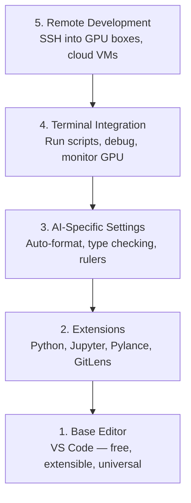

# Düzenleyici Kurulum

> Editörünüz sizin ortakınızdır. Bir kere ayarlayın, bir daha sorun çıkarmasın ve gerçek bir etki yaratmaya başlasın.

**Type:** Build
**Languages:** --
**Prerequisites:** Phase 0, Lesson 01
**Time:** ~20 分钟

## Öğrenme hedefi
- VS Code'u yükle, Python、Jupyter、linting ve uzak SSH'nin gerekli çekirdek uzantıları yapılandır
- AI iş akışları için  format-on-save yapılandırma ]], tip kontrolü ve notbuk çıkışını kaydırma
- Configuration Remote SSH, edit local code gibi uzaktan GPU 机器上编辑和调试 代码
- 评估其他编辑器选择(Cursor、Windsurf、Neovim) ve onların AI çalışmalarındaki tercihleri

## 问题
Editörde binlerce saat harcayacaksınız: Python'u yazmak, not defterleri çalıştırmak, defekt etme eğitim döngüleri, SSH'ye GPU makineleri gibi.

Doğru ayarlama sadece 20 dakika sürer. Atlamak her gün 20 dakika kaybeder.

## 概念
AI mühendisliği editör konfigürasyonu beş şey gerektirir:




```figure
s0-lsp-roundtrip
```

## Yapın onu.
### 步骤 1: VS Kodı yükle

推使用 VS Code──它免费──可在所有OS上运行──对Jupyter notebook有一流支持,并且扩展生态覆盖所有AI工作所需的一切──

- Evet .[code.visualstudio.com](https://code.visualstudio.com/)Aşağıya.

Terminal Central Test:

```bash
code --version
```

Eğer macOS 上找不到 `code`,打开 VS Code,按 `Cmd+Shift+P`,输入 "Shell Command", sonra "PATH'de 'kod' komutunu yükle" seçin.

### 步骤 2:安装必要扩展

VS Code içinde açılmış terminal`Ctrl+`` `Ya da `` Cmd+```), ヽ ヽ ヽ ヽ ヽ ヽ ヽ ヽ ヽ ヽ ヽ ヽ ヽ ヽ ヽ ヽ ヽ ヽ ヽ ヽ ヽ ヽ ヽ ヽ ヽ ヽ ヽ ヽ ヽ ヽ ヽ ヽ ヽ ヽ ヽ ヽ ヽ ヽ ヽ ヽ ヽ ヽ ヽ ヽ ヽ ヽ ヽ ヽ ヽ ヽ ヽ ヽ ヽ ヽ ヽ ヽ ヽ ヽ ヽ ヽ ヽ ヽ ヽ ヽ ヽ ヽ ヽ ヽ ヽ ヽ ヽ ヽ                                                                                                                                                                                                                                                                                                                                                                          

```bash
code --install-extension ms-python.python
code --install-extension ms-python.vscode-pylance
code --install-extension ms-toolsai.jupyter
code --install-extension eamodio.gitlens
code --install-extension ms-vscode-remote.remote-ssh
code --install-extension ms-python.debugpy
code --install-extension ms-python.black-formatter
code --install-extension charliermarsh.ruff
```

Her bir uzatma etkisi:

| Extension | Why |
|-----------|-----|
| Python | Language 支持、virtual env 检测、run/debug |
| Pylance | 快速 type checking、autocomplete、import resolution |
| Jupyter | 在 VS Code 内运行 notebooks、variable explorer |
| GitLens | 查看谁改了什么、inline git blame |
| Remote SSH | 像本地一样打开远程 GPU 机器上的文件夹 |
| Debugpy | Python 的 step-through debugging |
| Black Formatter | 保存时自动格式化，保持风格一致 |
| Ruff | 快速 linting，捕获常见错误 |

本课中 `code/.vscode/extensions.json`文件包含完整推列表──当你打开项目文件时,VS Code 会提示你安装它们──

### 步骤 3: yapılandırma ayarları

复制本课 `code/.vscode/settings.json`İç ayarlar veya geçiş yoluyla`Settings > Open Settings (JSON)`Ellemel uygulama.

AI çalışmalarının anahtar ayarları:

```jsonc
{
    "python.analysis.typeCheckingMode": "basic",
    "editor.formatOnSave": true,
    "editor.rulers": [88, 120],
    "notebook.output.scrolling": true,
    "files.autoSave": "afterDelay"
}
```

Neden bunlar çok önemli:

- **Type checking on basic**Çeviri:                                                                                                                                                                                                                                                             
- **Format on save**Şekilleme: artık düşünmeliyim.
- **Rulers at 88 and 120**: Black 在 88 处换行──120 标记显示 docstrings 和 comments 什么时候过长──
- **Notebook output scrolling**Eğitim döngüleri, binlerce satır basılacak.
- **Auto-save**Bu durumdan kaçınmak için otomatik olarak kurtarmak gerekir.

### 步骤 4: Terminal 集成

VS Code'un entegre terminalı, eğitim senaryolarını yürütmek, GPU'ları denetlemek, ortamları yönetmek için yerlerdir.

Doğru ayar:

```jsonc
{
    "terminal.integrated.defaultProfile.osx": "zsh",
    "terminal.integrated.defaultProfile.linux": "bash",
    "terminal.integrated.fontSize": 13,
    "terminal.integrated.scrollback": 10000
}
```

Kullanılabilir hızlı anahtar:

| Action | macOS | Linux/Windows |
|--------|-------|---------------|
| Toggle terminal | `` Ctrl+` `` | `` Ctrl+` `` |
| New terminal | `Ctrl+Shift+`` ` | `Ctrl+Shift+`` ` |
| Split terminal | `Cmd+\` | `Ctrl+\` |

Bölünmüş terminaller  çok yararlı: biri senaryoyu çalıştırmak için, diğeri kullanmak için `nvidia-smi -l 1`Ya da`watch -n 1 nvidia-smi`- Kontrol GPU.

### 步骤 5:远程开发(SSH to GPU 机器)

Bu AI çalışması en önemli uzantısı. Uzantı makinelerinde çalışacaklar.

Yapılandırma:

1. Install Remote SSH uzantısı ((已在步骤 2 完成)
2. 按 `Ctrl+Shift+P`(Yada `Cmd+Shift+P`),输入 "Uzak-SSH: Host'a Bağlantı"。
3. 输入 `user@your-gpu-box-ip`- Evet.
4. VS Code otomatik olarak uzak bir makineye sunucu bileşenini yükler.

Şifresiz erişim gerekirse, SSH anahtarlarını yapılandırın:

```bash
ssh-keygen -t ed25519 -C "your-email@example.com"
ssh-copy-id user@your-gpu-box-ip
```

为了方便,把主播 添加到 `~/.ssh/config`- ...

```
Host gpu-box
    HostName 203.0.113.50
    User ubuntu
    IdentityFile ~/.ssh/id_ed25519
    ForwardAgent yes
```

Şimdi .`Remote-SSH: Connect to Host > gpu-box`Hemen bağlantı kurmak istiyorum.

## Alternatifler

### Kursor

[cursor.com](https://cursor.com)Bu, aynı uzantıyı kullanıyor, ortam ve ayarları biçimi kullanıyor. Cursor kullanıyorsanız, bu dersin tüm içeriği hala uygundur.`settings.json`和 `extensions.json`- Evet.

### Rüzgar sürfi

[windsurf.com](https://windsurf.com)Bu durum aynıdır: Aynı uzantılar, aynı ayarlar, aynı uzak SSH desteği.

### Vim/Neovim

Eğer Vim veya Neovim kullanıyorsanız ve verimlilik çok yüksek ise, AI Python çalışmasının en düşük konfigürasyonunu kullanmaya devam edin:

- **pyright**Ya da**pylsp**Tip kontrolü için kullanılır.
- **nvim-lspconfig**Dil sunucu entegrasyonu için
- **jupyter-vim**Ya da**molten-nvim**Not defteri gibi çalıştırma için kullanılır
- **telescope.nvim**Dosya/simbol arama için kullanılır
- **none-ls.nvim**搭配 black 和 ruff biçimlendirme/kısımlandırma için kullanılır

Eğer Vim'i kullanmamışsanız, şimdi başlamayın.

## Kullan
Bu ayarlama ile günlük iş akışınız şöyle görünüyor:

1. VS Code içinde projenin klasörünü açın (or Remote SSH connect to GPU 机器)
2. Editorside Python'u düzenlemek, otomatik tamamlama, tip ipuçları ve iç hatalı hatalar kullanmak.
3. İnternetde kullanılıyor.
4. İntegrasyonlu terminal kullanın.`uv pip install`Ve GPU izleme.
5. GitLens inceleme değişiklikleri gönderir.

## 练习
1. VS Kod ve Adım 2 İçinde listelenen tüm uzantılar
2. Sınıfı`settings.json`复制到你的 VS kod yapılandırması 中
3. Bir Python dosyası aç, Python'u doğrulay, Tip ipucu göster ve Black 会在保存时格式化
4. Uzaktan bir makineye erişebilirseniz, Uzak SSH'yi yapılandırın ve üzerindeki bir dosyayı açın.

## 关键术语
| Term | What people say | What it actually means |
|------|----------------|----------------------|
| LSP | "Autocomplete engine" | Language Server Protocol：一种标准，让 editors 可以从特定 language 的 server 获取 type info、completions 和 diagnostics |
| Pylance | "The Python plugin" | Microsoft 的 Python language server，使用 Pyright 进行 type checking 和 IntelliSense |
| Remote SSH | "Working on the server" | VS Code extension，在远程机器上运行轻量 server，并将 UI stream 到本地 editor |
| Format on save | "Auto-prettier" | 每次保存时 editor 都会运行 formatter（Black、Ruff），因此 code style 始终一致 |
