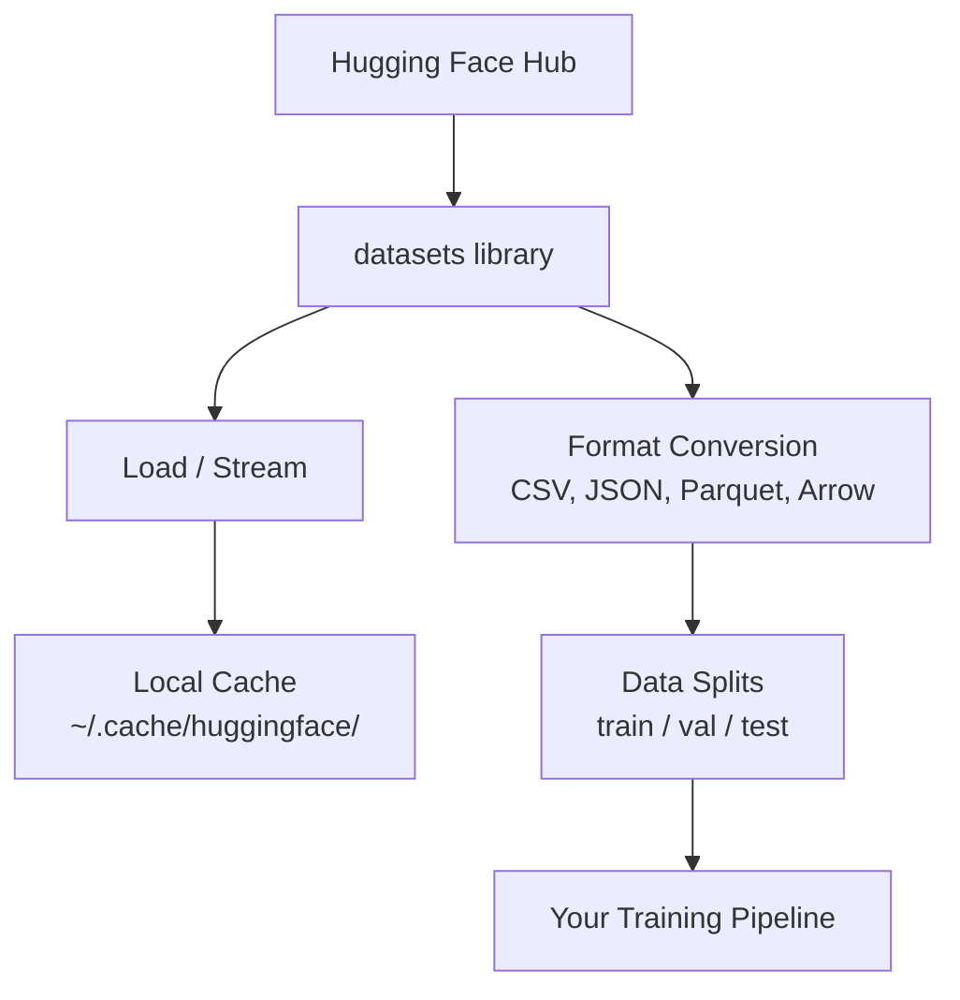

# Veriler Yönetimi

> Veriler yakıt. Nasıl yönetilirse, daha hızlı gideceğine karar verir.

**Type:** Build
**Language:**Python
**Prerequisites:** Phase 0, Lesson 01
**Time:** ~45 分钟

## Öğrenme hedefi
- Üstünü kucaklayan bir yüz kullan `datasets`kütüphanesi yükleme, akış ve önbelleğe veri kümeleri
- CSV、JSON、Parquet ve Arrow formatları arasında dönüşüm ve onların değişimini açıklamak
- Use fixed random seeds 创建可复现的火车/验证/测试分区
- Kullanım`.gitignore`、Git LFS veya DVC 管理大型模型 和数据集 dosyaları

## 问题
Her AI projesi verilerden  başlıyor. Veriler kümelerini bulmalısın. Onları indirmelisin. Formattar arasında dönüştürülsün.

## 概念


Sarılan Yüz`datasets`Kütüphane, AI için çalışmaktadır. Veri yüklemenin standart yolu.


```figure
s0-data-pipeline
```

## Yapın onu.
### 步骤 1: Veritabeleri kur

```bash
pip install datasets huggingface_hub
```

### 步骤 2: Veriler kümesini yükle

```python
from datasets import load_dataset

dataset = load_dataset("imdb")
print(dataset)
print(dataset["train"][0])
```

Bu, IMDB'nin ilk indirimi sonrasında,`~/.cache/huggingface/datasets/`- Ne? - Evet.

### 步骤 3: 流式处理大型数据集

Bazı veri kümeleri çok büyüktür, disk içine tam olarak yerleştiremez.

```python
dataset = load_dataset("wikimedia/wikipedia", "20220301.en", split="train", streaming=True)

for i, example in enumerate(dataset):
    print(example["title"])
    if i >= 4:
        break
```

Akış sana bir tane verecek .`IterableDataset` You will be in rows until you arrive at time processing them                                                                                                                                                                                                                                                       

### 步骤 4: Veri kümesi biçimleri

`datasets`Kütüphanenin alt katı Apache Arrow kullanıyor.

```python
dataset = load_dataset("imdb", split="train")

dataset.to_csv("imdb_train.csv")
dataset.to_json("imdb_train.json")
dataset.to_parquet("imdb_train.parquet")
```

Format karşılaştırması:

| Format | Size | Read Speed | Best For |
|--------|------|-----------|----------|
| CSV | 大 | 慢 | Human readability、spreadsheets |
| JSON | 大 | 慢 | APIs、nested data |
| Parquet | 小 | 快 | Analytics、columnar queries |
| Arrow | 小 | 最快 | In-memory processing（`datasets` 内部使用的格式） |

AI çalışması için,Parquet en iyi depolama biçimidir. Arrow ise, birbiriyle değişmek için kullanılan bir bellekteki biçimdir.

### 步骤 5: Veriler bölünüyor

Her bir ML projesi üç bölüme ihtiyaç duyar:

- **Train**:model buradan öğrenmek (normalde %80)
- **Validation**:                                                                                                                                                                                                                                                               
- **Test**: eğitim 完成后的最终评估 (genellikle %10)

Bazı veri kümeleri 已预先分割──没有时,自己分割:

```python
dataset = load_dataset("imdb", split="train")

split = dataset.train_test_split(test_size=0.2, seed=42)
train_val = split["train"].train_test_split(test_size=0.125, seed=42)

train_ds = train_val["train"]
val_ds = train_val["test"]
test_ds = split["test"]

print(f"Train: {len(train_ds)}, Val: {len(val_ds)}, Test: {len(test_ds)}")
```

始终设置种子以保证复制性──同种子每次都产生相同的分裂──

### 步骤 6: 下载并缓存模型

Modeller büyük bir dosyadır.`huggingface_hub`Kitaplık 会处理 downloading 和 caching──

```python
from huggingface_hub import hf_hub_download, snapshot_download

model_path = hf_hub_download(
    repo_id="sentence-transformers/all-MiniLM-L6-v2",
    filename="config.json"
)
print(f"Cached at: {model_path}")

model_dir = snapshot_download("sentence-transformers/all-MiniLM-L6-v2")
print(f"Full model at: {model_dir}")
```

Modeller gizli kalır .`~/.cache/huggingface/hub/`下载一次后后后续运行会立即加载──

### Adım 7: Büyük dosyaları işleme

Model ağırlıkları ve büyük veri kümeleri git'e girmemelidir.

**Option A: .gitignore（最简单）**

```
*.bin
*.safetensors
*.pt
*.onnx
data/*.parquet
data/*.csv
models/
```

**Option B: Git LFS（在 git 中跟踪大型文件）**

```bash
git lfs install
git lfs track "*.bin"
git lfs track "*.safetensors"
git add .gitattributes
```

Git LFS, repo'nun depolama göstergeleri içinde gerçek dosyaları ayrı bir sunucuda depolayacaktır. GitHub 1 GB ücretsiz miktar sağlayacaktır.

**Option C: DVC（data version control）**

```bash
pip install dvc
dvc init
dvc add data/training_set.parquet
git add data/training_set.parquet.dvc data/.gitignore
git commit -m "Track training data with DVC"
```

DVC 会创建小型 `.dvc`文件, point towards your data──Data 本身存储在S3、GCS或其他远程存储后端中──

| Approach | Complexity | Best For |
|----------|-----------|----------|
| .gitignore | 低 | 个人项目、可重新获取的 downloaded data |
| Git LFS | 中 | 通过 git 共享 model weights 的团队 |
| DVC | 高 | 可复现 experiments、大型 datasets、团队 |

Bu ders için,`.gitignore`已足够──当你需要跨机器复现精确实实验时,再使用DVC──

### 步骤 8: Depolama kalıpları

**Local storage**                                                                                                                                                                                                                                                                                                                                                                                                                                                                                                                             

**Cloud storage** Daha büyük içerik için uygundur veya bir cihaz üzerinden paylaşım yapılması gereken içerik:

```python
import os

local_path = os.path.expanduser("~/.cache/huggingface/datasets/")

# s3_path = "s3://my-bucket/datasets/"
# gcs_path = "gs://my-bucket/datasets/"
```

DVC doğrudan S3 ve GCS ile 集成 edilebilir:

```bash
dvc remote add -d myremote s3://my-bucket/dvc-store
dvc push
```

对于本课程,本地存储 足够──云存储会在您的远程GPU实例上调时变得相关──

## Bu ders kullanımı

| Dataset | Lessons | Size | What It Teaches |
|---------|---------|------|----------------|
| IMDB | Tokenization、classification | 84 MB | Text classification 基础 |
| WikiText | Language modeling | 181 MB | Next-token prediction |
| SQuAD | QA systems | 35 MB | Question answering、spans |
| Common Crawl (subset) | Embeddings | 不定 | Large-scale text processing |
| MNIST | Vision basics | 21 MB | Image classification fundamentals |
| COCO (subset) | Multimodal | 不定 | Image-text pairs |

Şimdi bunları indirmek zorunda değilsin. Her ders ne istediğini açıklayacak.

## Kullan
运行 Utilities script 验证一切正常:

```bash
python code/data_utils.py
```

Küçük bir veri kümesi indirir, onu dönüştürür, ayırır, özetini basır.

## - Söyle.
本课产 出:
- `code/data_utils.py`- Tekrar kullanılabilir veri yükleme ve önbelleğe alma aracı
- `outputs/prompt-data-helper.md`- Uygun bir veri kümesi bulmak için kullanılır .

## 练习
1. Kullanım`mrpc`yükleme yükleme`glue`Veriler kümesi,并检查前 5 个例
2. Akım `c4`Veriler kümesi,并统计 10 秒内処理できる kaç örnek
3. Bir veri kümesini Parket olarak dönüştürmek ve dosya boyutunu CSV ile karşılaştırmak
4. Use Fixed Seed 创建 70/15/15 tren/val/test split,并验证 boyutları

## 关键术语
| Term | What people say | What it actually means |
|------|----------------|----------------------|
| Dataset split | "Training data" | 一个命名 subset（train/val/test），用于 ML lifecycle 的不同阶段 |
| Streaming | "Load it lazily" | 从远程 source 逐行处理 data，而不下载完整 dataset |
| Parquet | "Compressed CSV" | 一种 columnar file format，针对 analytical queries 和 storage efficiency 优化 |
| Arrow | "Fast dataframe" | `datasets` library 内部使用的 in-memory columnar format，用于 zero-copy reads |
| Git LFS | "Git for big files" | 一个 extension，将大型文件存储在 git repo 外，同时在 version control 中保留 pointers |
| DVC | "Git for data" | 一个用于 datasets 和 models 的 version control system，可与 cloud storage 集成 |
| Cache | "Already downloaded" | 之前获取过的 data 的本地副本，默认存储在 ~/.cache/huggingface/ |
