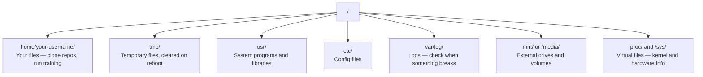

# 面向 AI's Linux

> Çoğu AI Linux'ta çalışıyor.

**类型：**Öğrenme
**语言：**- Ne ?
**先修要求：**Eğitim 0
**时间：**~ 30 dakika

## Öğrenme hedefi

- Linux dosya sistemini, emirden çıkartıp temel dosya işlemini gerçekleştir
- Kullanım`chmod`和 `chown`admin izinlerini yönetin, "İzin reddedildi" hatalarını çözmek için
- Kullanım`apt`Sistem paketlerini monte edin, yeni bir GPU kutu ayarlayın
- 识别 MacOS'tan Linux'a geçiş yaparken, geliştiriciler uzak bir makine üzerinde sık sık baskı yapıyor

## 问题

MacOS veya Windows'ta geliştirilmiştir. Ancak bir kez SSH'yi bulutlu GPU kutularına girdiğinde Lambda örneğini kiraladığında veya bir EC2 makinesi başlattığında, Ubuntu'ya gireceksin. Terminal senin tek arayüzün. Arayan yok, Explorer yok, GUI yok. Eğer dosya sistemini taramak için emirden geçemezsen, paketleri yüklemek için işlemleri yönetemezsen, bir kenara GPU'yu ödemeyi, bir kenara arama yaparak bir dosyayı Linux'ta nasıl açılacağını 🏻

Bu bir yaşam rehberi. Sadece uzaktan Linux makinelerinde AI'nin çalışmalarını yapmak için gereken içeriği kapsar.

## Dosya Sistemi 布局

Linux her şeyi tek bir kökende organize eder.`/`Aşağıda yok.`C:\`Ya da`/Volumes`你实际会接触的目录:



Ev dizinin var.`~`Ya da`/home/your-username`Neredeyse her şey burada oluyor.

## İzle

Aşağıdaki 15 komut, uzaktan GPU kutusunun %95'ini kapsar.

### 移动位置

```bash
pwd                         # Where am I?
ls                          # What's here?
ls -la                      # What's here, including hidden files with details?
cd /path/to/dir             # Go there
cd ~                        # Go home
cd ..                       # Go up one level
```

### 文件和目录

```bash
mkdir my-project            # Create a directory
mkdir -p a/b/c              # Create nested directories in one shot

cp file.txt backup.txt      # Copy a file
cp -r src/ src-backup/      # Copy a directory (recursive)

mv old.txt new.txt          # Rename a file
mv file.txt /tmp/           # Move a file

rm file.txt                 # Delete a file (no trash, it's gone)
rm -rf my-dir/              # Delete a directory and everything inside
```

`rm -rf`Bu yollar daimdir.

### 读取文件

```bash
cat file.txt                # Print entire file
head -20 file.txt           # First 20 lines
tail -20 file.txt           # Last 20 lines
tail -f log.txt             # Follow a log file in real time (Ctrl+C to stop)
less file.txt               # Scroll through a file (q to quit)
```

### Arama

```bash
grep "error" training.log           # Find lines containing "error"
grep -r "learning_rate" .           # Search all files in current directory
grep -i "cuda" config.yaml          # Case-insensitive search

find . -name "*.py"                 # Find all Python files under current dir
find . -name "*.ckpt" -size +1G     # Find checkpoint files larger than 1GB
```

## İzinler

Linux'taki her dosyanın sahibi ve izin bitleri vardır. Yazı yazı yazılarını yerine getiremiyorsanız ya da bir dizinin içine yazamadığınızda bu soruna rastlanırsınız.

```bash
ls -l train.py
# -rwxr-xr-- 1 user group 2048 Mar 19 10:00 train.py
#  ^^^             owner permissions: read, write, execute
#     ^^^          group permissions: read, execute
#        ^^        everyone else: read only
```

常见修复方式:

```bash
chmod +x train.sh           # Make a script executable
chmod 755 deploy.sh         # Owner: full, others: read+execute
chmod 644 config.yaml       # Owner: read+write, others: read only

chown user:group file.txt   # Change who owns a file (needs sudo)
```

Bir yerde "Izin reddedildi" diye söylendiğinde, neredeyse her zaman izinler sorunu vardır.`chmod +x`Ya da`sudo`Çoğu durumu düzeltebilirim.

## Paket Yönetimi (apt)

Ubuntu kullan `apt` Sistem düzeyinde yazılım kurma şekli.

```bash
sudo apt update             # Refresh the package list (always do this first)
sudo apt install -y htop    # Install a package (-y skips confirmation)
sudo apt install -y build-essential  # C compiler, make, etc. Needed by many Python packages
sudo apt install -y tmux    # Terminal multiplexer (keep sessions alive after disconnect)

apt list --installed        # What's installed?
sudo apt remove htop        # Uninstall
```

Yeni GPU kutuda yüklenen paketler:

```bash
sudo apt update && sudo apt install -y \
    build-essential \
    git \
    curl \
    wget \
    tmux \
    htop \
    unzip \
    python3-venv
```

## Kullanıcılar 和 sudo

Genellikle normal kullanıcı 登录── bazı işlemler root admin 权限──

```bash
whoami                      # What user am I?
sudo command                # Run a single command as root
sudo su                     # Become root (exit to go back, use sparingly)
```

Bulut GPU durumlarında, genellikle tek kullanıcısınız ve zaten sudo erişiminiz var.

## İşlemler ve sistem

Eğitim yapılırken, ya da çalışmakta olan içeriği kontrol etmeniz gerektiğinde:

```bash
htop                        # Interactive process viewer (q to quit)
ps aux | grep python        # Find running Python processes
kill 12345                  # Gracefully stop process with PID 12345
kill -9 12345               # Force kill (use when graceful doesn't work)
nvidia-smi                  # GPU processes and memory usage
```

Sistem yönetim hizmetleri, arka plan şeytanları. Eğer bir sonuç sunucusu kullanıyorsan, kullanırsın.

```bash
sudo systemctl start nginx          # Start a service
sudo systemctl stop nginx           # Stop it
sudo systemctl restart nginx        # Restart it
sudo systemctl status nginx         # Check if it's running
sudo systemctl enable nginx         # Start automatically on boot
```

## 磁盘空间

GPU kutularının disk alanı genellikle sınırlıdır.

```bash
df -h                       # Disk usage for all mounted drives
df -h /home                 # Disk usage for /home specifically

du -sh *                    # Size of each item in current directory
du -sh ~/.cache             # Size of your cache (pip, huggingface models land here)
du -sh /data/checkpoints/   # Check how big your checkpoints are

# Find the biggest space hogs
du -h --max-depth=1 / 2>/dev/null | sort -hr | head -20
```

常见省空间方式:

```bash
# Clear pip cache
pip cache purge

# Clear apt cache
sudo apt clean

# Remove old checkpoints you don't need
rm -rf checkpoints/epoch_01/ checkpoints/epoch_02/
```

## Ağlama

Emir yolundan model indir, dosya aktar, API'yi kullan.

```bash
# Download files
wget https://example.com/model.bin                   # Download a file
curl -O https://example.com/data.tar.gz              # Same thing with curl
curl -s https://api.example.com/health | python3 -m json.tool  # Hit an API, pretty-print JSON

# Transfer files between machines
scp model.bin user@remote:/data/                     # Copy file to remote machine
scp user@remote:/data/results.csv .                  # Copy file from remote to local
scp -r user@remote:/data/checkpoints/ ./local-dir/   # Copy directory

# Sync directories (faster than scp for large transfers, resumes on failure)
rsync -avz --progress ./data/ user@remote:/data/
rsync -avz --progress user@remote:/results/ ./results/
```

 Büyük bir nakliye için öncelik kullanımı `rsync`Hayır.`scp`                                                                                                                                                                                                                                                              

## tmux:保持 Sessions 存活

Uzak kutuya gelince, dizüstü bilgisayarla birlikte çalışırsan, antrenmanın devam etmesini sağlayacaksın.

```bash
tmux new -s train           # Start a new session named "train"
# ... start your training, then:
# Ctrl+B, then D            # Detach (training keeps running)

tmux ls                     # List sessions
tmux attach -t train        # Reattach to session

# Inside tmux:
# Ctrl+B, then %            # Split pane vertically
# Ctrl+B, then "            # Split pane horizontally
# Ctrl+B, then arrow keys   # Switch between panes
```

长时间训练任务总是放在tmux 里运行――总是如此――

## Windows kullanıcılarının WSL2

Windows'ta ise, WSL2 gerçek bir Linux ortamı sağlayabilir.

```bash
# In PowerShell (admin)
wsl --install -d Ubuntu-24.04

# After restart, open Ubuntu from Start menu
sudo apt update && sudo apt upgrade -y
```

WSL2 运行真实Linux kernel──本课中的所有内容都能在其中工作──从 WSL 内部看,你的Windows文件 位于 `/mnt/c/Users/YourName/`- Evet.

GPU geçiş yoluyla 需要 Windows 侧安装 NVIDIA sürücüleri──安装 Windows NVIDIA sürücü(Linux sürücü değil),CUDA 就会在 WSL2 内可用──

## MacOS'a Linux'a

Eğer macOS'tan gelirsen, bu şeyler sana kalır:

| macOS | Linux | 说明 |
|-------|-------|-------|
| `brew install` | `sudo apt install` | package names 有时不同。`brew install htop` 和 `sudo apt install htop` 效果相同，但 `brew install readline` 和 `sudo apt install libreadline-dev` 不同。 |
| `open file.txt` | `xdg-open file.txt` | 但远程 box 上通常没有 GUI。使用 `cat` 或 `less`。 |
| `pbcopy` / `pbpaste` | 不可用 | SSH 上不存在 pipe 到/来自 clipboard 的能力。 |
| `~/.zshrc` | `~/.bashrc` | macOS 默认使用 zsh。大多数 Linux servers 使用 bash。 |
| `/opt/homebrew/` | `/usr/bin/`, `/usr/local/bin/` | Binaries 位于不同位置。 |
| `sed -i '' 's/a/b/' file` | `sed -i 's/a/b/' file` | macOS sed 需要在 `-i` 后加一个空字符串。Linux 不需要。 |
| Case-insensitive filesystem | Case-sensitive filesystem | 在 Linux 上，`Model.py` 和 `model.py` 是两个不同文件。 |
| Line endings `\n` | Line endings `\n` | 相同。但 Windows 使用 `\r\n`，会破坏 bash scripts。运行 `dos2unix` 修复。 |

## 快速参考卡

```
Navigation:     pwd, ls, cd, find
Files:          cp, mv, rm, mkdir, cat, head, tail, less
Search:         grep, find
Permissions:    chmod, chown, sudo
Packages:       apt update, apt install
Processes:      htop, ps, kill, nvidia-smi
Services:       systemctl start/stop/restart/status
Disk:           df -h, du -sh
Network:        curl, wget, scp, rsync
Sessions:       tmux new/attach/detach
```


```figure
s0-process-fork
```

## 练习

1. SSH herhangi bir Linux makinesine ((( veya WSL2 aç), ve gidilen ev dizinine.`touch`Üç boş dosya oluşturup kullan.`ls -la`Onları listelemek.
2. Uzal apt `htop`En çok hafıza kullanan süreçleri bul.
3. Tmux seansı başlatın, içinde çalışın `sleep 300`Ayrıl, ayrılma seansları, sonra tekrar bağlan.
4. Kullanım`df -h`检查可用磁盘空间, sonra kullan `du -sh ~/.cache/*`找出 cache 中占空间的内容──
5. Kullanım`scp`Bir dosyayı yerel makineden uzaktan makinelere aktarıp kullanın.`rsync`Aynı şekilde aktarım yapın, ve deneyim karşılaştırın.
