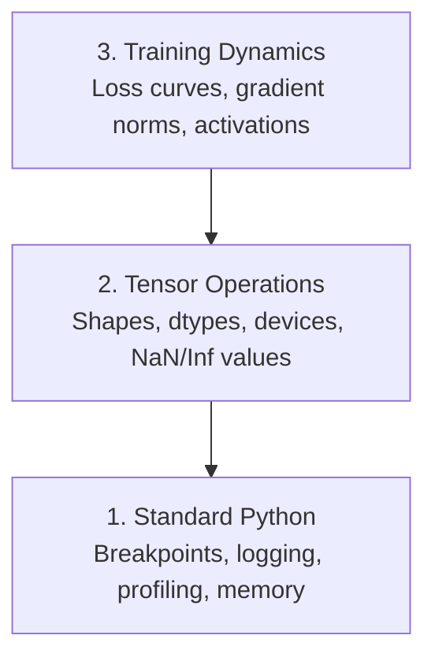

# Çözüm ve Profilleme

> En kötü AI böcekleri çökmez. Onlar gizlice çöp verileri üzerinde eğitim alır ve güzel bir kayıp eğri rapor ederler.

**类型：**Yapım
**语言：**Python
**先修要求：**Ders 1 ((Dev Environment), temel PyTorch 熟悉度
**时间：**~ 60 dakika

## Öğrenme hedefi

- İşe yarayan şartlar`breakpoint()`和 `debug_print`Eğitim sırasında, tensör şekilleri, türleri ve NaN değerlerini kontrol et.
- Kullanım`cProfile`- Evet.`line_profiler`和 `tracemalloc`Profil  eğitim döngüsü, şişe boğazları bulmak
- 检测常见 AI hataları: şekil eşleşmezliği, NaN kaybı, veri sızması ve yanlış cihaz tenzorları
- setting TensorBoard 来可视化损失曲線、重量 histograms 和梯度 dağılımları

## 问题

AI kodunun başarısız olması normal kodlardan farklıdır. Web uygulaması, bir yığın izleri ile 崩── yapılandırma hatası eğitim döngüsü, 8 saat sürecek, 200 dolarlık GPU  zamanı yakıp sonra her giriş için bir ortalama tahmin modeli üretir.`.detach()`Etiketler  Ayrıntılı özellikler 

Bu sessizlik başarısızlığında zamanınızı ve hesaplarınızı harcamak için debugging araçlarına ihtiyacınız var.

## 概念

AI debugging üç kat seviyeye ayrılmıştır:



Çoğu insan doğrudan 3. katı atlar. Ama AI hatalarının %80'i 1. ve 2. katlarda yer almaktadır.


```figure
s0-flame-hot
```

## Yapın onu.

### Bölüm 1: Baskı Debugging ((是的,它有效)

Yazım düzeltme  sık sık hafife alınır. Fakat bu doğru değildir. Tansor kodu için, bir hedeflenmiş yazım ifade 往往胜越逐步调试器, çünkü şekil, tür ve değer aralıklarını bir kez görmeniz gerekir.

```python
def debug_print(name, tensor):
    print(f"{name}: shape={tensor.shape}, dtype={tensor.dtype}, "
          f"device={tensor.device}, "
          f"min={tensor.min().item():.4f}, max={tensor.max().item():.4f}, "
          f"mean={tensor.mean().item():.4f}, "
          f"has_nan={tensor.isnan().any().item()}")
```

Bu işlemden sonra, bu hatları kaldırın.

### Bölüm 2: Python Debugger ((pdb 和 breakpoint)

İçeride yapılan hatalar AI'de düşük değerlendirilmiştir.`breakpoint()`放入训练循环,并交互式检查门子──

```python
def training_step(model, batch, criterion, optimizer):
    inputs, labels = batch
    outputs = model(inputs)
    loss = criterion(outputs, labels)

    if loss.item() > 100 or torch.isnan(loss):
        breakpoint()

    loss.backward()
    optimizer.step()
```

Çözücü durduğunda kullanışlı komutlar:

- `p outputs.shape`检查 şekilleri
- `p loss.item()`查看 Kayıp değeri
- `p torch.isnan(outputs).sum()`统计 NaN
- `p model.fc1.weight.grad`检查 gradientleri
- `c`继续,`q`Çıkış

Bu şartlı düzeltme. Sadece görünüşte durmak için değil. 10.000 adımlı bir eğitim için bu önemli bir noktaya sahip.

### Bölüm 3: Python Kayıtlama

Çözümleme yaparken 超出快速检查范围时, logging kullanın 印刷 açıklamalarını değiştirin。

```python
import logging

logging.basicConfig(
    level=logging.INFO,
    format="%(asctime)s [%(levelname)s] %(message)s",
    handlers=[
        logging.FileHandler("training.log"),
        logging.StreamHandler()
    ]
)
logger = logging.getLogger(__name__)

logger.info("Starting training: lr=%.4f, batch_size=%d", lr, batch_size)
logger.warning("Loss spike detected: %.4f at step %d", loss.item(), step)
logger.error("NaN loss at step %d, stopping", step)
```

Logging  tempo stempelleri  şiddet seviyeleri 和 dosya çıkışı sağlar.

### Bölüm 4: Çevre zamanları

Zamanın nerede geçeceğini bilmek, iyileşmenin ilk adımıdır.

```python
import time

class Timer:
    def __init__(self, name=""):
        self.name = name

    def __enter__(self):
        self.start = time.perf_counter()
        return self

    def __exit__(self, *args):
        elapsed = time.perf_counter() - self.start
        print(f"[{self.name}] {elapsed:.4f}s")

with Timer("data loading"):
    batch = next(dataloader_iter)

with Timer("forward pass"):
    outputs = model(batch)

with Timer("backward pass"):
    loss.backward()
```

常见发现: veri yüklenmesi 訓練時間の 60% ̊ını oluşturuyor.`num_workers > 0`Daha hızlı GPU'lar değil.

### Bölüm 5: cProfile 和 line_profiiler

Eğer manuel zamanlamalara daha fazla bilgi ihtiyacınız varsa:

```bash
python -m cProfile -s cumtime train.py
```

Bu, her fonksiyon çağrısını gösterir ve toplu zaman 排序── if to go by-profile:

```bash
pip install line_profiler
```

```python
@profile
def train_step(model, data, target):
    output = model(data)
    loss = F.cross_entropy(output, target)
    loss.backward()
    return loss

# Run with: kernprof -l -v train.py
```

### Bölüm 6: Hatıra Profili

#### Tracemalloc kullan 查看 CPU belleği

```python
import tracemalloc

tracemalloc.start()

# your code here
model = build_model()
data = load_dataset()

snapshot = tracemalloc.take_snapshot()
top_stats = snapshot.statistics("lineno")
for stat in top_stats[:10]:
    print(stat)
```

#### 使用 memory_profiler 查看 CPU belleği

```bash
pip install memory_profiler
```

```python
from memory_profiler import profile

@profile
def load_data():
    raw = read_csv("data.csv")       # watch memory jump here
    processed = preprocess(raw)       # and here
    return processed
```

Kullan .`python -m memory_profiler your_script.py`运行,以查看逐行 bellek kullanımı

#### PyTorch kullan 查看 GPU belleği

```python
import torch

if torch.cuda.is_available():
    print(torch.cuda.memory_summary())

    print(f"Allocated: {torch.cuda.memory_allocated() / 1e9:.2f} GB")
    print(f"Cached: {torch.cuda.memory_reserved() / 1e9:.2f} GB")
```

- Ne? - Ne? - Ne?

1. 减小批量量 (永远是第一个要尝试的)
2. Kullanım`torch.cuda.empty_cache()`释放 Önbelleğe alınmış hafıza
3. Büyük ortalamalara`del tensor`, sonra调用`torch.cuda.empty_cache()`
4. Miş prece kullanın`torch.cuda.amp`) hafıza kullanımı  azaldır
5. Çok derin modeller için gradient kontrol noktası kullanın

### Bölüm 7: 常见AI Böcekleri ve onları nasıl yakaladığını

#### Şekil Uymazlığı

En sık görülen böcek.`[batch, features]`, ama model 期望 `[batch, channels, height, width]`- Evet.

```python
def check_shapes(model, sample_input):
    print(f"Input: {sample_input.shape}")
    hooks = []

    def make_hook(name):
        def hook(module, inp, out):
            in_shape = inp[0].shape if isinstance(inp, tuple) else inp.shape
            out_shape = out.shape if hasattr(out, "shape") else type(out)
            print(f"  {name}: {in_shape} -> {out_shape}")
        return hook

    for name, module in model.named_modules():
        hooks.append(module.register_forward_hook(make_hook(name)))

    with torch.no_grad():
        model(sample_input)

    for h in hooks:
        h.remove()
```

Bir örnek partiyle bir kez çalıştırılsın.

#### Kayıplar

Bir şey patladı.

- Öğrenme oranı 太高
- Gümrük kaybı
- 0 veya 0 log
- RNN Orta dereceler  Explosion

```python
def detect_nan(model, loss, step):
    if torch.isnan(loss):
        print(f"NaN loss at step {step}")
        for name, param in model.named_parameters():
            if param.grad is not None:
                if torch.isnan(param.grad).any():
                    print(f"  NaN gradient in {name}")
                if torch.isinf(param.grad).any():
                    print(f"  Inf gradient in {name}")
        return True
    return False
```

#### Veriler Sızdırılıyor

Test setinde %99 doğruluk elde etti.

```python
def check_data_leakage(train_set, test_set, id_column="id"):
    train_ids = set(train_set[id_column].tolist())
    test_ids = set(test_set[id_column].tolist())
    overlap = train_ids & test_ids
    if overlap:
        print(f"DATA LEAKAGE: {len(overlap)} samples in both train and test")
        return True
    return False
```

Ayrıca zamanlı sızıntıları kontrol etmek için: Using futur data prediction past── split 前先按时刻排序──

#### Yanlış Cihaz

Farklı cihazlarda (CPU vs GPU) olan tenzorlar çalıştırma saat hatalarına yol açar. Ama bazen bir tenzor CPU'da sessizce durur.

```python
def check_devices(model, *tensors):
    model_device = next(model.parameters()).device
    print(f"Model device: {model_device}")
    for i, t in enumerate(tensors):
        if t.device != model_device:
            print(f"  WARNING: tensor {i} on {t.device}, model on {model_device}")
```

### Bölüm 8: TensorBoard 基础

TensorBoard, eğitim sürecinde neler olduğunu gösterir.

```bash
pip install tensorboard
```

```python
from torch.utils.tensorboard import SummaryWriter

writer = SummaryWriter("runs/experiment_1")

for step in range(num_steps):
    loss = train_step(model, batch)

    writer.add_scalar("loss/train", loss.item(), step)
    writer.add_scalar("lr", optimizer.param_groups[0]["lr"], step)

    if step % 100 == 0:
        for name, param in model.named_parameters():
            writer.add_histogram(f"weights/{name}", param, step)
            if param.grad is not None:
                writer.add_histogram(f"grads/{name}", param.grad, step)

writer.close()
```

Başlat:

```bash
tensorboard --logdir=runs
```

Neyi dikkat etmelisin:

- **Loss 不下降**Öğrenme oranı  çok düşük, veya model mimarisi  sorun
- **Loss 剧烈震荡**Öğrenme oranı 太高
- **Loss 变成 NaN**: Sayısal dengesizlik ((See above of NaN 部分)
- **Train loss 下降，val loss 上升**Üstü takma:
- **Weight histograms 坍缩到零**Kayıp dereceler:
- **Gradient histograms 爆炸**: gradient kesim ihtiyacı

### Bölüm 9: VS Kod Debugger

交互式 debugging için, kullan `launch.json`配置 VS Kod:

```json
{
    "version": "0.2.0",
    "configurations": [
        {
            "name": "Debug Training",
            "type": "debugpy",
            "request": "launch",
            "program": "${file}",
            "console": "integratedTerminal",
            "justMyCode": false
        }
    ]
}
```

点击 gutter 设置 breakpoints──使用变量表 检查子属性──Debug Console 让你在执行中途运行任意Python表达式──

Bu, veri önceden işleme boru hattlarını adım adım görmek için çok yararlıdır, özellikle de her dönüşümün görmesini istiyorsanız.

## Kullan

Aşağıdaki debugging iş akışı çoğu AI hatalarını yakalayabilir:

1. **训练前**:用 örnek parti 运行 `check_shapes` Test giriş ve çıkış boyutları                                                                                                                                                                                                                                                                                                                                                                                                                                                                                                                    
2. **前 10 步**: Kayıplara, çıkışlara ve gradientlere`debug_print`                                                                                                                                                                                                                                                              
3. **训练期间**Bu nedenle, bu programın en iyi bir şekilde yapılması gereken bir şey var.
4. **出问题时**: 放置 在失败点 `breakpoint()`◊ 交互式检查テンсоറുകൾ──
5. **针对性能**:计时数据 loading、前进、后进通──若接近OOM,则个人资料内存──

## - Söyle.

运行 debugging toolkit senaryosu:

```bash
python phases/00-setup-and-tooling/12-debugging-and-profiling/code/debug_tools.py
```

- Bakın .`outputs/prompt-debug-ai-code.md`Bu, AI-süsekli hataları teşhis etmek için yardımcı olan bir ipucu.

## 练习

1. 运行  İşlem`debug_tools.py`, her bölümün çıkışını okuyun.  Modify dummy model  introduce a NaN 提示:在前行中除以零), observe detector 捕获它──
2. Kullanım`cProfile`Profil bir eğitim döngüsü, en yavaş fonksiyonu tanımlamak
3. Kullanım`tracemalloc`En fazla hafıza dağıtılan bölümlerin hangisi?
4. Basit bir eğitim çalışması için TensorBoard ayarlayın, model tanımlayın
5. Eğitim döngüsünde kullanın`breakpoint()`△ Debugger prompt'tan pratik yaparak  Tensor şekilleri, cihazları ve gradient değerlerini kontrol etmektedir.
