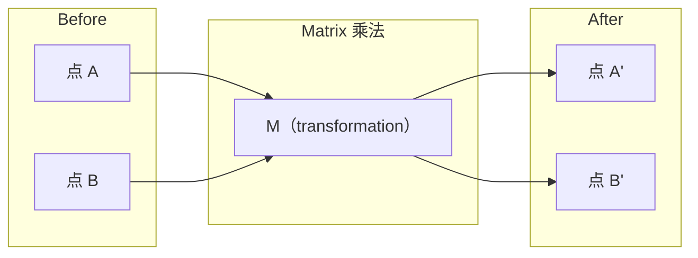
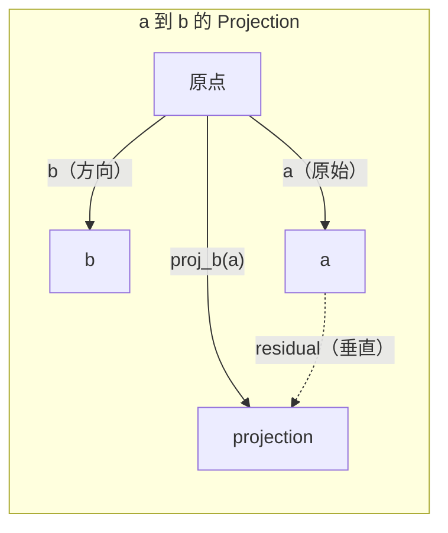

# Düzsel Cevab 直觉

> Her AI modeli sadece güzel bir şapka giydi.

**类型：**Öğrenme
**语言：**Python, Julia
**先修要求：**0 aşama
**时间：**~ 60 dakika

## Öğrenme hedefi

- Python'da ise, vektör ve matris 运算 (kafardot、 product、matrix çarpımı)
- Bir ürün projesi ve bir Gram-Schmidt süreci ne yapılır
- Kullanım Satır Kısıtlama 判断一组 Vektorların doğrusal bağımsızlığı、rank 和 tabanı
- Lineer Cevabı kavramını AI'de uygulamalar: yerleşim, dikkat puanları, LoRA ile bağlamak

## 问题

İlk sayfada, vektör, matris, nokta ürünü ve dönüşümünü göreceksin. Doğrudan da bunlar sadece simgeler.

Matematikçi olman gerekmiyor. Bu işlemlerin coğrafi anlamını görmen gerek. Sonra da onları kendi koduna yazman gerek.

## 概念

### vektörler 点 (点)

Vektör sadece bir sayı listesi. Ama bu sayıların anlamı vardır.

**2D Vector [3, 2]：**

| x | y | 点 |
|---|---|-------|
| 3 | 2 | 这个 Vector 从原点 (0,0) 指向平面上的 (3, 2) |

Bu vektörün büyüklüğü 为平方(3^2 + 2^2) =平方(13), yön yukarı ve sağ yönde。

Vector, AI'de her şeyi gösteriyor:
- Bir kelime → bir kelime içerir 768 个数字的矢量 (vidaylık 空间中的含义)
- Bir resim → Bir vektör milyonlarca resim değerinden oluşur
- Bir kullanıcı → bir gösterim tercih vektörü

### Matrisler dönüşümlerdir .

Matrix bir vektörü başka bir vektöre dönüştürür.



AI'de Matrix modelini şöyle anlatıyor:
- Nöral Ağ Ağ ağırlıkları → 输入 转换成输出的矩阵
- Dikkat puanları → karar vermek için neye dikkat etmesi gerekir
- Eklentiler → 将词映射到矢量的矩阵lar

### Dot Ürün 衡量相似性

İki vektörün nokta ürünü, birbirlerine çok benzer olduğunu söyler.

```
a · b = a₁×b₁ + a₂×b₂ + ... + aₙ×bₙ

方向相同：      a · b > 0  （相似）
相互垂直：      a · b = 0  （无关）
方向相反：      a · b < 0  （不相似）
```

İşte bu arama motorları, önerme sistemleri ve RAG'ın çalışma biçimi - nokta ürünü daha yüksek vektörleri bulmak.

### Düzsel Bağımsızlık

Eğer bir toplamda başka vektörlerin bir araya gelmesi olarak yazılabilecek herhangi bir vektör yoksa, bu vektörler doğrusal olarak bağımsızdır. Eğer v1、v2、v3 bağımsız ise, 3 boyutlu bir alan kapsar.

Bu, AI'nin önemi için önemlidir: Özellik matrisiniz  lineer olarak bağımsız sütunlar olmalıdır. Eğer iki özellik  tamamen ilişkili ise, model kendi etkisini ayırt edemez. Bu, Regresyon'da çok yönlü birliğe neden olur. Ağırlık matrisinin dengesizliği, girişlerin küçük değişiklikleri büyük bir kayıpla sonuçlanacaktır.

**具体示例：**

```
v1 = [1, 0, 0]
v2 = [0, 1, 0]
v3 = [2, 1, 0]   # v3 = 2*v1 + v2
```

v1 ve v2 bağımsızdır. İki tarafı da diğerlerinin bir diğerinin bir diğerinin bir diğerinin bir diğerinin bir diğerinin bir diğerinin bir diğerinin bir diğerinin bir diğerinin bir diğerinin bir diğerinin bir diğerinin bir diğerinin bir diğerinin bir diğerinin bir diğerinin bir diğerinin bir diğerinin bir diğerinin bir diğerinin bir diğerinin bir diğerinin bir diğerinin bir diğerinin bir diğerinin bir diğerinin bir diğerinin bir diğerinin bir diğerinin bir diğerinin bir diğerinin bir diğerinin bir diğerinin bir diğerinin bir diğerinin bir diğerinin bir diğerinin bir diğerinin bir diğerinin bir diğerinin bir diğerinin bir diğerinin bir diğerinin bir diğerinin bir diğerinin bir diğerinin bir diğerinin bir diğerinin bir diğerinin bir diğerinin bir diğerinin bir diğerinin bir diğerinin bir diğerinin bir diğerinin bir diğerinin bir diğerinin bir diğerinin bir diğerinin bir diğerinin bir diğerinin bir diğerinin bir diğerinin bir diğerinin bir diğerinin bir diğerinin bir diğerinin bir diğerinin bir diğerinin bir diğerinin bir diğerinin bir diğerinin bir diğerinin bir diğerinin bir diğerinin bir diğerinin birinin bir diğerinin bir diğerinin birinin bir diğerinin birinin bir diğerinin birinin birinin bir diğerinin birinin birinin bir diğerinin birinin birinin bir diğerinin birinin birinin birinin birinin bir diğerinin birinin birinin bir diğerinin birinin birinin birinin birinin birinin bir diğerinin birinin birinin birinin birinin birinin birinin bir diğerinin birinin birinin birinin birinin birinin bir diğerinin birinin birinin birinin birinin birinin bir diğerinin birinin birinin birinin birinin birinin birinin birinin birinin birinin birinin birinin ve diğerinin ve diğerinin ve diğerinin de diğerinin de diğerinin de diğerinin de diğerinin de diğerinin de diğerinin de diğerinin de diğerinin de diğerinin de diğerinin de diğerinin de diğerinin de diğerinin de diğerinin de diğerinin de diğerinin de diğerinin de diğerinin de diğerinin de sadece sadece iki ve diğerinin de sadece iki ve sadece iki ve sadece iki ve sadece iki özgürlükleri vardır.

Veriler kümesinde: Eğer feature_3 = 2*feature_1 + feature_2, join feature_3 model için herhangi bir yeni bilgi getirmez. Daha da kötüsü, normal denklemlerin tek başına dönüşmesini sağlar.

### Temel ve Rank

Temel, en küçük bir dizi çizgi bağımsız vektördür, bunlar tüm uzayı kapsarlar. Temel vektörlerin sayısı uzayın boyutudur.

3D 空间'ın standart temeli ise {1,0,0], [0,1,0], [0,0,1]}── ama 3D'deki herhangi üç bağımsız vektör, geçerli bir temel oluşturur.

Matrix'in rütbesi = doğrusal bağımsız sütunların sayısı = doğrusal bağımsız satırların sayısı── eğer rütbesi < min(satırlar, kollar) ise, bu Matrix = rütbesi eksik── bu da şöyle anlama gelir:
- Sistemin son derece çok çözümü var.
- dönüşüm İçinde kaybolmuş bilgi
- Matrix 不能被逆转

| 情况 | Rank | 对 ML 的含义 |
|-----------|------|---------------------|
| Full rank (rank = min(m, n)) | 最大可能值 | 存在唯一 least-squares solution。Model well-conditioned。 |
| Rank deficient (rank < min(m, n)) | 低于最大值 | Features 冗余。有无穷多个 weight solutions。需要 regularization。 |
| Rank 1 | 1 | 每一列都是某个 Vector 的缩放副本。所有数据都位于一条线上。 |
| Near rank-deficient（较小的 singular values） | 数值上较低 | Matrix ill-conditioned。极小的 input noise 会造成很大的 output changes。使用 SVD truncation 或 ridge regression。 |

### Proje

Vector**a**投影到 Vector **b**Üst, alacağım.**a**- Evet .**b**方向上的分量:

```
proj_b(a) = (a dot b / b dot b) * b
```

Geri kalan (a - proj_b(a)) b 垂直── bu ortogonal parçalanma en az kareye uygunluğun temelidir.

Projection 在 ML 中无处不在:
- Düzsel Geri Dönüşüm , sütun alanına en küçük gözlemler -- 解本身就是一个投影
- PCA , verileri en büyük değişikliğe doğru yansıtacak .
- Transformers Orta Dikkat Konumları hesaplama sorguları anahtarlar projeleri



**示例：**A = [3, 4], b = [1, 0]

proj_b(a) = (3*1 + 4*0) / (1*1 + 0*0) * [1, 0] = 3 * [1, 0] = [3, 0]

Bu projeksiyon y bölümü ortadan kaldırdı. Bu en basit biçimdeki boyutsuzluk azaltımı.

### Gram-Schmidt Süreci

Bu, herhangi bir grup bağımsız vektörler için ortonomal temel olarak dönüştürülür. Ortonomal, her vektör için uzunluk 1 demektir ve herhangi bir vektör için birbirine dikey olarak değişir.

算法:
1. İlk vektörü al, normalleşir.
2. İkinci vektörü al, onu ilk vektörün üstündeki projeksiyonda çıkar, yeniden normalleştir.
3. Üçüncü vektörü alın, tüm önceki vektörlerin projeksiyonlarını indirin, yeniden normalleştirin.
4. Geri kalan vektörlere 重复该过程

```
Input:  v1, v2, v3, ...（linearly independent）

u1 = v1 / |v1|

w2 = v2 - (v2 dot u1) * u1
u2 = w2 / |w2|

w3 = v3 - (v3 dot u1) * u1 - (v3 dot u2) * u2
u3 = w3 / |w3|

Output: u1, u2, u3, ...（orthonormal basis）
```

İşte QR parçalanması 内部的工作方式──Q is orthonormal basis,R 捕获投射系数──QR parçalanması:
- 求解线性系 (Gaucian ortadan kaldırma daha稳定)
- 计算 eigenvalues(QR algoritması)
- En az kare geri dönüşü (standard数值 method)


```figure
eigen-directions
```

## Yapın onu.

### 步骤 1: From零实现 Vectors(Python)

```python
class Vector:
    def __init__(self, components):
        self.components = list(components)
        self.dim = len(self.components)

    def __add__(self, other):
        return Vector([a + b for a, b in zip(self.components, other.components)])

    def __sub__(self, other):
        return Vector([a - b for a, b in zip(self.components, other.components)])

    def dot(self, other):
        return sum(a * b for a, b in zip(self.components, other.components))

    def magnitude(self):
        return sum(x**2 for x in self.components) ** 0.5

    def normalize(self):
        mag = self.magnitude()
        return Vector([x / mag for x in self.components])

    def cosine_similarity(self, other):
        return self.dot(other) / (self.magnitude() * other.magnitude())

    def __repr__(self):
        return f"Vector({self.components})"


a = Vector([1, 2, 3])
b = Vector([4, 5, 6])

print(f"a + b = {a + b}")
print(f"a · b = {a.dot(b)}")
print(f"|a| = {a.magnitude():.4f}")
print(f"cosine similarity = {a.cosine_similarity(b):.4f}")
```

### 步骤 2: From零 realization Matrices(Python)

```python
class Matrix:
    def __init__(self, rows):
        self.rows = [list(row) for row in rows]
        self.shape = (len(self.rows), len(self.rows[0]))

    def __matmul__(self, other):
        if isinstance(other, Vector):
            return Vector([
                sum(self.rows[i][j] * other.components[j] for j in range(self.shape[1]))
                for i in range(self.shape[0])
            ])
        rows = []
        for i in range(self.shape[0]):
            row = []
            for j in range(other.shape[1]):
                row.append(sum(
                    self.rows[i][k] * other.rows[k][j]
                    for k in range(self.shape[1])
                ))
            rows.append(row)
        return Matrix(rows)

    def transpose(self):
        return Matrix([
            [self.rows[j][i] for j in range(self.shape[0])]
            for i in range(self.shape[1])
        ])

    def __repr__(self):
        return f"Matrix({self.rows})"


rotation_90 = Matrix([[0, -1], [1, 0]])
point = Vector([3, 1])

rotated = rotation_90 @ point
print(f"Original: {point}")
print(f"Rotated 90°: {rotated}")
```

### Adım 3: Bu neden AI için çok önemli ?

```python
import random

random.seed(42)
weights = Matrix([[random.gauss(0, 0.1) for _ in range(3)] for _ in range(2)])
input_vector = Vector([1.0, 0.5, -0.3])

output = weights @ input_vector
print(f"Input (3D): {input_vector}")
print(f"Output (2D): {output}")
print("This is what a neural network layer does -- matrix multiplication.")
```

### 步骤 4: Julia 版本

```julia
a = [1.0, 2.0, 3.0]
b = [4.0, 5.0, 6.0]

println("a + b = ", a + b)
println("a · b = ", a ⋅ b)       # Julia supports unicode operators
println("|a| = ", √(a ⋅ a))
println("cosine = ", (a ⋅ b) / (√(a ⋅ a) * √(b ⋅ b)))

# Matrix-vector multiplication
W = [0.1 -0.2 0.3; 0.4 0.5 -0.1]
x = [1.0, 0.5, -0.3]
println("Wx = ", W * x)
println("This is a neural network layer.")
```

### 步骤 5: From zero realization Linear bağımsızlık 和 projeksiyon (Python)

```python
def is_linearly_independent(vectors):
    n = len(vectors)
    dim = len(vectors[0].components)
    mat = Matrix([v.components[:] for v in vectors])
    rows = [row[:] for row in mat.rows]
    rank = 0
    for col in range(dim):
        pivot = None
        for row in range(rank, len(rows)):
            if abs(rows[row][col]) > 1e-10:
                pivot = row
                break
        if pivot is None:
            continue
        rows[rank], rows[pivot] = rows[pivot], rows[rank]
        scale = rows[rank][col]
        rows[rank] = [x / scale for x in rows[rank]]
        for row in range(len(rows)):
            if row != rank and abs(rows[row][col]) > 1e-10:
                factor = rows[row][col]
                rows[row] = [rows[row][j] - factor * rows[rank][j] for j in range(dim)]
        rank += 1
    return rank == n


def project(a, b):
    scalar = a.dot(b) / b.dot(b)
    return Vector([scalar * x for x in b.components])


def gram_schmidt(vectors):
    orthonormal = []
    for v in vectors:
        w = v
        for u in orthonormal:
            proj = project(w, u)
            w = w - proj
        if w.magnitude() < 1e-10:
            continue
        orthonormal.append(w.normalize())
    return orthonormal


v1 = Vector([1, 0, 0])
v2 = Vector([1, 1, 0])
v3 = Vector([1, 1, 1])
basis = gram_schmidt([v1, v2, v3])
for i, u in enumerate(basis):
    print(f"u{i+1} = {u}")
    print(f"  |u{i+1}| = {u.magnitude():.6f}")

print(f"u1 · u2 = {basis[0].dot(basis[1]):.6f}")
print(f"u1 · u3 = {basis[0].dot(basis[2]):.6f}")
print(f"u2 · u3 = {basis[1].dot(basis[2]):.6f}")
```

## Kullan

NumPy ile aynı şeyi yapmak için şimdi-- bu uygulamada gerçekten kullanacağınız yöntem:

```python
import numpy as np

a = np.array([1, 2, 3], dtype=float)
b = np.array([4, 5, 6], dtype=float)

print(f"a + b = {a + b}")
print(f"a · b = {np.dot(a, b)}")
print(f"|a| = {np.linalg.norm(a):.4f}")
print(f"cosine = {np.dot(a, b) / (np.linalg.norm(a) * np.linalg.norm(b)):.4f}")

W = np.random.randn(2, 3) * 0.1
x = np.array([1.0, 0.5, -0.3])
print(f"Wx = {W @ x}")
```

### NumPy kullan 处理 Rank、Projection 和 QR

```python
import numpy as np

A = np.array([[1, 2], [2, 4]])
print(f"Rank: {np.linalg.matrix_rank(A)}")

a = np.array([3, 4])
b = np.array([1, 0])
proj = (np.dot(a, b) / np.dot(b, b)) * b
print(f"Projection of {a} onto {b}: {proj}")

Q, R = np.linalg.qr(np.random.randn(3, 3))
print(f"Q is orthogonal: {np.allclose(Q @ Q.T, np.eye(3))}")
print(f"R is upper triangular: {np.allclose(R, np.triu(R))}")
```

### PyTorch -- Tensorlar Autodiff'li vektörler

```python
import torch

x = torch.randn(3, requires_grad=True)
y = torch.tensor([1.0, 0.0, 0.0])

similarity = torch.dot(x, y)
similarity.backward()

print(f"x = {x.data}")
print(f"y = {y.data}")
print(f"dot product = {similarity.item():.4f}")
print(f"d(dot)/dx = {x.grad}")
```

Dots product  About x'in Gradient is y。PyTorch otomatik olarak bunu hesapladı。Neural Network'daki her işlem bu tür işlemlerden oluşur--Matrix çarpıtır、dot products、projections--auto-diff 会在所有这些运算中追踪 Gradients──

NumPy'yi tamamlayabileceğimiz bir şey inşa ettiniz. Şimdi alt tarafta neler olduğunu biliyorsunuz.

## - Söyle.

Bu ders:
- `outputs/prompt-linear-algebra-tutor.md`-- Bir AI asistanı için kullanılır 几何直觉教授 Linear Cevabı                                                                                                                                                                                                                                                                                                                                                                                                                                                                                                          

## 连接

Bu dersten her bir içerik modern AI'nin özel bölümlerine bağlı:

| 概念 | 出现位置 |
|---------|------------------|
| Dot product | Transformers 中的 Attention scores，RAG 中的 cosine similarity |
| Matrix multiply | 每个 Neural Network layer，每个 linear transformation |
| Linear independence | Feature selection，避免 multicollinearity |
| Rank | 判断一个系统是否可解，LoRA（low-rank adaptation） |
| Projection | Linear Regression（投影到 column space）、PCA |
| Gram-Schmidt / QR | Numerical solvers，eigenvalue computation |
| Orthonormal basis | 稳定的 numerical computation，whitening transforms |

LoRA 特別説明に値する。 特別説明します。 通過する 重量更新 分解低級マトリスへ 来細調 LLMs。 詳細調整 LLM。 伴随更新4096x4096 の重量マトリスの一つの4096x4096 の重量マトリスの一つの16M パラメータ),LoRA 更新2次元4096x16 和16x4096 の重量マトリスの一つの131K パラメータ) ・ ランク16 约束 LoRA 仮設重量更新を意味する. 完全な4096 次元空間内内内内内内内内内内内内内内内内内内内内内内内内内内内内内内内内内内内内内内内内内内内内内内内内内内内内内内内内内内内内内内内内内内内内内内内内内内内内内内内内内内内内内内内内内内内内内内内内内内内内内内内内内内内内内内内内内内内内内内内内内内内内内内内内内内内内内内内内内内内内内内内内内内内内内内内内内内内内内内内内内内内内内内内内内内内内内内内内内内内内内内内内内内内内内内内内内内内内内内内内内内内内内内内内内内内内内内内内内内内内内内内内内内内内内内内内内内内内内内内内内内内内内内内内内内内内内内内内内内内内内内内内内内内内内内内内内内内内内内内内内内内内内内内内内内内内内内内内内内内内内内内内内内内内内内内内内内内内内内内内内内内内内内内内内内内内内内内内内内内内内内内内内内内内内内内内内内内内内内内内内内内内内内内内内内内内内内内内

## 练习

1.  gerçekleştirmek `Vector.angle_between(other)`, iki vektör arasındaki açıyı tekrar tekrar tekrar
2. 2 boyutlu bir ölçekleme matrisi oluşturun, x koordinatını 翻倍、y koordinatını 变为三倍 yapın, sonra onu vektöre uygulayın [1, 1]
3. 给定 5 个随机类词 矢量 (dimensiyon 50), cosine benzerliği kullanarak 找出最相似的两个
4. 验证 Gram-Schmidt çıkışı 确实是正规的:检查每对的点产品都为 0,并且每个向量的大小都为 1
5. 创建一个级为 2 的 3x3 Matrix──使用 `rank()`Bu sütunların uzantısı hangi nesnelerdir?
6. Vector [1, 2, 3] 投投到 [1, 1, 1] 上──結果在几何上表示什么?

## 关键术语

| 术语 | 人们常说 | 实际含义 |
|------|----------------|----------------------|
| Vector | “一个箭头” | 一个数字列表，表示 n-dimensional space 中的点或方向 |
| Matrix | “一个数字表” | 一种 transformation，将 Vectors 从一个空间映射到另一个空间 |
| Dot product | “相乘再求和” | 衡量两个 Vectors 对齐程度的指标 -- similarity search 的核心 |
| Embedding | “某种 AI 魔法” | 一个表示某物含义（词、图像、用户）的 Vector |
| Linear independence | “它们不重叠” | 集合中没有任何 Vector 可以写成其他 Vector 的组合 |
| Rank | “有多少维” | Matrix 中 linearly independent columns（或 rows）的数量 |
| Projection | “影子” | 一个 Vector 在另一个 Vector 方向上的分量 |
| Basis | “坐标轴” | 一组最小的 independent Vectors，它们 span 该空间 |
| Orthonormal | “垂直的单位 Vectors” | 彼此互相垂直且各自长度为 1 的 Vectors |
