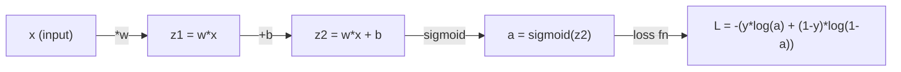
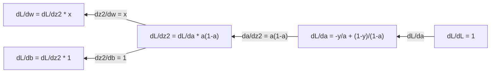
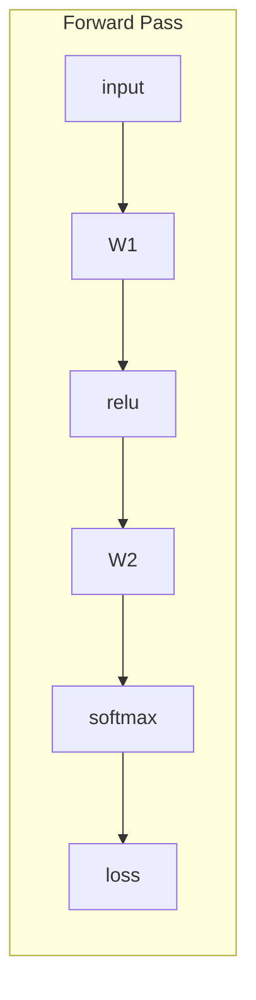
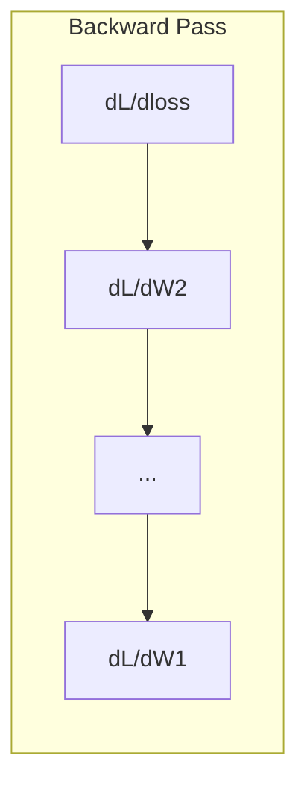

# Makine Öğrenimi 微积分

> Nörolar ağının öğrenmesi gereken her şey budur.

**Type:** Learn
**Language:**Python
**Prerequisites:** Phase 1, Lessons 01-03
**Time:** ~60 minutes

## Öğrenme hedefi

- 計算常见 ML 函数(x^2、sigmoid、cross-entropy) nın sayı değerli yönlendirmesi ve çözünür yönlendirmesi
- 0'dan Gradient Descent'i gerçekleştirmek, 1D ve 2D'de en az düşüş fonksiyonu
- 推导线性回归 模型的渐进,并通过手动更新权重来训练它
- 解释 Hessian Matrix、Taylor serisi 近似,以及它们与优化方法的联系

## 问题

Bir milyon ağırlık içeren nöral ağınız var. Her ağırlık bir dönüm noktasıdır.

微积分, neural ağı eğitmek, her türlü değişimi denemek, sonra da iyi şans elde etmek demektir. 导数 varsa, her bir ağırlığın hataları nasıl etkilediğini tam olarak bilebilirsin.

## 概念

### - Nedir bu?

导数量量量变化率──对函数 y = f(x),导数 f'(x) 会告诉你: Eğer x 微小地推一点,y 会变化多少?

Görevsel olarak, yönlü sayı bir noktada çizginin eğilimi olarak görülür.

**f(x) = x^2：**

| x | f(x) | f'(x)（斜率） |
|---|------|---------------|
| 0 | 0    | 0（平坦，在底部） |
| 1 | 1    | 2 |
| 2 | 4    | 4（该点处切线的斜率） |
| 3 | 9    | 6 |

X = 2'de, eğrilik oranı 4'dir. Eğer x'yi sağ tarafa hareket ettirseniz, büyük ihtimalle bu hareket miktarını 4 kat artırır.

形式化定義:

```
f'(x) = lim   f(x + h) - f(x)
        h->0  -----------------
                     h
```

Kodda, sınırdan geçersin, doğrudan çok küçük bir h. kullanırsın.

### 偏导数: once only see a variable

Gerçek fonksiyonun birçok girişleri vardır. Nöral Ağın Kaybesi, binlerce ağırlığa bağlıdır.

```
f(x, y) = x^2 + 3xy + y^2

df/dx = 2x + 3y     (treat y as a constant)
df/dy = 3x + 2y     (treat x as a constant)
```

Her yönlendirme cevap: Eğer sadece bu ağırlığı azaltırsam, Kayıp nasıl değişir?

### Gradient: tüm yön yönlü sayıların oluşturduğu vektör

Gradient, her yönlendirme sayısını bir vektöre toplayacak.

```
grad f = [ df/dx, df/dy, df/dz ]
```

Gradient gösterir en yüksek yönde. Bir işlevi en aza indirmek için, karşı yönde hareket etmektedir.

**f(x,y) = x^2 + y^2 的等高线图：**

Bu işlevi bir bowl şeklinde eğri bir şekil oluşturur, eğ高線=同心圆.

| 点 | grad f | -grad f（下降方向） |
|-------|--------|----------------------------|
| (1, 1) | [2, 2]（指向上坡，远离最小值） | [-2, -2]（指向下坡，朝向最小值） |
| (0, 0) | [0, 0]（平坦，在最小值处） | [0, 0] |

İşte bir tabloda bir dereceli düşüş.

### Optimizasyon ile bağlantı

訓練 ニューラルネットワーク 就是优化──你有一个损失函数 L(w1, w2, ..., wn),它衡量模型有多错──你想最小化它──

```
Gradient descent update rule:

  w_new = w_old - learning_rate * dL/dw

For every weight:
  1. Compute the partial derivative of loss with respect to that weight
  2. Subtract a small multiple of it from the weight
  3. Repeat
```

Öğrenme hızı  kontrol et                                                                                                                                                                                                                                                                                                                                                                                                                                                                                                                      

**Loss landscape（1D 切片）：**

Kayıp Fonksiyonu L(w)  Vücut ağırlığının değişimiyle birlikte bir                                                                                                                                                                                                                                                    

| 特征 | 描述 |
|---------|-------------|
| Global minimum | 整条曲线上的最低点，即最佳解 |
| Local minimum | 比邻近位置更低、但不是整体最低点的谷 |
| Slope | Gradient Descent 会从任意起点沿斜率向下走 |

Gradient Descent 会 ırmak oranının aşağı yukarı giderek gerçekleşir. Yerel minimumlara düşebilir, ancak yüksek boyutlu alanlarda bu pek az gerçek bir sorundur.

### 解析导数 vs 解析导数

Bilgisayarın iki yolu vardır.

解析方式:手动应用微积分规则──对于 f(x) = x^2,导数是 f'(x) = 2x──精确,快速──

sayı değer biçimi: kullanımı tanımlama yapılır yaklaşımlı olarak.

```
Numerical (central difference):

f'(x) ~= f(x + h) - f(x - h)
          -----------------------
                  2h

h = 0.0001 works well in practice
```

Değerli bir dizgin daha yavaş, ancak herhangi bir işlevi için uygundur. Değerli bir dizgin hızlıdır, ancak yönlendirmelisiniz.

### Hand Handling: basit fonksiyonların indirgenicesi

Bunlar ML'de tekrar tekrar gördüğünüz yönlendirmeler.

```
Function        Derivative       Used in
--------        ----------       -------
f(x) = x^2     f'(x) = 2x      Loss functions (MSE)
f(x) = wx + b  f'(w) = x        Linear layer (gradient w.r.t. weight)
                f'(b) = 1        Linear layer (gradient w.r.t. bias)
                f'(x) = w        Linear layer (gradient w.r.t. input)
f(x) = e^x     f'(x) = e^x     Softmax, attention
f(x) = ln(x)   f'(x) = 1/x     Cross-entropy loss
f(x) = 1/(1+e^-x)  f'(x) = f(x)(1-f(x))   Sigmoid activation
```

对于 f(x) = x^2:

```
f(x) = x^2    f'(x) = 2x

  x    f(x)   f'(x)   meaning
  -2    4      -4      slope tilts left (decreasing)
  -1    1      -2      slope tilts left (decreasing)
   0    0       0      flat (minimum!)
   1    1       2      slope tilts right (increasing)
   2    4       4      slope tilts right (increasing)
```

对于 f(w) = wx + b,且 x=3、b=1:

```
f(w) = 3w + 1    f'(w) = 3

The derivative with respect to w is just x.
If x is big, a small change in w causes a big change in output.
```

### 链式法则

Bir fonksiyon oluştuğunda, zincir kuralları size nasıl yönlendirileceğini söyler.

```
If y = f(g(x)), then dy/dx = f'(g(x)) * g'(x)

Example: y = (3x + 1)^2
  outer: f(u) = u^2       f'(u) = 2u
  inner: g(x) = 3x + 1    g'(x) = 3
  dy/dx = 2(3x + 1) * 3 = 6(3x + 1)
```

Nöral Ağı:bir satır işlevi: giriş -> doğrusal -> etkinleştirme -> doğrusal -> etkinleştirme -> kaybı。 Geri yayılma, yani çıkıştan girişe dönüştürülmüş uygulama zinciri biçimi¬¬¬¬¬¬¬¬¬¬¬¬¬¬¬¬¬¬¬¬¬¬¬¬¬¬¬¬¬¬¬¬¬¬¬¬¬¬¬¬¬¬¬¬¬¬¬¬¬¬¬¬¬¬¬¬¬¬¬¬¬¬¬¬¬¬¬¬¬¬¬¬¬¬¬¬¬¬¬¬¬¬¬¬¬¬¬¬¬¬¬¬¬¬¬¬¬¬¬¬¬¬¬¬¬¬¬¬¬¬¬¬¬¬¬¬¬¬¬¬¬¬¬¬¬¬¬¬¬¬¬¬¬¬¬¬¬¬¬¬¬¬¬¬¬¬¬¬¬¬¬¬¬¬¬¬¬¬¬¬¬¬¬¬¬¬¬¬¬¬¬¬¬¬¬¬¬¬¬¬¬¬¬¬¬¬¬¬¬¬¬¬¬¬¬¬¬¬¬¬¬¬¬¬¬¬¬¬¬¬¬¬¬¬¬¬¬¬¬¬¬¬¬¬¬¬¬¬¬¬¬¬¬¬¬¬¬¬¬¬¬¬¬¬¬¬¬¬¬¬¬¬¬¬¬¬¬¬¬¬¬¬¬¬¬¬¬¬¬¬¬¬¬¬¬¬¬¬¬¬¬¬¬¬¬¬¬¬¬¬¬¬¬¬¬¬¬¬¬¬¬¬¬¬¬¬¬¬¬¬¬¬¬¬¬¬¬¬¬¬¬¬¬¬¬¬¬¬¬¬¬¬¬¬¬¬¬¬¬¬¬¬¬¬¬¬¬¬¬¬¬¬¬¬¬¬¬¬¬¬¬¬¬¬¬¬¬¬¬¬¬¬¬¬¬¬¬¬¬¬¬¬¬¬¬¬¬¬¬¬¬¬¬¬¬¬¬¬¬¬¬¬¬¬¬¬¬¬¬¬¬¬¬¬¬¬¬¬¬¬¬¬¬¬¬¬¬¬¬¬¬¬¬¬¬¬¬¬¬¬¬¬¬¬¬¬¬¬¬¬¬¬¬¬¬¬¬¬

### Hessian Matrix

Gradient 告诉你斜率──Hessian 告诉你曲率──

Hessian'ın (i, j) 项 is:

```
H[i][j] = d^2f / (dx_i * dx_j)
```

对于二变量函数 f ((x, y):

```
H = | d^2f/dx^2    d^2f/dxdy |
    | d^2f/dydx    d^2f/dy^2 |
```

**Hessian 在临界点（Gradient = 0 的地方）告诉你什么：**

| Hessian 性质 | 含义 | 示例曲面 |
|-----------------|---------|-----------------|
| 正定（所有 eigenvalues > 0） | Local minimum | 向上开口的碗 |
| 负定（所有 eigenvalues < 0） | Local maximum | 向下开口的碗 |
| 不定（eigenvalues 正负混合） | Saddle point | 马鞍形 |

**示例：**f(x, y) = x^2 - y^2(1 otlak 函数)

```
df/dx = 2x       df/dy = -2y
d^2f/dx^2 = 2    d^2f/dy^2 = -2    d^2f/dxdy = 0

H = | 2   0 |
    | 0  -2 |

Eigenvalues: 2 and -2 (one positive, one negative)
--> Saddle point at (0, 0)
```

与 f(x, y) = x^2 + y^2(一个碗形函数)比较:

```
H = | 2  0 |
    | 0  2 |

Eigenvalues: 2 and 2 (both positive)
--> Local minimum at (0, 0)
```

**为什么 Hessian 在 ML 中重要：**

Newton'un yöntemini kullanmak için Hessian'dan daha iyi bir optimizasyon adımını kullanın.

```
Newton's update:    w_new = w_old - H^(-1) * gradient
Gradient descent:   w_new = w_old - lr * gradient
```

Newton'un yöntemi 收更快, çünkü Hessian 会 yeniden küçültülmüş  Gradient:方向的步子更小,平坦方向的步子更大──

Sorun şu: N ′parametre olan sinir ağları için Hessian N x N ′dır. Bir milyon ′parametre olan model, 1 milyar element içeren bir matris gerektirir. Bu yüzden yaklaşım yöntemini kullanıyoruz.

| 方法 | 使用什么 | 成本 | 收敛 |
|--------|-------------|------|-------------|
| Gradient Descent | 只使用一阶导数 | 每步 O(N) | 慢（线性） |
| Newton's method | 完整 Hessian | 每步 O(N^3) | 快（二次） |
| L-BFGS | 从 Gradient 历史近似 Hessian | 每步 O(N) | 中等（超线性） |
| Adam | 每参数自适应 rate（对角 Hessian 近似） | 每步 O(N) | 中等 |
| Natural gradient | Fisher information matrix（统计 Hessian） | 每步 O(N^2) | 快 |

實踐中,Adam is Deep Learning'ın öntanımlı Optimizer── it tracks each parameter Gradient'in run average and square difference, to low cost approximate second-stage information──

### Taylor Serisi 近似

 herhangi bir düzleme işlevi, yerel olarak bir çok yönlü yaklaşım olarak kullanılabilir:

```
f(x + h) = f(x) + f'(x)*h + (1/2)*f''(x)*h^2 + (1/6)*f'''(x)*h^3 + ...
```

包含的项越多,近似越好, ancak sadece x 附近成立──

**为什么 Taylor series 对 ML 重要：**

- **一阶 Taylor = Gradient Descent。**Eğer f (x + h) ~ f (x) + f' (x) * h) kullanırsanız, bu modelin en azını seçerseniz, h = -lr * f' (x) ⋅

- **二阶 Taylor = Newton's method。**kullan f(x + h) ~ f(x) + f'(x) *h + (1/2)*f'(x) *h^2 时,You get a second model──最小化 it will get h = -f'(x) /f'(x),也就是牛顿的步──

- **Loss Function 设计。**MSE ve çapraz entropi düzeltilmiştir, bu da Taylor genişlemeleri iyi performans göstermektedir. Bu tesadüf değil.

```
Approximation order    What it captures    Optimization method
-------------------    -----------------   -------------------
0th order (constant)   Just the value      Random search
1st order (linear)     Slope               Gradient descent
2nd order (quadratic)  Curvature           Newton's method
Higher orders          Finer structure     Rarely used in ML
```

关键洞见是: tüm Gradient tabanlı optimization, aslında tüm yerel yakınlık kaybı işlevi, ve bu yakınlık işlevi en az değeri adım adım.

### ML İçin 积分

导数 size değişim oranını anlatır.

ML'de çok az kişi manuel hesaplama yapıyor, ama bu kavram var.

**概率。**对于具有密度 p(x) 的连续随机变量:
```
P(a < X < b) = integral from a to b of p(x) dx
```
概率 yoğunluğu eğri a ve b arasındaki yüzey, bu bölgede düşen 概率

**期望值。**概率加权的平均结果:
```
E[f(X)] = integral of f(x) * p(x) dx
```
Veriler dağıtımında beklenen kayıp bir积分―― eğitim, deneyiminin en azına yaklaşmasıdır.

**KL divergence。** İki farklı dağılım ölçmek:
```
KL(p || q) = integral of p(x) * log(p(x) / q(x)) dx
```
VAE'ler, bilgi destilasyonu ve Bayesian sonuçları kullanıyor.

**归一化常数。**Bayesian sonucu 中:
```
p(w | data) = p(data | w) * p(w) / integral of p(data | w) * p(w) dw
```
分母, tüm olası parametreler değerinin积分idir. Genellikle işlenmez, bu yüzden MCMC ve varyasyonsal çıkarım gibi yaklaşım yöntemlerini kullanıyoruz.

| 积分概念 | 在 ML 中出现的位置 |
|-----------------|----------------------|
| 曲线下面积 | 由 density functions 得到概率 |
| 期望值 | Loss Functions、risk minimization |
| KL divergence | VAEs、policy optimization、distillation |
| 归一化 | Bayesian posteriors、softmax denominator |
| Marginal likelihood | Model comparison、evidence lower bound (ELBO) |

### Hesaplama Grafiği 中的多变量链式法则

链式法则不仅适用于一条线上的标量函数――在神经网络中,变量会分叉并合并――下面显示导数如何流过一个简单的前进传递:



Geriye geçiş 会从右到左计算 Gradient:



Her bir ok da yerel yönlendirme sayısı üzerinde çarpılır. Herhangi bir parametre'nin derecesi, Kaybettikten bu parametre yoluna kadar tüm yerel yönlendirme sayısı çarpıdır. Yollar ayrılırken ve birleşirken, her bir yolun katkılarını artıracaksınız.

Backpropagation'ın tüm içeriği şudur: Output'tan Input'a kadar sistematik olarak hesaplama grafiklerinde uygulama zinciri kuralları vardır.

### Jacobian Matrix

Bir işlevin vektörü 映射 ettiği zaman, onun yönlendirmesi bir Matrix ve Jacobian'da her giriş ile ilgili her çıkışın tüm yönlendirmelerin bulunması vardır.

对于 f: R^n -> R^m,Jacobian J 是一个 m x n Matrix:

| | x1 | x2 | ... | xn |
|---|---|---|---|---|
| f1 | df1/dx1 | df1/dx2 | ... | df1/dxn |
| f2 | df2/dx1 | df2/dx2 | ... | df2/dxn |
| ... | ... | ... | ... | ... |
| fm | dfm/dx1 | dfm/dx2 | ... | dfm/dxn |

Siz Neural Network için Jacobian hesaplamayacaksınız. PyTorch bunu işleyecek. Ama varlığını bilmenize yardımcı olacak. Geri yayılma içindeki şeklini anlamanıza yardımcı olacaktır. Eğer bir katman R^n'i R^m'e yerleştirirse, onun Jacobian m x n olacaktır.

### Bu neden sinir ağı için çok önemli ?

Neural Network'deki her bir güç bir Gradient elde eder. Gradient size bu güçleri nasıl ayarlayacağınızı ve kayıpları nasıl azaltacağınızı söyler.





Her kez yeniden yenilenir:
- `W1 = W1 - lr * dL/dW1`
- `W2 = W2 - lr * dL/dW2`

Önceden geçmek 计算预测和 Loss── geriye geçmek 计算 Loss 对于每权重的格第ент──然后每权重都向下坡方向迈一小步──重复数百万步──这是深度学习──


```figure
derivative-tangent
```

## Yapın onu.

### 步骤 1: sıfırdan gerçekleştirici değer

```python
def numerical_derivative(f, x, h=1e-7):
    return (f(x + h) - f(x - h)) / (2 * h)

def f(x):
    return x ** 2

for x in [-2, -1, 0, 1, 2]:
    numerical = numerical_derivative(f, x)
    analytical = 2 * x
    print(f"x={x:2d}  f'(x) numerical={numerical:.6f}  analytical={analytical:.1f}")
```

Sayı değerli ve çözme yönlendirmesi birçok küçük sayılarda uyumludur.

### 步骤 2: Geçici ile Geçici

```python
def numerical_gradient(f, point, h=1e-7):
    gradient = []
    for i in range(len(point)):
        point_plus = list(point)
        point_minus = list(point)
        point_plus[i] += h
        point_minus[i] -= h
        partial = (f(point_plus) - f(point_minus)) / (2 * h)
        gradient.append(partial)
    return gradient

def f_multi(point):
    x, y = point
    return x**2 + 3*x*y + y**2

grad = numerical_gradient(f_multi, [1.0, 2.0])
print(f"Numerical gradient at (1,2): {[f'{g:.4f}' for g in grad]}")
print(f"Analytical gradient at (1,2): [2*1+3*2, 3*1+2*2] = [{2*1+3*2}, {3*1+2*2}]")
```

### 步骤 3: Gradient Descent ile f(x) = x^2'in en az değerini bul

```python
x = 5.0
lr = 0.1
for step in range(20):
    grad = 2 * x
    x = x - lr * grad
    print(f"step {step:2d}  x={x:8.4f}  f(x)={x**2:10.6f}")
```

X=5'den başlayarak, her adım x=0'ye daha yakın olacak.

### 步骤 4: 2D 函数 üzerinde Gradient Descent gerçekleştir

```python
def f_2d(point):
    x, y = point
    return x**2 + y**2

point = [4.0, 3.0]
lr = 0.1
for step in range(30):
    grad = numerical_gradient(f_2d, point)
    point = [p - lr * g for p, g in zip(point, grad)]
    loss = f_2d(point)
    if step % 5 == 0 or step == 29:
        print(f"step {step:2d}  point=({point[0]:7.4f}, {point[1]:7.4f})  f={loss:.6f}")
```

### Adım 5: Aralıklı değerler ve değerler karşılaştırma ve değerler analiz

```python
import math

test_functions = [
    ("x^2",      lambda x: x**2,          lambda x: 2*x),
    ("x^3",      lambda x: x**3,          lambda x: 3*x**2),
    ("sin(x)",   lambda x: math.sin(x),   lambda x: math.cos(x)),
    ("e^x",      lambda x: math.exp(x),   lambda x: math.exp(x)),
    ("1/x",      lambda x: 1/x,           lambda x: -1/x**2),
]

x = 2.0
print(f"{'Function':<12} {'Numerical':>12} {'Analytical':>12} {'Error':>12}")
print("-" * 50)
for name, f, df in test_functions:
    num = numerical_derivative(f, x)
    ana = df(x)
    err = abs(num - ana)
    print(f"{name:<12} {num:12.6f} {ana:12.6f} {err:12.2e}")
```

### 步骤 6: Hessian sayı değerini hesaplamak

```python
def hessian_2d(f, x, y, h=1e-5):
    fxx = (f(x + h, y) - 2 * f(x, y) + f(x - h, y)) / (h ** 2)
    fyy = (f(x, y + h) - 2 * f(x, y) + f(x, y - h)) / (h ** 2)
    fxy = (f(x + h, y + h) - f(x + h, y - h) - f(x - h, y + h) + f(x - h, y - h)) / (4 * h ** 2)
    return [[fxx, fxy], [fxy, fyy]]

def saddle(x, y):
    return x ** 2 - y ** 2

def bowl(x, y):
    return x ** 2 + y ** 2

H_saddle = hessian_2d(saddle, 0.0, 0.0)
H_bowl = hessian_2d(bowl, 0.0, 0.0)
print(f"Saddle Hessian: {H_saddle}")  # [[2, 0], [0, -2]] -- mixed signs
print(f"Bowl Hessian:   {H_bowl}")    # [[2, 0], [0, 2]]  -- both positive
```

Seaddle 函数的Hessian has eigenvalues 2 和 -2(符号混合,确认是 Saddle point) ・・・ bowls 函数 has eigenvalues 2 和 2(均为正,确认是最小) ・・・

### 步骤7:Taylor 近似的实际效果

```python
import math

def taylor_approx(f, f_prime, f_double_prime, x0, h, order=2):
    result = f(x0)
    if order >= 1:
        result += f_prime(x0) * h
    if order >= 2:
        result += 0.5 * f_double_prime(x0) * h ** 2
    return result

x0 = 0.0
for h in [0.1, 0.5, 1.0, 2.0]:
    true_val = math.sin(h)
    t1 = taylor_approx(math.sin, math.cos, lambda x: -math.sin(x), x0, h, order=1)
    t2 = taylor_approx(math.sin, math.cos, lambda x: -math.sin(x), x0, h, order=2)
    print(f"h={h:.1f}  sin(h)={true_val:.4f}  order1={t1:.4f}  order2={t2:.4f}")
```

Bu yaklaşım çok küçük h için çok iyi, ama daha büyük h için başarısız olur. Bu yüzden daha küçük öğrenme oranlarında dereceli düşüş en iyi sonuç: her adımın tüm hipotezi linear yaklaşım doğru olacaktır.

### Adım 8: Bu neden sinir ağı için çok önemli ?

```python
import random

random.seed(42)

w = random.gauss(0, 1)
b = random.gauss(0, 1)
lr = 0.01

xs = [1.0, 2.0, 3.0, 4.0, 5.0]
ys = [3.0, 5.0, 7.0, 9.0, 11.0]

for epoch in range(200):
    total_loss = 0
    dw = 0
    db = 0
    for x, y in zip(xs, ys):
        pred = w * x + b
        error = pred - y
        total_loss += error ** 2
        dw += 2 * error * x
        db += 2 * error
    dw /= len(xs)
    db /= len(xs)
    total_loss /= len(xs)
    w -= lr * dw
    b -= lr * db
    if epoch % 40 == 0 or epoch == 199:
        print(f"epoch {epoch:3d}  w={w:.4f}  b={b:.4f}  loss={total_loss:.6f}")

print(f"\nLearned: y = {w:.2f}x + {b:.2f}")
print(f"Actual:  y = 2x + 1")
```

Her Gradient tabanlı eğitim döngüsü bu moduya uyar: öngörüm, hesaplama, kaybı hesaplama, gradyenin yenilemesi, ağırlık.

## Kullan

NumPy kullanın, aynı şekilde daha hızlı, daha basit bir şekilde:

```python
import numpy as np

x = np.array([1, 2, 3, 4, 5], dtype=float)
y = np.array([3, 5, 7, 9, 11], dtype=float)

w, b = np.random.randn(), np.random.randn()
lr = 0.01

for epoch in range(200):
    pred = w * x + b
    error = pred - y
    loss = np.mean(error ** 2)
    dw = np.mean(2 * error * x)
    db = np.mean(2 * error)
    w -= lr * dw
    b -= lr * db

print(f"Learned: y = {w:.2f}x + {b:.2f}")
```

Siz sadece Gradient Descent'i oluşturmuşsunuz. PyTorch otomatik olarak Gradient'i tamamlayacak.

## 练习

1. İki kez kullanılıyor.`numerical_derivative`Nasıl gerçekleştirilir ?`numerical_second_derivative(f, x)` Test x^3 x=2'de ikinci aşama yönlendirme sayısı 12 
2. kullan Gradient Descent 找到 f(x, y) = (x - 3) ^ 2 + (y + 1) ^ 2'nin en az değeri── (0, 0) 开始──答案应收到 (3, -1)──
3. Geçici Geçici Geçici Geçici Geçici Geçici Geçici Geçici Geçici Geçici Geçici Geçici Geçici Geçici Geçici Geçici Geçici Geçici Geçici Geçici Geçici Geçici Geçici Geçici Geçici Geçici Geçici Geçici Geçici Geçici Geçici Geçici Geçici Geçici Geçici Geçici Geçici Geçici Geçici Geçici Geçici Geçici Geçici Geçici Geçici Geçici Geçici Geçici Geçici Geçici Geçici Geçici Geçici Geçici Geçici Geçici Geçici Geçici Geçici Geçici Geçici Geçici Geçici Geçici Geçici Geçici Geçici Geçici Geçici Geçici Geçici Geçici Geçici Geçici Geçici Geçici Geçici Geçici Geçici Geçici Geçici Geçici Geçici Geçici Geçici Geçici Geçici Geçici Geçici Geçici Geçici Geçici Geçici Geçici Geçici Geçici Geçici Geçi Geçi Geçi Geçi Geçi Geçi Geçi Geçi Geçi Geçi Geçi Geçi Geçi Geçi Geçi Geçi Geçi Geçi Geçi Geçi Geçi Geçi Geçi Geçi Geçi Geçi Geçi Geçi Geçi Geçi Geçi Geçi Geçi Geçi Geçi Geçi Geçi Geçi Geçi Geçi Geçi Geçi Geçi Geçi Geçi Geçi Geçi Geçi Geçi Geçi Geçi Geçi Geçi Geçi Geçi Geçi Geçi Geçi Geçi Geçi Geçi Geçi Geçi Geçi Geçi Geçi Geçi Geçi Geçi Geçi Geçi Geçi Geçi Geçi Geçi Geçi Geçi Geçi Geçi Geçi Geçi Geçi Geçi Geçi Geçi Geçi Geçi Geçi Geçi Geçi Geçi Geçi Geçi Geçi Geçi Geçi Geçi Geçi Geçi Geçi Geçi Geçi Geçi Geçi Geçi Geçi Geçi Geçi Geçi Ge

## 关键术语

| 术语 | 人们常说 | 实际含义 |
|------|----------------|----------------------|
| Derivative | “斜率” | 函数在某一点的变化率。告诉你输入每变化一个单位，输出会变化多少。 |
| Partial derivative | “一个变量的导数” | 在保持其他所有变量不变时，对某一个变量求导。 |
| Gradient | “最陡上升方向” | 由所有偏导数组成的 Vector。指向让函数增长最快的方向。 |
| Gradient Descent | “往下坡走” | 从参数中减去 Gradient（乘以 learning rate），从而降低 Loss。Neural Network 训练的核心。 |
| Learning rate | “步长” | 控制每一步 Gradient Descent 有多大的标量。太大：发散。太小：收敛缓慢。 |
| Chain rule | “把导数相乘” | 对复合函数求导的规则：df/dx = df/dg * dg/dx。Backpropagation 的数学基础。 |
| Jacobian | “导数 Matrix” | 当一个函数把 Vector 映射到 Vector 时，Jacobian 是所有输出相对于输入的偏导数组成的 Matrix。 |
| Numerical derivative | “有限差分” | 通过在两个相邻点上评估函数并计算它们之间的斜率来近似导数。 |
| Backpropagation | “Reverse-mode autodiff” | 使用链式法则，从输出到输入逐层计算 Gradient。Neural Network 就是这样学习的。 |
| Hessian | “二阶导数 Matrix” | 所有二阶偏导数组成的 Matrix。描述函数的曲率。在临界点处 Hessian 正定意味着 local minimum。 |
| Taylor series | “多项式近似” | 使用函数的导数在某一点附近近似函数：f(x+h) ~ f(x) + f'(x)h + (1/2)f''(x)h^2 + ... 它是理解 Gradient Descent 和 Newton's method 为什么有效的基础。 |
| Integral | “曲线下面积” | 某个量在一个范围内的累积。在 ML 中，积分定义概率、期望值和 KL divergence。 |

## 延伸阅读

- [3Blue1Brown: Essence of Calculus](https://www.3blue1brown.com/topics/calculus)- 关于导数,积分和链式法则的视觉直觉
- [Stanford CS231n: Backpropagation](https://cs231n.github.io/optimization-2/)- Gradient  nasıl akıştı Nöral Ağ katmanı
