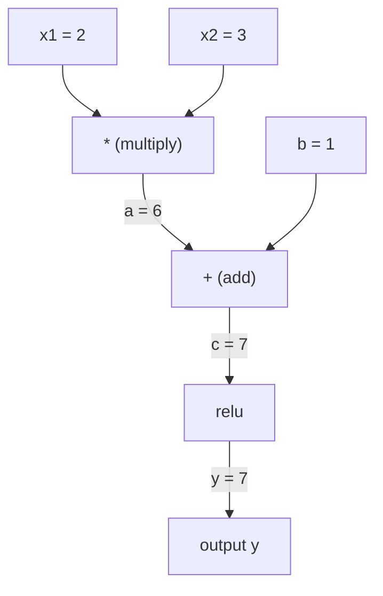
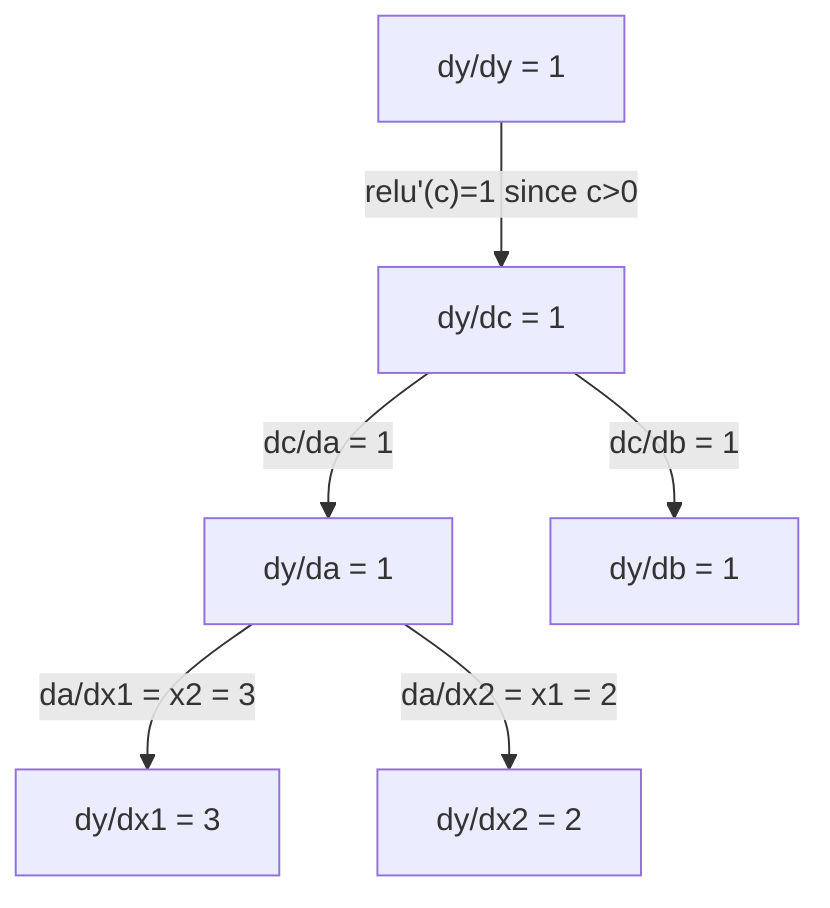

# Zincir Kuralı ve Otomatik Farklılaştırma

> Zincir Kuralı, her birinin öğrenmesi gereken sinir ağının arkasındaki motor.

**类型：**Yapım
**语言：**Python
**前置要求：**1. aşama, Ders 04 (Derivatlar ve Gradiyentler)
**时间：**90 dakika kadar .

## Öğrenme hedefi

- 构建一个极简 autograd 引擎(Değer sınıfı),记录操作并通过逆模式的自动调节 计算 Gradient
- Topolojik tür kullanmak, hesaplama grafikinde ileriyi ve geriyi geçmeyi gerçekleştirmek
- Sadece sıfırdan gerçekleştirilen otograd motor kullanılarak, XOR'da bir çok katmanlı algılayıcıyı inşa ve eğit.
- Gradyent kontrolü kullanmak, otomatik olarak değer ve sayı sınırlı farkları karşılaştırmak, doğruluk doğruluğu

## 问题

Basit bir işlevin yönlendirme sayısını hesaplayabilirsiniz. Ancak Nöral Ağ basit bir işlevin değil. Yüzlerce işlevin bir araya gelmesiyle oluşur: matris çarpımı, ekleme ve kısıtlama, uygulama etkinleştirmesi, tekrar matris çarpımı, yumuşak maksimum, çapraz entropi kaybı, bir işlevin bir işlevin bir işlevin bir işlevi vergisinin çıkışı.

Bu, milyonlarca parametre ile tamamlanmak için imkansızdır.

Zincir Kuralı  matematiğin temelini vermek. Otomatik farklılık  algoritma vermek.

İşte PyTorch, TensorFlow ve JAX'in çalışma biçimi.

## 核心概念

### Zincir Kuralı

Eğer `y = f(g(x))`- Öyleyse .`y`                `x`Çekilme sayısı:

```
dy/dx = dy/dg * dg/dx = f'(g(x)) * g'(x)
```

沿着链条将导数相乘―― her bir bölüm kendi yerel导数¬larına katkıda bulunur.

Örnek:`y = sin(x^2)`

```
g(x) = x^2       g'(x) = 2x
f(g) = sin(g)     f'(g) = cos(g)

dy/dx = cos(x^2) * 2x
```

Daha derin bir komplo için, zincir devam eder:

```
y = f(g(h(x)))

dy/dx = f'(g(h(x))) * g'(h(x)) * h'(x)
```

Nöral ağın her katmanı bu zincirdeki bir kısım.

### Hesaplama Grafikleri

Hesaplama grafiği 让链规则可视化──每个操作都将成为一个节点──数据沿图向前流动──Gradient向后流动──

**Forward pass（计算值）：**



**Backward pass（计算 Gradient）：**



Arka Geçit, Çatışa yayılan çıkıştan girişe kadar dereceli olacaktır.

### Ön yönlü modüs vs ters yönlü modüs

Grafın içinde zincir kuralını uygulamanın iki yolu vardır.

**Forward mode**Giriştan başlayarak, öne doğru sayı hesaplanır.`dx/dx = 1`,并通过每个操作传播――适合输入少、输出多场景――

```
Forward mode: seed dx/dx = 1, propagate forward

  x = 2       (dx/dx = 1)
  a = x^2     (da/dx = 2x = 4)
  y = sin(a)  (dy/dx = cos(a) * da/dx = cos(4) * 4 = -2.615)
```

**Reverse mode**Çıkıştan çıkıştan sonra, dereceli olarak geriye doğru geriye doğru hesaplanır.`dy/dy = 1`, ve her işlemden sonra ters yönlü bir sırada yayılmaktadır.

```
Reverse mode: seed dy/dy = 1, propagate backward

  y = sin(a)  (dy/dy = 1)
  a = x^2     (dy/da = cos(a) = cos(4) = -0.654)
  x = 2       (dy/dx = dy/da * da/dx = -0.654 * 4 = -2.615)
```

Neural Network'da milyonlarca giriş var. Ağırlık ve bir çıkış kaybı. Geriye doğru modda tüm dereceleri hesaplayabilirsiniz.

| Mode | Seed | Direction | Best when |
|------|------|-----------|-----------|
| Forward | `dx_i/dx_i = 1` | 输入到输出 | 输入少、输出多 |
| Reverse | `dy/dy = 1` | 输出到输入 | 输入多、输出少（neural nets） |

### Önceki Modu Çift Sayılar

Önceki mod çift sayı kullanılabilir 优雅地实现──双数的形式是`a + b*epsilon`, içinden `epsilon^2 = 0`- Evet.

```
Dual number: (value, derivative)

(2, 1) means: value is 2, derivative w.r.t. x is 1

Arithmetic rules:
  (a, a') + (b, b') = (a+b, a'+b')
  (a, a') * (b, b') = (a*b, a'*b + a*b')
  sin(a, a')         = (sin(a), cos(a)*a')
```

Giriş değişkeninin dilim sayısı 1 olarak ayarlanacak.

### 构建 Autograd 引擎

Bir otograd motor üç şeye ihtiyaç duyar:

1. **Value wrapping。**Her rakamı bir nesne içinde paketleyerek değerini ve derecesi depolamak için kullanılır.
2. **Graph recording。**Her işlem, giriş ve yerleşimlerini kaydetir.
3. **Backward pass。**Grafiğe topolojik bir tür yapın, sonra da her noktada zincir kuralını uygulayın.

Bu da PyTorch'in.`autograd`Yapılacak şeyler.`torch.Tensor`sınıf 包裹值,在 `requires_grad=True`时记录操作, ve 调用`.backward()`时计算 Gradient。

### PyTorch Autograd 底层 nasıl işliyor

PyTorch kodunu yazdığında:

```python
x = torch.tensor(2.0, requires_grad=True)
y = x ** 2 + 3 * x + 1
y.backward()
print(x.grad)  # 7.0 = 2*x + 3 = 2*2 + 3
```

PyTorch İç Meclis:

1. Çı`x`Bir tane oluştur .`Tensor`节点,并设置 `requires_grad=True`
2. Her bir operasyon`**`- Evet.`*`- Evet.`+`) t t t t t t t t t t t t t t t t t t t t t t t t t t t t t t t t t t t t t t t t t t t t t t t t t t t t t t t t t t t t t t t t t t t t t t t t t t t t t t t t t t t t t t t t t t t t t t t t t t t t t t t t t t t t t t t t t t t t t t t t t t t t t t t t t t t t t t t t t t t t t t t t t t t t t t t t t t t t t t t t t t t t t t t t t t t t t t t t t t t t t t t t t t t t t t t t t t t t t t t t t t t t t t t t t t t t t t t t t t t t t t t t t t t t t t t t t t t t t t t t t t t t t t t t t t t t t t t t t t t t t t t t t t t t t t t t t t t t t t t t t t t t t t t t t t t t t t t t t t t t t t t t t t t t t t t t t t t t t t t t t t t t t t t t t t t t t t t t t t t t t t t t t t t t t t t t t t t t t t t t t t t t t t t t t t t t t t t t t t t t t t t t t t t t t t t t t t t t t t t t t t t t t t t t t t t t t t t t t t t t t t t t t t t t t t t t t t t t t t t t t t t t t t t t t t t t t t t t t t t t t t t t t t t t t t t t t t t t t t t t t t t t t t t t t t t t t t t t t t t t t t t t t t t t t
3. `y.backward()`触发对已记录图的反转模式自动调节 触发对已记录图的反转模式自动调节 触发对已记录图的反转模式自动调节 触发对已记录图的反转模式自动调节 触发对已记录图的反转模式自动调节
4. Her noktayı.`grad_fn`計算局部 Gradient,并将它们传给父节点
5. Gradient 通過加法(不是替换)累积到 `.grad`属性中

Bu grafik ise hareketli bir şekilde düzenlenir. Her ileri geçiş yeni bir grafik oluşturur. Bu yüzden PyTorch kontrol akımını kullanıyor.


```figure
chain-rule
```

## Yapın onu.

### 步骤1:Değer sınıfı

```python
class Value:
    def __init__(self, data, children=(), op=''):
        self.data = data
        self.grad = 0.0
        self._backward = lambda: None
        self._prev = set(children)
        self._op = op

    def __repr__(self):
        return f"Value(data={self.data:.4f}, grad={self.grad:.4f})"
```

Her biri .`Value`∞ ∞ ∞ ∞ ∞ ∞ ∞ ∞ ∞ ∞ ∞ ∞ ∞ ∞ ∞ ∞ ∞ ∞ ∞ ∞ ∞ ∞ ∞ ∞ ∞ ∞ ∞ ∞ ∞ ∞ ∞ ∞ ∞ ∞ ∞ ∞ ∞ ∞ ∞ ∞ ∞ ∞ ∞ ∞ ∞ ∞ ∞ ∞ ∞ ∞ ∞ ∞ ∞ ∞ ∞ ∞ ∞ ∞ ∞ ∞ ∞ ∞ ∞ ∞ ∞ ∞ ∞ ∞ ∞ ∞ ∞ ∞ ∞ ∞ ∞ ∞ ∞ ∞ ∞ ∞ ∞ ∞ ∞ ∞ ∞ ∞ ∞ ∞ ∞ ∞ ∞ ∞ ∞ ∞ ∞ ∞ ∞ ∞ ∞ ∞ ∞ ∞ ∞ ∞ ∞ ∞ ∞ ∞ ∞ ∞ ∞ ∞ ∞ ∞ ∞ ∞ ∞ ∞ ∞ ∞ ∞ ∞ ∞ ∞ ∞ ∞ ∞ ∞ ∞ ∞ ∞ ∞ ∞ ∞ ∞ ∞ ∞ ∞ ∞ ∞ ∞ ∞ ∞ ∞ ∞ ∞ ∞ ∞ ∞ ∞ ∞ ∞ ∞ ∞ ∞ ∞ ∞ ∞ ∞ ∞ ∞ ∞ ∞ ∞ ∞ ∞ ∞ ∞ ∞ ∞ ∞ ∞ ∞ ∞ ∞ ∞ ∞ ∞ ∞ ∞ ∞ ∞ ∞ ∞ ∞ ∞ ∞ ∞ ∞ ∞ ∞ ∞ ∞ ∞ ∞ ∞ ∞ ∞ ∞ ∞ ∞ ∞ ∞ ∞ ∞ ∞ ∞ ∞ ∞ ∞ ∞ ∞ ∞ ∞ ∞ ∞ ∞ ∞ ∞ ∞ ∞ ∞ ∞ ∞ ∞ ∞ ∞ ∞ ∞ ∞ ∞ ∞ ∞ ∞ ∞ ∞ ∞ ∞ ∞ ∞ ∞ ∞ ∞ ∞ ∞ ∞ ∞ ∞ ∞ ∞ ∞ ∞ ∞ ∞ ∞

### 步骤 2:带 Gradient takip 算术操作

```python
    def __add__(self, other):
        other = other if isinstance(other, Value) else Value(other)
        out = Value(self.data + other.data, (self, other), '+')
        def _backward():
            self.grad += out.grad
            other.grad += out.grad
        out._backward = _backward
        return out

    def __mul__(self, other):
        other = other if isinstance(other, Value) else Value(other)
        out = Value(self.data * other.data, (self, other), '*')
        def _backward():
            self.grad += other.data * out.grad
            other.grad += self.data * out.grad
        out._backward = _backward
        return out

    def relu(self):
        out = Value(max(0, self.data), (self,), 'relu')
        def _backward():
            self.grad += (1.0 if out.data > 0 else 0.0) * out.grad
        out._backward = _backward
        return out
```

Her işlem bir kapanış oluşturur, nasıl hesaplanacağını bilir.`out.grad`)。`+=`处理, bir değerin birden fazla işletim tarafından kullanıldığı durumdur.

### 步骤 3: Geriye geçiş

```python
    def backward(self):
        topo = []
        visited = set()
        def build_topo(v):
            if v not in visited:
                visited.add(v)
                for child in v._prev:
                    build_topo(child)
                topo.append(v)
        build_topo(self)

        self.grad = 1.0
        for v in reversed(topo):
            v._backward()
```

Topolojik tür                                                                                                                                                                                                                                                                                                                                                                                                                                                                                                                           

### Adım 4: Tam motor daha fazla işlem gerektirir

基础 Değer sınıfı 支持加法、乘法和 relu。 gerçek otograd 引擎需要更多能力──下面是构建神经网络所需的操作:

```python
    def __neg__(self):
        return self * -1

    def __sub__(self, other):
        return self + (-other)

    def __radd__(self, other):
        return self + other

    def __rmul__(self, other):
        return self * other

    def __rsub__(self, other):
        return other + (-self)

    def __pow__(self, n):
        out = Value(self.data ** n, (self,), f'**{n}')
        def _backward():
            self.grad += n * (self.data ** (n - 1)) * out.grad
        out._backward = _backward
        return out

    def __truediv__(self, other):
        return self * (other ** -1) if isinstance(other, Value) else self * (Value(other) ** -1)

    def exp(self):
        import math
        e = math.exp(self.data)
        out = Value(e, (self,), 'exp')
        def _backward():
            self.grad += e * out.grad
        out._backward = _backward
        return out

    def log(self):
        import math
        out = Value(math.log(self.data), (self,), 'log')
        def _backward():
            self.grad += (1.0 / self.data) * out.grad
        out._backward = _backward
        return out

    def tanh(self):
        import math
        t = math.tanh(self.data)
        out = Value(t, (self,), 'tanh')
        def _backward():
            self.grad += (1 - t ** 2) * out.grad
        out._backward = _backward
        return out
```

**每个操作为什么重要：**

| Operation | Backward rule | Used in |
|-----------|--------------|---------|
| `__sub__` | 复用 add + neg | Loss 计算（pred - target） |
| `__pow__` | n * x^(n-1) | Polynomial activations、MSE（error^2） |
| `__truediv__` | 复用 mul + pow(-1) | Normalization、learning rate scaling |
| `exp` | exp(x) * upstream | Softmax、log-likelihood |
| `log` | (1/x) * upstream | Cross-entropy loss、log probabilities |
| `tanh` | (1 - tanh^2) * upstream | 经典 activation function |

巧妙之处在:`__sub__`和 `__truediv__`Bu işlemler otomatik olarak doğru bir derece elde eder, çünkü zincir kuralları alt katınca eklenen/çoktan/sıkı bir şekilde birleştirilmiştir.

### 5 adım: Mini MLP'yi sıfırdan gerçekleştirmek

Tam bir Değer sınıfı var, sinir ağını inşa edebiliriz. PyTorch gerekmiyor. NumPy gerekmiyor. Sadece Değerler ve Zincir Kuralı var.

```python
import random

class Neuron:
    def __init__(self, n_inputs):
        self.w = [Value(random.uniform(-1, 1)) for _ in range(n_inputs)]
        self.b = Value(0.0)

    def __call__(self, x):
        act = sum((wi * xi for wi, xi in zip(self.w, x)), self.b)
        return act.tanh()

    def parameters(self):
        return self.w + [self.b]

class Layer:
    def __init__(self, n_inputs, n_outputs):
        self.neurons = [Neuron(n_inputs) for _ in range(n_outputs)]

    def __call__(self, x):
        return [n(x) for n in self.neurons]

    def parameters(self):
        return [p for n in self.neurons for p in n.parameters()]

class MLP:
    def __init__(self, sizes):
        self.layers = [Layer(sizes[i], sizes[i+1]) for i in range(len(sizes)-1)]

    def __call__(self, x):
        for layer in self.layers:
            x = layer(x)
        return x[0] if len(x) == 1 else x

    def parameters(self):
        return [p for layer in self.layers for p in layer.parameters()]
```

Bir tane .`Neuron`计算 `tanh(w1*x1 + w2*x2 + ... + b)`Bir tane.`Layer`- Neyronlar.`MLP`Bir katman toplayarak.`Value`, bu yüzden kullanın `loss.backward()`Gradient'i her parametreye yaymak için kullanacağız.

**在 XOR 上训练：**

```python
random.seed(42)
model = MLP([2, 4, 1])  # 2 inputs, 4 hidden neurons, 1 output

xs = [[0, 0], [0, 1], [1, 0], [1, 1]]
ys = [-1, 1, 1, -1]  # XOR pattern (using -1/1 for tanh)

for step in range(100):
    preds = [model(x) for x in xs]
    loss = sum((p - y) ** 2 for p, y in zip(preds, ys))

    for p in model.parameters():
        p.grad = 0.0
    loss.backward()

    lr = 0.05
    for p in model.parameters():
        p.data -= lr * p.grad

    if step % 20 == 0:
        print(f"step {step:3d}  loss = {loss.data:.4f}")

print("\nPredictions after training:")
for x, y in zip(xs, ys):
    print(f"  input={x}  target={y:2d}  pred={model(x).data:6.3f}")
```

İşte bu mikroprad. Tam bir nöral ağ eğitim döngüsü. Tam bir Python ve otomatik farklılık kullanılarak gerçekleştirilen.

### 步骤 6: Gradient kontrolü

Kendi otomatik defterinizin doğru olduğunu nasıl bileceksiniz? Onu sayısal değer dizileri ile karşılaştırın.

```python
def gradient_check(build_expr, x_val, h=1e-7):
    x = Value(x_val)
    y = build_expr(x)
    y.backward()
    autodiff_grad = x.grad

    y_plus = build_expr(Value(x_val + h)).data
    y_minus = build_expr(Value(x_val - h)).data
    numerical_grad = (y_plus - y_minus) / (2 * h)

    diff = abs(autodiff_grad - numerical_grad)
    return autodiff_grad, numerical_grad, diff
```

Bir karmaşık ifade üzerinde test it:

```python
def expr(x):
    return (x ** 3 + x * 2 + 1).tanh()

ad, num, diff = gradient_check(expr, 0.5)
print(f"Autodiff:  {ad:.8f}")
print(f"Numerical: {num:.8f}")
print(f"Difference: {diff:.2e}")
# Difference should be < 1e-5
```

Yeni işlem gerçekleştirirken, dereceli kontrol 至关重要── eğer geri geçişiniz bir hata varsa, sayısal değer kontrolü onu bulacaktır── her ciddi derin öğrenme 实现都会在开发期间运行梯度检查──

**什么时候使用 gradient checking：**

| Situation | Do gradient check? |
|-----------|-------------------|
| 向 autograd 添加新操作 | 是，始终要做 |
| 调试无法收敛的训练循环 | 是，先检查 Gradient |
| 生产训练 | 否，太慢（每个参数需要 2 次 forward pass） |
| autograd 代码的 unit tests | 是，将它自动化 |

### 7 adım: İşlem sonuçları doğrulanması

```python
x1 = Value(2.0)
x2 = Value(3.0)
a = x1 * x2          # a = 6.0
b = a + Value(1.0)    # b = 7.0
y = b.relu()          # y = 7.0

y.backward()

print(f"y = {y.data}")          # 7.0
print(f"dy/dx1 = {x1.grad}")   # 3.0 (= x2)
print(f"dy/dx2 = {x2.grad}")   # 2.0 (= x1)
```

Çekilme:`y = relu(x1*x2 + 1)`❖ Çünkü `x1*x2 + 1 = 7 > 0`,Relu bir kimliktir.
`dy/dx1 = x2 = 3`- Evet.`dy/dx2 = x1 = 2`◊ Engine's results coincide―

## Kullan

### 验证

```python
import torch

x1 = torch.tensor(2.0, requires_grad=True)
x2 = torch.tensor(3.0, requires_grad=True)
a = x1 * x2
b = a + 1.0
y = torch.relu(b)
y.backward()

print(f"PyTorch dy/dx1 = {x1.grad.item()}")  # 3.0
print(f"PyTorch dy/dx2 = {x2.grad.item()}")  # 2.0
```

Gradient 相同──你的引擎計算出的結果與 PyTorch 一致,因为数学基础相同:通过 Chain Rule 实现反模式自动调用──

### Daha karmaşık bir ifade.

```python
a = Value(2.0)
b = Value(-3.0)
c = Value(10.0)
f = (a * b + c).relu()  # relu(2*(-3) + 10) = relu(4) = 4

f.backward()
print(f"df/da = {a.grad}")  # -3.0 (= b)
print(f"df/db = {b.grad}")  #  2.0 (= a)
print(f"df/dc = {c.grad}")  #  1.0
```

## 交付内容

Bu ders:
- `outputs/skill-autodiff.md`-- bir otograd  sistemi oluşturmak ve düzenlemek için bir beceri
- `code/autodiff.py`-- bir genişletilmeye devam edebilecek en basit otograd motor

Bu yapılandırılan değer sınıfı, 3 aşamada Nöral Ağ ı eğitim döngüsünün temelini oluşturur.

## 练习

1. Kılavuz sınıfı 添加 `__pow__`Böylece hesaplayabilirsin .`x ** n`❖ Testing in `x=2`时,`d/dx(x^3)`Ben de öyleyim .`12.0`- Evet.

2. 添加 `tanh`作为激活函数──验证 `tanh'(0) = 1`Ve`tanh'(2) = 0.0707`(Yaklaşık değer)

3. Tek bir nöron için hesaplama grafikini oluştur:`y = relu(w1*x1 + w2*x2 + b)`△ hesapla tüm beş dereceyi,并与 PyTorch 验证──

4. Çift sayılar kullanın  ileriye doğru otomatik olarak kullanın  Create one `Dual`sınıf,并验证 it gives the same number with reverse-mode engine.

## 关键术语

| Term | What people say | What it actually means |
|------|----------------|----------------------|
| Chain rule | “把导数相乘” | 组合函数的导数等于每个函数在正确位置处的局部导数之积 |
| Computational graph | “网络图” | 一个有向无环图，其中节点是操作，边承载值（forward）或 Gradient（backward） |
| Forward mode | “向前推导数” | 将导数从输入传播到输出的 autodiff。每个输入变量需要一次 pass。 |
| Reverse mode | “Backpropagation” | 将 Gradient 从输出传播到输入的 autodiff。每个输出变量需要一次 pass。 |
| Autograd | “自动 Gradient” | 一个系统：记录对值执行的操作、构建 graph，并通过 Chain Rule 计算精确 Gradient |
| Dual numbers | “值加导数” | 形式为 a + b*epsilon（epsilon^2 = 0）的数字，可以在算术运算中携带导数信息 |
| Topological sort | “依赖顺序” | 对 graph 节点排序，使每个节点都位于其所有依赖之后。正确传播 Gradient 所必需。 |
| Gradient accumulation | “相加，不要替换” | 当一个值流入多个操作时，它的 Gradient 是所有传入 Gradient 贡献的总和 |
| Dynamic graph | “Define by run” | 每次 forward pass 都重新构建的 computation graph，允许模型内部使用 Python 控制流（PyTorch 风格） |
| Gradient checking | “数值验证” | 将 autodiff Gradient 与数值 finite-difference Gradient 对比，以验证正确性。调试时必不可少。 |
| MLP | “Multi-layer perceptron” | 一个包含一层或多层隐藏 neuron 的 Neural Network。每个 neuron 计算加权和加 bias，然后应用 activation function。 |
| Neuron | “加权和 + activation” | 基本单元：output = activation(w1*x1 + w2*x2 + ... + b)。weights 和 bias 是可学习参数。 |

## 延伸阅读

- [3Blue1Brown: Backpropagation calculus](https://www.youtube.com/watch?v=tIeHLnjs5U8)-- Neural Ağ İçindeki Zincir Kuralı'nın Görülebilir Özetleri
- [PyTorch Autograd mechanics](https://pytorch.org/docs/stable/notes/autograd.html)-- 真实系统的工作方式
- [Baydin et al., Automatic Differentiation in Machine Learning: a Survey](https://arxiv.org/abs/1502.05767)-- 综合参考
