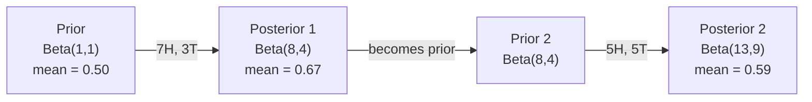

# Bayes teoremi

> Muhtemelenlik  Sorun senin beklediğin şeyle ilgili. Bayes teoremi  Sorun senin ne öğrendiğin şeyle ilgili.

**类型：**Yapım
**语言：**Python
**前置要求：**Eğitim 1 Fase, Ders 06
**时间：**~ 75 dakika

## Öğrenme hedefi

- Bayes teoremi uygulanır, ön olasılık ve kanıtlara göre, son olasılık hesaplanır.
- Züce bir yapım ile Laplace düzeltme ve log-uzay hesaplama
- MLE ile MAP tahminlerini karşılaştırın, MAP'ı nasıl L2 düzenlenmesine karşı koyacağınızı açıklayın
- Beta-Binomial konjugat öncüleri kullanmak A/B testleri için  sıralı Bayesian güncelleştirmeyi gerçekleştirmek

## 问题

Bir tıbbi testin %99 doğruluk oranı var. Test sonuçlarınız olumlu.

Çoğu insan 99% diyecektir. Gerçek cevap bu hastalığın nadir olmasına bağlıdır. Eğer her 10.000 kişiden sadece 1 kişi hastalanırsa, bir kez olumlu sonuç sadece hastalanma olasılığının yaklaşık %1 olduğunu gösterir. Diğer 99% olumlu sonuçlar sağlıklı insan tarafından meydana gelen yanlış haberlerdir.

Bu Bayes teorisi. Her spam filtre, her tıbbi teşhis, her ölçümsel belirsizlikten kaynaklanan bir ML modeli tamamen aynı düşünceleri kullanıyor.

Eğer bu noktayı anlamadığınızda bir ML sistemi oluşturursanız, model çıkışlarını yanlış anlayacaksınız, kötü eşiği ayarlayacaksınız ve aşırı güvenli tahminler yayınlayacaksınız.

## 概念

### Ortak olasılıktan Bayes'e.

6. derste şartsal olasılıkları biliyorsunuz:

```
P(A|B) = P(A and B) / P(B)
```

Görevi:

```
P(B|A) = P(A and B) / P(A)
```

两个表达式共享同一个分子:P(A ve B) ――令它们相等并重新整理:

```
P(A and B) = P(A|B) * P(B) = P(B|A) * P(A)

Therefore:

P(A|B) = P(B|A) * P(A) / P(B)
```

İşte Bayes teoremi.

### Dört bölüm

| Part | Name | What it means |
|------|------|---------------|
| P(A\|B) | Posterior | 看到 evidence B 之后，你对 A 的更新后 belief |
| P(B\|A) | Likelihood | 如果 A 为真，evidence B 出现的概率有多大 |
| P(A) | Prior | 在看到任何 evidence 之前，你对 A 的 belief |
| P(B) | Evidence | 在所有可能性下看到 B 的总概率 |

Kanıtlar P 项 B 起到归一化因子的作用── you can use the total probability law 展开 it:

```
P(B) = P(B|A) * P(A) + P(B|not A) * P(not A)
```

### 医学检测 örneği

Bir hastalık, her 10.000 insandan 1 kişiyi etkiliyor.

```
P(sick)          = 0.0001     (prior: disease is rare)
P(positive|sick) = 0.99       (likelihood: test catches it)
P(positive|healthy) = 0.01    (false positive rate)

P(positive) = P(positive|sick) * P(sick) + P(positive|healthy) * P(healthy)
            = 0.99 * 0.0001 + 0.01 * 0.9999
            = 0.000099 + 0.009999
            = 0.010098

P(sick|positive) = P(positive|sick) * P(sick) / P(positive)
                 = 0.99 * 0.0001 / 0.010098
                 = 0.0098
                 = 0.98%
```

%1'e kadar değil. Önceki önemli kontrol. Bir durum nadir olduğunda, doğru testlerin çoğu bile yanlış pozitif sonuçlar verir.

### Spam Filtresi Örneği

"Lotteri" kelimesini içeren bir e-posta aldın mı?

```
P(spam)                = 0.3      (30% of email is spam)
P("lottery"|spam)      = 0.05     (5% of spam emails contain "lottery")
P("lottery"|not spam)  = 0.001    (0.1% of legitimate emails contain "lottery")

P("lottery") = 0.05 * 0.3 + 0.001 * 0.7
             = 0.015 + 0.0007
             = 0.0157

P(spam|"lottery") = 0.05 * 0.3 / 0.0157
                  = 0.955
                  = 95.5%
```

Bir kelime oranını %30'dan %95.5'e çıkarır. Gerçek spam filtreyi aynı anda yüzlerce kelime üzerinde uygulayacaktır.

### Naive Bayes:Bağımsızlık varsayımı

Naive Bayes, tüm özellikleri bir sınıfın koşullarında birbirinden bağımsız olarak varsayarak, bu düşünceyi çeşitli özelliklere yaydı:

```
P(class | feature_1, feature_2, ..., feature_n)
  = P(class) * P(feature_1|class) * P(feature_2|class) * ... * P(feature_n|class)
    / P(feature_1, feature_2, ..., feature_n)
```

"Sırılgan"ın bir kısmı bağımsızlık varsayımıdır. Yazılarda, kelimelerin ortaya çıkması bağımsız değildir. "Yeni" ve "York" ilişkili değildir. Ancak bu varsayım pratikte şaşırtıcı bir etki doğurur, çünkü sınıflandırma makinesi sadece sınıflara  sıralama gerektirir, iyi bir olasılık oluşturmak yerine  sıralama gerektirir.

Çünkü tüm sınıflara göre aynı, sadece moleküller karşılaştırarak atlayabilirsin.

```
score(class) = P(class) * product of P(feature_i | class)
```

Seçim puanı en yüksek sınıfı

### Maksimum olasılık tahminleri (MLE)

√ √ √ √ √ √ √ √ √ √ √ √ √ √ √ √ √ √ √ √ √ √ √ √ √ √ √ √ √ √ √ √ √ √ √ √ √ √ √ √ √ √ √ √ √ √ √ √ √ √ √ √ √ √ √ √ √ √ √ √ √ √ √ √ √ √ √ √ √ √ √ √ √ √ √ √ √ √ √ √ √ √ √ √ √ √ √ √ √ √ √ √ √ √ √ √ √ √ √ √ √ √ √ √ √ √ √ √ √ √ √ √ √ √ √ √ √ √ √ √ √ √ √ √ √ √ √ √ √ √ √ √ √ √ √ √ √ √ √ √ √ √ √ √ √ √ √ √ √ √ √ √ √ √ √ √ √ √ √ √ √ √ √ √ √ √ √ √ √ √ √ √ √ √ √ √ √ √ √ √ √ √ √ √ √ √ √ √ √ √ √ √ √ √ √ √ √ √ √ √ √ √ √ √ √ √ √ √ √ √ √ √ √ √ √ √ √ √ √ √ √ √ √ √ √ √ √ √ √ √ √ √ √ √ √ √ √ √ √ √ √ √ √ √ √ √ √ √ √ √    √     

```
P("free"|spam) = (number of spam emails containing "free") / (total spam emails)
```

İşte MLE: Seçim için gözlem verisini en olası belirleme değerini seçin.

问题: Eğer bir kelime eğitim sırasında hiç spam'de görünmezse, MLE ona sıfır olasılıklar dağıtacak.

```
P(word|class) = (count(word, class) + 1) / (total_words_in_class + vocabulary_size)
```

Her sayı 1'e ekle, ve olasılıkların hiç de sıfır olmayacağını garanti et.

### Maksimum a posteriori (MAP)

MLE 问的是: hangi parametreler maksimum P((bkz parametre)?

MAP 问的是: hangi parametreler maksimum P(parametre verileri içerir)?

Bayes teoremesine göre:

```
P(parameters|data) proportional to P(data|parameters) * P(parameters)
```

MAP, parametreler üzerinde bir öncüye katılır. Eğer parametrelerin daha küçük olması gerektiğini düşünüyorsanız, onu büyük değerli bir öncüye ödenmek için kodlayın. ML'deki L2 düzenlenmesiyle tamamen aynıdır.

| Estimation | Optimizes | ML equivalent |
|------------|-----------|---------------|
| MLE | P(data\|params) | 未 regularize 的训练 |
| MAP | P(data\|params) * P(params) | L2 / L1 regularization |

### Bayesian vs. Frequentist:实践差异

Frequentistler parametreyi sabit ama bilinmeyen bir miktar olarak görüyorlar.

Bayesililer Parametreyi Değiştirmek için Değiştirir. Onlar soruyorlar:  Gördüğüm konulara dayanarak, bu parametrelere ne inanıyorum?

Construction ML system için, pratik farklılıkları aşağıdakiler:

| Aspect | Frequentist | Bayesian |
|--------|-------------|----------|
| Output | 点估计 | 值上的 distribution |
| Uncertainty | Confidence intervals（关于过程） | Credible intervals（关于 parameter） |
| Small data | 可能 overfit | Prior 起到 regularization 的作用 |
| Computation | 通常更快 | 通常需要 sampling（MCMC） |

Çoğu üretim seviyesinde ML sıklıklı bir yöntemdir. SGD 点估算) ⋅ Bayesian yöntemleri çok yararlı olacaktır.

### Bayesian düşüncesi neden ML için çok önemlidir ?

Bu tür bağlantılar daha derin:

**Priors 就是 regularization。**Yukarıdaki ağırlıklar Gaussian öncü L2 düzenlenmesi. L1'ün öncü yer L1'ün öncü yer. Her ek düzenlenme sırasında, sen de beklenen parametreler değerlerine karşı Bayesian bir ifade yaparsın.

**Posteriors 就是不确定性。**单个预测概率不能告诉你模型对该估计有多信心――Bayesian Metods Will Give You A Distribution:我认为P(spam) 间 0.8 到 0.95 之间──

**Bayes updates 就是 online learning。**Bugünün sonrası yarınki öncülüğe dönüşecek. Modeliniz yeni verileri gördüğünde, sıfırdan yeniden eğitilmek yerine inançlarını yenileyecektir.

**Model comparison 是 Bayesian 的。**Bayesian bilgi kriterleri (BIC) ✓ sınırlı olasılıkla birlikte Bayes faktörleri Bayesian mantık kullanır.


```figure
bayes-update
```

## Yapın onu.
### 步骤 1: Bayes teoremi işlevi

```python
def bayes(prior, likelihood, false_positive_rate):
    evidence = likelihood * prior + false_positive_rate * (1 - prior)
    posterior = likelihood * prior / evidence
    return posterior

result = bayes(prior=0.0001, likelihood=0.99, false_positive_rate=0.01)
print(f"P(sick|positive) = {result:.4f}")
```

### 步骤 2: Naive Bayes sınıflandırıcısı

```python
import math
from collections import defaultdict

class NaiveBayes:
    def __init__(self, smoothing=1.0):
        self.smoothing = smoothing
        self.class_counts = defaultdict(int)
        self.word_counts = defaultdict(lambda: defaultdict(int))
        self.class_word_totals = defaultdict(int)
        self.vocab = set()

    def train(self, documents, labels):
        for doc, label in zip(documents, labels):
            self.class_counts[label] += 1
            words = doc.lower().split()
            for word in words:
                self.word_counts[label][word] += 1
                self.class_word_totals[label] += 1
                self.vocab.add(word)

    def predict(self, document):
        words = document.lower().split()
        total_docs = sum(self.class_counts.values())
        vocab_size = len(self.vocab)
        best_class = None
        best_score = float("-inf")
        for cls in self.class_counts:
            score = math.log(self.class_counts[cls] / total_docs)
            for word in words:
                count = self.word_counts[cls].get(word, 0)
                total = self.class_word_totals[cls]
                score += math.log((count + self.smoothing) / (total + self.smoothing * vocab_size))
            if score > best_score:
                best_score = score
                best_class = cls
        return best_class
```

Log olasılıkları, düşük akışın önlenmesini sağlar. Çok küçük olasılık çarpmaları, yüzen noktaya karşı çok küçük sayılarda oluşur.

### Adım 3: Spam Bilgi Üzerinde Eğitim

```python
train_docs = [
    "win free money now",
    "free lottery ticket winner",
    "claim your prize today free",
    "urgent offer free cash",
    "congratulations you won free",
    "meeting tomorrow at noon",
    "project update attached",
    "can we schedule a call",
    "quarterly report review",
    "lunch on thursday sounds good",
    "team standup notes attached",
    "please review the pull request",
]

train_labels = [
    "spam", "spam", "spam", "spam", "spam",
    "ham", "ham", "ham", "ham", "ham", "ham", "ham",
]

classifier = NaiveBayes()
classifier.train(train_docs, train_labels)

test_messages = [
    "free money waiting for you",
    "meeting rescheduled to friday",
    "you won a free prize",
    "please review the attached report",
]

for msg in test_messages:
    print(f"  '{msg}' -> {classifier.predict(msg)}")
```

### 4 adım: inceleme öğrenme olasılığı

```python
def show_top_words(classifier, cls, n=5):
    vocab_size = len(classifier.vocab)
    total = classifier.class_word_totals[cls]
    probs = {}
    for word in classifier.vocab:
        count = classifier.word_counts[cls].get(word, 0)
        probs[word] = (count + classifier.smoothing) / (total + classifier.smoothing * vocab_size)
    sorted_words = sorted(probs.items(), key=lambda x: x[1], reverse=True)
    for word, prob in sorted_words[:n]:
        print(f"    {word}: {prob:.4f}")

print("\nTop spam words:")
show_top_words(classifier, "spam")
print("\nTop ham words:")
show_top_words(classifier, "ham")
```

## Kullan
Scikit-learning  üretilebilir saf Bayes  gerçekleştirmek için sağladı:

```python
from sklearn.feature_extraction.text import CountVectorizer
from sklearn.naive_bayes import MultinomialNB
from sklearn.metrics import classification_report

vectorizer = CountVectorizer()
X_train = vectorizer.fit_transform(train_docs)
clf = MultinomialNB()
clf.fit(X_train, train_labels)

X_test = vectorizer.transform(test_messages)
predictions = clf.predict(X_test)
for msg, pred in zip(test_messages, predictions):
    print(f"  '{msg}' -> {pred}")
```

Aynı algoritma.CountVectorizer. Tokenizasyon ve kelimeforumu oluşturmayı işleyen.MultinomialNB.

## - Söyle.
Bu yapılandırılmış NaiveBayes sınıfı  tam bir boru hattını gösterdi: tokenizasyon  Laplace düzleştirme kullanımı  log- uzay tahminleri `code/bayes.py`Python standart kütüphanesi dışında herhangi bir bağımlılık gerektirmez.

### Birlikte Birlikte Birlikte Birlikte Birlikte Birlikte Birlikte Birlikte Birlikte Birlikte Birlikte Birlikte Birlikte Birlikte Birlikte Birlikte Birlikte Birlikte Birlikte Birlikte Birlikte Birlikte Birlikte Birlikte Birlikte Birlikte Birlikte Birlikte Birlikte Birlikte Birlikte Birlikte Birlikte Birlikte Birlikte Birlikte Birlikte Birlikte Birlikte Birlikte Birlikte Birlikte Birlikte Birlikte Birlikte Birlikte Birlikte Birlikte Birlikte Birlikte Birlikte Birlikte Birlikte Birlikte Birlikte Birlikte Birlikte Birlikte Birlikte Birlikte Birlikte Birlikte Birlikte Birlikte Birlikte Birlikte Birlikte Birlikte Birlikte Birlikte Birlikte Birlikte Birlikte Birlikte Birlikte Birlikte Birlikte Birlikte Birlikte Birlikte Birlikte Birlikte Birlikte Birlikte Birlikte Birlikte Birlikte Birlikte Birlikte Birlikte Birlikte Birlikte Birlikte Birlikte Birlikte Birlikte Birlikte Birlikte Birlikte Birlikte Birlikte Birlikte Birlikte Birlikte Birlikte Birlikte Birlikte Birlikte Birlikte Birlikte Birlikte Birlikte Birlikte Birlikte Birlikte Birlikte Birlikte Birlikte Birlikte Birlikte Birlikte Birlikte Birlikte Birlikte Birlikte Birlikte Birlikte Birlikte Birlikte Birlikte Birlikte Birlikte Birlikte Birlikte Birlikte Birlikte Birlikte Birlikte Birlikte Birlikte Birlikte Birlikte Birlikte Birlikte Birlikte Birlikte Birlikte Birlikte Birlikte Birlikte Birlikte Birlikte Birlikte Birlikte Birlikte Birlikte Birlikte Birlikte Birlikte Birlikte Birlikte Birlikte Birlikte Birlikte Birlikte Birlikte Birlikte Birlikte Birlikte Birlikte Birlikte Birlikte Birlikte Birlikte Birlikte Birlikte Birlikte Birlikte Birlikte Birlikte Birlikte Birlikte Birlikte Birlikte Birlikte Birlikte Birlikte Birlikte Birlikte Birlikte Birlikte Birlikte Birlikte Birlikte Birlikte Birlikte Birlikte Birlikte Birlikte Birlikte Birlikte Birlikte Birlikte Birlikte Birlikte Birlikte Birlikte Birlikte Birlikte Birlikte Birlikte Birlikte Birlikte Birlikte Birlikte Birlikte Birlikte Birlikte Birlikte Birlikte Birlikte Birlikte Birlikte Birlikte Birlikte Birlikte Birlikte Birlikte Birlikte Birlikte Birlikte Birlikte Birlikte Birlikte Birlikte Birlikte Birlikte Birlikte Birlikte Birlikte Birlikte Birlikte Birlikte Birlikte Birlikte Birlikte Birlikte Birlikte Birlikte Birlikte Birlikte Birlikte Birlikte Birlikte Birlikte

Eğer ön ve arka  aynı dağılım ailesine aittirse, bu ön "konjugat" olarak adlandırılır. Bu Bayesian güncelleme sırasında çok temiz 

| Likelihood | Conjugate Prior | Posterior | Example |
|-----------|----------------|-----------|---------|
| Bernoulli | Beta(a, b) | Beta(a + successes, b + failures) | Coin flip bias estimation |
| Normal (known variance) | Normal(mu_0, sigma_0) | Normal(weighted mean, smaller variance) | Sensor calibration |
| Poisson | Gamma(a, b) | Gamma(a + sum of counts, b + n) | Modeling arrival rates |
| Multinomial | Dirichlet(alpha) | Dirichlet(alpha + counts) | Topic modeling, language models |

Bu neden önemlidir: Konjugat öncüleri yokken, Monte Carlo örneğine veya sonraki yaklaşımdaki değişim sonuçlarına ihtiyacınız var.

Beta dağılım, uygulamada en yaygın birleştirilmiş öncüdür. Beta, a, b) Bir olasılık parametresi karşı inancınızı ifade eder.

Beta öncesi özel durumları:
- Beta(1, 1) = birer.
- Beta(10, 10) = = = = = = = = = = = = = = = = = = = = = = = = = = = = = = = = = = = = = = = = = = = = = = = = = = = = = = = = = = = = = = = = = = = = = = = = = = = = = = = = = = = = = = = = = = = = = = = = = = = = = = = = = = = = = = = = = = = = = = = = = = = = = = = = = = = = = = = = = = = = = = = = = = = = = = = = = = = = = = = = = = = = = = = = = = = = = = = = = = = = = = = = = = = = = = = = = = = = = = = = = = = = = = = = = = = = = = = = = = = = = = = = = = = = = = = = = = = = = = = = = = = = = = = = = = = = = = = = = = = = = = = = = = = = = = = = = = = = = = = = = = = = = = = = = = = = = = = = = = = = = = = = = = = = = = = = = = = = = = = = = = = = = = = = = = = = = = = = = = = = = = = = = = = = = = = = = = = = = = = = = = = = = = = = = = = = = = = = = = = = = = = = = = = = = = = = = = = = = = = = = = = = = = = = = = = = = = = = = = = = = = = = = = = = = = = = = = = = = = = = = = = = = = = = = = = = = = = = = = = = = = = = = = = = = = = = = = = = = = = = = = = = = = = = = = = = = = = = = = = = = = = = = =
- Beta(1, 10) = 向 0 偏斜──你相信参数 很小──

更新规则极其简单:

```
Prior:     Beta(a, b)
Data:      s successes, f failures
Posterior: Beta(a + s, b + f)
```

没有积分――没有样本――只有加法――

### Bayesian Değişiklikleri

Bayesian sonucu 天然是序列的──今日的后者会成为明天的前者──这是现实系统如何在不重新处理所有历史数据的情况下增量学习──

具体例: bir kârın adil olup olmadığını tahmin etmek

**Day 1：还没有数据。**
Beta'dan (1,1) 开始一个统一的前者――你没有意见――
- Önceki ortalama:0.5
- Önceki = [0, 1]

**Day 2：观察到 7 次正面，3 次反面。**
Arka = Beta(1 + 7, 1 + 3) = Beta(8, 4)
- Aralık ortalama:8/12 = 0,667
- Kanıtlar , çetin parayı doğru yönde yönlendirdiğini göstermektedir .

**Day 3：又观察到 5 次正面，5 次反面。**
Geçmişi bugünün önünü olarak kullanın.
Arka = Beta(8 + 5, 4 + 5) = Beta(13, 9)
- Aralık ortalama:13/22 = 0,591
- Yeni dengeler verileri , tahmin değerini 0.5 civarına geri döndü .



观测顺序不重要――Beta(1,1) 一次性用全部12次正面和8次反面更新,也会得到Beta(13, 9) 结果相同──序列更新和批次更新 在数学上等价──但序列更新 允许你在每一步做决定,无需存储原始数据──

Bu, üretim sınıfı ML  sisteminde çevrimiçi öğrenmenin temelidir.

### A/B Testlerle İletişim

A/B testleri aslında uydurma Bayesian sonuçlardır.

设定:你正在测试两种按颜色──A çeşitleri A 蓝色) 和 B çeşitleri B 绿色)──你想知道哪一个得到更多点击──

Bayesian A/B testi:

1. **Prior。**Beta'dan gelen iki varians var.
2. **Data。**A: 1000 kez gösterim içinde 50 kez tıklayın.
3. **Posteriors。**
   - A:Beta(1 + 50, 1 + 950) = Beta(51, 951) ・・・ Ortalama = 0.051
   - B:Beta(1 + 65, 1 + 935) = Beta(66, 936) ・・・ Ortalama = 0,066
4. **Decision。**计算 P(B > A) B'nin gerçek dönüşüm oranı A'nın muhtemelliğinden daha yüksektir。

解析地计算 P(B > A) 很困难――但蒙特卡罗 让它变得非常简单:

```
1. Draw 100,000 samples from Beta(51, 951)  -> samples_A
2. Draw 100,000 samples from Beta(66, 936)  -> samples_B
3. P(B > A) = fraction of samples where B > A
```

Eğer P(B > A) > 0.95, B. Variansı yayınlar. Eğer 0.05 ve 0.95 arasında ise, verileri toplamaya devam eder.

A/B testlerinin avantajları:
- Bir doğrudan olasılık elde edeceksiniz. %97 oranı daha iyi.
- 没有 p-value 混──没有 fail to reject the null hypothesis  这种回避表述──
- Her zaman sonuçları görebilirsin, ama yanlış pozitif oranları yükseltmeyeceksin.
- Önceki bilgiyi de dahil edebilirsiniz. Örneğin, önceki testler dönüşüm oranlarını genellikle %3-8 gösteriyor.

| Aspect | Frequentist A/B | Bayesian A/B |
|--------|----------------|--------------|
| Output | p-value | P(B > A) |
| Interpretation | “如果 A=B，这些数据有多令人意外？” | “B 比 A 更好的可能性有多大？” |
| Early stopping | 会抬高 false positives | 任意时点都是安全的（前提是 prior 选择合理且 model specification 正确） |
| Prior knowledge | 不使用 | 编码为 Beta prior |
| Decision rule | p < 0.05 | P(B > A) > threshold |

## 练习
1. **Multiple tests。**İki testte bir hasta iki bağımsız testte olumlu bir şekilde test edildi. İki testte yüzde 99 doğrudur.

2. **Smoothing impact。**0.01、0.1、1.0 和 10.0 运行垃圾邮件分类器──Top kelime olasılığı 会如何变化?

3. **Add features。**扩展 NaiveBayes sınıfı, onu kelime sayımlarından başka 之外, 也使用消息长度(short/long)作为特征──从训练数据中估计 P(((shortspam) 和 P(short时时时时时时时),并把它合并到预测分中──

4. **MAP by hand。**给定观测数据(10 kez para atışları arasında 7 kez başlar var), Beta(2,2) kullanın öncesinde 计算偏差 的 MAP tahminleri──把它与MLE tahminleri(7/10)

## 关键术语
| Term | What people say | What it actually means |
|------|----------------|----------------------|
| Prior | “我的初始猜测” | 观测 evidence 之前的 P(hypothesis)。在 ML 中：regularization 项。 |
| Likelihood | “数据拟合得有多好” | P(evidence\|hypothesis)。在特定 hypothesis 下，观测数据出现的概率有多大。 |
| Posterior | “我更新后的 belief” | P(hypothesis\|evidence)。Prior 乘以 likelihood，然后归一化。 |
| Evidence | “归一化常数” | 所有 hypotheses 下的 P(data)。确保 posterior 求和为 1。 |
| Naive Bayes | “那个简单的文本分类器” | 一个假设 features 在给定 class 时相互独立的分类器。尽管该假设不成立，效果仍然很好。 |
| Laplace smoothing | “Add-one smoothing” | 给每个 feature 增加一个小计数，以防止未见数据产生零概率。 |
| MLE | “直接用频率” | 选择最大化 P(data\|parameters) 的 parameters。没有 prior。在小数据上可能 overfit。 |
| MAP | “带 prior 的 MLE” | 选择最大化 P(data\|parameters) * P(parameters) 的 parameters。等价于 regularized MLE。 |
| Log-probability | “在 log space 中工作” | 使用 log(P) 而不是 P，避免许多小数相乘时发生 floating-point underflow。 |
| False positive | “错误警报” | 检测结果为阳性，但真实状态为阴性。它会推动 base rate fallacy。 |

## 延伸阅读
- [3Blue1Brown: Bayes' theorem](https://www.youtube.com/watch?v=HZGCoVF3YvM)- Medical test örnek kullanın görülebilir açıklama
- [Stanford CS229: Generative Learning Algorithms](https://cs229.stanford.edu/notes2022fall/cs229-notes2.pdf)- Naif Bayes ve onun ayrımcılık modelleriyle bağlantısı
- [Think Bayes](https://greenteapress.com/wp/think-bayes/)- 免费书籍,包含 Python 代码的贝耶斯统计
- [scikit-learn Naive Bayes](https://scikit-learn.org/stable/modules/naive_bayes.html)- Üretim sınıfı ve her türlü variantın ne zaman kullanılması
