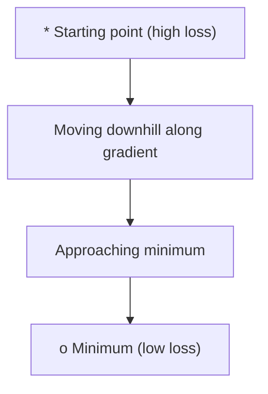
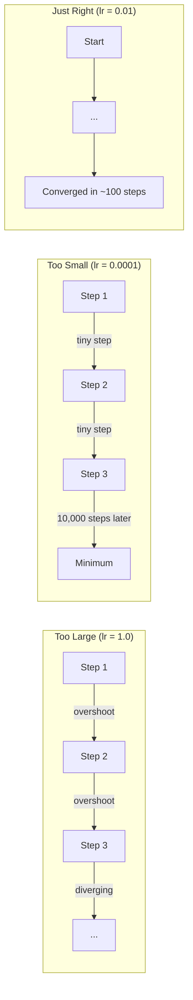
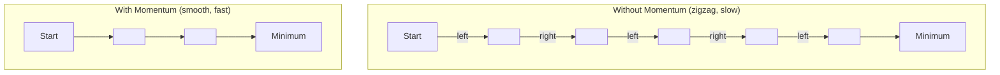
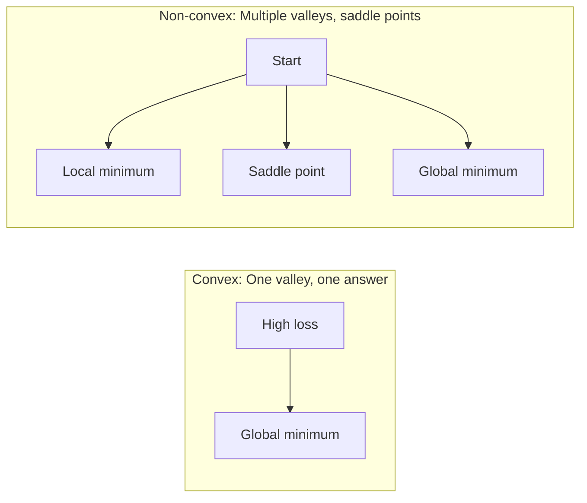
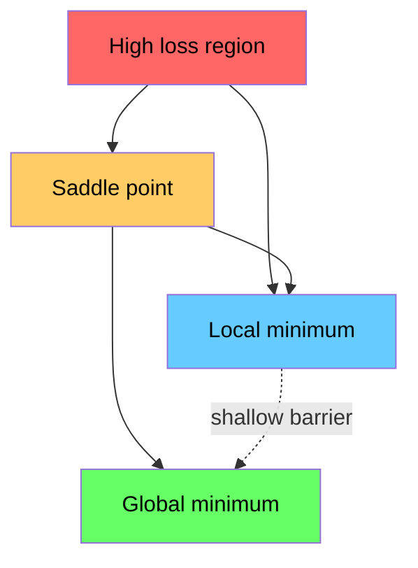

# Optimize

> Neural Network'i eğitmek, aslında dağ vadisinin en düşük noktasını bulmak demektir.

**Type:** Build
**Language:**Python
**Prerequisites:** Phase 1, Lessons 04-05 (Derivatives, Gradients)
**Time:** ~75 minutes

## Öğrenme hedefi
- Vanil gradient düşüşünü, momentumu ve Adem'i gerçekleştirmek için SGD'yi sıfırdan gerçekleştirmek
- Rosenbrock fonksiyonunu karşılaştır 收表现,并解释为什么Adam会为每重自适应调整学习率
- 区分 convex ve non-convex Kayıp manzarası,并解释 addel point 在高维空间中的作用
- Configure learning rate schedules ((step decay]], cozin annealing, warmingup) to improve training stability

## 问题
Bir Kayıp fonksiyonu vardır. Bu size modelin yanlış olduğunu söyler. Bu size bir dereceyi gösterir. Bu size Kayıpın daha kötü hale gelmesini sağlayacak yönleri söyler.

En basit yöntem çok basit:朝 Gradient'in ters yön hareketleri. Bir öğrenme hızının sayısını kullanarak hızlandırmak. Bu, gradient düşüşüdür ve gerçekten de etkili. Ama 有效 前提── öğrenme hızı 太大, sen doğrudan tüm vadide, iki taraf arasında geri dönmek 太小, sen binlerce gereksiz adımla cevaplara doğru yavaş tırmanırsın.

Derin Öğrenme'deki her optimizer aynı soruyu cevaplıyor: Nasıl daha hızlı, daha güvenilir bir şekilde dağ vadisinin altına ulaşabiliriz?

## 概念
### Optimize edilmenin anlamı

Optimize, bir işlevi en aza indirmek için bir giriş değerini aramak demektir.

```
minimize L(w) where:
  L = loss function
  w = model weights (could be millions of parameters)
```

### Değerlendirme (vanil)

En basit Optimizer, hesaplama, her ağırlığın Gradiyenti ile karşılaştırıldığında kaybı, her ağırlığın Gradiyenti ile karşı yönde hareket etmesini sağlar.

```
w = w - lr * gradient
```

İşte tam bir algoritma.



### Öğrenme hızı: en önemli hiperparametre

Öğrenme hızı kontrol etmektedir.



Doğru öğrenme oranını doğrudan verebilecek bir formül yoktur. Bunu deney yoluyla bulmanız gerekir.

### SGD vs. parti vs. mini parti

Vanilla gradient düşüşü, bir adım öncesinde, tüm veri kümesi üzerinde hesaplanır. Bu, parti gradient düşüşü olarak adlandırılır.

Stochastic gradient descent (SGD) on a single random sample (SGD) on a single random sample on a calculated Gradient,并立即更新──它噪音大,但快──)

Mini-batch gradient descent 折中处理──先在一个小批(32、64、128、256 个样本) 上计算 Gradient,然后更新──这是实际中大家真正使用的方法──

| Variant | Batch size | Gradient quality | Speed per step | Noise |
|---------|-----------|-----------------|---------------|-------|
| Batch GD | 整个 dataset | 精确 | 慢 | 无 |
| SGD | 1 个样本 | 噪声很大 | 快 | 高 |
| Mini-batch | 32-256 | 良好估计 | 均衡 | 中等 |

SGD ve mini-batch içindeki gürültü bir hata değildir.

### Momentum: Dağa aşağı fırlayan küçük top

Vanil gradient düşüşü sadece şu anda görülen gradientlerdir. Eğer gradient geri dönerse, bu sorun çözülür.

```
v = beta * v + gradient
w = w - lr * v
```

类比是: bir top dağın altına doğru yuvarlanır. O her küçük bir köşe üzerinde durur, tekrar başlar.



`beta`(genellikle 0.9) kontrol yaparak çok fazla tarihsel bilgiyi saklamak, beta 越高, momentum 越强, yol yol daha düz, ama yön değişimlerine karşı tepki de daha yavaş.

### Adam:Adaptif öğrenme oranları

Farklı ağırlıklar farklı öğrenme oranlarına ihtiyaç duyar. Bazıları büyük derecelerin ağırlığını çok az elde ederken, büyük derecelerin ağırlığını elde ederken daha büyük adımlar atmalıdır.

Adam, her ağırlık için iki şey yapacaktır.

1. İlk moment ((m):Gradients'in akış ortalaması ((( benzer momentum)
2. İkinci an ((v): kare gradientlerin                                                                                                                                                                                                                                                           

```
m = beta1 * m + (1 - beta1) * gradient
v = beta2 * v + (1 - beta2) * gradient^2

m_hat = m / (1 - beta1^t)    bias correction
v_hat = v / (1 - beta2^t)    bias correction

w = w - lr * m_hat / (sqrt(v_hat) + epsilon)
```

Üstelik`sqrt(v_hat)`Bu, önemli bir anlayıştır. Büyük derecelerin ağırlıkları büyük derecelerin ağırlıkları büyük derecelerin ağırlıkları küçük derecelerin ağırlıkları küçük derecelerin ağırlıkları büyük derecelerin ağırlıkları büyük derecelerin ağırlıkları büyük derecelerin ağırlıkları büyük derecelerin ağırlıkları büyük derecelerin ağırlıkları büyük derecelerin ağırlıkları büyük derecelerin ağırlıkları büyük derecelerin ağırlıkları büyük derecelerin ağırlıkları büyük derecelerin ağırlıkları büyük derecelerin ağırlıkları büyük derecelerin ağırlıkları büyük derecelerin ağırlıkları büyük derecelerin ağırlıkları büyük derecelerin ağırlıkları büyük derecelerin ağırlıkları büyük derecelerin ağırlıkları büyük derecelerin ağırlıkları büyük derecelerin değişimleri büyük derecelerin değişimleri büyük derecelerin değişimleri büyük derecelerin değişimleri büyük derecelere değişimleri büyük derecelere değişimleri büyük derecelere değişimler.

默认 hiperparametre:`lr=0.001, beta1=0.9, beta2=0.999, epsilon=1e-8`Bu standartlar çoğu soruya karşı geçerlidir.

### Öğrenme oranı programları

固定的学习率是一种折中──早期训练,你希望步子大一些,以便快速取得进展──训练后期,你希望步子小一些,以便在最小的附近精调──

常见 çizelgeleri:

| Schedule | Formula | Use case |
|----------|---------|----------|
| Step decay | lr = lr * factor every N epochs | 简单，手动控制 |
| Exponential decay | lr = lr_0 * decay^t | 平滑降低 |
| Cosine annealing | lr = lr_min + 0.5 * (lr_max - lr_min) * (1 + cos(pi * t / T)) | Transformers，现代训练 |
| Warmup + decay | 线性上升，然后 decay | 大模型，防止早期不稳定 |

### Konves vs. konves olmayan

Sıkı bir fonksiyon                                                                                                                                                                                                                                                            `f(x) = x^2`Bu tür kare bir konvekstir.

Nöral Ağ Kayıp fonksiyonları konveks değildir.



實踐中,高维神經網絡中的本地 minima 很少是真正的问题──大部分的本地 minima 的損失值都接近全球最小──

### Kayıp manzarayı görselleştirme

Kayıp tüm ağırlıkların işlevi olan bir işlevi olan Kayıp manzarası, 100 milyon ağırlığa sahip bir model için 1.000.000.000 维空间 içindedir.



Keskin minimumlar 泛化差──Plat minimler 泛化较好── bu da son test doğruluğunda SPD'nin momentumuyla sonuçlanan bir neden.


```figure
gradient-descent
```

## Yapın onu.
### 步骤 1: Test fonksiyonunu tanımlayın

Rosenbrock fonksiyonu klasik optimizasyon referansıdır. En azı (1, 1), bir kargaşa 曲 山谷 içinde bulunur.

```
f(x, y) = (1 - x)^2 + 100 * (y - x^2)^2
```

```python
def rosenbrock(params):
    x, y = params
    return (1 - x) ** 2 + 100 * (y - x ** 2) ** 2

def rosenbrock_gradient(params):
    x, y = params
    df_dx = -2 * (1 - x) + 200 * (y - x ** 2) * (-2 * x)
    df_dy = 200 * (y - x ** 2)
    return [df_dx, df_dy]
```

### 步骤 2: Vanil gradient düşüşü

```python
class GradientDescent:
    def __init__(self, lr=0.001):
        self.lr = lr

    def step(self, params, grads):
        return [p - self.lr * g for p, g in zip(params, grads)]
```

### 步骤 3: İhtimalle SGD

```python
class SGDMomentum:
    def __init__(self, lr=0.001, momentum=0.9):
        self.lr = lr
        self.momentum = momentum
        self.velocity = None

    def step(self, params, grads):
        if self.velocity is None:
            self.velocity = [0.0] * len(params)
        self.velocity = [
            self.momentum * v + g
            for v, g in zip(self.velocity, grads)
        ]
        return [p - self.lr * v for p, v in zip(params, self.velocity)]
```

### 4 adım: Adam

```python
class Adam:
    def __init__(self, lr=0.001, beta1=0.9, beta2=0.999, epsilon=1e-8):
        self.lr = lr
        self.beta1 = beta1
        self.beta2 = beta2
        self.epsilon = epsilon
        self.m = None
        self.v = None
        self.t = 0

    def step(self, params, grads):
        if self.m is None:
            self.m = [0.0] * len(params)
            self.v = [0.0] * len(params)

        self.t += 1

        self.m = [
            self.beta1 * m + (1 - self.beta1) * g
            for m, g in zip(self.m, grads)
        ]
        self.v = [
            self.beta2 * v + (1 - self.beta2) * g ** 2
            for v, g in zip(self.v, grads)
        ]

        m_hat = [m / (1 - self.beta1 ** self.t) for m in self.m]
        v_hat = [v / (1 - self.beta2 ** self.t) for v in self.v]

        return [
            p - self.lr * mh / (vh ** 0.5 + self.epsilon)
            for p, mh, vh in zip(params, m_hat, v_hat)
        ]
```

### 步骤 5: Çalıştır ve karşılaştır

```python
def optimize(optimizer, func, grad_func, start, steps=5000):
    params = list(start)
    history = [params[:]]
    for _ in range(steps):
        grads = grad_func(params)
        params = optimizer.step(params, grads)
        history.append(params[:])
    return history

start = [-1.0, 1.0]

gd_history = optimize(GradientDescent(lr=0.0005), rosenbrock, rosenbrock_gradient, start)
sgd_history = optimize(SGDMomentum(lr=0.0001, momentum=0.9), rosenbrock, rosenbrock_gradient, start)
adam_history = optimize(Adam(lr=0.01), rosenbrock, rosenbrock_gradient, start)

for name, history in [("GD", gd_history), ("SGD+M", sgd_history), ("Adam", adam_history)]:
    final = history[-1]
    loss = rosenbrock(final)
    print(f"{name:6s} -> x={final[0]:.6f}, y={final[1]:.6f}, loss={loss:.8f}")
```

预期输出:Adam 收最快──带动力 的 SGD 路径更平滑──Vanilla GD 狭窄山谷中进展缓慢──

## Kullan
实践中, PyTorch veya JAX Optimizers kullanın.

```python
import torch

model = torch.nn.Linear(784, 10)

sgd = torch.optim.SGD(model.parameters(), lr=0.01, momentum=0.9)
adam = torch.optim.Adam(model.parameters(), lr=0.001)
adamw = torch.optim.AdamW(model.parameters(), lr=0.001, weight_decay=0.01)

scheduler = torch.optim.lr_scheduler.CosineAnnealingLR(adam, T_max=100)
```

经验法则:

- Adam'dan (rl=0.001) başlamak için, çoğu sorunun üzerinde çalışmak için bir düzenleme yapılması gerekmez.
- En iyi son doğruluğa ihtiyacınız olduğunda ve daha fazla düzenleme maliyetini karşılayabilmeniz için, SGD'nin hızla geçiş yapın: LR=0.01, Momentum=0.9)
- Adam'ın ağırlığındaki bozulma ile.
- Birkaç dönemden fazla süre boyunca eğitim süresi programını her zaman kullanmak.
- Eğer eğitim dengesizse, öğrenme oranını düşürürsen, eğer eğitim çok yavaşsa, onu artırırsın.

## - Söyle.
Bu ders, uygun optimizer seçimi için bir sürpriz oluşturdu.`outputs/prompt-optimizer-guide.md`- Evet.

Bu yapılandırılmış Optimizer sınıfları 3. aşamada tekrar ortaya çıkacak ve o zaman sıfırdan bir sinir ağı eğitime başlayacağız.

## 练习
1. **Learning rate sweep.**Rosenbrock fonksiyonunda, öğrenme oranlarının (0.0001, 0.0005, 0.001, 0.005, 0.01) kullanımı ile, her öğrenme oranına yönelik olarak, 5000 adım sonra çizim veya basma son kaybı olarak, hala elde edilebilecek en yüksek öğrenme oranını bulmak için,

2. **Momentum comparison.**Rosenbrock fonksiyonunda 运行带动态的 SGD──跟踪每一步的损失──哪个动态值 收最快?哪个会超越?

3. **Saddle point escape.**定义函数 `f(x, y) = x^2 - y^2`(origin point has a saddle point) 〜 (0.01, 0.01) 开始── Comparison vanilla GD、带 momentum 的 SGD 和 Adam 的行为──哪个能逃离 saddle point?

4. **Implement learning rate decay.**GradientDescent sınıfı 添加指数式衰退日程:`lr = lr_0 * 0.999^step`◊ Rosenbrock fonksiyonunda  performansı  % % % % % % % % % % % % % % % % % % % % % % % % % % % % % % % % % % % % % % % % % % % % % % % % % % % % % % % % % % % % % % % % % % % % % % % % % % % % % % % % % % % % % % % % % % % % % % % % % % % % % % % % % % % % % % % % % % % % % % % % % % % % % % % % % % % % % % % % % % % % % % % % % % % % % % % % % % % % % % % % % % % % % % % % % % % % % % % % % % % % % % % % % % % % % % % % % % % % % % % % % % % % % % % % % % % % % % % % % % % % % % % % % % % % % % % % % % % % % % % % % % % % % % % % % % % % % % % % % % % % % % % % % % % % % % % % % % % % % % % % % % % % % % % % % % % % % % % % % % % % % % % % % % % % % % % % % % % % % % % % % % % % % % % % % % % % % % % % % % % % % % % % % % % % % % % % % % % % % % % % % % % % % % % % % % % % % % % % % % % % % % % % % % % % % % % % % % % % % % % % % % % % % % % % % % % % % % % % % % % % % % % % % % % % % % % % % % % % % % % % % % % % % % % % % % % % % % % % % % % % % % % % % % % % % % % % % % % % % % % % % % % % % % % % % % % % % % %

## 关键术语
| Term | What people say | What it actually means |
|------|----------------|----------------------|
| Gradient descent | “Go downhill” | 通过减去按 learning rate 缩放后的 Gradient 来更新 weights。最基础的 Optimizer。 |
| Learning rate | “Step size” | 控制每次更新让 weights 移动多远的标量。太大会导致发散。太小会浪费计算。 |
| Momentum | “Keep rolling” | 将过去的 Gradients 累积到一个 velocity Vector 中。抑制震荡，并加速沿一致方向的移动。 |
| SGD | “Random sampling” | Stochastic gradient descent。用随机子集而不是完整 dataset 计算 Gradient。实践中几乎总是指 mini-batch SGD。 |
| Mini-batch | “A chunk of data” | 用于估计 Gradient 的一小部分训练数据（32-256 个样本）。平衡速度与 Gradient 准确性。 |
| Adam | “The default optimizer” | Adaptive Moment Estimation。跟踪每个 weight 的 Gradients 和 squared gradients 的 running averages，从而为每个 weight 提供自己的 learning rate。 |
| Bias correction | “Fix the cold start” | Adam 的 first 和 second moments 初始化为零。Bias correction 在早期步骤中通过除以 (1 - beta^t) 进行补偿。 |
| Learning rate schedule | “Change lr over time” | 在训练过程中调整 learning rate 的函数。早期大步，后期小步。 |
| Convex function | “One valley” | 任意 local minimum 都是 global minimum 的函数。Gradient descent 总能找到它。Neural Network losses 不是 convex。 |
| Saddle point | “Flat but not a minimum” | Gradient 为零，但在某些方向上是 minimum、在另一些方向上是 maximum 的点。高维空间中很常见。 |
| Loss landscape | “The terrain” | 在 weight space 上绘制出的 Loss function。通过沿两个随机方向切片来可视化。 |
| Convergence | “Getting there” | Optimizer 已到达一个继续更新也无法显著降低 Loss 的点。 |

## 延伸阅读
- [Sebastian Ruder: An overview of gradient descent optimization algorithms](https://ruder.io/optimizing-gradient-descent/)- Tüm Ana Optimizerlerin Tam Özetleri
- [Why Momentum Really Works (Distill)](https://distill.pub/2017/momentum/)- momentum dinamiklerinin görülebilirleşmesi
- [Adam: A Method for Stochastic Optimization (Kingma & Ba, 2014)](https://arxiv.org/abs/1412.6980)- 原始 Adam kağıdı, kolay okunur ve kısa
- [Visualizing the Loss Landscape of Neural Nets (Li et al., 2018)](https://arxiv.org/abs/1712.09913)-   gösterir keskin vs düz minimum kağıt
