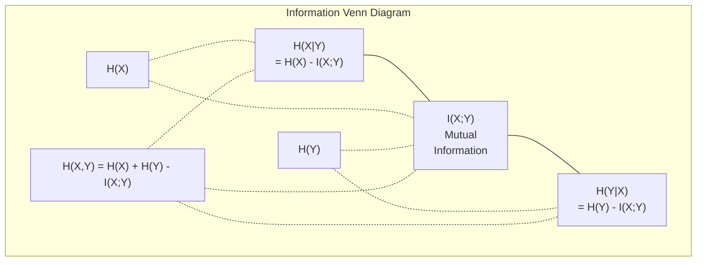

# Bilgi Teorisi

> Bilgi Teorisi Surprise ölçmek―Fonksiyon kaybı Buğday üzerinde inşa edilmek―

**Type:** Learn
**Language:**Python
**Prerequisites:** Phase 1, Lesson 06 (Probability)
**Time:** ~60 分钟

## Öğrenme hedefi

- Zero hesap entropisi, çapraz entropisi ve KL farklılığından, bunların arasındaki ilişkiyi açıklayın
- 推导为什么最小化交叉热损等价 maximize log-probability
- 计算 özellikleri ve hedef  arasındaki karşılıklı bilgi , sıralama özellikleri önemi için
-  将困惑 解释为语言模型 从中选择的有效词汇规模 中选择的有效词汇规模 解释为语言模型 从中选择的有效词汇规模 的有效词汇规模 的语句大小 的语句大小 的语句大小 的语句大小 的语句大小 的语句大小 的语句大小 的语句大小 的语句大小 的语句大小 的语句大小 的语句大小 的语句大小 的语句大小 的语句大小 的语句大小 的语句大小 的语句大小 的语句大小的语句大小的语句大小的语数

## 问题

Eğitimdeki her sınıflandırma modeli içinde kalır .`CrossEntropyLoss()` her dil modelinde  her makalede çılgınlık   VAE  distillasyon ve RLHF  KL farklılıklarını okuyacaksınız.

Bilgi Teorisi, belirsizlik, sıkıştırma ve tahmin dilini ortaya koydu. Claude Shannon 1948 yılında bunu ortaya çıkardı, iletişim sorunlarını çözmek için. Sonuç olarak, Nöral Ağı da bir iletişim sorunu: model, öğrendikleri ağırlıkları kullanarak  oluşan gürültülü kanalları                                                                                                                                                                                                                                                                                                                                                                                                                                                         

Bu ders her formülü sıfırdan kurar, nereden geldiğini ve neden işe yarayacağını göreceksin.

## 概念

### 信息量(Sürpriz)

O zaman daha fazla bilgi getirir.

概率为 p 的事件的信息量是:

```
I(x) = -log(p(x))
```

2 olarak kullanılır. Bir parça elde edilir. Doğal bir log kullanılır. Aynı fikir, farklı birimler elde edilir.

```
Event              Probability    Surprise (bits)
Fair coin heads    0.5            1.0
Rolling a 6        0.167          2.58
1-in-1000 event    0.001          9.97
Certain event      1.0            0.0
```

Bir olayın gerçekleşeceğini çoktan biliyordun.

### Entropi (ortalama)

Entropi, tüm olası sonuçların beklenmedik bir dağıtımdır.

```
H(P) = -sum( p(x) * log(p(x)) )  for all x
```

公平硬币对二元变量 具有最大エントロピー:1位──偏置硬币(99% 正面) 具有低エントロピー:0.08位──你已经知道会发生什么,因此每次抛几乎不会告诉你任何信息──

```
Fair coin:    H = -(0.5 * log2(0.5) + 0.5 * log2(0.5)) = 1.0 bit
Biased coin:  H = -(0.99 * log2(0.99) + 0.01 * log2(0.01)) = 0.08 bits
```

Entropi bir dağılım ölçer. İçinde belirsizlikler vardır.

### Çarpışıklık (你每日使用的损失函数)

Çelişkili entropi  Ölçüm Distribüsiyonu kullanırken Q 来编码实际来自分布 P 的事件时,平均惊喜是多少──

```
H(P, Q) = -sum( p(x) * log(q(x)) )  for all x
```

P doğru dağılımdır. Q modelinizin tahminidir. Eğer Q ile P tamamen uyumluysa, çapraz entropi entropiyaya benzer.

Sınıflandırmada, P bir sıcak vektördür. Gerçek sınıfın olasılıkları 1'dir. Diğer tümleri 0'dur.

```
H(P, Q) = -log(q(true_class))
```

İşte sınıflandırmanın tam çapraz entropi kaybı formülü.

### KL Dönüşüm (Distributions                                                                                                                                                                                                                                                                                                                                                                                                                                                                                                                    

KL farklılığı, P yerine Q kullanımı ölçmek için çok fazla sürpriz getirecektir.

```
D_KL(P || Q) = sum( p(x) * log(p(x) / q(x)) )  for all x
             = H(P, Q) - H(P)
```

Çarpışık entropi, entropi, KL farklılığıdır. Çünkü gerçek dağılım entropi, antrenman sırasında normaldir, en azlaştırılmış çapraz entropi, KL farklılığı ile aynıdır.

KL farklılığı 不是对称的:D_KL(P  Q) != D_KL(Q  P) ─ bu gerçek mesafe metrik değil

### Karşılıklı Bilgi

Karşılıklı bilgi  Ölçmek bilmek bir değişken 能告诉你另一个变量 多少信息──

```
I(X; Y) = H(X) - H(X|Y)
        = H(X) + H(Y) - H(X, Y)
```

Eğer X ve Y  bağımsız ise, karşılıklı bilgi ise sıfır. Biliyorsun, bir tanesi diğerinden herhangi bir bilgiyi anlatmaz. Eğer tamamen ilişkili ise, karşılıklı bilgi bir değişkenin entropiye benzer.

Özellik seçimi sırasında, Özellik ile Hedef arasındaki karşılıklı bilgi Yüksek, bu özellik için kullanılabilir anlamına gelir.

### Şartlı Entropi

H(Y X)  Ölçmek X 后, Y hakkında daha fazla belirsizlik kaldı

```
H(Y|X) = H(X,Y) - H(X)
```

İki uç:
- Eğer X 完全决定 Y,then H(YX ) = 0──知道 X 会消除关于 Y 的全部不确定性──例:X = 摄氏温度,Y = 华氏温度──
- Eğer X ile Y  hiçbir bilgi yoksa, H    Y                                                                                                                                                                                                                                                                                                                                                                                                                                                                                                                

Şartlı entropi 始终非负,并且永远不超过 H(Y):

```
0 <= H(Y|X) <= H(Y)
```

Makine Öğrenimi'nde, koşullu entropi ortaya çıkıyor karar ağaçları'nda. Her bölünmede, algoritma H(YYYX'i seçer. En küçük özelliği X, yani etiket Y'yi en fazla belirsizlik özelliğini kaldırmak.

### Ortak Entropi

H(X,Y) X 和 Y ̇ ̇ ̇ ̇ ̇ ̇ ̇ ̇ ̇ ̇ ̇ ̇ ̇ ̇ ̇ ̇ ̇ ̇ ̇ ̇ ̇ ̇ ̇ ̇ ̇ ̇ ̇ ̇ ̇ ̇ ̇ ̇ ̇ ̇ ̇ ̇ ̇ ̇ ̇ ̇ ̇ ̇ ̇ ̇ ̇ ̇ ̇ ̇ ̇ ̇ ̇ ̇ ̇ ̇ ̇ ̇ ̇ ̇ ̇ ̇ ̇ ̇ ̇ ̇ ̇ ̇ ̇ ̇ ̇ ̇ ̇ ̇ ̇ ̇ ̇ ̇ ̇ ̇ ̇ ̇ ̇ ̇ ̇ ̇ ̇ ̇ ̇ ̇ ̇ ̇ ̇ ̇ ̇ ̇ ̇ ̇ ̇ ̇ ̇ ̇ ̇ ̇ ̇ ̇ ̇ ̇ ̇ ̇ ̇ ̇ ̇ ̇ ̇ ̇ ̇ ̇ ̇ ̇ ̇ ̇ ̇ ̇ ̇ ̇ ̇ ̇ ̇ ̇ ̇ ̇ ̇ ̇ ̇ ̇ ̇ ̇ ̇ ̇ ̇ ̇ ̇ ̇ ̇ ̇ ̇ ̇ ̇ ̇ ̇ ̇ ̇ ̇ ̇ ̇ ̇ ̇ ̇ ̇ ̇ ̇ ̇ ̇ ̇ ̇ ̇ ̇ ̇ ̇ ̇ ̇ ̇ ̇ ̇ ̇ ̇ ̇ ̇ ̇ ̇ ̇ ̇ ̇ ̇ ̇ ̇ ̇ ̇ ̇ ̇ ̇ ̇ ̇ ̇ ̇ ̇ ̇ ̇ ̇ ̇ ̇ ̇ ̇ ̇ ̇ ̇ ̇ ̇ ̇ ̇ ̇ ̇ ̇ ̇ ̇ ̇ ̇ ̇ ̇ ̇ ̇ ̇

```
H(X,Y) = -sum sum p(x,y) * log(p(x,y))   for all x, y
```

关键性质:

```
H(X,Y) <= H(X) + H(Y)
```

X ve Y 独立时等号成立时―― eğer bunlar bilgi paylaşırsa, ortak entropi kendi entropilerinden daha küçük olur 之和──────────────────────────────────────────────────────────────────────────────────────────────────────────────────────────────────────────────────────────────────────────────────────────────────────────────────────────────────────────────────────────────────────────────────────────────────────────────────────────────────────────────────────────────────────────────────────────────────────────────────────────────────────────────────────────────────────────────────────────────────────────────────────────────────────────────────────────────────────────────────────────────────────────────────────────────────────────────────────────────────────────────────────────────────────────────────────────────────────────────────────────────────────────────────────────────────────────────────────────────────────────────────────────────────────────────────────────────────────────────────────────────────────────────────────────────────────────────────────────────



Bu ilişkiler:
- H(X,Y) = H(X) + H(Y
- H (H) - H (H) - H (H) - H (H) - H (H) - H (H) - H (H) - H (H) - H (H) - H (H) - H (H) - H (H) - H (H) - H (H) - H (H) - H (H) - H (H) - H (H) - H (H) - H (H) - H (H) - H (H) - H (H) - H (H) - H (H) - H (H) - H (H) - H (H) - H (H) - H (H) - H (H) - H (H) - H (H) - H (H) - H) - H (H) - H (H) - H) - H (H) - H) - H (H) - H) - H (H) - H) - H) - H (H) - H) - H) - H (H) - H) - H) - H) - H) - H (H) - H) - H) - H) - H) - H - H - H - H - H - H - H - H - H - H - H - H - H - H - H - H - H - H - H - H - H - H - H - H - H - H - H - H - H - H - H - H - H - H - H - H - H - H - H - H - H - H - H - H - H - H - H - H - H - H - H - H - H - H - H - H - H - H - H - H - H - H - H - H - H - H - H - H - H - H - H - H - H - H - H - H - H - H - H - H - H - H - H - H - H - H - H - H - H - H - H - H - H - H - H - H - H - H - H - H - H - H - H - H - H - H - H - H - H - H - H - H - H - H - H - H - H - H - H - H - H - H - H - H - H - H -
- H(X,Y) = H(X) + H(Y) - I(X;Y)

### Karşılıklı Bilgi ((Dep Dive)

Karşılıklı bilgi I(X;Y) 量化知道一个变量会减少关于另一个变量多少不确定性──

```
I(X;Y) = H(X) - H(X|Y)
       = H(Y) - H(Y|X)
       = H(X) + H(Y) - H(X,Y)
       = sum sum p(x,y) * log(p(x,y) / (p(x) * p(y)))
```

Seks:
- Bir şeyi izlemek asla bilgi kaybına neden olmaz.
- Eğer sadece X ve Y bağımsızsa, I(X;Y) = 0。
- I(X;Y) = I(Y;X)。
- I(X;X) = H(X)。 bir değişken ile kendi kendini paylaşın tüm bilgi。

**用于 feature selection 的 mutual information。**ML'de, hedef için istediğiniz özellikler var bilgi miktarı.

1. Her bir özelliğe X_i, hesap I(X_i; Y), Y'nin hedefi değişkenidir.
2. 按MI puanı 排序 özellikleri。
3. Kalkın.

Bu özellik ile hedefin arasındaki herhangi bir ilişki için geçerlidir: doğrusal, hatalı olmayan, monoton veya diğer ilişkiler.

| Method | Detects | Computational cost | Handles categorical? |
|--------|---------|-------------------|---------------------|
| Pearson correlation | Linear relationships | O(n) | No |
| Spearman correlation | Monotonic relationships | O(n log n) | No |
| Mutual information | 任意 statistical dependency | O(n log n) with binning | Yes |

### Etiket Düzeltme ve Çaplak Entropi

标准分類 使用硬目标:[0, 0, 1, 0]──true class 的概率为 1,其他全部为 0──Label smoothing 会用软目标 替换它们:

```
soft_target = (1 - epsilon) * hard_target + epsilon / num_classes
```

当 epsilon = 0.1 且有 4 个类 时:
- Zor hedef: [0, 0, 1, 0]
- Yumuşak hedef: [0.025, 0.025, 0.925, 0.025]

Bilgi Teorisinden 视角看,etiket düzeltmesi  target dağılımının entropiyi arttırdı──Hard one-hot targetlerin entropiyi 0, yani belirsizlik yok──Soft targetlerin 正正 entropiyi vardır──

Neden bu işe yarıyor?
- 防止模型 将 logits 推向极端值(在交叉内, 完美匹配一热目标 无限大的 logits 需要)
- 作为规范化:模型 不能100%自信
-  改善校准:预测概率更好地反映真实不确定性
-                                                                                                                                                                                                                                                                                                                                                                                                                                                                                                                              

Etiket düzeltme 变为:

```
L = (1 - epsilon) * CE(hard_target, prediction) + epsilon * H_uniform(prediction)
```

İkinci olarak, bir yörüngeden uzak tahminleri cezalandırır, yani güvenle doğrudan düzenlenir.

### Neden çapraz entropiyası sınıflandırma kaybının merkezi ?

Üç açı, aynı sonucu.

**Information Theory 视角。**Çarpıcı entropi, modelinizin gerçek dağıtım yerine dağıtımını ölçerken kaç bit harcadığını azaltır.

**Maximum likelihood 视角。**对于 N 个 true classes 为 y_i 的 eğitim örnekleri:

```
Likelihood     = product( q(y_i) )
Log-likelihood = sum( log(q(y_i)) )
Negative log-likelihood = -sum( log(q(y_i)) )
```

Son bir çizgi ise çapraz entropi kaybı, en az çapraz entropi = en fazla eğitim verisi, senin modelin aşağı olasılığı.

**Gradient 视角。**Çarpışıklık                                                                                                                                                                                                                                                                                                                                                                                                                                                                                                                         

### Bitler vs Nats

Tek fark logun alt sayısıdır.

```
log base 2   -> bits      (information theory tradition)
log base e   -> nats      (machine learning convention)
log base 10  -> hartleys  (rarely used)
```

1 nat = 1/ln(2) bit = 1.4427 bit。PyTorch 和 TensorFlow 默认使用自然ログ(nats)。

### Kafası karışık

Kafası karışıklık, çapraz entropi göstergesidir. Size modelin belirsiz olduğunu söyler.

```
Perplexity = 2^H(P,Q)   (if using bits)
Perplexity = e^H(P,Q)   (if using nats)
```

50'nin dil modelinin karmaşıklığı, ortalama olarak, sanki 50'den sonraki olası jetonlardan ortalama seçim gibi karışıklık içinde.

GPT-2'nin normal standartlarda yaklaşık 30'luk karmaşıklığa ulaşması mümkündür. Modern modeller iyi alanlar kapsamında bireysel oranlara ulaşabilir.


```figure
entropy-kl
```

## Yapın onu.

### 第 1 步: Bilgi içeriği

```python
import math

def information_content(p, base=2):
    if p <= 0 or p > 1:
        return float('inf') if p <= 0 else 0.0
    return -math.log(p) / math.log(base)

def entropy(probs, base=2):
    return sum(
        p * information_content(p, base)
        for p in probs if p > 0
    )

fair_coin = [0.5, 0.5]
biased_coin = [0.99, 0.01]
fair_die = [1/6] * 6

print(f"Fair coin entropy:   {entropy(fair_coin):.4f} bits")
print(f"Biased coin entropy: {entropy(biased_coin):.4f} bits")
print(f"Fair die entropy:    {entropy(fair_die):.4f} bits")
```

### 步骤 2: Çelişkili entropi ve KL farklılık

```python
def cross_entropy(p, q, base=2):
    total = 0.0
    for pi, qi in zip(p, q):
        if pi > 0:
            if qi <= 0:
                return float('inf')
            total += pi * (-math.log(qi) / math.log(base))
    return total

def kl_divergence(p, q, base=2):
    return cross_entropy(p, q, base) - entropy(p, base)

true_dist = [0.7, 0.2, 0.1]
good_model = [0.6, 0.25, 0.15]
bad_model = [0.1, 0.1, 0.8]

print(f"Entropy of true dist:     {entropy(true_dist):.4f} bits")
print(f"CE (good model):          {cross_entropy(true_dist, good_model):.4f} bits")
print(f"CE (bad model):           {cross_entropy(true_dist, bad_model):.4f} bits")
print(f"KL divergence (good):     {kl_divergence(true_dist, good_model):.4f} bits")
print(f"KL divergence (bad):      {kl_divergence(true_dist, bad_model):.4f} bits")
```

### 步骤 3: Kısası entropi sınıflandırma kaybı olarak

```python
def softmax(logits):
    max_logit = max(logits)
    exps = [math.exp(z - max_logit) for z in logits]
    total = sum(exps)
    return [e / total for e in exps]

def cross_entropy_loss(true_class, logits):
    probs = softmax(logits)
    return -math.log(probs[true_class])

logits = [2.0, 1.0, 0.1]
true_class = 0

probs = softmax(logits)
loss = cross_entropy_loss(true_class, logits)

print(f"Logits:      {logits}")
print(f"Softmax:     {[f'{p:.4f}' for p in probs]}")
print(f"True class:  {true_class}")
print(f"Loss:        {loss:.4f} nats")
print(f"Perplexity:  {math.exp(loss):.2f}")
```

### 步骤 4: Çelişki entropisi negatif log olasılığına eşittir

```python
import random

random.seed(42)

n_samples = 1000
n_classes = 3
true_labels = [random.randint(0, n_classes - 1) for _ in range(n_samples)]
model_logits = [[random.gauss(0, 1) for _ in range(n_classes)] for _ in range(n_samples)]

ce_loss = sum(
    cross_entropy_loss(label, logits)
    for label, logits in zip(true_labels, model_logits)
) / n_samples

nll = -sum(
    math.log(softmax(logits)[label])
    for label, logits in zip(true_labels, model_logits)
) / n_samples

print(f"Cross-entropy loss:      {ce_loss:.6f}")
print(f"Negative log-likelihood: {nll:.6f}")
print(f"Difference:              {abs(ce_loss - nll):.2e}")
```

### 5 adım: Karşılıklı bilgi

```python
def mutual_information(joint_probs, base=2):
    rows = len(joint_probs)
    cols = len(joint_probs[0])

    margin_x = [sum(joint_probs[i][j] for j in range(cols)) for i in range(rows)]
    margin_y = [sum(joint_probs[i][j] for i in range(rows)) for j in range(cols)]

    mi = 0.0
    for i in range(rows):
        for j in range(cols):
            pxy = joint_probs[i][j]
            if pxy > 0:
                mi += pxy * math.log(pxy / (margin_x[i] * margin_y[j])) / math.log(base)
    return mi

independent = [[0.25, 0.25], [0.25, 0.25]]
dependent = [[0.45, 0.05], [0.05, 0.45]]

print(f"MI (independent): {mutual_information(independent):.4f} bits")
print(f"MI (dependent):   {mutual_information(dependent):.4f} bits")
```

## Kullan

NumPy kullanmak aynı kavramı ifade etmek için, pratikte kullanılacağınız yöntem budur:

```python
import numpy as np

def np_entropy(p):
    p = np.asarray(p, dtype=float)
    mask = p > 0
    result = np.zeros_like(p)
    result[mask] = p[mask] * np.log(p[mask])
    return -result.sum()

def np_cross_entropy(p, q):
    p, q = np.asarray(p, dtype=float), np.asarray(q, dtype=float)
    mask = p > 0
    return -(p[mask] * np.log(q[mask])).sum()

def np_kl_divergence(p, q):
    return np_cross_entropy(p, q) - np_entropy(p)

true = np.array([0.7, 0.2, 0.1])
pred = np.array([0.6, 0.25, 0.15])
print(f"Entropy:    {np_entropy(true):.4f} nats")
print(f"Cross-ent:  {np_cross_entropy(true, pred):.4f} nats")
print(f"KL div:     {np_kl_divergence(true, pred):.4f} nats")
```

Sen de sıfırdan inşa ettin.`torch.nn.CrossEntropyLoss()`内部 done things──now you know why loss will drop in the training process: modelinizin tahmin edilen dağılım gerçek dağılımın yakınında, bilgi kaybının nats'larını kullanarak ölçmek için──

## 练习

1. 假设英文字母表服服从统一分布(26 个字母), entropy 計算します.

2. 某模型对真级为 1 样本输出 logits [5.0, 2.0, 0.5]──手算交叉热损失,然后用你的 `cross_entropy_loss`Bu işlevler, nasıl bir kayıp yaratacak?

3. 证明 KL divergence 不是对称的──选择两个分布 P 和 Q,计算 D_KL(P    Q) 和 D_K                                                                                                                                                                                                                                             

4. 构建一个函数,为一段符号预测 序列计算困难――给定一个由 (true_token_index, predicted_logits) çiftleri 组成的列表,返回该序列的困难──

## 关键术语

| Term | What people say | What it actually means |
|------|----------------|----------------------|
| Information content | “Surprise” | 编码一个事件所需的 bits（或 nats）数量：-log(p) |
| Entropy | “Randomness” | 一个 distribution 中所有 outcomes 的平均 surprise。衡量不可约 uncertainty。 |
| Cross-entropy | “The loss function” | 使用 model distribution Q 编码来自 true distribution P 的事件时的平均 surprise。 |
| KL divergence | “Distance between distributions” | 使用 Q 而不是 P 所浪费的额外 bits。等于 cross-entropy 减 entropy。不是对称的。 |
| Mutual information | “How related are X and Y” | 知道 Y 后，关于 X 的 uncertainty 减少量。为零表示独立。 |
| Softmax | “Turn logits into probabilities” | 取指数并归一化。将任意 real-valued vector 映射为有效 probability distribution。 |
| Perplexity | “How confused the model is” | Cross-entropy 的指数。model 在每一步从中选择的有效 vocabulary size。 |
| Bits | “Shannon's unit” | 使用以 2 为底的 log 衡量的信息。一个 bit 解决一次公平抛硬币。 |
| Nats | “ML's unit” | 使用 natural log 衡量的信息。PyTorch 和 TensorFlow 默认使用。 |
| Negative log-likelihood | “NLL loss” | 对 one-hot labels 来说，与 cross-entropy loss 完全相同。最小化它会最大化正确 predictions 的概率。 |

## 延伸阅读

- [Shannon 1948: A Mathematical Theory of Communication](https://people.math.harvard.edu/~ctm/home/text/others/shannon/entropy/entropy.pdf)- 原始论文,至今仍然易读
- [Visual Information Theory (Chris Olah)](https://colah.github.io/posts/2015-09-Visual-Information/)- Entrofi ve KL farklılıkları için en iyi görülebilir açıklama
- [PyTorch CrossEntropyLoss docs](https://pytorch.org/docs/stable/generated/torch.nn.CrossEntropyLoss.html)- framework  nasıl oluşturduğunuz içeriği gerçekleştirmek için
