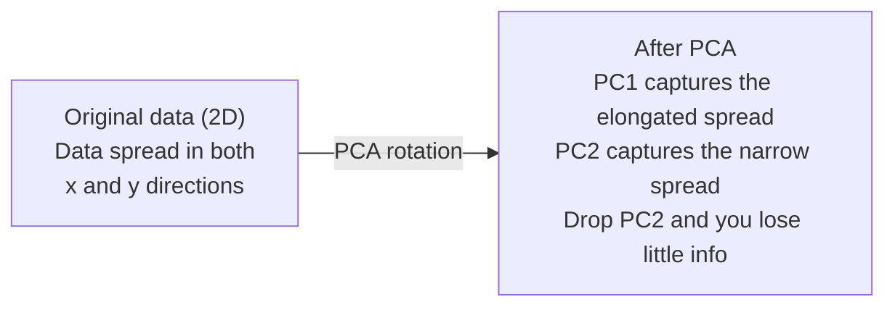

# Boyutların Azaldılması

> Yüksek veri yapılandırması vardır. Doğru açıdan bakmak gerekir.

**Type:** Build
**Language:**Python
**Prerequisites:** Phase 1, Lessons 01（Linear Algebra Intuition）、02（Vectors, Matrices & Operations）、03（Eigenvalues & Eigenvectors）、06（Probability & Distributions）
**Time:** ~90 分钟

## Öğrenme Hedefleri

- PCA:Center Data: Zero Implementation: Center Data: Center Data: Center Data: Center Data: Center Data: Center Data: Center Data: Center Data: Center Data: Center Data: Center Data: Center Data: Center Data: Center Data: Center Data: Center Data: Center Data: Center Data: Center Data: Center Data: Center Data: Data: Data: Data: Data: Data: Data: Data: Data: Data: Data: Data: Data: Data: Data: Data: Data: Data: Data: Data: Data: Data: Data: Data: Data: Data: Data: Data: Data: Data: Data: Data: Data: Data: Data: Data: Data: Data: Data: Data: Data: Data: Data: Data: Data: Data: Data: Data: Data: Data: Data: Data: Data: Data: Data: Data: Data: Data: Data: Data: Data: Data: Data: Data: Data: Data: Data: Data: Data: Data: Data: Data: Data: Data: Data: Data: Data: Data: Data: Data: Data: Data: Data: Data: Data: Data: Data: Data: Data: Data: Data: Data: Data: Data: Data: Data: Data: Data: Data: Data: Data: Data: Data: Data: Data: Data: Data: Data: Data: Data: Data: Data: Data: Data: Data: Data: Data: Data: Data: Data: Data: Data: Data: Data: Data: Data: Data: Data: Data: Data: Data: Data: Data: Data: Data: Data: Data: Data: Data: Data: Data: Data: Data: Data: Data: Data: Data: Data: Data: Data: Data: Data: Data: Data: Data: Data: Data: Data: Data: Data: Data: Data: Data: Data: Data: Data: Data: Data: Data: Data: Data: Data is data is data is data is data is data: Data: Data: Data: Data: Data: Data: Data: Data: Data: Data is data is data is data is data is data is data is data is data is data is data is data is data; data is data is data is data; data is data is data is data; data is data is data is data is data; data is data is data is data is data is data; data
- Uygulamayı açıklayan varyansa oranı 和 elbolu yöntemi  seçin ana bileşenlerin sayısı
- PCA ̊t-SNE ve UMAP ile 2D'de görülebilir MNIST rakamlarının etkilerini karşılaştırın ve onların ağırlığını açıklayın
- RBF çekirdeği kullanımı RBF çekirdeği PCA ayrılmış standart PCA  işleme imkansız olmayan veriler yapısı

## Sorun

Her örnekte 784 özellik içeren bir veri kümesi vardır. Belki de el yazılı rakamlı piksel değerleri vardır. Belki de gen ekspresyonu seviyeleri vardır. Belki de kullanıcı davranış sinyalleri vardır.

Ancak bu 784 özelliklerin çoğu boştur. Gerçek bilgi çok daha küçük bir yüzeyde bulunur. Bir el yazısı "7" olarak 784'ü tanımlamak için birbirinden bağımsız sayıya ihtiyaç duymaz.

Boyutsuzluk azaltımı daha küçük bir yüzeyi bulacaktır. 784 boyutlu verilerinizi 2,10 veya 50 boyutlara kadar sıkıştırır ve önemli yapıları korur.

## Anlaşım

### Boyutsuzluk laneti

Yüksek boyutlu alanlar, doğrusuna uymayan üç şey vardır.

**距离变得没有意义。**Yüksek seviyede, herhangi iki boşluk arasındaki mesafe aynı değere ulaşır. Eğer her nokta diğer her noktaya kadar farklı olursa, en yakın komşu arayışı başarısız olur.

```
Dimension    Avg distance ratio (max/min between random points)
2            ~5.0
10           ~1.8
100          ~1.2
1000         ~1.02
```

**体积集中在角落。**D 维 birim hiperkubu 2 个角. 100 维中, neredeyse tüm 积积都在角落里,远离中心.

**你需要指数级更多的数据。**Bir uzayda aynı örnek yoğunluğunu korumak için, 2D'den 20D'ye kadar 10^18 kat fazla veriye ihtiyacınız var demektir.

### PCA: önemli yönleri bul

Ana Komponent Analizi (PCA) en büyük değişimlerin en büyük aksidelerini bulur.

算法:

```
1. Center the data        (subtract the mean from each feature)
2. Compute covariance     (how features move together)
3. Eigendecomposition     (find the principal directions)
4. Sort by eigenvalue     (biggest variance first)
5. Project               (keep top k eigenvectors, drop the rest)
```

Neden kendi bileşimi kullanılır?Kovariansa matrisi simetrik ve pozitif yarı belirlenmiştir. Kendi vektörleri özellik alanındaki ortogonal yönlerdir.



- **Before PCA:**Veri bulutu  x ve y 两个轴呈对角线扩散
- **After PCA:**坐标系 is rotated, making PC1 to z z maksimum varyansa yönünde(uzanan yayılma), PC2 to z minimum varyansa yönünde(kısık yayılma)
- **Dimensionality reduction:**PC2'yi bırakıp verileri PC1'e atıyor, çok az bilgi kaybediyor.

### Açıklanan değişim oranı

Her ana bileşen, toplam değişikliğin bir kısmını yakalar.

```
Component    Eigenvalue    Explained ratio    Cumulative
PC1          4.73          0.473              0.473
PC2          2.51          0.251              0.724
PC3          1.12          0.112              0.836
PC4          0.89          0.089              0.925
...
```

Toplam açıklanan varyasyon 0.95'e ulaştığında, bu bileşenlerin %95'i aldığını biliyorsun.

### Bileşen sayısını seçmek

Üç tür kuralı:

1. **Threshold.**90-95%'lik farklılığı açıklamak için yeterli miktarda bileşen tutmak.
2. **Elbow method.**図に各要素の説明された変異を図にします── 図に各要素の説明された変異を図にします── 図に各要素の説明された変異を図にします── 図に各要素の説明された変異を図にします── 図に各要素の説明された変異を図にします── 図に各要素の説明された変異を図にします── 図に各要素の説明された変異を図に描く── 図に各要素の説明された変異を図に描く── 図に示す 図に示す 図に示す 図に示す 図に示す 図に示す 図に示す 図を図に示す 図に示す 図に示す 図に示す 図に示す 図に示す 図を図に示す 図に示す 図に示す 図に示す 図に示す 図に示す 図を図に示す 図に示す 図に示す 図に示す 図に示す 図に示す 図を図に示する
3. **Downstream performance.**PCA'yı önceden işleme yapımı için kullanmak.

### t-SNE: mahalleleri korumak

T-Yüklü Stochastic Komşulu Eklenti (t-SNE) ise, görülebilir tasarım için kullanılır.

直觉是: 原始空間中, noktalar arasındaki mesafeye göre bir olasılık dağılımını hesaplar. Yakın nokta yüksek olasılık elde eder. Uzak nokta düşük olasılık elde eder. Sonra bir 2D dağılım bulur ve aynı olasılık dağılımını oluşturur.

t-SNE'nin anahtar özellikleri:
- Hattı olmayan, PCA'nın işleme imkanı olmayan karmaşık çeşitlilikleri ortaya çıkarabilir.
- Stochastic¬¬¬¬¬¬¬¬¬¬¬¬¬¬¬¬¬¬¬¬¬¬¬¬¬¬¬¬¬¬¬¬¬¬¬¬¬¬¬¬¬¬¬¬¬¬¬¬¬¬¬¬¬¬¬¬¬¬¬¬¬¬¬¬¬¬¬¬¬¬¬¬¬¬¬¬¬¬¬¬¬¬¬¬¬¬¬¬¬¬¬¬¬¬¬¬¬¬¬¬¬¬¬¬¬¬¬¬¬¬¬¬¬¬¬¬¬¬¬¬¬¬¬¬¬¬¬¬¬¬¬¬¬¬¬¬¬¬¬¬¬¬¬¬¬¬¬¬¬¬¬¬¬¬¬¬¬¬¬¬¬¬¬¬¬¬¬¬¬¬¬¬¬¬¬¬¬¬¬¬¬¬¬¬¬¬¬¬¬¬¬¬¬¬¬¬¬¬¬¬¬¬¬¬¬¬¬¬¬¬¬¬¬¬¬¬¬¬¬¬¬¬¬¬¬¬¬¬¬¬¬¬¬¬¬¬¬¬¬¬¬¬¬¬¬¬¬¬¬¬¬¬¬¬¬¬¬¬¬¬¬¬¬¬¬¬¬¬¬¬¬¬¬¬¬¬¬¬¬¬¬¬¬¬¬¬¬¬¬¬¬¬¬¬¬¬¬¬¬¬¬¬¬¬¬¬¬¬¬¬¬¬¬¬¬¬¬¬¬¬¬¬¬¬¬¬¬¬¬¬¬¬¬¬¬¬¬¬¬¬¬¬¬¬¬¬¬¬¬¬¬¬¬¬¬¬¬¬¬¬¬¬¬¬¬¬¬¬¬¬¬¬¬¬¬¬¬¬¬¬¬¬¬¬¬¬¬¬¬¬¬¬¬¬¬¬¬¬¬¬¬¬¬¬¬¬¬¬¬¬¬¬¬¬¬¬¬¬¬¬¬¬¬¬¬¬¬¬¬¬¬¬¬¬¬¬¬¬¬¬¬¬¬¬¬¬¬¬¬¬¬¬¬¬¬¬¬¬¬¬¬¬¬¬¬¬¬¬¬¬¬¬¬¬¬¬¬¬¬¬¬¬¬¬¬¬¬¬¬¬¬¬¬¬¬¬¬¬¬¬¬¬¬¬¬¬¬
- Kafası karışıklık 参数控制考虑多少邻居 (tipiği: 5-50)
- 输出中 clusters  arasındaki mesafe anlamsızdır. Sadece clusters özde anlamlıdır.
- Büyük veri kümelerinde ise çok yavaş.

### UMAP: Daha hızlı ve daha iyi küresel yapı

Uniform Manifold Approximation and Projection (UMAP) çalışma biçimi t-SNE'ye benzer, ancak iki avantajı vardır:
- Daha hızlı, tüm çiftlik mesafelerini hesaplamak yerine, en yakın komşu grafiklerini kullanıyor.
- Daha iyi küresel yapı── çıkarım içindeki kümelerin göreceli konumları t-SNE daha anlamlı­ ̆

UMAP, yüksek boyutlu bir uzayda ağırlıklı bir grafik oluşturur, sonra düşük boyutlu bir düzen arar ve bu grafikleri mümkün olduğunca korur.

关键参数:
- `n_neighbors`: how many neighbour define local structure (a) ⋅ similar perplexity (a) ⋅
- `min_dist`: output middle point cluster daha fazla yakınlıkta oluşur. Daha düşük değer daha yoğun clusters oluşturur.

### Ne zaman kullanılır

| Method | Use case | Preserves | Speed |
|--------|----------|-----------|-------|
| PCA | Preprocessing before training | Global variance | Fast (exact), works on millions of samples |
| PCA | Quick exploratory visualization | Linear structure | Fast |
| t-SNE | Publication-quality 2D plots | Local neighborhoods | Slow (< 10k samples ideal) |
| UMAP | 2D visualization at scale | Local + some global structure | Medium (handles millions) |
| PCA | Feature reduction for models | Variance-ranked features | Fast |
| t-SNE / UMAP | Understanding cluster structure | Cluster separation | Medium to slow |

 تجربة قانون: PCA ile önceden işleme ve veri sıkıştırma yapın.

### Kernel PCA

標準 PCA lineer alt boşlukları bulacaktır── bu sizin koordinatlarınızı döndürür ve taşır. Fakat eğer verileriniz bir çizgisiz manifoldta bulunursa 上怎么办?2D'deki bir yuvarlak herhangi bir düz yoldan ayrı kalmaz── standart PCA hiç yardımcı olmayacaktır──

Kernel PCA, kernel fonksiyonu tarafından  yönlendirilmiş yüksek seviye özellik alanında PCA'yı uyguluyor, açıkça bu alanın koordinatlarını hesaplamıyor.

算法:
1. 计算 çekirdek matrisi K, K_ij = k(x_i, x_j)
2. Özellik alanında Orta çekirdek matrisi
3. Kendini merkezi çekirdek matrisine yaparak
4. 顶部 eigenvectors(按1/sqrt(eigenvalue) 缩放)就是投影

常见 çekirdek fonksiyonları:

| Kernel | Formula | Good for |
|--------|---------|----------|
| RBF (Gaussian) | exp(-gamma * \|\|x - y\|\|^2) | 大多数 nonlinear data、smooth manifolds |
| Polynomial | (x . y + c)^d | Polynomial relationships |
| Sigmoid | tanh(alpha * x . y + c) | Neural network-like mappings |

Normal PCA değil, çekirdek PCA kullanıyor:

| Criterion | Standard PCA | Kernel PCA |
|-----------|-------------|------------|
| Data structure | Linear subspace | Nonlinear manifold |
| Speed | O(min(n^2 d, d^2 n)) | O(n^2 d + n^3) |
| Interpretability | Components are linear combinations of features | Components lack direct feature interpretation |
| Scalability | Works on millions of samples | Kernel matrix is n x n, memory-limited |
| Reconstruction | Direct inverse transform | Requires pre-image approximation |

Klasik örnek: 2D'deki konsentrik döngüler: bir döngü diğer döngünün içinde iki döngü vardır. Standart PCA, iki döngüyü aynı çizgiye doğru yansıtır. Bu sınıflandırmaya gerek yoktur.

### Yeniden Yapım Hatası

784'i 50'e kadar daraltmışsın. Ne kaybettin?

测量 yeniden yapılandırma hatası:
1. K 维: X_reduced = X @ W_k
2. 重建: X_hat = X_reduced @ W_k^T
3. 计算 MSE:mean((X - X_hat) ^2)

PCA için, yeniden yapılama hatası açıklanan değişim ile açık bir ilişki vardır:

```
Reconstruction error = sum of eigenvalues NOT included
Total variance = sum of ALL eigenvalues
Fraction lost = (sum of dropped eigenvalues) / (sum of all eigenvalues)
```

Her bileşenin açıklanan varyansa oranı:

```
explained_ratio_k = eigenvalue_k / sum(all eigenvalues)
```

Toplam açıklanmış varyasyonu, bileşenlerin sayısal çizimleri, "koluk" eğri elde edilir.
- 曲线变平的位置(收益递减)
- Toplam değişkenlik  跨越你的门的位置(通常是0.90或0.95)
- Aşağıdaki görev performansı 进入平台期的位置

Yeniden inşaat hatası sadece seçmek için kullanılmaz. Onu anomali tespit için kullanabilirsiniz: Yeniden inşaat hatası Yüksek örnekler dış seviyedir, öğrenilen alt alanlara uymayanlardır.


```figure
pca-axes
```

## Yapın

### Adım 1: PCA sıfırdan

```python
import numpy as np

class PCA:
    def __init__(self, n_components):
        self.n_components = n_components
        self.components = None
        self.mean = None
        self.eigenvalues = None
        self.explained_variance_ratio_ = None

    def fit(self, X):
        self.mean = np.mean(X, axis=0)
        X_centered = X - self.mean

        cov_matrix = np.cov(X_centered, rowvar=False)

        eigenvalues, eigenvectors = np.linalg.eigh(cov_matrix)

        sorted_idx = np.argsort(eigenvalues)[::-1]
        eigenvalues = eigenvalues[sorted_idx]
        eigenvectors = eigenvectors[:, sorted_idx]

        self.components = eigenvectors[:, :self.n_components].T
        self.eigenvalues = eigenvalues[:self.n_components]
        total_var = np.sum(eigenvalues)
        self.explained_variance_ratio_ = self.eigenvalues / total_var

        return self

    def transform(self, X):
        X_centered = X - self.mean
        return X_centered @ self.components.T

    def fit_transform(self, X):
        self.fit(X)
        return self.transform(X)
```

### İkinci adım: Sintez veriler üzerinde test

```python
np.random.seed(42)
n_samples = 500

t = np.random.uniform(0, 2 * np.pi, n_samples)
x1 = 3 * np.cos(t) + np.random.normal(0, 0.2, n_samples)
x2 = 3 * np.sin(t) + np.random.normal(0, 0.2, n_samples)
x3 = 0.5 * x1 + 0.3 * x2 + np.random.normal(0, 0.1, n_samples)

X_synthetic = np.column_stack([x1, x2, x3])

pca = PCA(n_components=2)
X_reduced = pca.fit_transform(X_synthetic)

print(f"Original shape: {X_synthetic.shape}")
print(f"Reduced shape:  {X_reduced.shape}")
print(f"Explained variance ratios: {pca.explained_variance_ratio_}")
print(f"Total variance captured: {sum(pca.explained_variance_ratio_):.4f}")
```

### Adım 3: MNIST rakamları 2 boyutlu

```python
from sklearn.datasets import fetch_openml

mnist = fetch_openml("mnist_784", version=1, as_frame=False, parser="auto")
X_mnist = mnist.data[:5000].astype(float)
y_mnist = mnist.target[:5000].astype(int)

pca_mnist = PCA(n_components=50)
X_pca50 = pca_mnist.fit_transform(X_mnist)
print(f"50 components capture {sum(pca_mnist.explained_variance_ratio_):.2%} of variance")

pca_2d = PCA(n_components=2)
X_pca2d = pca_2d.fit_transform(X_mnist)
print(f"2 components capture {sum(pca_2d.explained_variance_ratio_):.2%} of variance")
```

### 4. adım: sklearn ile karşılaştır

```python
from sklearn.decomposition import PCA as SklearnPCA
from sklearn.manifold import TSNE

sklearn_pca = SklearnPCA(n_components=2)
X_sklearn_pca = sklearn_pca.fit_transform(X_mnist)

print(f"\nOur PCA explained variance:     {pca_2d.explained_variance_ratio_}")
print(f"Sklearn PCA explained variance: {sklearn_pca.explained_variance_ratio_}")

diff = np.abs(np.abs(X_pca2d) - np.abs(X_sklearn_pca))
print(f"Max absolute difference: {diff.max():.10f}")

tsne = TSNE(n_components=2, perplexity=30, random_state=42)
X_tsne = tsne.fit_transform(X_mnist)
print(f"\nt-SNE output shape: {X_tsne.shape}")
```

### Adım 5: UMAP karşılaştırması

```python
try:
    from umap import UMAP

    reducer = UMAP(n_components=2, n_neighbors=15, min_dist=0.1, random_state=42)
    X_umap = reducer.fit_transform(X_mnist)
    print(f"UMAP output shape: {X_umap.shape}")
except ImportError:
    print("Install umap-learn: pip install umap-learn")
```

## Kullan

PCA kullanmak için sınıflandırıcı  önceki önceden işleme:

```python
from sklearn.decomposition import PCA as SklearnPCA
from sklearn.linear_model import LogisticRegression
from sklearn.model_selection import train_test_split
from sklearn.metrics import accuracy_score

X_train, X_test, y_train, y_test = train_test_split(
    X_mnist, y_mnist, test_size=0.2, random_state=42
)

results = {}
for k in [10, 30, 50, 100, 200]:
    pca_k = SklearnPCA(n_components=k)
    X_tr = pca_k.fit_transform(X_train)
    X_te = pca_k.transform(X_test)

    clf = LogisticRegression(max_iter=1000, random_state=42)
    clf.fit(X_tr, y_train)
    acc = accuracy_score(y_test, clf.predict(X_te))
    var_captured = sum(pca_k.explained_variance_ratio_)
    results[k] = (acc, var_captured)
    print(f"k={k:>3d}  accuracy={acc:.4f}  variance={var_captured:.4f}")
```

Performans, 784'den daha azdır.

## Gönder

Bu ders:
- `outputs/skill-dimensionality-reduction.md`- belirli görevler için uygun ölçülü bir seçim için kullanılacak bir teknik becerisi

## Egzersizler

1. 修改 PCA sınıfı 以支持 `inverse_transform`△ 10、50 和 200 个 bileşen kullanılarak MNIST rakamlarını yeniden inşa etmek için.

2. Aynı MNIST alt kümesi içinde t-SNE'nin işlevi, karmaşıklık  değer ayrılığı 5、30 和 100─ olarak tanımlanır.

3. 50 özellikli bir veri kümesi var ama sadece 5 bilgi özellikli bir veri kümesi kullanılır.`sklearn.datasets.make_classification`生成) ・ PCA uygulaması,并检查 açıklayan varyansa eğri

## Anahtar Terimler

| Term | What people say | What it actually means |
|------|----------------|----------------------|
| Curse of dimensionality | "Too many features" | 随着维度增长，距离、体积和数据密度都会表现得反直觉。Models 需要指数级更多的数据来补偿。 |
| PCA | "Reduce dimensions" | 旋转你的坐标系，使各轴与 maximum variance 的方向对齐，然后丢弃 low-variance axes。 |
| Principal component | "An important direction" | Covariance matrix 的一个 eigenvector。Feature space 中数据变化最大的方向。 |
| Explained variance ratio | "How much info this component has" | 一个 principal component 捕获的 total variance 比例。对前 k 个 ratios 求和，就能看到 k 个 components 保留了多少信息。 |
| Covariance matrix | "How features correlate" | 一个 symmetric matrix，其中 entry (i,j) 衡量 feature i 和 feature j 如何共同变化。Diagonal entries 是各自的 variances。 |
| t-SNE | "That cluster plot" | 一种 nonlinear 方法，通过保留 pairwise neighborhood probabilities 将高维数据映射到 2D。适合可视化，不适合 preprocessing。 |
| UMAP | "Faster t-SNE" | 一种基于 topological data analysis 的 nonlinear 方法。既保留 local structure，也保留部分 global structure。比 t-SNE 更容易扩展。 |
| Perplexity | "A t-SNE knob" | 控制每个点考虑的有效邻居数量。低 perplexity 聚焦非常 local 的结构。高 perplexity 捕获更宽泛的模式。 |
| Manifold | "The surface the data lives on" | Embedding在更高维空间中的低维表面。一张在 3D 中揉皱的纸是一个 2D manifold。 |

## Daha Fazla Okumak

- [A Tutorial on Principal Component Analysis](https://arxiv.org/abs/1404.1100)(Shlens) - From零开始清晰推导 PCA
- [How to Use t-SNE Effectively](https://distill.pub/2016/misread-tsne/)(Wattenberg et al.) - 关于 t-SNE 陷和参数选择的交互式指南
- [UMAP documentation](https://umap-learn.readthedocs.io/)- UMAP yazarlarının teorisi ve pratik yönlendirmelerinden
