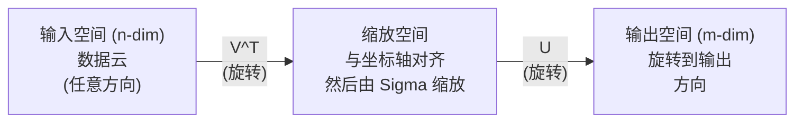
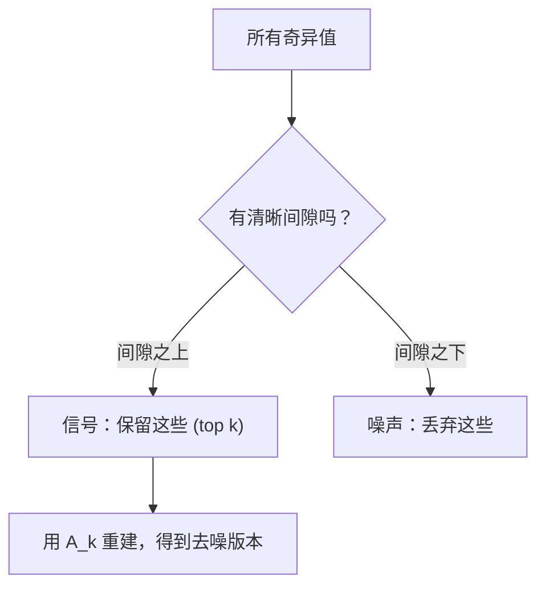

# Tek değerlerin parçalanması

> SVD, 線性代数 içindeki bir 瑞士軍刀. Her matrisde SVD vardır.

**Type:** Build
**Languages:** Python, Julia
**Prerequisites:** Phase 1，Lessons 01 (Linear Algebra Intuition)、02 (Vectors & Matrices Operations)、03 (Matrix Transformations)
**Time:** ~120 minutes

## Öğrenme hedefi
- 通过功率代代实现 SVD,并解释 U、Sigma 和 V^T 的几何含义
-                                                                                                                                                                                                                                                                                                                                                                                                                                                                                                                              
- SVD üzerinden Moore-Penrose sahte karşıtlığı hesaplamak, en az kareyi çözmek için
- SVD'yi PCA'yla 推系统 (latent faktörler) ve NLP'deki latent semantik analiz ile bağlayın

## 问题
1000x2000'li bir Matrix'iniz var. Bu kullanıcı-film değerleri olabilir. Bu bir resim biçiminin bir değeri olabilir. Bu bir resim biçiminin bir değeri olabilir. Bu bir resim biçiminin bir parçasıdır. Bu bir metrikin en küçük kareli bir sistem çözümü için kullanılması gerekir.

SVD herhangi bir Matris için uygundur. İstediği şekil, istediği sıra, istediği sınır yoktur. Matris'i üç faktöre ayırır. Bu, bu matrisin uzaydaki değişimlerin geometrik yapısını ortaya çıkarır.

## 概念
### SVD on几何上做什么

Her matris, şekli ne olursa olsun, üç işlemleri sırayla gerçekleştirecektir: dönmek, kısaltmak, dönmek.

```
A = U * Sigma * V^T

      m x n     m x m    m x n    n x n
     (任意)    (旋转)   (缩放)   (旋转)
```

给定任意 Matrix A,SVD'yi aşağıdaki bölüme ayırır:
- V^T 旋转输入空间(n 维) içindeki vektör
- Sigma  boyunca her bir akselde kısaltma (la伸或压缩)
- Sonuçlar dışarı çıkış alanına döner.



Bu şekilde anlayabilirsiniz. SVD'ye bir Matrix'i veriyorsunuz. Size şöyle anlatır: Bu Matrix önce V^T ile bir top içine döner, sonra Sigma ile bir top haline çıkarır, son olarak bu top için U'yla döner.

### Tam bir parçalanma

对于形为 m x n 的 Matrix A:

```
A = U * Sigma * V^T

其中：
  U     是 m x m，正交 (U^T U = I)
  Sigma 是 m x n，对角（奇异值位于对角线上）
  V     是 n x n，正交 (V^T V = I)

奇异值 sigma_1 >= sigma_2 >= ... >= sigma_r > 0
其中 r = rank(A)
```

U'nun sıraları sol tuhaf vektör olarak adlandırılır. V'nin sıraları sağ tuhaf vektör olarak adlandırılır. Sigma'nın karşı yönlü elementleri tuhaf değerler olarak adlandırılır.

### Sol tekerlek vektörleri, tekerlek değerleri, sağ tekerlek vektörleri

SVD'nin her bir parçası farklı anlamlara sahiptir.

**Right singular vectors（V 的列）：**它们为输入空间 (R^n) 构成一组ortho-normal basis――它们是输入空间中的方向,矩阵将这些方向映射到输出空间中的正交方向――它们可以看作域的自然坐标系――

**Singular values（Sigma 的对角线）：**它们是缩放因子──第一个 奇异值告诉你,Matrix 沿第一个 右 奇异Vector 方向将向向拉伸多少──奇异值为零

**Left singular vectors（U 的列）：**它们为输出空间(R^m) oluşturur bir grup ortonomik tabanlı¬¬¬¬¬¬¬¬¬¬¬¬¬¬¬¬¬¬¬¬¬¬¬¬¬¬¬¬¬¬¬¬¬¬¬¬¬¬¬¬¬¬¬¬¬¬¬¬¬¬¬¬¬¬¬¬¬¬¬¬¬¬¬¬¬¬¬¬¬¬¬¬¬¬¬¬¬¬¬¬¬¬¬¬¬¬¬¬¬¬¬¬¬¬¬¬¬¬¬¬¬¬¬¬¬¬¬¬¬¬¬¬¬¬¬¬¬¬¬¬¬¬¬¬¬¬¬¬¬¬¬¬¬¬¬¬¬¬¬¬¬¬¬¬¬¬¬¬¬¬¬¬¬¬¬¬¬¬¬¬¬¬¬¬¬¬¬¬¬¬¬¬¬¬¬¬¬¬¬¬¬¬¬¬¬¬¬¬¬¬¬¬¬¬¬¬¬¬¬¬¬¬¬¬¬¬¬¬¬¬¬¬¬¬¬¬¬¬¬¬¬¬¬¬¬¬¬¬¬¬¬¬¬¬¬¬¬¬¬¬¬¬¬¬¬¬¬¬¬¬¬¬¬¬¬¬¬¬¬¬¬¬¬¬¬¬¬¬¬¬¬¬¬¬¬¬¬¬¬¬¬¬¬¬¬¬¬¬¬¬¬¬¬¬¬¬¬¬¬¬¬¬¬¬¬¬¬¬¬¬¬¬¬¬¬¬¬¬¬¬¬¬¬¬¬¬¬¬¬¬¬¬¬¬¬¬¬¬¬¬¬¬¬¬¬¬¬¬¬¬¬¬¬¬¬¬¬¬¬¬¬¬¬¬¬¬¬¬¬¬¬¬¬¬¬¬¬¬¬¬¬¬¬¬¬¬¬¬¬¬¬¬¬¬¬¬¬¬¬¬¬¬¬¬¬¬¬¬¬¬¬¬¬¬¬¬¬¬¬¬¬¬¬¬¬¬¬¬¬¬¬¬¬¬¬¬¬¬¬¬¬¬¬¬¬¬¬¬¬¬¬¬¬¬¬¬¬¬¬¬¬¬¬¬¬¬¬¬¬¬¬¬¬¬¬¬¬¬¬¬¬¬¬¬¬¬¬¬¬¬

Arasındaki ilişki:

```
A * v_i = sigma_i * u_i

Matrix A 接收第 i 个右奇异Vector v_i，
用 sigma_i 对其缩放，并将其映射到第 i 个左奇异Vector u_i。
```

Bu, herhangi bir Matrix'in yapıp yapıp yapmadığı bir görüntü veriyor.

### Dış ürün biçimi

SVD'nin 1 sınıf matrisinin yazısı:

```
A = sigma_1 * u_1 * v_1^T + sigma_2 * u_2 * v_2^T + ... + sigma_r * u_r * v_r^T

每一项 sigma_i * u_i * v_i^T 都是一个 rank-1 Matrix（一个 outer product）。
完整 Matrix 是 r 个这类 Matrix 的和，其中 r 是 rank。
```

Bu biçim düşük sıra yaklaşımının temelidir. Her bir yapı bir kat katlanır. Birinci, en önemli tek bir biçimi ele alır.

```
Rank-1 approx:    A_1 = sigma_1 * u_1 * v_1^T
                  (捕获主导模式)

Rank-2 approx:    A_2 = sigma_1 * u_1 * v_1^T + sigma_2 * u_2 * v_2^T
                  (捕获两个最重要的模式)

Rank-k approx:    A_k = top k 项之和
                  (根据 Eckart-Young theorem，这是最优的)
```

### Kendi bileşimi ile ilişki

SVD ve özde kompozisyonunun derin bir bağlantısı vardır. A'nın garip değerleri ve garip vektörleri doğrudan A^T A ve A^T'nin öz değerleriyle öz vektörlerle bağlantılıdır.

```
A^T A = V * Sigma^T * U^T * U * Sigma * V^T
      = V * Sigma^T * Sigma * V^T
      = V * D * V^T

其中 D = Sigma^T * Sigma 是一个对角 Matrix，其对角线上为 sigma_i^2。

因此：
- 右奇异Vector (V) 是 A^T A 的 eigenvectors
- 奇异值的平方 (sigma_i^2) 是 A^T A 的 eigenvalues

类似地：
A A^T = U * Sigma * V^T * V * Sigma^T * U^T
      = U * Sigma * Sigma^T * U^T

因此：
- 左奇异Vector (U) 是 A A^T 的 eigenvectors
- A A^T 的 eigenvalues 也都是 sigma_i^2
```

Bu bağlantı size üç şey anlatıyor:
1. 奇异值总是实数且非负 (bu, pozitif yarım belirlenmiş matrisin öz değerlerinin kare köküdür) 
2. A^T A'ya göre kendi bileşimi yaparak SVD'yi hesaplayabilirsiniz, ancak bu karelerinin sayısal değeri kesinliği de kaybedilecektir.
3. Bir ∈ A = ∈ A = ∈ A = ∈ A = ∈ A = ∈ A = ∈ A = ∈ A = ∈ A = ∈ A = ∈ A = ∈ A = ∈ A = ∈ A = ∈ A = ∈ A = ∈ A = ∈ A = ∈ A = ∈ A = ∈ A = ∈ A = ∈ A = ∈ A = ∈ A = ∈ A = ∈ A = ∈ A = ∈ A = ∈ A = ∈ A = ∈ A = ∈ A = ∈ A = ∈ A = ∈ A = ∈ A = ∈ A = ∈ A = ∈ A = ∈ A = ∈ A = ∈ A = ∈ A = ∈ A = ∈ A = ∈ A = ∈ A = ∈ A = ∈ A = ∈ A = ∈ A = ∈ A = ∈ A = ∈ A = ∈ A = ∈ A = ∈ A = ∈ A = ∈ A

### Kısalmış SVD: düşük seviye yakınlaması

Eckart-Young-Mirsky teoremi  gösterir, A'nın en iyi sıra-k yakın benzerliği (((Frobenius norm ve spektral norm altında) sadece üst k 个奇异值 ve ona karşı vektör 得到通过:

```
A_k = U_k * Sigma_k * V_k^T

其中：
  U_k     是 m x k  (U 的前 k 列)
  Sigma_k 是 k x k  (Sigma 的左上 k x k 块)
  V_k     是 n x k  (V 的前 k 列)

近似误差 = sigma_{k+1}  (在 spectral norm 下)
         = sqrt(sigma_{k+1}^2 + ... + sigma_r^2)  (在 Frobenius norm 下)
```

Bu sadece  iyi  yakınlık değil. Bu  yakınlıkların en iyi rütbesidir.

| Component | Relative magnitude | Kept in rank-3 approx? |
|-----------|-------------------|------------------------|
| sigma_1 | 最大 | 是 |
| sigma_2 | 大 | 是 |
| sigma_3 | 中等偏大 | 是 |
| sigma_4 | 中等 | 否（误差） |
| sigma_5 | 中等偏小 | 否（误差） |
| sigma_6 | 小 | 否（误差） |
| sigma_7 | 很小 | 否（误差） |
| sigma_8 | 极小 | 否（误差） |

保留 top 3:A_3 捕获三个最大的奇异值──误差 = 余值(sigma_4 到 sigma_8)。

Eğer bu değerlerin eksikliği çok hızlı olursa, çok küçük bir k, Matrix'in büyük kısmını ele alabilir.

### SVD kullanılarak görüntü sıkıştırma

灰度图像是像素强度组成的矩阵――一张800x600 图像有480,000 个值――SVD 让你用更少的值来接近它――

```
原始图像：800 x 600 = 480,000 个值

rank k 的 SVD：
  U_k:      800 x k 个值
  Sigma_k:  k 个值
  V_k:      600 x k 个值
  总计:     k * (800 + 600 + 1) = k * 1401 个值

  k=10:   14,010 个值   (原始的 2.9%)
  k=50:   70,050 个值  (原始的 14.6%)
  k=100: 140,100 个值  (原始的 29.2%)

  k 越小，压缩率越好，
  但视觉质量会下降。
```

关键洞察: Doğal görüntülerin garip değerleri hızla azalıyor. Önceki birkaç garip değer büyük ölçekli yapıları (şekil, adımlar) yakalamakta.

### SVD için kullanılır

Netflix Ödülü 让这一点广为人知──你有一个用户电影评分矩阵,其中大多数条目是缺失的──

```
             Movie1  Movie2  Movie3  Movie4  Movie5
  User1      [  5      ?       3       ?       1  ]
  User2      [  ?      4       ?       2       ?  ]
  User3      [  3      ?       5       ?       ?  ]
  User4      [  ?      ?       ?       4       3  ]

  ? = 未知评分
```

核心思想:这个评分 矩阵 具有低级别──用户的品味不是完全独立──有少数隐藏因素──动作对剧情、旧对新、理性对感官) 可以解释大多数偏好──

Matrix SVD'yi yaparken, aşağıdaki bölüme ayrılır:
- U:latent factor space 中的用户个人资料
- Sigma: Her gizli faktörün önemi
- V^T:latent faktor alanı 中的电影资料

Kullanıcı bir film için bir kullanıcı profilinin bir film profilinin bir nokta ürünü ile bir kullanıcı profilinin bir kısmı olarak değerlendirilmiştir.

 Praktiki olarak, Simon Funk'ın artışlı SVD veya ALS'i kullanırsınız. Bu tür en az kareyi değiştirerek kayıp verilerin değişimlerini doğrudan işleyebilirsiniz.

### NLP 中的 SVD:Latent Semantic Analysis

Latent Semantik Analiz (LSA), ayrıca Latent Semantic Indexing (LSI) olarak adlandırılır, SVD 应用于术语文档矩阵──

```
             Doc1   Doc2   Doc3   Doc4
  "cat"      [  3      0      1      0  ]
  "dog"      [  2      0      0      1  ]
  "fish"     [  0      4      1      0  ]
  "pet"      [  1      1      1      1  ]
  "ocean"    [  0      3      0      0  ]

rank k=2 的 SVD 之后：

  每个文档变成 2D “概念空间”中的一个点。
  每个词项变成同一个 2D 空间中的一个点。
  主题相似的文档会聚在一起。
  含义相似的词项会聚在一起。

  "cat" 和 "dog" 最终会靠近彼此（陆地宠物）。
  "fish" 和 "ocean" 最终会靠近彼此（水相关概念）。
  如果 Doc1 和 Doc3 共享相似主题，它们会聚在一起。
```

LSA, orijinal metinlerden语义相似性 yöntemi yakalamak için en erken başarılı yöntemlerden biridir. Bu nedenle geçerlidir, çünkü同义词往往相似文档中出现, bu nedenle SVD onları aynı gizli boyutlara yerleştirecektir.

### Gürültü azaltmak için SVD

Gürültülü veriler genellikle sinyalleri en yüksek garip değerlere odaklarken, gürültü tüm garip değerlere dağılır.

**干净信号的奇异值：**

| Component | Magnitude | Type |
|-----------|-----------|------|
| sigma_1 | 非常大 | 信号 |
| sigma_2 | 大 | 信号 |
| sigma_3 | 中等 | 信号 |
| sigma_4 | 接近零 | 可忽略 |
| sigma_5 | 接近零 | 可忽略 |

**有噪声信号的奇异值（噪声会加到所有分量上）：**

| Component | Magnitude | Type |
|-----------|-----------|------|
| sigma_1 | 非常大 | 信号 |
| sigma_2 | 大 | 信号 |
| sigma_3 | 中等 | 信号 |
| sigma_4 | 小 | 噪声 |
| sigma_5 | 小 | 噪声 |
| sigma_6 | 小 | 噪声 |
| sigma_7 | 小 | 噪声 |



Bu, sinyal işleme, bilimsel ölçüm ve veri temizliği için kullanılır. Herhangi bir zamanda, Matris'iniz daha fazla gürültü kirliliğiyle, kesilmiş SVD'nin bir prensibi vardır.

### SVD yoluyla sahte tersleşme

Moore-Penrose pseudoinverse A+ Matrix inversiyonunu 非方阵和奇异 Matrix olarak 推广します。SVD 計算ı çok basit hale getirir。

```
如果 A = U * Sigma * V^T，那么：

A+ = V * Sigma+ * U^T

其中 Sigma+ 的构造方式为：
  1. 转置 Sigma（交换行和列）
  2. 将每个非零对角元素 sigma_i 替换为 1/sigma_i
  3. 零保持为零

对于 A (m x n)：      A+ 是 (n x m)
对于 Sigma (m x n)：  Sigma+ 是 (n x m)
```

Pseudoinverse en az kareyi isteyebilirsiniz 问题── eğer Ax = b 没有精确解(超定系统),then x = A + b 就是最小的平方 解(最小化的Ax - b 时时时) ‖

```
超定系统（方程数多于未知数）：

  [1  1]         [3]
  [2  1] x   =   [5]       不存在精确解。
  [3  1]         [6]

  x_ls = A+ b = V * Sigma+ * U^T * b

  这给出了使残差平方和最小的 x。
  结果与 normal equations (A^T A)^(-1) A^T b 相同，
  但数值上更稳定。
```

### Sayısal istikrar 优势

計算 A^T A'nın özde kompozisyon 会平方奇异值(A^T A'nın öz değerleri sigma_i^2)。

```
示例：
  A 的奇异值为 [1000, 1, 0.001]
  A 的 condition number：1000 / 0.001 = 10^6

  A^T A 的 eigenvalues 为 [10^6, 1, 10^{-6}]
  A^T A 的 condition number：10^6 / 10^{-6} = 10^{12}

  直接计算 SVD：使用 condition number 10^6
  通过 A^T A 计算：使用 condition number 10^{12}
                   （额外损失 6 位精度）
```

现代 SVD 算法(Golub-Kahan iki teşhis) doğrudan A 上工作,从不构建 A^T A──`np.linalg.svd(A)`- Hayır .`np.linalg.eig(A.T @ A)`- Evet.

### PCA'ya bağlantı

PCA, SVD'yi merkezileştirilmiş verilere göre yapmaktır.

```
给定数据 Matrix X (n_samples x n_features)，已中心化（减去均值）：

Covariance Matrix: C = (1/(n-1)) * X^T X

PCA 寻找 C 的 eigenvectors。但：

  X = U * Sigma * V^T    (X 的 SVD)

  X^T X = V * Sigma^2 * V^T

  C = (1/(n-1)) * V * Sigma^2 * V^T

所以 principal components 恰好就是右奇异Vector V。
每个 component 的 explained variance 是 sigma_i^2 / (n-1)。

在 sklearn 中，PCA 使用 SVD 实现，而不是 eigendecomposition。
它更快，数值上也更稳定。
```

Bu, 10. derste öğrendiğiniz boyutların azaltılması hakkında her şeyin alt katı SVD'dir.


```figure
svd-rank-reconstruction
```

## Yapın onu.
### 步骤 1: Güç İterasyonu kullanarak sıfırdan SVD

Düşünce: en büyük garip değer ve vektörünü bulmak için A^T A( veya A^T) güç iterasyonunu kullanabiliriz.

```python
import numpy as np

def power_iteration(M, num_iters=100):
    n = M.shape[1]
    v = np.random.randn(n)
    v = v / np.linalg.norm(v)

    for _ in range(num_iters):
        Mv = M @ v
        v = Mv / np.linalg.norm(Mv)

    eigenvalue = v @ M @ v
    return eigenvalue, v

def svd_from_scratch(A, k=None):
    m, n = A.shape
    if k is None:
        k = min(m, n)

    sigmas = []
    us = []
    vs = []

    A_residual = A.copy().astype(float)

    for _ in range(k):
        AtA = A_residual.T @ A_residual
        eigenvalue, v = power_iteration(AtA, num_iters=200)

        if eigenvalue < 1e-10:
            break

        sigma = np.sqrt(eigenvalue)
        u = A_residual @ v / sigma

        sigmas.append(sigma)
        us.append(u)
        vs.append(v)

        A_residual = A_residual - sigma * np.outer(u, v)

    U = np.column_stack(us) if us else np.empty((m, 0))
    S = np.array(sigmas)
    V = np.column_stack(vs) if vs else np.empty((n, 0))

    return U, S, V
```

### 步骤 2: NumPy ile test ve karşılaştır

```python
np.random.seed(42)
A = np.random.randn(5, 4)

U_ours, S_ours, V_ours = svd_from_scratch(A)
U_np, S_np, Vt_np = np.linalg.svd(A, full_matrices=False)

print("Our singular values:", np.round(S_ours, 4))
print("NumPy singular values:", np.round(S_np, 4))

A_reconstructed = U_ours @ np.diag(S_ours) @ V_ours.T
print(f"Reconstruction error: {np.linalg.norm(A - A_reconstructed):.8f}")
```

### 步骤 3: Resim sıkıştırma demo

```python
def compress_image_svd(image_matrix, k):
    U, S, Vt = np.linalg.svd(image_matrix, full_matrices=False)
    compressed = U[:, :k] @ np.diag(S[:k]) @ Vt[:k, :]
    return compressed

image = np.random.seed(42)
rows, cols = 200, 300
image = np.random.randn(rows, cols)

for k in [1, 5, 10, 20, 50]:
    compressed = compress_image_svd(image, k)
    error = np.linalg.norm(image - compressed) / np.linalg.norm(image)
    original_size = rows * cols
    compressed_size = k * (rows + cols + 1)
    ratio = compressed_size / original_size
    print(f"k={k:>3d}  error={error:.4f}  storage={ratio:.1%}")
```

### 步骤 4: Ses azaltımı

```python
np.random.seed(42)
clean = np.outer(np.sin(np.linspace(0, 4*np.pi, 100)),
                 np.cos(np.linspace(0, 2*np.pi, 80)))
noise = 0.3 * np.random.randn(100, 80)
noisy = clean + noise

U, S, Vt = np.linalg.svd(noisy, full_matrices=False)
denoised = U[:, :5] @ np.diag(S[:5]) @ Vt[:5, :]

print(f"Noisy error:    {np.linalg.norm(noisy - clean):.4f}")
print(f"Denoised error: {np.linalg.norm(denoised - clean):.4f}")
print(f"Improvement:    {(1 - np.linalg.norm(denoised - clean) / np.linalg.norm(noisy - clean)):.1%}")
```

### 步骤 5: Pseudoinverse

```python
A = np.array([[1, 1], [2, 1], [3, 1]], dtype=float)
b = np.array([3, 5, 6], dtype=float)

U, S, Vt = np.linalg.svd(A, full_matrices=False)
S_inv = np.diag(1.0 / S)
A_pinv = Vt.T @ S_inv @ U.T

x_svd = A_pinv @ b
x_lstsq = np.linalg.lstsq(A, b, rcond=None)[0]
x_pinv = np.linalg.pinv(A) @ b

print(f"SVD pseudoinverse solution:  {x_svd}")
print(f"np.linalg.lstsq solution:   {x_lstsq}")
print(f"np.linalg.pinv solution:    {x_pinv}")
```

## Kullan
完整可运行 demo 位于 `code/svd.py`◊运行 SVD'yi görüntü sıkıştırılması için kullanmak için kullanılabilir.

```bash
python svd.py
```

`code/svd.jl`中的 Julia 版本使用 Julia 原生 的 中的 Julia `svd()`函数和 `LinearAlgebra`paket 演示相同概念──

```bash
julia svd.jl
```

## - Söyle.
Bu ders:
- `outputs/skill-svd.md`- SVD'yi gerçek projelerde nasıl uygulayacağımızı anlamaya yönelik bir beceri

## 练习
1. Tam bir SVD'yi gerçekleştirmek için güç iterasyonunu kullanmayın.

2. Üzerine bir görüntü yükle. Ya da bir görüntüyi griyeğe dönüştür.

3. 构建一个微型推系统――创建一个10x8的用户电影评分矩阵,其中包含一些已知条目――使用行平均值填充缺失条目――计算 SVD 并重建排-3 近似――使用重建矩阵 预测缺失评分――验证预测结果是合理的――

4.  100x50'lik bir belge-term Matrix oluşturun, 3 合成 temayı içerir. Her temada 5 关联词项──添加噪声──应用 SVD,并验证 top 3 个奇异值明显大于其余奇异值──文档投影到3D潜伏空间,并检查来自同一主题的文档是否聚集在一起──

5. 生成一个干净的低级矩阵 (rango 3,大小 50x40),并不同水平下添加高斯噪音 (sigma = 0,1、0.5、1.0、2.0) ◦ Her bir gürültü seviyesine, k=1'den 40'e kadar tarama yaparak ve temiz matrisin yeniden yapılandırma hatalarına göre ölçerek, en iyi kesim seviyesini bulur.

## 关键术语
| Term | What people say | What it actually means |
|------|----------------|----------------------|
| SVD | “Factor 任意 Matrix” | 将 A 分解为 U Sigma V^T，其中 U 和 V 是正交的，Sigma 是具有非负元素的对角 Matrix。适用于任意形状的任意 Matrix。 |
| Singular value | “这个 component 有多重要” | Sigma 的第 i 个对角元素。衡量 Matrix 沿第 i 个 principal direction 拉伸的程度。总是非负，并按降序排列。 |
| Left singular vector | “输出方向” | U 的一列。第 i 个右奇异Vector 经过 sigma_i 缩放后映射到的输出空间方向。 |
| Right singular vector | “输入方向” | V 的一列。输入空间中的一个方向，Matrix 会将其映射到第 i 个左奇异Vector（经过 sigma_i 缩放后）。 |
| Truncated SVD | “Low-rank approximation” | 只保留 top k 个奇异值及其 Vector。生成原始 Matrix 的可证明最佳 rank-k 近似（Eckart-Young theorem）。 |
| Rank | “真实维度” | 非零奇异值的数量。告诉你 Matrix 实际使用了多少个独立方向。 |
| Pseudoinverse | “广义逆” | V Sigma+ U^T。对非零奇异值取倒数，零保持为零。为非方阵或奇异 Matrix 求解 least-squares 问题。 |
| Condition number | “对误差有多敏感” | sigma_max / sigma_min。大的 condition number 意味着很小的输入变化会造成很大的输出变化。SVD 直接揭示这一点。 |
| Latent factor | “隐藏变量” | SVD 发现的 low-rank space 中的一个维度。在推荐中，latent factor 可能对应类型偏好。在 NLP 中，它可能对应一个主题。 |
| Frobenius norm | “Matrix 的总大小” | 所有元素平方和的平方根。等于所有奇异值平方和的平方根。用于衡量近似误差。 |
| Eckart-Young theorem | “SVD 给出最佳压缩” | 对任意目标 rank k，truncated SVD 会在所有可能的 rank-k Matrix 中最小化近似误差。 |
| Power iteration | “找到最大的 eigenvector” | 反复用 Matrix 乘以一个随机 Vector 并归一化。会收敛到具有最大 eigenvalue 的 eigenvector。它是许多 SVD 算法的构建模块。 |

## 延伸阅读
- [Gilbert Strang: Linear Algebra and Its Applications, Chapter 7](https://math.mit.edu/~gs/linearalgebra/)- SVD ve uygulamaları hakkında derinlemesine bilgi
- [3Blue1Brown: But what is the SVD?](https://www.youtube.com/watch?v=vSczTbgc8Rc)- SVD'nin geometrisinde
- [We Recommend a Singular Value Decomposition](https://www.ams.org/publicoutreach/feature-column/fcarc-svd)- Amerikan Matematik Derneği  kolayca anlaşılabilir bir özet
- [Netflix Prize and Matrix Factorization](https://sifter.org/~simon/journal/20061211.html)- Simon Funk  hakkında SVD kullanmak için önerilen orijinal blog makalesi
- [Latent Semantic Analysis](https://en.wikipedia.org/wiki/Latent_semantic_analysis)- SVD NLP'de erken uygulama
- [Numerical Linear Algebra by Trefethen and Bau](https://people.maths.ox.ac.uk/trefethen/text.html)- SVD algoritmasını ve sayısal değerlerin yetkili bilgileri anlamak
