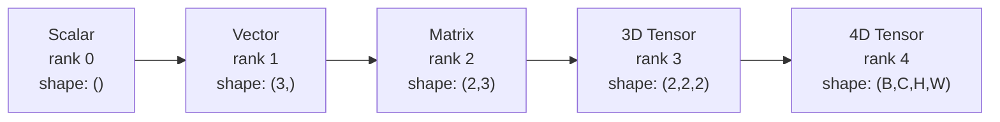
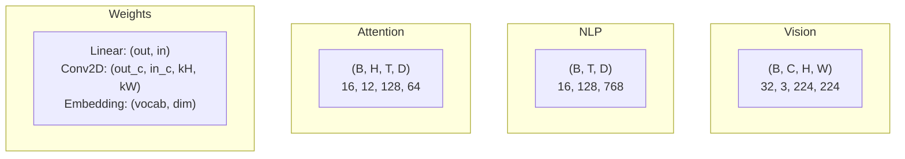
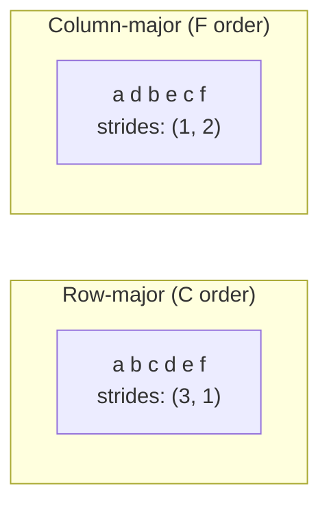
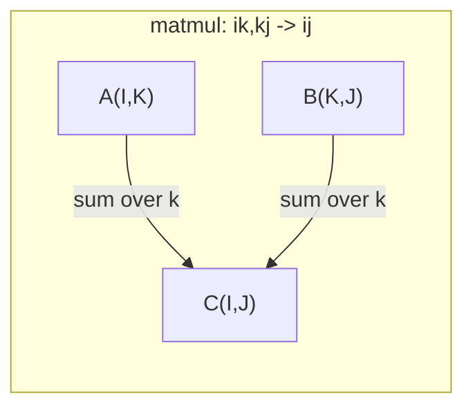

# Tensör İşlemleri

> Tensörler, veriler ve derin öğrenme arasındaki ortak dillerdir.

**Type:** Build
**Language:**Python
**前置要求：**1. Fase Dersler 01 (Hattı Cevabı İntüyüsü),02 (Vektörler, Matrisler ve İşlemler)
**Time:** ~90 分钟

## Öğrenme hedefi
- Bir Tensor sınıfı gerçekleştirmek, şekil, adım, şekil değiştirme, transpose ve element-hikmetli işlemleri desteklemek
-                                                                                                                                                                                                                                                                                                                                                                                                                                                                                                                              
- Çıkış ürünleri, matris çarpmaları, dış ürünler ve seri işlemleri
-  Takip Multi-Head Dikkat Her Adımın Tam Tenzor Şekilleri

## 问题
Bir transformatör inşa ettin. Ön geçit. İyi bir görünüm.`RuntimeError: mat1 and mat2 shapes cannot be multiplied (32x768 and 512x768)`Bu şekillerin üzerinde çalışıyorsun.`Expected 4D input (got 3D input)`Bir tane daha sıkıştırmadın. Başka bir yer bozuldu.

Şekil hataları derin öğrenme kodlarında en yaygın hatalardır. Onlar kavramda zor değildir. Her işlemin bir şekil sözleşmesi vardır. Ama hızlı bir şekilde üstlenir. Bir transformatör birkaç düzine şekil değiştirir, transpose ve yayınları birbirine bağlar. Bir eksik, hata, bir sınıf bağlantısı vardır. Daha da kötüsü, bazı şekil hataları, temel olarak hata çıkarmaz.

Matrisler 处理两组事物之间成对关系──真数据不能放进两个维度──一批的32张224x224 RGB görüntüler 4D tenzor:`(32, 3, 224, 224)`12 başlı bir özdeyiş var. 4 boyutlu bir deyişle.`(batch, heads, seq_len, head_dim)`◊ size herhangi bir boyutlara yayılabilen bir veri yapısı gerekir.

## 概念
### Tensör nedir?

Tensör, birbirli bir veri tipi olan çok boyutlu bir sayıdır.**rank**(Yada **order**)― her boyut bir boyut.**axis**- Evet.**shape**Bir tuple, her eksesi sıralar.



总元素数 = 所有尺寸的乘积──形 `(2, 3, 4)`包含 `2 * 3 * 4 = 24`个元素──

### Derin Öğrenme Merkezi'ndeki Tensor şekilleri

 Adetlere göre, farklı veri türleri belirli Tensor şekillerine göre görüntülenir.



PyTorch NCHW kullanmakla birlikte, TensorFlow'un NHWC kullanımı ile uyumlu olmayan düzenleri de yavaş yavaş veya yanlış bir şekilde gerçekleşebilir.

### Hatırlama düzenlemesi nasıl çalışır

内存 içindeki 2D dizi 序列 序列 一段 1D bytes**Strides**Her eksesi boyunca daha fazla kaç element atlamak gerektiğini söyleyin.



Değişmeyen verileri aktarmak, adımları değiştirmek ve Tensor'u 变为 yapmak**non-contiguous**-- bir satırdaki elementler içi kayda artık birbirine yakın değil.

### Yayınlama kuralları

Yayınlama  izin verir                                                                                                                                                                                                                                                                                                                                                                                                                                                                                                                        

```
Tensor A:     (8, 1, 6, 1)
Tensor B:        (7, 1, 5)
Padded B:     (1, 7, 1, 5)
Result:       (8, 7, 6, 5)
```

### Einsum: genel tenzor işlevi

Einstein toplamı her ekseni işaretlemek için harflerle kullanılır. Girişlerde, ancak çıkışlarda bulunmayan iç ekseler, istenir ve alınır.



关键模式:`i,i->`(dot ürün)`i,j->ij`(dış ürün)`ii->`(izleri)`ij->ji`(Transpose)`bij,bjk->bik`(batch matmul)`bhtd,bhsd->bhts`(Dikkat puanları)


```figure
tensor-broadcast
```

## Yapın onu.
代码位于 `code/tensors.py`❖ Her adımında bunların gerçekleşmesini anlatacağız.

### 步骤1:Tensor 存储和步骤

Tensor  depolama  平 の数字列表および形 メタデータ。ステップ 索引論理を 多维 指数 映射を平位置にどのように 映射するかを ストーデス 索引 mantığını 図数 図数 図数 図数 図数 図数 図数 図数 図数 図数 図数 図数 図数 図数 図数 図数 図数 図数 図数 図数 図数 図数 図数 図数 図数 図数 図数 図数 図数 図数 図数 図数 図数 図数 図数 図数 図数 図数 図数 図数 図数 図数 図数 図数 図数 図数 図数 図数 図数 図数 図数 図数 図数 図 図数 図数 図 図数 図数 図数 図 図数 図数 図 図数 図 図数 図数 図数 図 図 図数 図 図数 図 図数 図数 図 図

```python
class Tensor:
    def __init__(self, data, shape=None):
        if isinstance(data, (list, tuple)):
            self._data, self._shape = self._flatten_nested(data)
        elif isinstance(data, np.ndarray):
            self._data = data.flatten().tolist()
            self._shape = tuple(data.shape)
        else:
            self._data = [data]
            self._shape = ()

        if shape is not None:
            total = reduce(lambda a, b: a * b, shape, 1)
            if total != len(self._data):
                raise ValueError(
                    f"Cannot reshape {len(self._data)} elements into shape {shape}"
                )
            self._shape = tuple(shape)

        self._strides = self._compute_strides(self._shape)

    @staticmethod
    def _compute_strides(shape):
        if len(shape) == 0:
            return ()
        strides = [1] * len(shape)
        for i in range(len(shape) - 2, -1, -1):
            strides[i] = strides[i + 1] * shape[i + 1]
        return tuple(strides)
```

Şekil için .`(3, 4)`, adımlar `(4, 1)`-- 4 element atladı, 1 element atladı.

### 步骤 2: Yeniden şekillendirme, sıkıştırma, sıkıştırmayı bırakma

Şekil değiştirmek, fakat değişmeyen element sırasıdır.`-1`Bir boyut kendiliğinden ölçüsünü belirlesin.

```python
t = Tensor(list(range(12)), shape=(2, 6))
r = t.reshape((3, 4))
r = t.reshape((-1, 3))
```

Squeeze 会移除大小为 1 的轴──Squeeze 会插入一个──Squeeze 对广播 至关重要 -- 一个偏向向向 `(D,)`Toplama yaptır .`(B, T, D)`Ücüm, sıkıştırmadan yapmamalısın.`(1, 1, D)`- Evet.

```python
t = Tensor(list(range(6)), shape=(1, 3, 1, 2))
s = t.squeeze()
v = Tensor([1, 2, 3])
u = v.unsqueeze(0)
```

### Üçüncü adım: Transpose ve permute

Transpose 交换两个轴──Permute 重新排序所有轴──这就是在NCHW与NHWC之间转换的方式──

```python
mat = Tensor(list(range(6)), shape=(2, 3))
tr = mat.transpose(0, 1)

t4d = Tensor(list(range(24)), shape=(1, 2, 3, 4))
perm = t4d.permute((0, 2, 3, 1))
```

Transpose veya permute  sonrasında, Tensor 在内存中是非连接的──在 PyTorch 中,`view`Kontaj olmayan tenzorlarda 会在非连接的テンソറുകൾ 上失败 -- 使用 `reshape`, veya önce ayarlayın `.contiguous()`- Evet.

### 步骤 4: Elementler açısından işlemler ve azaltmalar

Element-wise ops (add, multiply, subtract) her element'e bağımsız olarak uygulanır, biçimi değişir ve kalır.

```python
a = Tensor([[1, 2], [3, 4]])
b = Tensor([[10, 20], [30, 40]])
c = a + b
d = a * 2
s = a.sum(axis=0)
```

CNN'in genel ortalama birleştirmesi:`(B, C, H, W).mean(axis=[2, 3])` oluşuyor`(B, C)`◊NLP 中 中 の sırası birleştirme anlamına gelir:`(B, T, D).mean(axis=1)` oluşuyor`(B, D)`- Evet.

### 步骤 5: NumPy ile yayınlama

`tensors.py`Orta `demo_broadcasting_numpy()`fonksiyon  gösterdi temel model¬¬¬¬¬¬¬¬¬¬¬¬¬¬¬¬¬¬¬¬¬¬¬¬¬¬¬¬¬¬¬

```python
activations = np.random.randn(4, 3)
bias = np.array([0.1, 0.2, 0.3])
result = activations + bias

images = np.random.randn(2, 3, 4, 4)
scale = np.array([0.5, 1.0, 1.5]).reshape(1, 3, 1, 1)
result = images * scale

a = np.array([1, 2, 3]).reshape(-1, 1)
b = np.array([10, 20, 30, 40]).reshape(1, -1)
outer = a * b
```

通过广播 计算对距:将 `(M, 2)`yeniden şekillendirmek`(M, 1, 2)`,将 `(N, 2)`yeniden şekillendirmek`(1, N, 2)`,相减、平方、沿最后一个轴 求和、取平方根──结果为:`(M, N)`- Evet.

### 步骤 6: Einsum işlemleri

`demo_einsum()`和 `demo_einsum_gallery()`Bu işlevler, her türlü normal bir biçimi aşamalı olarak gösterir.

```python
a = np.array([1.0, 2.0, 3.0])
b = np.array([4.0, 5.0, 6.0])
dot = np.einsum("i,i->", a, b)

A = np.array([[1, 2], [3, 4], [5, 6]], dtype=float)
B = np.array([[7, 8, 9], [10, 11, 12]], dtype=float)
matmul = np.einsum("ik,kj->ij", A, B)

batch_A = np.random.randn(4, 3, 5)
batch_B = np.random.randn(4, 5, 2)
batch_mm = np.einsum("bij,bjk->bik", batch_A, batch_B)
```

Bir kısıtlama hesaplama maliyeti tüm indeks boyutlarının çarpımasıdır.`bij,bjk->bik`- ...`32 * 128 * 64 * 128 = 33,554,432`İkinci katkı.

### 步骤 7: Birim yoluyla dikkat mekanizması

`demo_attention_einsum()`işlevi 端到端实现了多头注意──

```python
B, H, T, D = 2, 4, 8, 16
E = H * D

X = np.random.randn(B, T, E)
W_q = np.random.randn(E, E) * 0.02

Q = np.einsum("bte,ek->btk", X, W_q)
Q = Q.reshape(B, T, H, D).transpose(0, 2, 1, 3)

scores = np.einsum("bhtd,bhsd->bhts", Q, K) / np.sqrt(D)
weights = softmax(scores, axis=-1)
attn_output = np.einsum("bhts,bhsd->bhtd", weights, V)

concat = attn_output.transpose(0, 2, 1, 3).reshape(B, T, E)
output = np.einsum("bte,ek->btk", concat, W_o)
```

Her adım bir Tensor işlemidir: projection(oneum 执行 matmul) 、head splitting(reshape + transpose) 、attention scores(oneum 执行 batch matmul) 、weighted sum(oneum 执行 batch matmul) 、head merging(transpose + reshape) 、output projection(oneum 执行 matmul) 、

## Kullan
### Çizik vs NumPy

| Operation | Scratch (Tensor class) | NumPy |
|---|---|---|
| Create | `Tensor([[1,2],[3,4]])` | `np.array([[1,2],[3,4]])` |
| Reshape | `t.reshape((3,4))` | `a.reshape(3,4)` |
| Transpose | `t.transpose(0,1)` | `a.T` or `a.transpose(0,1)` |
| Squeeze | `t.squeeze(0)` | `np.squeeze(a, 0)` |
| Sum | `t.sum(axis=0)` | `a.sum(axis=0)` |
| Einsum | N/A | `np.einsum("ij,jk->ik", a, b)` |

### Çizik vs PyTorch

```python
import torch

t = torch.tensor([[1, 2, 3], [4, 5, 6]], dtype=torch.float32)
t.shape
t.stride()
t.is_contiguous()

t.reshape(3, 2)
t.unsqueeze(0)
t.transpose(0, 1)
t.transpose(0, 1).contiguous()

torch.einsum("ik,kj->ij", A, B)
```

PyTorch  otograd  GPU desteği ve optimize BLAS çekirdekleri ⋅ Şekil semantik aynıdır ⋅ Eğer çizim versiyonunu anlarsanız, PyTorch şekil hataları daha da kolay okuyabilir ⋅

### Her sinir ağı katmanı bir Tensor operasyonu .

| Operation | Tensor Form | Einsum |
|---|---|---|
| Linear layer | `Y = X @ W.T + b` | `"bd,od->bo"` + bias |
| Attention QKV | `Q = X @ W_q` | `"btd,dh->bth"` |
| Attention scores | `Q @ K.T / sqrt(d)` | `"bhtd,bhsd->bhts"` |
| Attention output | `softmax(scores) @ V` | `"bhts,bhsd->bhtd"` |
| Batch norm | `(X - mu) / sigma * gamma` | element-wise + broadcast |
| Softmax | `exp(x) / sum(exp(x))` | element-wise + reduction |

## - Söyle.
Bu ders iki tekrarlanabilir ipucu ile oluşur:

1. **`outputs/prompt-tensor-shapes.md`**-- Tenzor şekli eşleşmezliklerini düzeltmek için kullanılan sistemleşme çağrısı── her türlü normal işlemleri içeren bir dizi karar tablosu, matmul, yayın, cat, linear, Conv2d, BatchNorm, softmax, ve bir düzeltme arama tablosu──

2. **`outputs/prompt-tensor-debugger.md`**-- Bir adım adım düzeltme sorunu, şekil hatası  blocker you, herhangi bir AI asistanı içine yapıştırılabilir.

## 练习
1. **Easy -- Reshape round-trip.**Bir şekil al.`(2, 3, 4)`Tensiyonu yeniden şekillendirecek.`(6, 4)`, yeniden şekillendirmek için `(24,)`Sonra tekrar değişir .`(2, 3, 4)`❖ Düz metin basılarak ❖ her adımın elementleri sırası korunmaktadır.

2. **Medium -- Implement broadcasting.**Çı`Tensor`sınıf 扩展一个 `broadcast_to(shape)`Metod,将大小为 1'in boyutlarını  hedef şekline genişletmek, sonra değiştirmek`_elementwise_op`, onu operatör öncesi otomatik yayınlanmak için kullanmak`(3, 1)`和 `(1, 4)` test yaptırmak, sonuçlar ortaya çıkmak `(3, 4)`- Evet.

3. **Hard -- Build einsum from scratch.**Bir temel oluşturmak için.`einsum(subscripts, *tensors)`işlevi, en azından support:dot ürün`i,i->`)、matrix çarpı`ij,jk->ik`)、 dış ürün`i,j->ij`) ve geçiş yaptırmak`ij->ji`)。 altyazma dizileri çöz, sözleşme endekslerini tanım,并遍历所有指数组合──将你的结果与 `np.einsum`- Karşılaştırmak için.

4. **Hard -- Attention shape tracker.**编写一个函数,输入 `batch_size`- Evet.`seq_len`- Evet.`embed_dim`和 `num_heads`,并印印多头注意 每一步的精确形:输入、Q/K/V projeksiyon、头分、注意分、软max weights、重量 sum、头合、输出投影──与`demo_attention_einsum()`çıkış  denetleme yapılmaktadır.

## 关键术语
| Term | What people say | What it actually means |
|---|---|---|
| Tensor | “一个 Matrix，但有更多 dimensions” | 一个具有统一 type 以及已定义 shape、strides 和 operations 的多维数组 |
| Rank | “dimensions 的数量” | axes 的数量。一个 Matrix 的 rank 是 2，而不是等于它的 matrix rank |
| Shape | “Tensor 的大小” | 一个 tuple，列出每个 axis 上的大小。`(2, 3)` 表示 2 行、3 列 |
| Stride | “内存如何排列” | 沿每个 axis 前进一个位置需要跳过的元素数量 |
| Broadcasting | “shapes 不同时它也能直接工作” | 一组严格规则：从右对齐，dimensions 必须相等，或其中一个必须是 1 |
| Contiguous | “Tensor 是正常的” | 元素在内存中按逻辑 layout 顺序连续存储，没有间隙或重排 |
| Einsum | “一种花哨的 matmul 写法” | 一种通用记法，可以用一行表达任意 Tensor contraction、outer product、trace 或 transpose |
| View | “和 reshape 一样” | 一个共享相同 memory buffer，但具有不同 shape/stride metadata 的 Tensor。会在 non-contiguous data 上失败 |
| Contraction | “对某个 index 求和” | Tensor 之间共享的 index 被相乘并求和，从而产生更低 rank 结果的一般 operation |
| NCHW / NHWC | “PyTorch vs TensorFlow format” | image tensors 的 memory layout conventions。NCHW 把 channels 放在 spatial dims 之前，NHWC 把它们放在之后 |

## 延伸阅读
- [NumPy Broadcasting](https://numpy.org/doc/stable/user/basics.broadcasting.html)-- 带有可见化示例的规范规则
- [PyTorch Tensor Views](https://pytorch.org/docs/stable/tensor_view.html)-- görüşleri, ne zaman kullanılabilir, ne zaman kopyalanacak
- [einops](https://github.com/arogozhnikov/einops)------------------------------------------------------------------------------------------------------------------------------------------------------------------------------------------------------------------------------------------------------------------------------------------------------------------------------------------------------------------------------------------------------------------------------------------------------------------------------------------------------------------------------------------------------------------------------------------------------------------------------------------------------------------------------------------------------------------------------------------------------------------------------------------------------------------------------------------------------------------------------------------------------------------------------------------------------------------------------------------------------------------------------------------------------------
- [The Illustrated Transformer](https://jalammar.github.io/illustrated-transformer/)-- 可視化 Dikkat İç akımlı Tenzor şekilleri
- [Einstein Summation in NumPy](https://numpy.org/doc/stable/reference/generated/numpy.einsum.html)-- 带有例的完整的 einsum belgeleme
