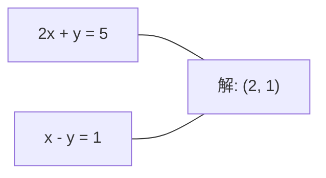
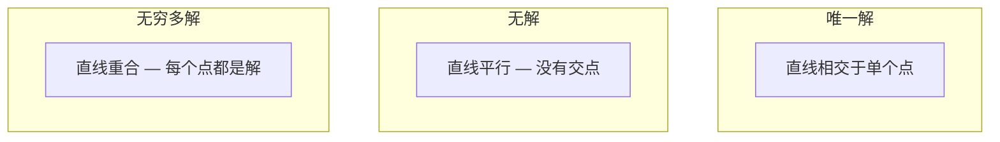

# Düzsel Sistemler

> Ax = b matematikte en eski sorunlardan biridir ve bugün hala sinir ağınızı kullanıyor.

**Type:** Build
**Language:**Python
**前置要求：**1. Fase Dersler 01 (Hattı Cevabı İntüyüsü),02 (Vektörler ve Matrisler),03 (Matrix Transformations)
**Time:** ~120 minutes

## Öğrenme hedefi
- 使用带 kısmi dönme 和 geri dönüş üstelik 求解 Ax = b
- LU、QR 和 Cholesky parçalanmalarını kullanın, Matrix'i çözün, ve her türlü yöntemin uygulanabilir olduğunu açıklayın.
- 推导最小正方形的正常方程式,并将其与线性回归和脊回归 联系起来
- İşe yarayan sistemleri teşhis etmek, düzenlemeyi uygulamak, sabitleştirmek

## 问题
Her antrenmanında bir çizgi gerileme sırasında, sen de bir çizgi sistemi çözmeye çalışıyorsun.`y = Wx + b`时,它都在评估线性系统的一侧. 时,你在修改这个系统. 时,你在分解一个矩阵. 时,你在分解一个矩阵. 时,你在解一个线性系统.

方程 Ax = b 无处不在──A, bilinen系数构成的矩阵──b,已知输出构成的矢量──x,你想找到的未知量矢量──在线性归归归中,A,你的数据矩阵,b,你的目标矢量,x,重量矢量──整个模型归结为:找到 x,使 Ax尽可能接近 b──

Bu ders, bu denklemin tüm ana yöntemlerini sıfırdan kurarak çözecek. Bazı yöntemlerin neden daha hızlı, diğerleri daha istikrarlı olduğunu, bazı yöntemlerin neden sadece kare sistemlere uygulanabileceğini, diğerleri ise aşırı belirlenmiş sistemleri ele alabileceğini ve Matrix'in koşul sayısı neden cevaplarınızın anlamlı olup olmadığını belirlediğini anlayacaksınız.

## 概念
### Ax = b hangi anlamda

Bir çizgisi denklem sistemi 具有几何解释──每个方程式 定义一个超平面──解就是所有超平面相交的点(或点集)──

```
2x + y = 5          2D 中的两条直线。
x - y  = 1          它们相交于 x=2, y=1。
```



Üç tür durum ortaya çıkabilir:



Matrix 形式中, "bir çözüm" A'nın dönüştürülebilir olduğunu ifade eder. "Hiçbir çözüm" sistemin tutarlı olmadığını ifade eder. "Sınırsız çözümler" A'nın sıfır boşluğu olduğunu ifade eder.

### sütun resmi vs satır resmi

Ax = bı anlamaya iki yol vardır.

**Row picture.**A'nın her satırı bir denklem tanımlıyor. Her denklem bir hiperplane.

**Column picture.**A'nın her bir sırası bir vektördür. Sorun şu hale geliyor: A'nın sütunlarının hangi doğrusal kombinasyonu b'yi oluşturabilir?

```
A = | 2  1 |    b = | 5 |
    | 1 -1 |        | 1 |

Row picture: 同时求解 2x + y = 5 和 x - y = 1。

Column picture: 找到 x1, x2，使得：
  x1 * [2, 1] + x2 * [1, -1] = [5, 1]
  2 * [2, 1] + 1 * [1, -1] = [4+1, 2-1] = [5, 1]   check.
```

Sütun resmi 更根本── Eğer b A'nın sütun alanında yer alırsa, sistem çözülür. Eğer b içinden değilse, sütun alanını bulursun.

### Gaussian ortadan kaldırılması

Gaussian ortadan kaldırılması 将 Ax = b 转换为上方三角形系统 Ux = c, sonra geri takdim ile 求解──这是最直接的方法──

算法:

```
1. 对每一列 k（pivot column）：
   a. 在第 k 行及其下方，找到 column k 中最大的 entry（partial pivoting）。
   b. 将该行与第 k 行交换。
   c. 对 k 下方的每一行 i：
      - 计算 multiplier m = A[i][k] / A[k][k]
      - 从第 i 行中减去 m 倍的第 k 行。
2. Back substitute：从最后一个 equation 向上求解。
```

Örnek:

```
Original:
| 2  1  1 | 8 |       R2 = R2 - (2)R1     | 2  1   1 |  8 |
| 4  3  3 |20 |  -->  R3 = R3 - (1)R1 --> | 0  1   1 |  4 |
| 2  3  1 |12 |                            | 0  2   0 |  4 |

                       R3 = R3 - (2)R2     | 2  1   1 |  8 |
                                       --> | 0  1   1 |  4 |
                                           | 0  0  -2 | -4 |

Back substitute:
  -2 * x3 = -4    -->  x3 = 2
  x2 + 2  = 4     -->  x2 = 2
  2*x1 + 2 + 2 = 8 --> x1 = 2
```

Gaussian ortadan kaldırma hesaplama maliyeti O (n^3) ⋅ 1000x1000 sistemi için yaklaşık olarak 10 milyar kez yüzer nokta işlemidir.

### Bölümsel dönüşüm: Neden önemli

 pivot yok, Gaussian ortadan kaldırma başarısız olabilir veya çöp sonuçları üretir. Eğer pivot elementı 为零 ise, siz de 零 olarak ayrılır.

```
Bad pivot:                       With partial pivoting:
| 0.001  1 | 1.001 |            先交换行：
| 1      1 | 2     |            | 1      1 | 2     |
                                 | 0.001  1 | 1.001 |
m = 1/0.001 = 1000              m = 0.001/1 = 0.001
R2 = R2 - 1000*R1               R2 = R2 - 0.001*R1
| 0.001  1     | 1.001   |      | 1      1     | 2     |
| 0     -999   | -999.0  |      | 0      0.999 | 0.999 |

x2 = 1.000（正确）              x2 = 1.000（正确）
x1 = (1.001 - 1)/0.001          x1 = (2 - 1)/1 = 1.000（正确）
   = 0.001/0.001 = 1.000        稳定，因为 multiplier 很小。
```

Kesinlikle sınırlı olan yüzen nokta aritmetikinde, henüz pivot edilmemiş versiyon önemli rakamlar kaybedebilir.

### LU parçalanması

LU parçalanması A'yı aşağı üçgenli matris L ve üst üçgenli matris U:A = LU──L matrisine ayırır.

```
A = L @ U

| 2  1  1 |   | 1  0  0 |   | 2  1   1 |
| 4  3  3 | = | 2  1  0 | @ | 0  1   1 |
| 2  3  1 |   | 1  2  1 |   | 0  0  -2 |
```

Neden doğrudan ortadan kaldırmak yerine faktör olması gerekir? Çünkü bir L ve U varsa, herhangi bir yeni b için çözüm aramak Ax = b sadece O(n^2) gerektirir:

```
Ax = b
LUx = b
令 y = Ux:
  Ly = b    (forward substitution, O(n^2))
  Ux = y    (back substitution, O(n^2))
```

O(n^3) maliyeti sadece faktörleşme sırasında ödenir. Sonra her seferinde çözülür.

Parsiyel pivot kullanırken, PA = LU elde edersin, P'nin sırada değişkenlerin permutasyon matrisi olduğu kaydedilmiştir.

### QR parçalanması

QR parçalanması A'yı ortogonal matris Q'a ve üst üçgenli matris R:A = QR olarak çözecektir.

Ortogonal matris 具有 Q^T Q = I 的性质──它的列是ortonormal vectors──乘以 Q 会保持长和角──

```
A = Q @ R

Q has orthonormal columns: Q^T Q = I
R is upper triangular

To solve Ax = b:
  QRx = b
  Rx = Q^T b    (只需乘以 Q^T，不需要 inversion)
  Back substitute to get x.
```

En az kare problemlerini çözmek için çalışırken, QR LU'dan daha iyi sayısal istikrarda;

```
Given columns a1, a2, ... of A:

q1 = a1 / ||a1||

q2 = a2 - (a2 . q1) * q1        (减去到 q1 上的 projection)
q2 = q2 / ||q2||                (normalize)

q3 = a3 - (a3 . q1) * q1 - (a3 . q2) * q2
q3 = q3 / ||q3||

R[i][j] = qi . aj    for i <= j
```

Her adım, önceki tüm q vektörlerinin bileşenlerini kaldırır ve yeni ortogonal yön bırakır.

### Cholesky parçalanması

A = A^T) ve pozitif belirlenmiş olduğunda, tüm öz değerleri A = L^T olarak parçalanabilir.

```
A = L @ L^T

| 4  2 |   | 2  0 |   | 2  1 |
| 2  5 | = | 1  2 | @ | 0  2 |

L[i][i] = sqrt(A[i][i] - sum(L[i][k]^2 for k < i))
L[i][j] = (A[i][j] - sum(L[i][k]*L[j][k] for k < j)) / L[j][j]    for i > j
```

Cholesky LU'dan 快两倍, ve sadece depolama alanının yarısını gerektirir. Sadece simetrik pozitif kesin matrisler için uygundur, ancak bu tür Matrix sıkça ortaya çıkar:

- Kovariansa matrisleri simetrik pozitif yarı kesinlerdir.
- Gaussian süreçleri arasında çekirdek matrisi simetrik pozitif kesintir.
- Konves fonksiyonun en az 处'nin Hessian'ı simetrik pozitif kesin olarak vardır.
- A^T A 总是 simetrik pozitif yarı belirlenmiş。

Gaussian süreçlerinde, Cholesky'yi kullanarak K çekirdek matrisiyi ayırın, sonra K alfa = y'yi çözün. Cholesky faktörü de sınırlı olasılıkların log-determinantını verir: log det(K) = 2 * toplamı(log(diag(L)))。

### En az kare:当 Ax = b 没有精确解时

Eğer A m x n 且 m > n ∈ R = + + + + + + + + + + + + + + + + + + + + + + + + + + + + + + + + + + + + + + + + + + + + + + + + + + + + + + + + + + + + + + + + + + + + + + + + + + + + + + + + + + + + + + + + + + + + + + + + + + + + + + + + + + + + + + + + + + + + + + + + + + + + + + + + + + + + + + + + + + + + + + + + + + + + + + + + + + + + + + + + + + + + + + + + + + + + + + + + + + + + + + + + + + + + + + + + + + + + + + + + + + + + + + + + + + + + + + + + + + + + + + + + + + + + + + + + + + + + + + + + + + + + + + + + + + + + + + + + + + + + + + + + + + + + + + + + + + + + + + + + + + + + + + + + + + + + + + + + + + + + + + + + + + + + + + + + + + + + + + + + + + + + + + + + + + + + + + + + + + + + + + + + + + + + + + + + + + + + + + + + + + + + + + + + + + + + + + + + + + + + + + + + + + + + + + + + + + + + + + + + + + + + + + + + + + + + + + + + + + + + + + + + + + + + + + + + + + + + + + + + + + + + + + + + + + + + + + + + + + + + + + + + + + + + + + + + + + + + + + + + + + + + + + + + + + + + + + + +

```
minimize ||Ax - b||^2

这是 squared residuals 的总和：
  sum((A[i,:] @ x - b[i])^2 for i in range(m))
```

Minimize 满足 normal denklemler:

```
A^T A x = A^T b
```

推导:展开A 求 Gradient,并令其为零:2 A                                                                                                                                                                                                                                                     

```
Original system (overdetermined, 4 equations, 2 unknowns):
| 1  1 |         | 3 |
| 1  2 | x     = | 5 |       没有精确的 x 能满足全部 4 个 equations。
| 1  3 |         | 6 |
| 1  4 |         | 8 |

Normal equations:
A^T A = | 4  10 |    A^T b = | 22 |
        | 10 30 |            | 63 |

Solve: x = [1.5, 1.7]

这就是 linear regression。x[0] 是 intercept，x[1] 是 slope。
```

### Normal denklemler = doğrusal gerileme

Bu tür bağlantılar kesin. Sınırlı gerileme sırasında, veriler matrisi X, her satır bir örnek karşısında, her satır bir özellik karşısında, hedef vektör ve her giriş bir örnek karşısında, ağırlık vektör karşısında:

```
X^T X w = X^T y
w = (X^T X)^(-1) X^T y
```

Bu bir çizgi geri dönüşün kapalı biçimli çözümü.`sklearn.linear_model.LinearRegression.fit()`Şehir hesaplama sonucu (Yani QR veya SVD)

Matrix'e 添加规范化术语 lambda * I,你就得到脊回归:

```
(X^T X + lambda * I) w = X^T y
w = (X^T X + lambda * I)^(-1) X^T y
```

Düzenleme Matrix'in koşullandırılmasını daha iyi yapar, ve ağırlıkları tam tersine doğru küçültür. Lambda > 0 时,Matrix X^T X + lambda * I 总是对称正确,因此可用Cholesky 求解──

### Pseudoinverse (Moore-Penrose)

Pseudoinverse A+ matris inversiyonunu 推广到非正方和单数矩阵──任意 Matrix A için:

```
x = A+ b

where A+ = V Sigma+ U^T    (computed via SVD)
```

Sigma+ 通過對每非零單位值 取相互并转置結果构成──如果A = U Sigma V^T,那么A+ = V Sigma+ U^T──

```
A = U Sigma V^T        (SVD)

Sigma = | 5  0 |       Sigma+ = | 1/5  0  0 |
        | 0  2 |                | 0  1/2  0 |
        | 0  0 |

A+ = V Sigma+ U^T
```

Pseudoinverse                                                                                                                                                                                                                                                                                                                                                                                                                                                                                                                          
- 唯一解: A+ b 给出该解──
- 无解:A+b 给出最小平方 çözümü。
- B + B                                                                                                                                                                                                                                                                                                                                                                                                                                                                                                                           

NumPy'nin `np.linalg.lstsq`和 `np.linalg.pinv`İçeride hep SVD kullanıyorlar.

### Şart numarası

Şart numarası  Ölçüm çözümü girişlerin küçük değişikliklerine karşı duyarlılık göstermektedir.

```
kappa(A) = ||A|| * ||A^(-1)|| = sigma_max / sigma_min
```

İçinde sigma_max 和 sigma_min 分别是最大和最小单数值──

```
Well-conditioned (kappa ~ 1):        Ill-conditioned (kappa ~ 10^15):
b 中的小变化 -->                    b 中的小变化 -->
x 中的小变化                         x 中的巨大变化

| 2  0 |   kappa = 2/1 = 2          | 1   1          |   kappa ~ 10^15
| 0  1 |   safe to solve            | 1   1+10^(-15) |   solution is garbage
```

经验法则:
- Kappa < 100: Güven, çözüm 准确。
- Kappa ~ 10^k: 你大约会从浮点算法 中损失 k 位精度──
- kappa ~ 10^16(Float64): çözümü 没有意义──矩阵 实际上是单一──

ML'de, kötü koşullama  oluşur  neredeyse üst sırada 时── düzenlenme  添加 lambda * I) 会将条件番号 从 sigma_max / sigma_min 改善为 (sigma_max + lambda) / (sigma_min + lambda) 

### İteratif yöntemler:konjugat gradiyenti

对于非常大的稀有系统 (数百万未知),LU 或 Cholesky gibi doğrudan yöntemler 成本过高――Iterative methods 会通过多次代改进一个猜想 来近似解决――

Konjugat gradiyenti (CG) A'da simetrik pozitif kesin 时求解 Ax = b。 tam aritmetikte en çok n defa 代 tarafından kesin çözümü bulunur, ancak A'nın öz değerleri 聚合irse, genellikle daha hızlı kabul edilir。

```
Algorithm sketch:
  x0 = initial guess (often zero)
  r0 = b - A x0           (residual)
  p0 = r0                 (search direction)

  For k = 0, 1, 2, ...:
    alpha = (rk . rk) / (pk . A pk)
    x_{k+1} = xk + alpha * pk
    r_{k+1} = rk - alpha * A pk
    beta = (r_{k+1} . r_{k+1}) / (rk . rk)
    p_{k+1} = r_{k+1} + beta * pk
    if ||r_{k+1}|| < tolerance: stop
```

CG:
- Büyük ölçekli optimizasyon (Newton-CG yöntemi)
- 求解 PDE diskretleştirmeleri
- Kernel yöntemleri, bunlardan birinde kernel matrisi 太大无法因子
- 作为其他反复解决器的预定条件

Konverjense oranı  koşul sayısına bağlıdır──  daha iyi sistemlerin  收更快 收 收 收 快, bu da düzenlenmenin  yardımcı olan başka bir nedeni

### Tam resim:何時使用哪种方法

| Method | Requirements | Cost | Use case |
|--------|-------------|------|----------|
| Gaussian elimination | Square, nonsingular A | O(n^3) | 对 square system 的一次性求解 |
| LU decomposition | Square, nonsingular A | O(n^3) factor + O(n^2) solve | 使用相同 A 的多次求解 |
| QR decomposition | Any A (m >= n) | O(mn^2) | Least squares，numerically stable |
| Cholesky | Symmetric positive definite A | O(n^3/3) | Covariance matrices，Gaussian processes，ridge regression |
| Normal equations | Overdetermined (m > n) | O(mn^2 + n^3) | Linear regression（小 n） |
| SVD / pseudoinverse | Any A | O(mn^2) | Rank-deficient systems，minimum-norm solutions |
| Conjugate gradient | Symmetric positive definite, sparse A | O(n * k * nnz) | Large sparse systems，k = iterations |

### ML ile bağlantı

Bu dersten her türlü yöntem üretim sınıfı ML'de ortaya çıkar:

**Linear regression.**Kapalı biçim çözümü 求解正常 denklemler X^T X w = X^T y。

**Ridge regression.**Kısıtlama: X^T X 添加 lambda * I。 Düzenlenmiş sistem (X^T X + lambda * I) w = X^T y 总是可以通过Cholesky 求解,因为当 lambda > 0 时,X^T X + lambda * I 是对称正确的──

**Gaussian processes.**Tahmin ortalaması 需要求解 K alfa = y, K ise çekirdek matrisi。对 K 做 Cholesky faktörleşmesi 是标准方法。Log sınırlı olasılığı 使用 log det(K) = 2 toplam(log(diag(L)))。

**Neural network initialization.**Ortogonal başlangıç, QR parçalanmasını kullanmak için ortonomal ağırlık matrisleri oluşturmak için kullanılır. Bu derin ağların içindeki sinyal çöküşünü önleyebilir.

**Preconditioning.**Büyük ölçekli optimizörler kullanın tamamlanmamış Cholesky veya tamamlanmamış LU 作为结合梯度溶剂的预条件──

**Feature engineering.**X^T X'in koşul numarası  tell you features are yes collinear。


```figure
linear-system-conditioning
```

## Yapın onu.
### 步骤 1: Gaussian ortadan kaldırma kısmi dönümle

```python
import numpy as np

def gaussian_elimination(A, b):
    n = len(b)
    Ab = np.hstack([A.astype(float), b.reshape(-1, 1).astype(float)])

    for k in range(n):
        max_row = k + np.argmax(np.abs(Ab[k:, k]))
        Ab[[k, max_row]] = Ab[[max_row, k]]

        if abs(Ab[k, k]) < 1e-12:
            raise ValueError(f"Matrix is singular or nearly singular at pivot {k}")

        for i in range(k + 1, n):
            m = Ab[i, k] / Ab[k, k]
            Ab[i, k:] -= m * Ab[k, k:]

    x = np.zeros(n)
    for i in range(n - 1, -1, -1):
        x[i] = (Ab[i, -1] - Ab[i, i+1:n] @ x[i+1:n]) / Ab[i, i]

    return x
```

### 步骤 2: LU parçalanması

```python
def lu_decompose(A):
    n = A.shape[0]
    L = np.eye(n)
    U = A.astype(float).copy()
    P = np.eye(n)

    for k in range(n):
        max_row = k + np.argmax(np.abs(U[k:, k]))
        if max_row != k:
            U[[k, max_row]] = U[[max_row, k]]
            P[[k, max_row]] = P[[max_row, k]]
            if k > 0:
                L[[k, max_row], :k] = L[[max_row, k], :k]

        for i in range(k + 1, n):
            L[i, k] = U[i, k] / U[k, k]
            U[i, k:] -= L[i, k] * U[k, k:]

    return P, L, U

def lu_solve(P, L, U, b):
    n = len(b)
    Pb = P @ b.astype(float)

    y = np.zeros(n)
    for i in range(n):
        y[i] = Pb[i] - L[i, :i] @ y[:i]

    x = np.zeros(n)
    for i in range(n - 1, -1, -1):
        x[i] = (y[i] - U[i, i+1:] @ x[i+1:]) / U[i, i]

    return x
```

### 步骤 3: Cholesky parçalanması

```python
def cholesky(A):
    n = A.shape[0]
    L = np.zeros_like(A, dtype=float)

    for i in range(n):
        for j in range(i + 1):
            s = A[i, j] - L[i, :j] @ L[j, :j]
            if i == j:
                if s <= 0:
                    raise ValueError("Matrix is not positive definite")
                L[i, j] = np.sqrt(s)
            else:
                L[i, j] = s / L[j, j]

    return L
```

### 步骤 4: Normal denklemler üzerinden en az kare

```python
def least_squares_normal(A, b):
    AtA = A.T @ A
    Atb = A.T @ b
    return gaussian_elimination(AtA, Atb)

def ridge_regression(A, b, lam):
    n = A.shape[1]
    AtA = A.T @ A + lam * np.eye(n)
    Atb = A.T @ b
    L = cholesky(AtA)
    y = np.zeros(n)
    for i in range(n):
        y[i] = (Atb[i] - L[i, :i] @ y[:i]) / L[i, i]
    x = np.zeros(n)
    for i in range(n - 1, -1, -1):
        x[i] = (y[i] - L.T[i, i+1:] @ x[i+1:]) / L.T[i, i]
    return x
```

### 步骤 5: Şart numarası

```python
def condition_number(A):
    U, S, Vt = np.linalg.svd(A)
    return S[0] / S[-1]
```

## Kullan
Bu bölümleri bir araya getirerek gerçek veriler üzerinde doğrusal gerileme ve kıyıs gerileme yapılır:

```python
np.random.seed(42)
X_raw = np.random.randn(100, 3)
w_true = np.array([2.0, -1.0, 0.5])
y = X_raw @ w_true + np.random.randn(100) * 0.1

X = np.column_stack([np.ones(100), X_raw])

w_ols = least_squares_normal(X, y)
print(f"OLS weights (ours):    {w_ols}")

w_np = np.linalg.lstsq(X, y, rcond=None)[0]
print(f"OLS weights (numpy):   {w_np}")
print(f"Max difference: {np.max(np.abs(w_ols - w_np)):.2e}")

w_ridge = ridge_regression(X, y, lam=1.0)
print(f"Ridge weights (ours):  {w_ridge}")

from sklearn.linear_model import Ridge
ridge_sk = Ridge(alpha=1.0, fit_intercept=False)
ridge_sk.fit(X, y)
print(f"Ridge weights (sklearn): {ridge_sk.coef_}")
```

## - Söyle.
本课产 出:
- `code/linear_systems.py`, sıfırdan gerçekleşen Gaussian ortadan kaldırımı, LU parçalanması, Cholesky parçalanması, en az kare ve kıyılar geri dönüşü içerir
- Bir çalışılabilir gösterim, normal denklemleri göstermek ve bir çizgi gerileme  aynı ağırlık üretmek

## 练习
1. Gaussian eliminasyonunuzu kullanın LU çözücüünüzü kullanın.`np.linalg.solve`求解 sistem `[[1,2,3],[4,5,6],[7,8,10]] x = [6, 15, 27]`❖ Test3者在浮点宽容内给出相同答案──

2. 生成一个50x5 随机矩阵 X 和 目标 y = X @ w_true + noise──分别使用正常方程、QR(通过 `np.linalg.qr`)、SVD( geçişi`np.linalg.svd`) ve `np.linalg.lstsq`求解 w―比较四个解决方案──测量 X^T X 的条件数,并解释它如何影响你信任哪种方法──

3. 通過让两列几乎相同来创建一个几乎单一矩阵 (例如,列2 =列1 + 1e-10 * noise) ⋅计算它的条件数──分别在有规律化和无规律化的情况下求解 Ax = b(加0.01 * I) ⋅比较解决和残留物──解释为什么规律化有帮助──

4. 100x100 rastgele simetrik pozitif kesin matris için  konjugat gradient algoritması gerçekleştirmek  统计它收到容忍 1e-8 需要多少次的                                                                                                                                                                                                                                         

5. 10,50,200,5500'lik simetrik pozitif kesin matrisler üzerinde, Cholesky çözücü için, LU çözücü için`np.linalg.solve`Çolesky'nin yaklaşık 2 kat daha fazla olduğunu görüyorum.

## 关键术语
| Term | What people say | What it actually means |
|------|----------------|----------------------|
| Linear system | "Solve for x" | 一组 linear equations Ax = b。找到 x 意味着找到在 transformation A 下产生 output b 的 input。 |
| Gaussian elimination | "Row reduce" | 使用 row operations 系统性地将 diagonal 下方的 entries 置零，产生可通过 back substitution 求解的 upper triangular system。O(n^3)。 |
| Partial pivoting | "Swap rows for stability" | 在 column k 中进行 elimination 前，将该 column 中 absolute value 最大的行交换到 pivot 位置。防止除以很小的数。 |
| LU decomposition | "Factor into triangles" | 写成 A = LU，其中 L 是 lower triangular（存储 multipliers），U 是 upper triangular（eliminated matrix）。将 O(n^3) 成本摊销到多次求解中。 |
| QR decomposition | "Orthogonal factorization" | 写成 A = QR，其中 Q 的 columns 是 orthonormal，R 是 upper triangular。对于 least squares，比 LU 更稳定。 |
| Cholesky decomposition | "Square root of a matrix" | 对 symmetric positive definite A，写成 A = LL^T。成本是 LU 的一半。用于 covariance matrices、kernel matrices 和 ridge regression。 |
| Least squares | "Best fit when exact is impossible" | 当 system overdetermined（equations 多于 unknowns）时，最小化 squared residuals 的总和 ||Ax - b||^2。 |
| Normal equations | "The calculus shortcut" | A^T A x = A^T b。将 ||Ax - b||^2 的 Gradient 设为零。这就是 linear regression 的 closed-form solution。 |
| Pseudoinverse | "Inversion for non-square matrices" | A+ = V Sigma+ U^T via SVD。对于任意 Matrix，无论 square 或 rectangular、singular 与否，给出 minimum-norm least-squares solution。 |
| Condition number | "How trustworthy is this answer" | kappa = sigma_max / sigma_min。衡量对 input perturbations 的敏感性。大约损失 log10(kappa) 位精度。 |
| Ridge regression | "Regularized least squares" | 求解 (X^T X + lambda I) w = X^T y。添加 lambda I 改善 conditioning，并将 weights 向零收缩。防止 overfitting。 |
| Conjugate gradient | "Iterative Ax=b for big matrices" | 用于 symmetric positive definite systems 的 iterative solver。最多 n 步收敛。适合 factorization 成本过高的大型 sparse systems。 |
| Overdetermined system | "More data than parameters" | 在 m-by-n system 中 m > n。不存在精确解。Least squares 找到最佳近似。这就是每个 regression problem。 |
| Back substitution | "Solve from the bottom up" | 给定 upper triangular system，先求解最后一个 equation，然后向后 substitute。O(n^2)。 |
| Forward substitution | "Solve from the top down" | 给定 lower triangular system，先求解第一个 equation，然后向前 substitute。O(n^2)。用于 LU solves 中的 L step。 |

## 延伸阅读
- [MIT 18.06: Linear Algebra](https://ocw.mit.edu/courses/18-06-linear-algebra-spring-2010/)(Gilbert Strang) --                                                                                                                                                                                                                                                                                                                                                                                                                                                                                                                      
- [Numerical Linear Algebra](https://people.maths.ox.ac.uk/trefethen/text.html)(Trefethen & Bau) -- Sayısal istikrarı, koşullama ve algoritmaları anlamaya neden başarısız olduğunu anlamak standart referans
- [Matrix Computations](https://www.cs.cornell.edu/cv/GolubVanLoan4/golubandvanloan.htm)(Golub & Van Loan) -- 涵盖各种矩阵算法 的百科式参考
- [3Blue1Brown: Inverse Matrices](https://www.3blue1brown.com/lessons/inverse-matrices)-- Ax = b 几何义的可视化直觉
