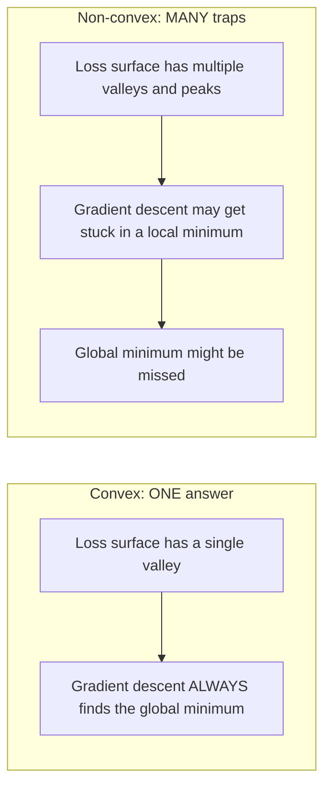
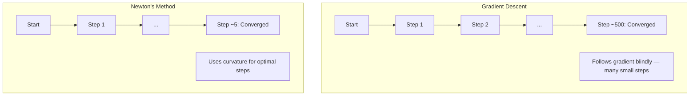
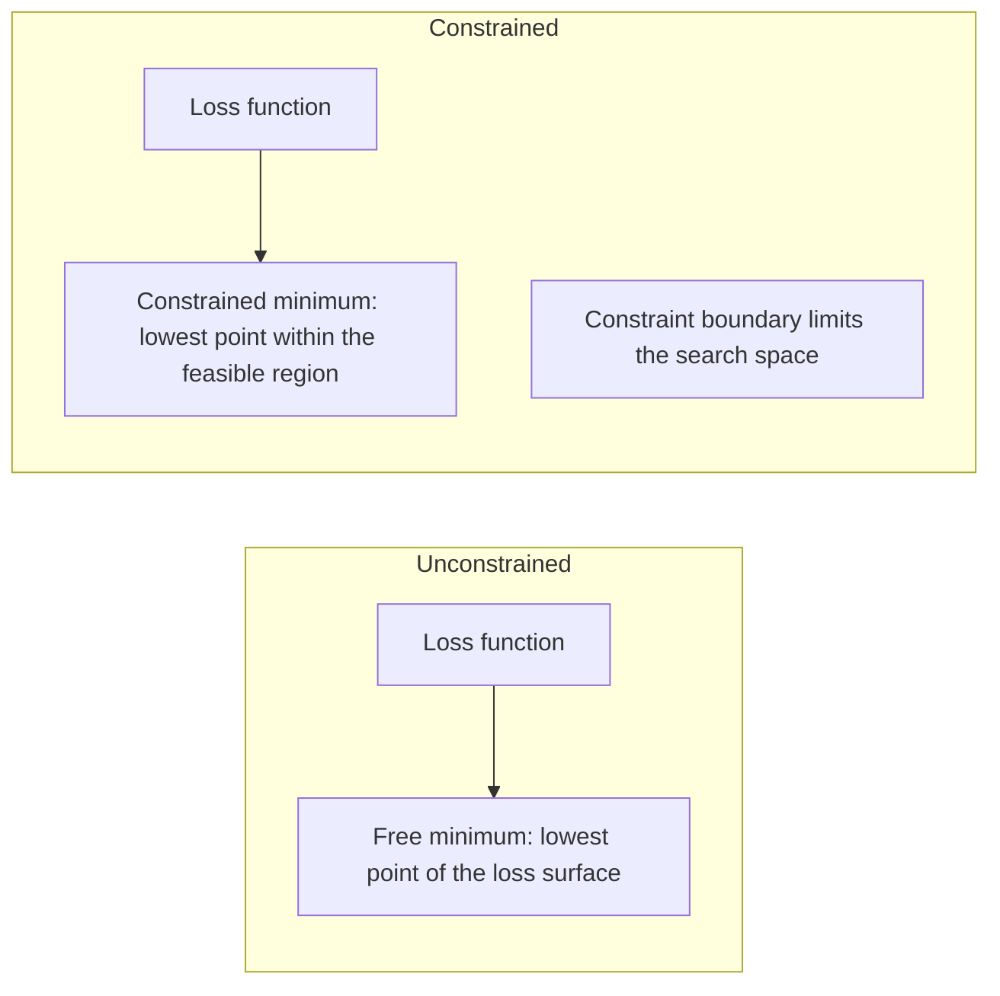
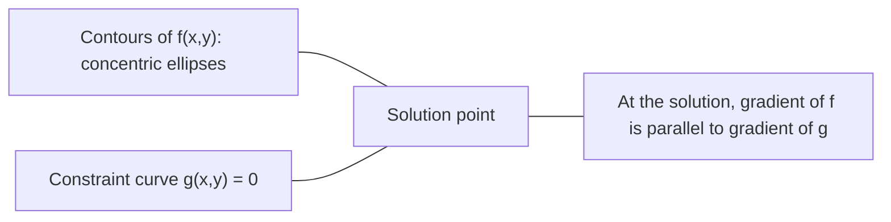

# 凸优化

> 凸 sorun sadece bir çukurun altında. Neural Network'de milyonlarca kişi var. Bu farkı anlamak çok önemlidir.

**类型：**Yapım
**语言：**Python
**前置要求：**Eğitim: 1. aşama, Ders 04
**时间：**90 dakika kadar .

## Öğrenme hedefi

- kullanımı defini、二阶导数和 Hessian 判据测试 bir işlevin kem işlevi olup olmadığını
- Newton'un yöntemini gerçekleştirmek, ikinci katlanma hızını Gradyen Düşüş ile karşılaştırmak
- Lagrange çarpıcıları kullanmak 求解带约束的优化问题,并解释 KKT koşulları
- Neden Neural Network Kayıp Manzarası Çekilmiyor, Ama SGD'nin Hala İyi Çözümleri Bulduğu

## 问题

Ders 08 Öğretmen Seni Gradient Descent, Momentum, Adam ve Adam olarak. Bu optimizerler herhangi bir yüzeyde aşağıya doğru hareket edebilir. Ama garanti yok.

Ancak ML'deki birçok sorun凸的──線形回归、物流回归、SVMs、LASSO、ridge regression── bu sorunlar için daha güçlü araçlar vardır:带有数学保证的优化──凸问题只有一个谷底──任何向下走的算法都会达到全局最小值──不需要重新启动──不需要学习率调度──不需要祈祷──

Kömünteti anlamak üç nokta değerine sahiptir. Birincisi, sorunun ne zaman basit olduğunu, ne zaman zor olduğunu anlatır. İkincisi, Kömünt probleminin Newton'un yöntemine benzer daha hızlı araçlar sunmasını sağlar. Üçüncüsü, ML'de tekrar tekrar ortaya çıkan kavramı açıklar: düzenleme  olarak bağlanma  SVM'ler arasındaki dualılık, ve neden derin öğrenme, Kömünteti'nin karşısında sağladığı her şeyin iyi niteliği üzerinde hala çalışabilir.

## 概念

### 凸集

Eğer S'nin içindeki herhangi iki noktaya göre, bunlar arasındaki çizgi bölümü de tamamen S'nin içindedirse, S'nin içindeki toplam da bir toplama olacaktır.

| 凸集 | 非凸 |
|---|---|
| **矩形**：内部任意两点都可以用一条仍在内部的线段连接 | **星形/月牙形**：两个内部点之间的线段可能穿过集合外部 |
| **三角形**：对所有内部点都满足相同性质 | **甜甜圈/环形**：中间的孔意味着某些线段会离开集合 |
| 任意两点之间的线段都留在集合内 | 某些点对之间的线段会离开集合 |

形式化测试: S içinde herhangi bir nokta x、y, ve [0, 1],点 tx + (1-t) y da S içinde。

凸集 örnekleri:
- Bir düz çizgi, bir düzlem, tüm R^n
- Bir top (öğrenç)
- Bir yarım uzay: {x: a^T x <= b}
- 任意数凸集的交交集

Çekilmez örnekler:
- Bir tatlı döngü
- İki farklı yönlü bir birleşim
- Herhangi bir tuzak veya delikle dolu bir topluluk

### 凸函数

Eğer f fonksiyonun tanım alanı bir topluğun olduğu ve tanım alanındaki herhangi iki noktayı x、y ve [0, 1] içinde herhangi bir t için ise:

```
f(tx + (1-t)y) <= t*f(x) + (1-t)*f(y)
```

几何上看: resim üzerinde herhangi iki nokta arasındaki çizgi bölümü resim üzerinde veya resim üzerinde yer almaktadır.

| 属性 | 凸函数 | 非凸函数 |
|---|---|---|
| **线段测试** | 图像上任意两点之间的线段位于曲线**之上或之上** | 图像上某些点之间的线段会下探到曲线**之下** |
| **形状** | 单个向上弯曲的碗/谷底 | 多个峰和谷，曲率混合 |
| **局部最小值** | 每个局部最小值都是全局最小值 | 可能存在多个高度不同的局部最小值 |

常见凸函数:
- f(x) = x^2(抛物线)
- F (x) =) X (x) = = = = = = = = = = = = = = = = = = = = = = = = = = = = = = = = = = = = = = = = = = = = = = = = = = = = = = = = = = = = = = = = = = = = = = = = = = = = = = = = = = = = = = = = = = = = = = = = = = = = = = = = = = = = = = = = = = = = = = = = = = = = = = = = = = = = = = = = = = = = = = = = = = = = = = = = = = = = = = = = = = = = = = = = = = = = = = = = = = = = = = = = = = = = = = = = = = = = = = = = = = = = = = = = = = = = = = = = = = = = = = = = = = = = = = = = = = = = = = = = = = = = = = = = = = = = = = = = = = = = = = = = = = = = = = = = = = = = = = = = = = = = = = = = = = = = = = = = = = = = = = = = = = = = = = = = = = = = = = = = = = = = = = = = = = = = = = = = = = = = = = = = = = = = = = = = = = = = = = = = = = = = = = = = = = = = = = = = = = = = = = = = = = = = = = = = = = = = = = = = = = = = = = = = = = = = = = = = = = = = = = = = = = = = = = = = = = = = = = = = = = = = = = = = = = = = = = = = = = = = = = = = = = = = = = = = = = = = = = = = = = = = = = = = = = = = = = = = = = = =
- f(x) = e^x(指数)
- f(x) = max(0, x)(ReLU, yine de 分段线性)
- f(x) = -log(x) için x > 0(负对数)
- 任意线性函数 f(x) = a^T x + b(既凸又)

### 测试凸性

Üç pratik test, en kolaytan en sıkıına kadar.

**测试 1：二阶导数测试（1D）。**Eğer tüm x'lere f'(x) >= 0, o zaman f'yün bir çarpma fonksiyonu vardır.

- f(x) = x^2:f'(x) = 2 >= 0。凸。
- f(x) = x^3:f'(x) = 6x。x < 0 时为负──非凸。
- f(x) = e^x: f'(x) = e^x > 0。凸。

**测试 2：Hessian 测试（多变量）。**Eğer Hessian Matrix H(x) tüm x için olumlu yarı belirlenmiş ise, f = konumu fonksiyonu。 Hessian = iki aşama yönlü sayı oluşturan Matrix。

**测试 3：定义测试。**直接检查不等式 f(tx + (1-t) y) <= t*f(x) + (1-t) *f(y)。适用于导数难以计算的函数。

### Neden önemli?

凸优化的核心定理:

**对于凸函数，每个局部最小值都是全局最小值。**

Bu, Gradient Descent'in sıkışmayacağı anlamına gelir. Aşağıdaki yolların hepsi aynı cevaplara doğru gider.



Sonuç:
- Tekrar başlatmak zorunda değilsiniz.
- karmaşık öğrenme oranı düzenlemesi gerekmez
- % % % % % % % % % % % % % % % % % % % % % % % % % % % % % % % % % % % % % % % % % % % % % % % % % % % % % % % % % % % % % % % % % % % % % % % % % % % % % % % % % % % % % % % % % % % % % % % % % % % % % % % % % % % % % % % % % % % % % % % % % % % % % % % % % % % % % % % % % % % % % % % % % % % % % % % % % % % % % % % % % % % % % % % % % % % % % % % % % % % % % % % % % % % % % % % % % % % % % % % % % % % % % % % % % % % % % % % % % % % % % % % % % % % % % % % % % % % % % % % % % % % % % % % % % % % % % % % % % % % % % % % % % % % % % % % % % % % % % % % % % % % % % % % % % % % % % % % % % % % % % % % % % % % % % % % % % % % % % % % % % % % % % % % % % % % % % % % % % % % % % % % % % % % % % % % % % % % % % % % % % % % % % % % % % % % % % % % % % % % % % % % % % % % % % % % % % % % % % % % % % % % % % % % % % % % % % % % % % % % % % % % % % % % % % % % % % % % % % % % % % % % % % % % % % % % % % % % % % % % % % % % % % % % % % % % % % % % % % % % % % % % % % % % % % % % % % % % % % % % % % % % % % % % % % %
- 解是唯一的 (Bölge dışında)

### ML'de bulunan kemik ve kemik olmayan

| 问题 | 凸？ | 原因 |
|---------|---------|-----|
| Linear regression (MSE) | 是 | Loss 关于权重是二次的 |
| Logistic regression | 是 | Log-loss 关于权重是凸的 |
| SVM (hinge loss) | 是 | 线性函数的最大值 |
| LASSO (L1 regression) | 是 | 凸函数之和是凸的 |
| Ridge regression (L2) | 是 | 二次 + 二次 = 凸 |
| Neural Network（任意 Loss） | 否 | 非线性 activations 会产生非凸 landscape |
| k-means clustering | 否 | 离散分配步骤 |
| Matrix factorization | 否 | 未知量的乘积 |

带有凸 Loss 线性模型是凸的. 带有凸 Loss 线性的模型是凸的. 带有凸 Loss 线性的模型是凸的. 带有凸 Loss 线性的线性模型是凸的. 带有凸 Loss 线性的线性模型是凸的. 带有凸的激活的隐藏层,凸性就会被破坏.

### Hessian Matrix

函数 f: R^n -> R'ın Hessian H ise n x n matrisi tarafından oluşturulan ikinci aşama yönlendirme sayısı tarafından oluşturulur.

```
H[i][j] = d^2 f / (dx_i dx_j)
```

对于 f ((x, y) = x^2 + 3xy + y^2:

```
df/dx = 2x + 3y       d^2f/dx^2 = 2      d^2f/dxdy = 3
df/dy = 3x + 2y       d^2f/dydx = 3      d^2f/dy^2 = 2

H = [ 2  3 ]
    [ 3  2 ]
```

Hessian 告诉你曲率信息:
- Kendi değerleri 全为正: işlevi her yönde tüm yukarı 曲 (→→→→→→→→→→→→→→→→→→→→→→→→→→→→→→→→→→→→→→→→→→→→→→→→→→→→→→→→→→→→→→→→→→→→→→→→→→→→→→→→→→→→→→→→→→→→→→→→→→→→→→→→→→→→→→→→→→→→→→→→→→→→→→→→→→→→→→→→→→→→→→→→→→→→→→→→→→→→→→→→→→→→→→→→→→→→→→→→→→→→→→→→→→→→→→→→→→→→→→→→→→→→→→→→→→→→→→→→→→→→→→→→→→→→→→→→→→→→→→→→→→→→→→→→→→→→→→→→→→→→→→→→→→→→→→→→→→→→→→→→→→→→→→→→→→→→→→→→→→→→→→→→→→→→→→→→→→→→→→→→→→→→→→→→→→→→→→→→→→→→→→→→→→→→→→→→→→→→→→→→→→→→→→→→→→→→→→→→→→→→→→→→→→→→→→→→→→→→→→→→→→→→→→→→→→→→→→→→→→→→→→→→→→→→→→→→→→→→→→→→→→→→→→→→→→→→→→→→→→→→→→→→→→→→→→→→→→→→→→→→→→→→→→→→→→→→
- Kendi değerleri 全为负: 在每个方向上都向下曲(,局部最大值)
- 符号混合:saddle point ((böyle yönlerde yukarı 曲, diğer yönlerde aşağı 曲)
- 零 öz değeri:该方向上是平坦的(退化)

√√√√√√√√√√√√√√√√√√√√√√√√√√√√√√√√√√√√√√√√√√√√√√√√√√√√√√√√√√√√√√√√√√√√√√√√√√√√√√√√√√√√√√√√√√√√√√√√√√√√√√√√√√√√√√√√√√√√√√√√√√√√√√√√√√√√√√√√√√√√√√√√√√√√√√√√√√√√√√√√√√√√√√√√√√√√√√√√√√√√√√√√√√√√√√√√√√√√√√√√√√√√√√√√√√√√√√√√√√√√√√√√√√√√√√√√√√√√√√√√√√√√√√√√√√√√√√√√√√√√√√√√√√√√√√√√√√√√√√√√√√√√√√√√√√√√√√√√√√√√√√√√√√√√√√√√√√√√√√√√√√√√√√√√√√√√√√√√√√√√√√√√√√√√√√√√√√√√√√√√√√√√√√√√√√√√√√√√√√√√√√√√√√√√√√√√√√√√√√√√√√√√√√√√√√√√√√√√√√√√√√√√√√√√√√√√√√√√√√√√√√√√√√√√√√√√√√√√√√√√√√√√√√√√√√√√√√√√√√√√√√√√√√√√√√√√√√√√√√√√√√√√√√√√√

### Newton'un yöntemi

Gradient Descent kullanın bir aşama bilgi ((Gradient) ・・・Newton'un yöntemi kullanın ikinci aşama bilgi ((Hessian) ・・・ Bu bir ikinci yaklaşım için hazırlanmış bir nokta, sonra doğrudan bu ikinci işlevin en az değerine atlamıştır.

```
Update rule:
  x_new = x - H^(-1) * gradient

Compare to gradient descent:
  x_new = x - lr * gradient
```

Newton'un yöntemi Hessian'ın aksine 代替标量学习率 kullanılır.



优点:
- 接近最小值时二次收(每步误差平方级下降)
- 调学习率
- 尺度不变 (Hepiniz nasıl da değişir)

缺点:
- 計算 Hessian 需要 O(n^2) 内存,求逆需要 O(n^3)
- Bir milyon ağırlıklı sinir ağı için bu 10'12'e 10'18'e kadar işlem anlamına gelir.
- Derin Öğrenme için uygulanmaz

### 约束优化

无约束优化:在所有 x 上最小化 f(x)。
约束优化: 约束条件下最小化 f ((x))

现实问题有约束――你想最小化成本,但预算有限――你想最小化错误,但模型复杂度有限――



### Lagrange çarpıcıları

Lagrange çarpıcıları 方法把束問題转换为无束問題──

问题:在 g(x) = 0 的约束下最小化 f(x) 』

解法:引入一个新变量 (Lagrange çarpıcı lambda)并求解无约束问题:

```
L(x, lambda) = f(x) + lambda * g(x)
```

Çözümde, L'in derecesi:

```
dL/dx = df/dx + lambda * dg/dx = 0
dL/dlambda = g(x) = 0
```

几何直觉: f'nin derecesi, 束 g'nin derecesiyle aynı olmalıdır. Eğer onlar eşit değilse, f'yi daha da düşürerek, 束曲面 boyunca hareket edebilirsiniz.



Örnek: x + y = 1'in kısıtlaması altında en azlaştırılmış f(x,y) = x^2 + y^2。

```
L = x^2 + y^2 + lambda(x + y - 1)

dL/dx = 2x + lambda = 0  =>  x = -lambda/2
dL/dy = 2y + lambda = 0  =>  y = -lambda/2
dL/dlambda = x + y - 1 = 0

From first two: x = y
Substituting: 2x = 1, so x = y = 0.5, lambda = -1
```

Doğrudan x + y = 1 yukarı mesafe ilk noktadan yakın olan nokta (0,5, 0,5) ⋅

### KKT koşulları

Karush-Kuhn-Tucker koşulları Lagrange çarpıcılarını                                                                                                                                                                                                                                                                                                                                                                                                                                                                                                             

问题:在 g_i(x) <= 0,i = 1, ..., m 的约束下最小化 f(x) 』

KKT şartları:

```
1. Stationarity:    df/dx + sum(lambda_i * dg_i/dx) = 0
2. Primal feasibility:  g_i(x) <= 0  for all i
3. Dual feasibility:    lambda_i >= 0  for all i
4. Complementary slackness:  lambda_i * g_i(x) = 0  for all i
```

Ek gevşeklik ise önemli bir açıktır.

KKT koşulları SVM'nin merkezilerdir. Destek vektörleri ise aktif olan bir veri noktasıdır.

### Düzenleme  作为束优化

L1 ve L2 düzenlenmesi isteksiz teknikler değildir.

**L2 regularization (Ridge)：**

```
minimize  Loss(w)  subject to  ||w||^2 <= t

Equivalent unconstrained form:
minimize  Loss(w) + lambda * ||w||^2
```

约束 约束 约束 约束 约束 约束 约束 约束 约束 约束 约束 约束 约束 约束 约束 约束 约束 约束 约束 约束 约束 约束 约束 约束 约束 约束 约束 约束 约束 约束 约束 约束 约束 约束 约束 约束 约束 约束 约束 约束 约束 约束 约束 约束 约束 约束 约束 约束 约束 约束 约束 约束 约束 约束 约束 约束 约束 约束 约束 约束 约束 约束 约束 约束 约束 约束 约束 约束 约束 约 约 约 约 约 约 约 约 约 约 约 约 约 约 约 约 约 约 约 约 约 约 约 约 约 约 约 约 约 约 约 约 约 约 约 约 约 约 约 约 约 约 约 约 约 约 约 约 约 约 约 约 约 约 约 约 约 约 约 约 约 约 约 约 约 约 约 约 约 约 约 约 约 约  约 约 约 约 约     约     约     约                                                                                                                              

**L1 regularization (LASSO)：**

```
minimize  Loss(w)  subject to  ||w||_1 <= t

Equivalent unconstrained form:
minimize  Loss(w) + lambda * ||w||_1
```

约束 束 束 束 束 束 束 束 束 束 束 束 束 束 束 束 束 束 束 束 束 束 束 束 束 束 束 束 束 束 束 束 束 束 束 束 束 束 束 束 束 束 束 束 束 束 束 束 束 束 束 束 束 束 束 束 束 束 束 束 束 束 束 束 束 束 束 束 束 束 束 束 束 束 束 束 束 束 束 束 束 束 束 束 束 束 束 束 束 束 束 束 束 束 束 束 束 束 束 束 束 束 束 束 束 束 束 束 束 束 束 束 束 束 束 束 束 束 束 束 束 束 束 束 束 束 束 束 束 束 束 束 束 束 束 束 束 束 束   束 束                                                                                                                                                                                                                                 

| 属性 | L2 约束（圆） | L1 约束（菱形） |
|---|---|---|
| **约束形状** | 圆（更高维中是球面） | 菱形（2D 中旋转的正方形） |
| **Loss 等高线接触的位置** | 光滑边界：圆上的任意点 | 角点：与某个轴对齐 |
| **解的行为** | 权重较小但非零 | 某些权重恰好为零（稀疏） |
| **结果** | 权重收缩 | 特征选择 |

Bu, L1'nin neden nadir bir model ürettiğini açıklıyor. L2'nin sadece ağırlığın azaltılmasını sağlar.

### İkiliğe

Her bir kısım optimizasyon sorunu (primal) bir eşlik sorunu (dual) vardır.

Lagrangian çift fonksiyonu:

```
Primal: minimize f(x) subject to g(x) <= 0
Lagrangian: L(x, lambda) = f(x) + lambda * g(x)
Dual function: d(lambda) = min_x L(x, lambda)
Dual problem: maximize d(lambda) subject to lambda >= 0
```

Neden ikililik  önemli:
- İkili sorun bazen ilk olana göre çözülmesi daha kolay olur.
- SVM'ler çift biçimde 求解, bunların içinde sorunlar, noktaların arasındaki nokta ürünlerine bağlıdır.
- ikili                                                                                                                                                                                                                                                                                                                                                                                                                                                                                                                            

具体到SVM:

```
Primal: find w, b that maximize the margin 2/||w|| subject to
        y_i(w^T x_i + b) >= 1 for all i

Dual:   maximize sum(alpha_i) - 0.5 * sum_ij(alpha_i * alpha_j * y_i * y_j * x_i^T x_j)
        subject to alpha_i >= 0 and sum(alpha_i * y_i) = 0

The dual only involves dot products x_i^T x_j.
Replace x_i^T x_j with K(x_i, x_j) to get the kernel trick.
```

### Neden Derin Öğrenme -Köküleme rağmen hala çalışabilmektedir

Neural Network Loss Function 极其非凸── her klasik standartlara göre, onları optimize etmek başarısız olmalıdır── Bununla birlikte, stohastik Gradient Descent 能可靠地找到好的解──几个因素解释这一点──

**大多数局部最小值已经足够好。**Yüksek seviye alanında, her zaman kritik noktalarda, yerin en düşük değerinden ziyade, bir yere düşen noktalarda baskı yapılır.

**真正的障碍是 saddle points，而不是局部最小值。**Bir n 个参数 işlevi içinde, otlak noktası aynı zamanda doğru eğilimi ve negatif eğilimi yönü ile birlikte yüksek seviyede herhangi bir kritik noktaya göre, tüm n 个 öz değerlerinin doğru için yerelendirilen en düşük değer) olasılığı yaklaşık olarak 2^(-n) ⋅ neredeyse tüm kritik noktalar otlak noktasıdır. SGD'nin gürültüsü onları kaçmaya yardımcı olur.

**Overparameterization 会平滑 landscape。**参数 sayısı eğitim örneğinin ağının daha düz, daha bağlantılı bir kayıp yüzeyine sahiptir.  Daha geniş ağların daha az kötü yerleşim en az değeri vardır.

**Loss landscape 结构：**

| 属性 | 低维空间 | 高维空间 |
|---|---|---|
| **Landscape** | 许多孤立的峰和谷 | 平滑连通的谷 |
| **最小值** | 许多孤立局部最小值 | 很少有糟糕局部最小值；大多数接近最优 |
| **导航** | 难以找到全局最小值 | 许多路径通向好的解 |
| **Critical points** | 局部最小值和 saddle points 混合 | 压倒性地是 saddle points，而非局部最小值 |

**随机噪声充当隐式 regularization。**Mini-batch SGD   gürültü giriş, keskin minimumlara düşmesini önlemek.

### 实践中的二阶方法

Yeni Newton'un büyük model için kullandığı yöntemler kullanışlı değildir.

**L-BFGS (Limited-memory BFGS)：**O 个 个 个 Gradient 差分近似逆 Hessian。 O  m) 内存 gerektirir, O  n ^ 2)。 en fazla 10.000 个参数 sorusu için uygulanır。 klasik ML  logistik geri dönüş、CRF'ler için kullanılır, ancak Derin Öğrenme için kullanılmaz。

**Natural gradient：**Fisher bilgi matrisi (Fisher bilgi matrisi) Hessian değil standart Hessian olarak kullanılır. Bu, yaklaşık olarak bölünmüş bir geometrik yapı olarak görülebilir.

**Hessian-free optimization：**Hx = g, H. Hessyan vektör ürünleri için kullanılır. Bu otomatik olarak ayrıştırılabilir.

**Diagonal approximations：**Adam'ın ikinci anı Hessian'ın köşenin karşı köşesine yaklaşımıdır. AdaHessian Hutchinson'ın tahmincisiyle gerçek Hessian diyagonal unsurları kullanarak bu noktayı genişletti.

| 方法 | 内存 | 每步成本 | 何时使用 |
|--------|--------|--------------|-------------|
| Gradient Descent | O(n) | O(n) | Baseline，大模型 |
| Newton's method | O(n^2) | O(n^3) | 小型凸问题 |
| L-BFGS | O(mn) | O(mn) | 中型凸问题 |
| Adam | O(n) | O(n) | Deep Learning 默认选择 |
| K-FAC | O(n) | 每层 O(n) | 研究、大 batch training |


```figure
convex-vs-nonconvex
```

## Yapın onu.

### 步骤 1:凸性检查器

 bir işlevi oluşturmak, deneysel testlerin tanımlanması ve testlerin test edilmesi için örneklemeler yaparak 

```python
import random
import math

def check_convexity(f, dim, bounds=(-5, 5), samples=1000):
    violations = 0
    for _ in range(samples):
        x = [random.uniform(*bounds) for _ in range(dim)]
        y = [random.uniform(*bounds) for _ in range(dim)]
        t = random.uniform(0, 1)
        mid = [t * xi + (1 - t) * yi for xi, yi in zip(x, y)]
        lhs = f(mid)
        rhs = t * f(x) + (1 - t) * f(y)
        if lhs > rhs + 1e-10:
            violations += 1
    return violations == 0, violations
```

### 2D Newton'un yöntemini kullanmak için

Newton'un yöntemini gerçekleştirmek için kullanılır.

```python
def newtons_method(f, grad_f, hessian_f, x0, steps=50, tol=1e-12):
    x = list(x0)
    history = [x[:]]
    for _ in range(steps):
        g = grad_f(x)
        H = hessian_f(x)
        det = H[0][0] * H[1][1] - H[0][1] * H[1][0]
        if abs(det) < 1e-15:
            break
        H_inv = [
            [H[1][1] / det, -H[0][1] / det],
            [-H[1][0] / det, H[0][0] / det],
        ]
        dx = [
            H_inv[0][0] * g[0] + H_inv[0][1] * g[1],
            H_inv[1][0] * g[0] + H_inv[1][1] * g[1],
        ]
        x = [x[0] - dx[0], x[1] - dx[1]]
        history.append(x[:])
        if sum(gi ** 2 for gi in g) < tol:
            break
    return history
```

### 步骤 3:Lagrange çarpıcı 求解器

通過在拉格蘭基上执行 Gradient Descent 来求解约束优化──

```python
def lagrange_solve(f_grad, g_val, g_grad, x0, lr=0.01,
                   lr_lambda=0.01, steps=5000):
    x = list(x0)
    lam = 0.0
    history = []
    for _ in range(steps):
        fg = f_grad(x)
        gv = g_val(x)
        gg = g_grad(x)
        x = [
            xi - lr * (fgi + lam * ggi)
            for xi, fgi, ggi in zip(x, fg, gg)
        ]
        lam = lam + lr_lambda * gv
        history.append((x[:], lam, gv))
    return history
```

### 步骤 4: Birinci aşama ile ikinci aşama karşılaştır

Aynı ikinci işlevi üzerinde çalıştırılır Gradient Descent ve Newton'un yöntemi.

```python
def quadratic(x):
    return 5 * x[0] ** 2 + x[1] ** 2

def quadratic_grad(x):
    return [10 * x[0], 2 * x[1]]

def quadratic_hessian(x):
    return [[10, 0], [0, 2]]
```

Newton'un yöntemi 1 步内收 (doğru)  (doğru)  (doğru)  (doğru)  (doğru)  (doğru)  (doğru)  (doğru)  (doğru)  (doğru)  (doğru)  (doğru)  (doğru)  (doğru)  (doğru)  (doğru)  (doğru)  (doğru)  (doğru)  (doğru)  (doğru)  (doğru)  (doğru)  (doğru)  (doğru)  (doğru)  (doğru)  (doğru)  (doğru)  (doğru)  (doğru)  (doğru)  (doğru)  (doğru)  (doğru)  (doğru)  (doğru)  (doğru)  (doğru)  (doğru)  (doğru)  (doğru)

## Kullan

Bu nedenle, bu yöntemin kullanımı ve kullanımı çok önemlidir.

对于凸问题(logistik gerileme、SVMs、LASSO):
- kullanıma özel çözücü ((liblinear、CVXPY、scipy.optimize.minimize method='L-BFGS-B') ile
- 预期 get unique全局解
- İkinci aşama yöntem uygundur ve hızlı

对于非凸问题:
- Bir aşama yöntem kullanın.
- 接受解依赖初始化和随机性
- Aşırı parametreleşme, ses ve öğrenme oranı düzenlemesini gizli düzenlendirme olarak kullanmak
- Zamanınızı boşa harcamayın. İyi bir yerin en az değeri yeter.

```python
from scipy.optimize import minimize

result = minimize(
    fun=lambda w: sum((y - X @ w) ** 2) + 0.1 * sum(w ** 2),
    x0=np.zeros(d),
    method='L-BFGS-B',
    jac=lambda w: -2 * X.T @ (y - X @ w) + 0.2 * w,
)
```

SVM için, çift formülasyon için çekirdek hilesini kullanabilirsin:

```python
from sklearn.svm import SVC

svm = SVC(kernel='rbf', C=1.0)
svm.fit(X_train, y_train)
print(f"Support vectors: {svm.n_support_}")
```

## 练习

1. **凸性画廊。**kullanın, test yapın bu fonksiyonların kemansallığı: f(x) = x^4、f(x) = sin(x)、f(x,y) = x^2 + y^2、f(x,y) = x*y、f(x) = max(x, 0)。

2. **Newton vs Gradient Descent 竞赛。**Başlangıç noktasından (10, 10) çıkış, f ((x,y) = 50*x^2 + y^2 上运行两种方法──每种方法需要多少步才能达到损失 < 1e-10?

3. **Lagrange multiplier 几何。**Bu nedenle, bu değerlerin değerinin değerinin değerinin değerinin değerinin değerinin değerinin değerinin değerinin değerinin değerinin değerinin değerinin değerinin değerinin değerinin değerinin değerinin değerinin değerinin değerinin değerinin değerinin değerinin değerinin değerinin değerinin değerinin değerinin değerinin değerinin değerinin değerinin değerinin değerinin değerinin değerinin değerinin değerinin değerinin değerinin değerinin değerinin değerinin değerinin değerinin değerinin değerinin değerinin değerinin değerinin değerinin değerinin değerinin değerinin değerinin değerinin değerinin değerinin değerinin değerinin değerinin değerinin değerinin değerinin değerinin değerinin değerinin değerinin değerinin değerinin değerinin değerinin değerinin değerinin değerinin değerinin değerinin değerinin değerinin değerinin değerinin değerinin değerinin değerinin değerinin değerinin değerinin değerinin değerinin değerinin değerinin değerinin değerinin değerinin değerinin değerinin değerinin değerinin değerinin değerinin değerinin değerinin değerinin değerinin değerinin değerinin değerinin değerinin değerinin değerinin değerinin değerinin değerinin değerinin değerinin değerinin değerinin değerinin değerinin değerinin değerinin değerinin değerinin değerinin değerinin değerinin değerinin değerinin değerinin değerinin değerinin değerinin değerinin değerinin değerinin değerinin değerinin değerinin değerinin değerinin değerinin değerinin değerinin değerinin değerinin değerinin değerinin değerinin değerinin değerinin değerinin değerinin değerinin değerinin değerinin değerinin değerinin değerinin değerinin değerinin değerinin değerinin değerinin değerinin değerinin değerinin değerinin değerinin değerinin değerinin değerinin değerinin değerinin değerinin değerinin değerinin değerinin değerinin değerinin değerinin değerinin değerinin değerinin değerinin değerinin değerinin değerinin değerinin değerinin değerinin değerinin değerinin değerinin değerinin değerinin değerinin değerinin değerinin değerinin değerinin değerinin değerinin değerinin değerinin değerinin değerinin değerinin değerinin değerinin değerinin değerinin değerinin değerinin değerinin değerinin değerinin değerinin değerinin değerinin değerinin değerinin değerinin değerinin değerinin değerinin değerinin değerinin değerinin değerinin değerinin değerinin değerinin değerinin değerinin değer değerinin değerinin değer değerinin değerinin değerinin değerinin değerinin değerinin değerinin değerinin değer değer değer değer değerinin değerinin değerinin değerinin

4. **Regularization 约束。**L1 kısıtlı optimizasyonu gerçekleştirmek: ⇒ x ∈ ∈ + y ∈ ∈ <= 1 ∈ ∈ ∈ ∈ ∈ ∈ ∈ ∈ ∈ ∈ ∈ ∈ ∈ ∈ ∈ ∈ ∈ ∈ ∈ ∈ ∈ ∈ ∈ ∈ ∈ ∈ ∈ ∈ ∈ ∈ ∈ ∈ ∈ ∈ ∈ ∈ ∈ ∈ ∈ ∈ ∈ ∈ ∈ ∈ ∈ ∈ ∈ ∈ ∈ ∈ ∈ ∈ ∈ ∈ ∈ ∈ ∈ ∈ ∈ ∈ ∈ ∈ ∈ ∈ ∈ ∈ ∈ ∈ ∈ ∈ ∈ ∈ ∈ ∈  ∈ ∈ ∈ ∈ ∈  ∈ ∈  ∈  ∈                                                                                                                                                           

5. **Hessian eigenvalue 分析。**計算 Rosenbrock işlevi, (1,1) 和 (-1,1) 处 Hessian ⋅ hesaplamak iki nokta ⋅ öz değerleri  Eigenevalues  Size en az değer yakınında ve en az değer uzakta olan ⋅ ⋅ ⋅ ⋅ ⋅ ⋅ ⋅ ⋅ ⋅ ⋅ ⋅ ⋅ ⋅ ⋅ ⋅ ⋅ ⋅ ⋅ ⋅ ⋅ ⋅ ⋅ ⋅ ⋅ ⋅ ⋅ ⋅ ⋅ ⋅ ⋅ ⋅ ⋅ ⋅ ⋅ ⋅ ⋅ ⋅ ⋅ ⋅ ⋅ ⋅ ⋅ ⋅ ⋅ ⋅ ⋅ ⋅ ⋅ ⋅ ⋅ ⋅ ⋅ ⋅ ⋅ ⋅ ⋅ ⋅ ⋅ ⋅ ⋅ ⋅ ⋅ ⋅ ⋅ ⋅ ⋅ ⋅ ⋅ ⋅ ⋅ ⋅ ⋅ ⋅ ⋅ ⋅ ⋅ ⋅ ⋅ ⋅ ⋅ ⋅ ⋅ ⋅ ⋅ ⋅ ⋅ ⋅ ⋅ ⋅ ⋅ ⋅ ⋅ ⋅ ⋅ ⋅ ⋅ ⋅ ⋅ ⋅ ⋅ ⋅ ⋅ ⋅ ⋅ ⋅ ⋅ ⋅ ⋅ ⋅ ⋅ ⋅ ⋅ ⋅ ⋅ ⋅ ⋅ ⋅ ⋅ ⋅ ⋅ ⋅ ⋅ ⋅ ⋅ ⋅ ⋅ ⋅ ⋅ ⋅ ⋅ ⋅ ⋅ ⋅ ⋅                                                                                                                                                                                                 

## 关键术语

| 术语 | 含义 |
|------|---------------|
| 凸集 | 集合中任意两点之间的线段仍留在集合内部的集合 |
| 凸函数 | 图像上任意两点之间的线段位于图像之上或图像上的函数。等价地，Hessian 在所有位置都是 positive semidefinite |
| 局部最小值 | 比所有邻近点都低的点。对于凸函数，每个局部最小值都是全局最小值 |
| 全局最小值 | 函数在其整个定义域上的最低点 |
| Hessian Matrix | 所有二阶偏导数组成的 Matrix。编码曲率信息 |
| Positive semidefinite | Eigenvalues 全部非负的 Matrix。是“二阶导数 >= 0”的多维类比 |
| Condition number | Hessian 的最大 eigenvalue 与最小 eigenvalue 的比值。高 condition number 意味着拉长的谷和缓慢的 Gradient Descent |
| Newton's method | 使用逆 Hessian 确定步进方向和大小的二阶 Optimizer。接近最小值时二次收敛 |
| Lagrange multiplier | 为了将约束优化问题转换为无约束问题而引入的变量 |
| KKT conditions | 不等式约束下最优性的必要条件。推广了 Lagrange multipliers |
| Complementary slackness | 在解处，约束要么是 active 的，要么其 multiplier 为零。二者不会同时非零 |
| Duality | 每个约束问题都有一个伴随的 dual problem。对于凸问题，二者具有相同的最优值 |
| Strong duality | Primal 和 dual 的最优值相等。对满足 Slater's condition 的凸问题成立 |
| L-BFGS | 近似二阶方法，存储最近 m 个 Gradient 差分，而不是完整 Hessian |
| Saddle point | Gradient 为零，但在某些方向上是最小值、在另一些方向上是最大值的点 |
| Overparameterization | 使用比训练样本更多的参数。会平滑 Loss landscape 并减少糟糕局部最小值 |

## 延伸阅读

- [Boyd & Vandenberghe: Convex Optimization](https://web.stanford.edu/~boyd/cvxbook/)- Standart eğitim, online ücretsiz sunulmaktadır
- [Bottou, Curtis, Nocedal: Optimization Methods for Large-Scale Machine Learning (2018)](https://arxiv.org/abs/1606.04838)- 连接凸优化理论与深度学习 实践
- [Choromanska et al.: The Loss Surfaces of Multilayer Networks (2015)](https://arxiv.org/abs/1412.0233)- Neden netleşmemiş sinir ağları manzaraları o kadar kötü görünmüyor?
- [Nocedal & Wright: Numerical Optimization](https://link.springer.com/book/10.1007/978-0-387-40065-5)- Newton'un yöntemi L-BFGS ve 约束优化综合参考
