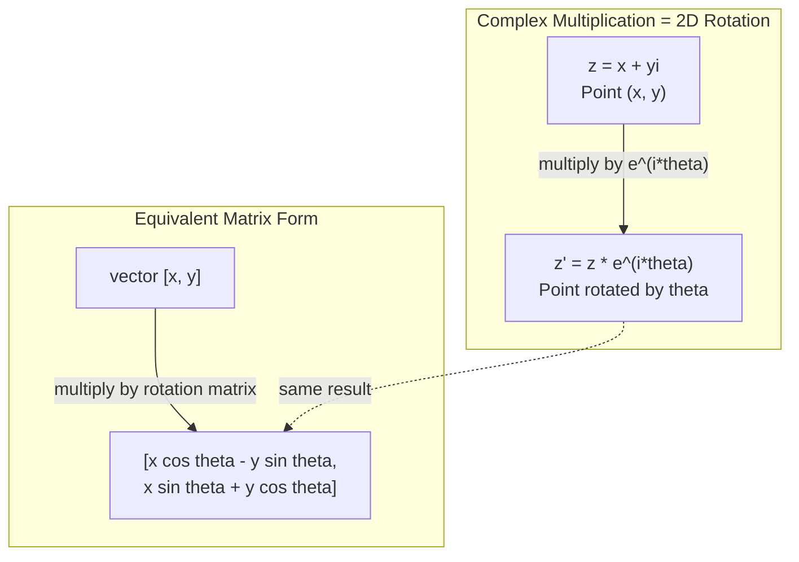
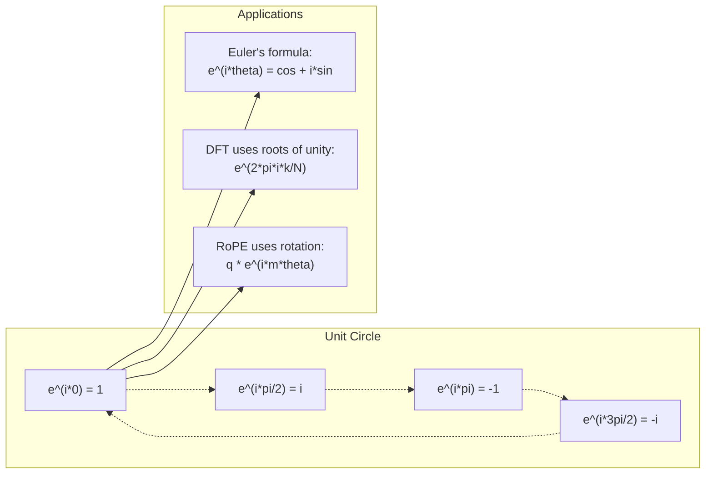

# AI 中中复数

> -1'in kare kökü boş değildir. Bu, dönüm, frekans ve yarım sinyal işleme alanının anahtarıdır.

**Type:** Learn
**Language:**Python
**Prerequisites:** Phase 1, Lessons 01-04（linear algebra, calculus）
**Time:** ~60 分钟

## Öğrenme hedefi
- Doğrudan şekil ve极坐标 şeklinde tekrar sayısal işlem yapılır (加法、乘法、除法、共)
-  Apply Euler'ın formülü 在复指数与三角函数之间转换
- kullanın                                                                                                                                                                                                                                                              
- 解释复数旋转 nasıl yapılandırılır Transformer 中 RoPE 和正弦位置编码的基础

## 问题
Fourier dönüşümleri hakkında bir makale açtınız.`i`△You查看 Transformer 位置编码, farklı sıklık altında `sin`和 `cos` 也就是复指数的实部和虚部──------- quantum calculı okuduğunda, her şeyi ifade etmek için tekrar vektör 空间 kullanıldığını keşfetmiş olursun.

复数 çok soyut görünüyor. -1'in kare kökü üzerinde kurulan bir sayısal sistem, bir tür matematik becerisi gibi hissettirilir. Fakat bu bir becerik değildir.

Eğer sayı anlamıyorsan, Fourier Transform'u anlamayacaksın. FFT'yi anlamayacaksın. Moderne dil modelindeki RoPE'yi anlamayacaksın.

Bu ders, sıfırdan yapılandırma ve sayısal işlemlerle bağlantılı olarak, geometri ile bağlantılı olarak, makine öğreniminde ortaya çıkan sayısal konumları doğruca gösterir.

## 概念
### Neyin nesi?

复数 iki bölüm vardır:实部和虚部。

```
z = a + bi

where:
  a is the real part
  b is the imaginary part
  i is the imaginary unit, defined by i^2 = -1
```

İşte böyle. Sayı aksanını bir düzine yayıyorsun. Gerçek sayı bir düzende, eksik sayı bir diğer düzende yer almaktadır.

### 复数运算

**加法。**Gerçek bir şey, gerçek bir şey.

```
(a + bi) + (c + di) = (a + c) + (b + d)i

Example: (3 + 2i) + (1 + 4i) = 4 + 6i
```

**乘法。**Uygulama kuralını kullan,并记住 i^2 = -1──

```
(a + bi)(c + di) = ac + adi + bci + bdi^2
                 = ac + adi + bci - bd
                 = (ac - bd) + (ad + bc)i

Example: (3 + 2i)(1 + 4i) = 3 + 12i + 2i + 8i^2
                            = 3 + 14i - 8
                            = -5 + 14i
```

**共轭。**翻转虚部的符号──

```
conjugate of (a + bi) = a - bi
```

Bir katı ve onun ortaklığındaki katı toplamı gerçek sayıdır:

```
(a + bi)(a - bi) = a^2 + b^2
```

**除法。**分子 ve分母 aynı zamanda 分母'nin toplamını çarpıyor.

```
(a + bi) / (c + di) = (a + bi)(c - di) / (c^2 + d^2)
```

Bu da bir parçacıkın boş kısmını yok eder ve temiz bir sayı elde eder.

### 复平面

复平面把每个复数映射到一个2D点――水平轴是实轴,垂直轴是虚轴――

```
z = 3 + 2i  corresponds to the point (3, 2)
z = -1 + 0i corresponds to the point (-1, 0) on the real axis
z = 0 + 4i  corresponds to the point (0, 4) on the imaginary axis
```

复数同时是一点,也是从原点出发的向量── bu ikili açıklama 复数在几何中有用的原因──

### 极坐标形式

Eklentide herhangi bir nokta, onu başlangıç noktasına kadar olan mesafeyi ve gerçek aksanın açısını tanımlamak için kullanılabilir.

```
z = r * (cos(theta) + i*sin(theta))

where:
  r = |z| = sqrt(a^2 + b^2)     (magnitude, or modulus)
  theta = atan2(b, a)             (phase, or argument)
```

Doğal şekil (a + bi) adaptatügefa,极坐标形式, r, theta) adaptatügefa,

**极坐标形式下的乘法。**模长相乘, açı açı

```
z1 = r1 * e^(i*theta1)
z2 = r2 * e^(i*theta2)

z1 * z2 = (r1 * r2) * e^(i*(theta1 + theta2))
```

Bu yüzden bir çarpı bir çarpı olarak bir çarpı olarak bir çarpı olarak bir çarpı olarak bir çarpı olarak bir çarpı olarak bir çarpı olarak bir çarpı olarak bir çarpı olarak bir çarpı olarak bir çarpı olarak bir çarpı olarak bir çarpı olarak bir çarpı olarak bir çarpı olarak bir çarpı olarak bir çarpı olarak bir çarpı olarak bir çarpı olarak bir çarpı olarak bir çarpı olarak bir çarpı olarak bir çarpı olarak bir çarpı olarak bir çarpı olarak bir çarpı olarak bir çarpı olarak bir çarpı olarak bir çarpı olarak bir çarpı olarak bir çarpı olarak bir çarpı olarak bir çarpı olarak bir çarpı olarak bir çarpı olarak bir çarpı olarak bir çarpı olarak bir çarpı olarak bir çarpı olarak bir çarpı olarak bir çarpı olarak bir çarpı olarak bir çarpı olarak bir çarpı olarak bir çarpı olarak bir çarpı olarak bir çarpı olarak bir çarpı olarak bir çarpı olarak bir çarpı olarak bir çarpı olarak bir çarpı olarak bir çarpı olarak bir çarpı olarak bir çarpı olarak bir çarpı olarak bir çarpı olarak bir çarpı olarak bir çarpı olarak bir çarpı olarak bir çarpı olarak bir çarpı olarak bir çarpı olarak bir çarpı olarak bir çarpı olarak bir çarpı olarak bir çarpı olarak bir çarpı olarak bir çarpı olarak bir çarpı olarak çarpı olarak bir çarpı olarak çarpı olarak çarpı olarak çarpı olarak çarpı olarak çarpı olarak çarpı bir çarpı olarak çarpı olarak çarpı bir çarpı olarak çarpı olarak çarpı çarpı olarak çarpı olarak çarpı olarak çarpı çarpı olarak çarpı çarpı çarpı çarpı çarpı çarpı çarpı çarpı çarpı çarpı çarpı çarpı çarpı çarpı çarpı çarpı çarpı çarpı çarpı çarpı çarpı çarpı çarpı çarpı çarpı çarpı çarpı çarpı çarpı çarpı çarpı çarpı çarpı çarpı çarpı çarpı çarpı çarpı çarpı çarpı çarpı çarpı çarpı çarpı çarpı çarpı çarpı çarpı çarpı çarpı çarpı çarpı çarpı çarpı çarpı çarpı çarpı çarpı çarpı çarpı çarpı çarpı çarpı çarpı çarpı çarpı çarpı çarpı çarpı çarpı çarpı çarpı çarpı çarpı çarpı çarpı çarpı çarpı çarpı çarpı çarpı çarpı çarpı çarpı çarp

### Euler'in formülü

复指数 ile 三角函数 arasındaki köprü:

```
e^(i*theta) = cos(theta) + i*sin(theta)
```

Bu, dersinin en önemli formülü.

```
e^(i*pi) = cos(pi) + i*sin(pi) = -1 + 0i = -1

Therefore: e^(i*pi) + 1 = 0
```

五个基本常数 ((e, i, pi, 1, 0) bir eşittir bağlantılı olarak

### Neden Euler'ın ML için formülü  çok önemli

Euler'in formülü gösterir,`e^(i*theta)`Bu, bir dönümün tamamını oluşturur. Bu, bir dönümün tamamını oluşturur. Bu dönümün tamamını oluşturur.

Bu, tekrar gösterge dönüştürülür anlamına gelir.

### 2D Dönüşüm ile bağlantı

将复数 (x + yi) 乘以 e^(i*theta),会把点 (x, y) 周围原点旋转 theta 角──

```
Rotation via complex multiplication:
  (x + yi) * (cos(theta) + i*sin(theta))
  = (x*cos(theta) - y*sin(theta)) + (x*sin(theta) + y*cos(theta))i

Rotation via matrix multiplication:
  [cos(theta)  -sin(theta)] [x]   [x*cos(theta) - y*sin(theta)]
  [sin(theta)   cos(theta)] [y] = [x*sin(theta) + y*cos(theta)]
```

它们产生完全相同的结果──复数乘法就是 2D 旋转──旋转矩阵 只是用矩阵记法写出的复数乘法──



### Fasar ve dönüş sinyalleri

复指数 e^(i*omega*t) 角 frekansı omega 绕单位圆旋转的点──随着t 增加,这个点将描绘出圆──

Bu dönüm noktasının gerçek kısmı cosmososososososososososososososososososososososososososososososososososososososososososososososososososososososososososososososososososososososososososososososososososososososososososososososososososososososososososososososososososososososososososososososososososososososososososososososososososososososososososososososososososososososososososososososososososososososososososososososososososososososososososososososososososososososososososososososososososososososososososososososososososososososososososososososososososososososososososososososososososososososososososososososososososososososososososososososososososososososososososososososososososososososososososososososososososososososososososososososososososososososososososososososososososososososososososososososososososososososososososososososososososososososososososososososososososososososososososososososososososososososososososososososososososososososososososososososososososososososososososososososososososososososososososososososososososososos

```
e^(i*omega*t) = cos(omega*t) + i*sin(omega*t)

Real part:      cos(omega*t)    -- a cosine wave
Imaginary part: sin(omega*t)    -- a sine wave
```

Bu, fazörün ifade etmesidir. Sen bir yükselişin asansör dalgasını takip etmeyi bırakıyorsun, tersine, bir düzlemle döndürülen okları takip ediyorsun.

### Birlik

N'den sonra birim kökü birim döngüsünün üzerinde ve birbirinden ayrı dağılımın N' noktasıdır:

```
w_k = e^(2*pi*i*k/N)    for k = 0, 1, 2, ..., N-1
```

N = 4 时,根是:1, i, -1, -i(四个罗盘方向)
N = 8'de, dört yön alırsın, dört yön katılır.

单位根 is the basis of the Discrete Fourier Transform. DFT sinyalleri bu N 个等间隔频率 üzerindeki 分量 olarak parçalacaktır.

### DFT ile bağlantı

信号 x[0], x[1], ..., x[N-1]'in Diskret Fourier Transformı ise:

```
X[k] = sum_{n=0}^{N-1} x[n] * e^(-2*pi*i*k*n/N)
```

Her X[k] sinyalin, k 个单位根 ile ilişkisini ölçmek, t.e. k 个频率 k 处 bir kopya正弦波 ile ilişkisini ölçmek için ölçülür.

### Neden yalancı değilim?

eğlence Bu kelime tarihsel tesadüflerdir. Descartes i i i i i i i i i i i i i i i i i i i i i i i i i i i i i i i i i i i i i i i i i i i i i i i i i i i i i i i i i i i i i i i i i i i i i i i i i i i i iiiiiiiiiiiiiiiiiiiiiiiiiiiiiiiiiiiiiiiiiiiiiiiiiiiiiiiiiiiiiiiiiiiiiiiiiiiiiiiiiiiiiiiiiiiiiiiiiiiiiiiiiiiiiiiiiiiiiiiiiiiiiiiii

Daha yararlı bir anlayış: i i i 90 derecelik bir dönüm makinesi. Bir kere bir gerçek sayıyı çarpıp i i i i i i i i i i i i i i i i i i i i i i i i i i i i i i i i i i i i i i i i i i i i i i i i i i i i i i i i i i i i i i i i i i i i i i i i i i i i i i i i i i i i i i i i i i i i i i i i i i i i i i i i i i i i i i i i i i i i i i i i i i i i i i i i i i i i i i i i i i i i i i i i i i i i i i i i i i i i i i i i i i i i i i i i i i i i i i i i i i i i i i i i i i i i i i i i i i i i i i i i i i i i i i i i i i i i i i i i i i i i i i i i i i i i i i i i i i i i i i i i i i i i i i i i i i i i i i i i i i i i i i i i i i i i i i i i i i i i i i i i i i i i i i i i i i i i i i i i i i i i i i i i i i i i i i i i i i i i i i i i i i i i i i i i i i i i i i i i i i i i i i i i i i i i i i i i i i i i i i i i i i i i i i i i i i i i i i i i i i i i i i i i i i i i i i i i i i i i i i i i i i i i i i i i i i i i i i i i i i i i i i i i i i i i i i i i i i i i i i i i i i i i i i i i i i i i i i i i i i i i i i i i i i i i i i i i i i i i i i i i i i i

Bu nedenle karmaşıklık, mühendislikte hiçbir yerde bulunmaz. Çevrelenen herhangi bir şey  elektromanyetik dalga, kuantum hali, sinyal titreşim, konum kodlaması  hepsi doğal olarak karmaşıklık tanımına uygun olur.

### 复指数 vs 三角函数

Euler'in formülünden önce mühendis sinyalleri A*cos olarak yazdı.

2. Sıkıntılı bir şekilde, bir yönlü bir yönlü bir yönlü bir yönlü bir yönlü bir yönlü bir yönlü yönlü bir yönlü yönlü yönlü yönlü yönlü yönlü yönlü yönlü yönlü yönlü yönlü yönlü yönlü yönlü yönlü yönlü yönlü yönlü yönlü yönlü yönlü yönlü yönlü yönlü yönlü yönlü yönlü yönlü yönlü yönlü yönlü yönlü yönlü yönlü yönlü yönlü yönlü yönlü yönlü yönlü yönlü yönlü yönlü yönlü yönlü yönlü yönlü yönlü yönlü yönlü yönlü yönlü yönlü yönlü yönlü yönlü yönlü yönlü yönlü yönlü yönlü yönlü yönlü yönlü yönlü yönlü yönlü yönlü yönlü yönlü yönlü yönlü yönlü yönlü yönlü yönlü yönlü yönlü yönlü yönlü yönlü yönlü yönlü yönlü yönlü yönlü yönlü yönlü yönlü yönlü yönlü yönlü yönlü yönlü yönlü yönlü yönlü yönlü yönlü yönlü yönlü yönlü yönlü yönlü yönlü yönlü yönlü yönlü yönlü yönlü yönlü yönlü yönlü yönlü yönlü yönlü yönlü yönlü yönlü yönlü yönlü yönlü yönlü yönlü yönlü yönlü yönlü yönlü yönlü yönlü yönlü yönlü yönlü yönlü yönlü yönlü yönlü yönlü yönlü yönlü yönlü yönlü yönlü yönlü yönlü yönlü yönlü yönlü yönlü yönlü yönlü yönlü yönlü yönlü yönlü yönlü yönlü yönlü yönlü yönlü yönlü yönlü yönlü yönlü yönlü yönlü yönlü yönlü yönlü yönlü yönlü yönlü yönlü yönlü yönlü yönlü yönlü yönlü yönlü yönlü yönlü yönlü yönlü yönlü yönlü yönlü yönlü yönlü yönlü yönlü yönlü yönlü yönlü yönlü yönlü yönlü yönlü yönlü yönlü yönlü yönlü yönlü yönlü yönlü yönlü yönlü yönlü yönlü yönlü yönlü yönlü yönlü yönlü yönlü yönlü yönlü yönlü yönlü yönlü yönlü yönlü yönlü yönlü yönlü yönlü yönlü yönlü yönlü yönlü yönlü yönlü yönlü yönlü yönlü yönlü yönlü yönlü yönlü yönlü

Tüm sinyal işleme alanı, matematik daha temiz olduğundan, sayısal kayıtlara yöneldi.

### Transformer ile bağlantı

**正弦位置编码**(原始 Transformer 论文):

```
PE(pos, 2i) = sin(pos / 10000^(2i/d))
PE(pos, 2i+1) = cos(pos / 10000^(2i/d))
```

Sin ve cos, ortaya çıkmaya karşı, bunlar farklı sıklıklı olarak tekrar indeksinin gerçek ve虚部lerdir. Her sıklık farklı bir  çözünürlük ── düşük frekans değişimi yavaş ── yüksek frekans değişimi hızlı ── ayrıntılı konum ── hepsi birlikte her konum için benzersiz frekans çizgilerini sağlarlar.

**RoPE（Rotary Position Embedding）**Daha da ileri¬¬¬, açıkça tekrar döngülmüş bir matris kullanıyor ̇ sorgu ve anahtar vektörü¬¬¬, iki simge arasındaki göreci konum bir dönüm köşesine dönüşüyor¬, dikkat bu dönümlerin ardından gelen vektörü kullanarak, modelin karşı karşı göreci konumlara duyarlılığını artırıyor¬,

| Operation | Algebraic Form | Geometric Meaning |
|-----------|---------------|-------------------|
| 加法 | (a+c) + (b+d)i | 平面中的 Vector 加法 |
| 乘法 | (ac-bd) + (ad+bc)i | 旋转并缩放 |
| 共轭 | a - bi | 关于实轴反射 |
| 模长 | sqrt(a^2 + b^2) | 到原点的距离 |
| 相位 | atan2(b, a) | 相对正实轴的角度 |
| 除法 | multiply by conjugate | 反向旋转并重新缩放 |
| 幂 | r^n * e^(i*n*theta) | 旋转 n 次，按 r^n 缩放 |




```figure
roots-of-unity
```

## Yapın onu.
### 步骤1: Kompleks 类

 Complex 数类, support运算、模长、相位,以及直角形式和极坐标形式之间转换── oluşturmak

```python
import math

class Complex:
    def __init__(self, real, imag=0.0):
        self.real = real
        self.imag = imag

    def __add__(self, other):
        return Complex(self.real + other.real, self.imag + other.imag)

    def __mul__(self, other):
        r = self.real * other.real - self.imag * other.imag
        i = self.real * other.imag + self.imag * other.real
        return Complex(r, i)

    def __truediv__(self, other):
        denom = other.real ** 2 + other.imag ** 2
        r = (self.real * other.real + self.imag * other.imag) / denom
        i = (self.imag * other.real - self.real * other.imag) / denom
        return Complex(r, i)

    def magnitude(self):
        return math.sqrt(self.real ** 2 + self.imag ** 2)

    def phase(self):
        return math.atan2(self.imag, self.real)

    def conjugate(self):
        return Complex(self.real, -self.imag)
```

### 步骤 2:极坐标转换与Euler'ın formülü

```python
def to_polar(z):
    return z.magnitude(), z.phase()

def from_polar(r, theta):
    return Complex(r * math.cos(theta), r * math.sin(theta))

def euler(theta):
    return Complex(math.cos(theta), math.sin(theta))
```

验证:`euler(theta).magnitude()`应始终为 1.0──`euler(0)`应给出 (1, 0)`euler(pi)`应给出 (-1, 0)

### 3 adım: dönüş

将点 (x, y) 旋转 the theta 角, sadece bir kez tekrar tekrar tekrar yapılması gerekir:

```python
point = Complex(3, 4)
rotated = point * euler(math.pi / 4)
```

模长保持不变──只有角度发生变化──

### 4 adım: DFT'nin sayısal işlemlere dayalı

```python
def dft(signal):
    N = len(signal)
    result = []
    for k in range(N):
        total = Complex(0, 0)
        for n in range(N):
            angle = -2 * math.pi * k * n / N
            total = total + Complex(signal[n], 0) * euler(angle)
        result.append(total)
    return result
```

Bu O(N^2)'nin DFT¬idir. Her çıkış X[k] 都是信号样本乘以单位根后的总和──

### 步骤 5: Ters DFT

Ters DFT, frekans spektrinden orijinal sinyalleri yeniden oluşturur. DFT'ye göre, tek değişim: N olarak ayrılmış, dönüşüm göstergesindeki simgelerdir.

```python
def idft(spectrum):
    N = len(spectrum)
    result = []
    for n in range(N):
        total = Complex(0, 0)
        for k in range(N):
            angle = 2 * math.pi * k * n / N
            total = total + spectrum[k] * euler(angle)
        result.append(Complex(total.real / N, total.imag / N))
    return result
```

Bu mükemmel bir yeniden yapı sağlayacaktır. Önce DFT uygula, sonra IDFT uygula, makinenin hassaslığı sınırında orijinal sinyal elde edeceksiniz.

### 步骤 6: birim

```python
def roots_of_unity(N):
    return [euler(2 * math.pi * k / N) for k in range(N)]
```

验证 iki nitelik:
- Her kökün şekli 1'dir.
- Ürünler birbirlerine karşı karşı ödemeler yaparlar.

Bu özellikler DFT'yi tersine yapar.

## Kullan
Python 内置支持复数──字面量 `j`Göstermek için birim.

```python
z = 3 + 2j
w = 1 + 4j

print(z + w)
print(z * w)
print(abs(z))

import cmath
print(cmath.phase(z))
print(cmath.exp(1j * cmath.pi))
```

对于数组,numpy 原生支持复数:

```python
import numpy as np

z = np.array([1+2j, 3+4j, 5+6j])
print(np.abs(z))
print(np.angle(z))
print(np.conj(z))
print(np.real(z))
print(np.imag(z))

signal = np.sin(2 * np.pi * 5 * np.linspace(0, 1, 128))
spectrum = np.fft.fft(signal)
freqs = np.fft.fftfreq(128, d=1/128)
```

## - Söyle.
运行  İşlem`code/complex_numbers.py`Yaratmak`outputs/skill-complex-arithmetic.md`- Evet.

## 练习
1. **手算复数运算。**計算 (2 + 3i) * (4 - i),并用代码验证──然后计算 (5 + 2i) / (1 - 3i)──把两个结果都画在复平面上,并检查乘法是否旋转并缩放第一数──

2. **旋转序列。**Ardından, her adımın bir satırını yazdırıp, onları bir düz 12 边形に描くことを確認します.

3. **已知信号的 DFT。**创建一个信号,它在32个点上采样 sin(2*pi*3*t) 与 0.5*sin(2*pi*7*t) 之和──运行你的DFT──验证幅度频谱在频率 3 和 7 处有峰值,并且频率 7 处的峰值高度是频率 3 处的一半──

4. **单位根可视化。**計算 8 次单位根──验证它们的和为零──验证任意根乘以本原根 e^(2*pi*i/8) 都会得到下根──

5. **旋转 Matrix 等价性。**10 随机角度 ve 10 随机点,验证复数乘法 verilen sonuçlar 2x2 旋转矩阵 进行矩阵向 乘法 的结果相同――印最大数值差──

## 关键术语
| Term | What it means |
|------|---------------|
| 复数 | 形如 a + bi 的数，其中 a 是实部，b 是虚部，并且 i^2 = -1 |
| 虚数单位 | 数 i，定义为 i^2 = -1。它在哲学意义上并不“虚”——它是一个旋转算子 |
| 复平面 | x 轴为实轴、y 轴为虚轴的 2D 平面。也称为 Argand plane |
| 模长（模） | 到原点的距离：sqrt(a^2 + b^2)。写作 \|z\| |
| 相位（辐角） | 相对正实轴的角度：atan2(b, a)。写作 arg(z) |
| 共轭 | 关于实轴的镜像：a + bi 的共轭是 a - bi |
| 极坐标形式 | 将 z 表示为 r * e^(i*theta)，而不是 a + bi。让乘法变得容易 |
| Euler's formula | e^(i*theta) = cos(theta) + i*sin(theta)。连接指数函数与三角函数 |
| Phasor | 表示正弦信号的旋转复数 e^(i*omega*t) |
| 单位根 | k = 0 到 N-1 时的 N 个复数 e^(2*pi*i*k/N)。单位圆上等间隔的 N 个点 |
| DFT | Discrete Fourier Transform。使用单位根将信号分解为复正弦分量 |
| RoPE | Rotary Position Embedding。使用复数乘法在 Transformer Attention 中编码相对位置 |

## 延伸阅读
- [Visual Introduction to Euler's Formula](https://betterexplained.com/articles/intuitive-understanding-of-eulers-formula/)-Küçük gazetecilik kullanmadan bir bilimsel anlayış oluşturmak
- [Su et al.: RoFormer (2021)](https://arxiv.org/abs/2104.09864)-                                                                                                                                                                                                                                                                                                                                                                                                                                                                                                                             
- [Vaswani et al.: Attention Is All You Need (2017)](https://arxiv.org/abs/1706.03762)-                                                                                                                                                                                                                                                                                                                                                                                                                                                                                                                             
- [3Blue1Brown: Euler's formula with introductory group theory](https://www.youtube.com/watch?v=mvmuCPvRoWQ)- e^(i*pi) = -1'in görülebilir açıklaması
- [Needham: Visual Complex Analysis](https://global.oup.com/academic/product/visual-complex-analysis-9780198534464)-                                                                                                                                                                                                                                                                                                                                                                                                                                                                                                                             
- [Strang: Introduction to Linear Algebra, Ch. 10](https://math.mit.edu/~gs/linearalgebra/)- 线性代数和特征值语境中的复数
