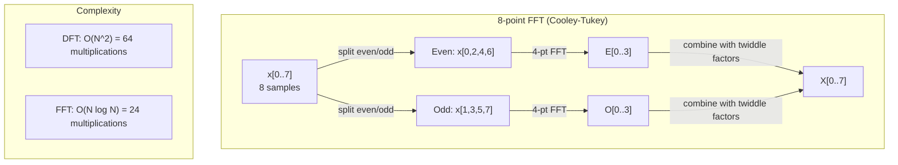
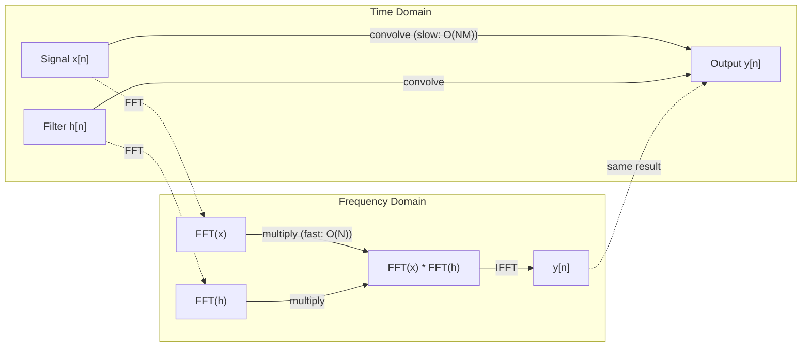

# Fourier Değişimi

> Her sinyal sinüs dalgalarının birleştirilmesi. Fourier dönüşümü size bazılarını söyleyecektir.

**Type:** Build
**Language:**Python
**Prerequisites:** Phase 1, Lessons 01-04, 19 (complex numbers)
**Time:** ~90 分钟

## Öğrenme hedefi
- Bu yüzden, bu konuda bir şey yapmamalıyız.
- Frekans katılıklarını anlamak: sinyalden amplitüde, faz ve güç spektrumunu çıkarmak
- 应用 convolution teoremi, FFT çarpımı yoluyla 执行 convolution
- Fourier frekansı parçalanmasını transformatör pozisyon kodlamaları ve CNN konvulsiyon katmanları ile bağlayın

## 问题
Bir ses ses ses kayıtı, zamanla değişen bir dizi basınç ölçüm değeri. Hissi değerleri, zamanla değişen bir dizi sayı değeri.

Ancak zaman alanında birçok desen görünmez. Bu ses sinyali saf ton mu yoksa akord mu? Bu payın haftalık döngüsü var mı? Bu resimlerin tekrarlanan dokuları mı var mı?

Fourier transformı, verileri zaman domeninden frekans domenine dönüştürür. Bir sinyal alır ve farklı frekanslarda sinüs dalgalarına ayrılır.

Bu ML için  çok önemlidir, çünkü frekans alanı düşüncesi 隨處可见── Konvolyasyonal sinir ağları  konvulsiyonu gerçekleştirir, konvulsiyon ise frekans alanında çoğaltmaktır── Transformer pozisyonal kodlamaları Frequency decomposition kullanmak için konum göstermek için konum kullanmak── Ses tanıma modeli (audio modeller, ses tanıma, müzik üretimi) spektrogramları, seslerin frekans temsillerini işlemek── Zaman dizisi modelleri, periyodik desenler aramak── Fourier dönüşümünü anlamak, bu sorunları işlemek için gerekli kelime birikmesini hazırlamak──

## 概念
### DFT tanımı

给定 N 个 örnekler x[0], x[1], ..., x[N-1],Diskrete Fourier Transform 会生成 N 个 frekans katılamaları X[0], X[1], ..., X[N-1]:

```
X[k] = sum_{n=0}^{N-1} x[n] * e^(-2*pi*i*k*n/N)

for k = 0, 1, ..., N-1
```

Her X[k] şehir karmaşık bir sayıdır. Büyüklüğü, X[k] de frekans k'nin amplitudesini ifade eder.

关键洞见:`e^(-2*pi*i*k*n/N)`Bu, sinyalin N 个等间隔频中每个信号与 N 个等间隔频中的相关性. Eğer sinyal k 上频内含有能量,相关性就很大――否则,它接近零――

### Her bir dizi anlamı

**X[0]: DC component。**Bu, tüm örneklerin toplamı, ortalama 成比例¬ı ile birlikte, sinyalin sabitini ifade eder.

```
X[0] = sum_{n=0}^{N-1} x[n] * e^0 = sum of all samples
```

**X[k] for 1 <= k <= N/2: positive frequencies。**X[k] göstermek için her N 个 örnek 中 k 个周期 的频率──k 越大,频率 越高(oscillation 越快)──

**X[N/2]: Nyquist frequency。**Bu N 个 örnek 能表示的最高频率── bu frekanstan fazla, yani yüksek frekanslar 伪装为低频──

**X[k] for N/2 < k < N: negative frequencies。**对于真值信号,X[N-k] = conj(X[k])。负 frekanslar 阳性的镜像──这就是为什么有用信息位于前 N/2 + 1 个系数中──

### Ters DFT

Ters DFT frekans katılıkları yeniden yapılandırma:

```
x[n] = (1/N) * sum_{k=0}^{N-1} X[k] * e^(2*pi*i*k*n/N)

for n = 0, 1, ..., N-1
```

Forward DFT'nin tek farkı: Eksponent arasında bir normalde bulunur.

Ters DFT mükemmel bir yeniden yapılandırmadır. Hiçbir bilgiyi kaybetmez. Zaman domeninden frekans domenine, tekrar geri dönebilir ve herhangi bir hata yapmadan geri dönebilirsiniz.

### FFT: hızlı hale getirmek

Yukarıda tanımlanan DFT ise O(N^2): N 个 çıktısı koeficientleri arasında her biri, N 个 giriş örnekleri 求和──当 N = 1 milyon 时,这就是10^12次操作──

Hızlı Fourier Değişimi (FFT) O(N log N) ile hesaplanır 計算同樣的結果──当 N = 1 milyon 时, bu yaklaşık olarak bir milyar değil, yaklaşık 20000000 kez işlemdir.

Cooley-Tukey algoritması (((最常见的 FFT) bölün ve fethet kullanın:

1. Sinyal ızgaralı ve eşsiz indeksli örneklere bölünecek.
2. 递归计算每一半的DFT──
3. "Yarı boyutlu ikili faktör" kullanın e^(-2*pi*i*k/N) 合并两个半尺寸 DFT;;

```
X[k] = E[k] + e^(-2*pi*i*k/N) * O[k]          for k = 0, ..., N/2 - 1
X[k + N/2] = E[k] - e^(-2*pi*i*k/N) * O[k]    for k = 0, ..., N/2 - 1

where E = DFT of even-indexed samples
      O = DFT of odd-indexed samples
```

Bu simetri, dönüşümlü olan her bir aşamada O  N) çalışmasını gerçekleştirmek anlamına gelir ve log2 N) aşamaları vardır.



FFT  sinyal uzunluğu isteniyor 2 ── pratikte, sinyaller genellikle sıfır-padı bir sonraki 2 ──

### Spektral analiz

**power spectrum**Bu da her frekansın katı büyüklüğüdür.

**phase spectrum**Bu, her frekansın fazının ofset olmasıdır. Çoğu analiz görevi için, güç spektrumu ile ilgileniyorsunuz.

```
Power at frequency k:  P[k] = |X[k]|^2 = X[k].real^2 + X[k].imag^2
Phase at frequency k:  phi[k] = atan2(X[k].imag, X[k].real)
```

### Frekans çözünürlüğü

DFT'nin frekans çözünürlüğü  örneklerin sayı N ve örnekleme oranı fs¬'ye bağlıdır.

```
Frequency of bin k:      f_k = k * fs / N
Frequency resolution:    delta_f = fs / N
Maximum frequency:       f_max = fs / 2  (Nyquist)
```

İki çok yakın frekansı ayırmak için daha fazla örnek gerekmektedir. Yüksek frekansları yakalamak için daha yüksek örnekleme oranına ihtiyaç vardır.

### Konvulsiyon teoremi

Bu sinyal işleme sonucunda en önemli sonuçlardan biri ve CNN'lerle doğrudan bağlantılıdır.

**time domain 中的 convolution 等于 frequency domain 中的 pointwise multiplication。**

```
x * h = IFFT(FFT(x) . FFT(h))

where * is convolution and . is element-wise multiplication
```

Neden bu önemli:

- 两个长度为 N 和 M'nin sinyalleri 直接 convolution 需要 O(N*M) işlemleri。
- 基于 FFT 的卷曲 需要 O(N log N):transform 两者、乘、转转──
- Büyük çekirdekler için, FFT konvulsiyonı 会快得多──
- Bu büyük kabul alanları olan konvulsiyon katmanlarında olan bir şey.

Not:DFT  hesaplamak dairesel kıvrımdır(sinyal 会 etrafta sarılır)。 çizgi kıvrım için(önüklenmez), lütfen hesaplamak için önce iki sinyal sıfır-pad 到长度 N + M - 1。



### Pencere

DFT 假设信号是周期的,也就是把N个样本 视为无限重复信号的一个周期――信号的起点和终点若不是相同值,就会在边界产生不连续性,并表现为虚假的高频内容―― దీనిని spektral leakage olarak adlandırırlar.

Pencere Hesaba Katılması DFT Önceki sinyal 双端 taper到零, böylece sızıntıları azaltmak için.

常见 pencereler:

| Window | Shape | Main lobe width | Side lobe level | Use case |
|--------|-------|----------------|-----------------|----------|
| Rectangular | 平坦（无 window） | 最窄 | 最高 (-13 dB) | 当 signal 在 N 个 samples 中正好 periodic 时 |
| Hann | Raised cosine | 中等 | 低 (-31 dB) | 通用 spectral analysis |
| Hamming | Modified cosine | 中等 | 更低 (-42 dB) | Audio processing、speech analysis |
| Blackman | Triple cosine | 宽 | 非常低 (-58 dB) | 当 side lobe suppression 至关重要时 |

```
Hann window:    w[n] = 0.5 * (1 - cos(2*pi*n / (N-1)))
Hamming window: w[n] = 0.54 - 0.46 * cos(2*pi*n / (N-1))
```

DFT'den önce, bir pencereyi sinyalle bir element-hikmetli çarpma yaparak uygulamak için pencereyi:`X = DFT(x * w)`- Evet.

### DFT özellikleri

| Property | Time Domain | Frequency Domain |
|----------|-------------|-----------------|
| Linearity | a*x + b*y | a*X + b*Y |
| Time shift | x[n - k] | X[f] * e^(-2*pi*i*f*k/N) |
| Frequency shift | x[n] * e^(2*pi*i*f0*n/N) | X[f - f0] |
| Convolution | x * h | X * H (pointwise) |
| Multiplication | x * h (pointwise) | X * H (circular convolution, scaled by 1/N) |
| Parseval's theorem | sum \|x[n]\|^2 | (1/N) * sum \|X[k]\|^2 |
| Conjugate symmetry (real input) | x[n] real | X[k] = conj(X[N-k]) |

Parseval teoremi, toplam enerjinin iki alan arasında aynı olduğunu gösterir.

### Konaklama kodlamaları ile bağlantı

原始 Transformer 使用 sinusoidal pozisyon kodlamaları:

```
PE(pos, 2i)   = sin(pos / 10000^(2i/d_model))
PE(pos, 2i+1) = cos(pos / 10000^(2i/d_model))
```

Her bir boyut (2i, 2i+1) farklı frekanslarda titreşiyor. Yüksek seviye 0,1'den düşük seviyeyeyeye kadar olan frekanslar, geometrik mesafeye göre düzenlenmektedir. Bu, her konumdaki tüm frekans bantlarında Fourier katılıklarına benzer şekilde, bir sinyalin nasıl fark edileceğini belirler.

Önemli özellikleri:

- **Uniqueness:**Her iki pozisyonda aynı kodlama olmayacak.
- **Bounded values:**Sin 和 cos 始终在 [-1, 1] 内。
- **Relative position:**pozisyon p+k'ın kodlanması konum p'处 kodlama için lineer fonksiyon olarak ifade edilebilir。 model görevi pozisyonları takip etmeyi öğrenir。

### CNN'lere bağlantı

Konvülsiyon katmanı 通過在信号或图上滑动一个学会过器 (kernel) ),将其应用到输入──数学上,这就是 convolution操作──

Konvulsiyon teoremine göre,
1. Giriş için FFT
2. Yükleme çekirdeği için FFT
3. Frekans alanında çarpın
4. IFFT'yi gerçekleştirmek için

标准 CNN 实现使用直接卷积 (直卷积) 🏻对小型3x3核更快) 🏻, ancak büyük核或全球卷积 (global卷积) 🏻 için, FFT'ye dayalı yöntemler daha belirgin olacaktır. Bazı mimarlıklar (örneğin FNet) tamamen FFT'yi kullanarak 替代 etmektedir.

### Spektrogramlar ve Kısa Zamanlı Fourier Değişimi

单次 FFT tüm sinyalin frekans içeriğini verecektir, ancak bu frekansların ne zaman ortaya çıktığını söyleyemez. ppppppppppppppppppppppppppppppppppppppppppppppppppppppppppppppppppppppppppppppppppppppppppppppppppppppppppppppppppppppppppppppppppppp

Kısa Zaman Fourier Değiştirme (STFT) ⇒ Sinyalın üst-üstünü kaplayan pencereler üzerinden FFT'yi hesaplamak için bu sorunu çözmek için. Sonuç: bir 2 boyutlu spektrogram, bunlardan bir eksesi zaman, diğer bir eksesi frekansdır.

```
STFT procedure:
1. Choose a window size (e.g., 1024 samples)
2. Choose a hop size (e.g., 256 samples -- 75% overlap)
3. For each window position:
   a. Extract the windowed segment
   b. Apply a Hann/Hamming window
   c. Compute FFT
   d. Store the magnitude spectrum as one column of the spectrogram
```

Spektrogramlar, ses ML modellerinin standart giriş temsilidir. Sessizleme tanıma modelleri.

### İsimsiz

Eğer sinyal 包含高于 fs/2 (Nyquist frekansı) frekansları ise, 速率 fs örneklemesi olarak, nümlü kopyalar üretilir. 100 Hz örneklemesi ile yapılan 90 Hz sinyal, nümlü 10 Hz ile tamamen aynı nümlüdür. nümlüyle nümlü olarak nümlü olarak nümlü olarak nümlü olarak nümlü olarak nümlü olarak nümlü olarak nümlü olarak nümlü olarak nümlü olarak nümlü olarak nümlü olarak nümlü olarak nümlü olarak nümlü olarak nümlü olarak nümlü olarak nümlü olarak nümlü olarak nümlü olarak nümlü olarak nümlü olarak nümlü olarak nümlü olarak nümlü olarak nümlü olarak nlü olarak nümlü olarak nlü olarak nümlü olarak nlü olarak nümlü olarak nümlü olarak nümlü olarak nümlü olarak nümlü olarak nümlü olarak nümlü olarak nümlü olarak nümlü nümlü olarak nnnnnnnnnnnnnnnnnnnnnnnnnnnnnnnnnnnnnnnnnnnnnnnnnnnnnnnnnnnnnnnnnnnnnnnnnnnnnnnnnnnnnnnnnnnnnn

```
Example:
  True signal: 90 Hz sine wave
  Sampling rate: 100 Hz
  Apparent frequency: 100 - 90 = 10 Hz

  The samples from the 90 Hz signal at 100 Hz sampling rate
  are identical to the samples from a 10 Hz signal.
  No amount of math can recover the original 90 Hz.
```

Bu nedenle analog-dijital dönüştürücüler, örnekleme sırasında anti-aliasing filtrelerini içerir.

### sıfır patlama çözünürlüğünü artırmaz

Bir yaygın yanlış anlaşma şu: FFT'de sinyal önüne sıfır patlama yapılır, frekans çözünürlüğünü artırır.

Gerçek frekans çözünürlüğü sadece gözlem süresine bağlı T = N / fs。 iki frekansın delta_f arasındaki farkı ayırt etmek için, en az T = 1 / delta_f 秒'un verisine ihtiyacınız vardır。 Ne kadar sıfır patlama yaparsanız yapın, bu temel sınırı değiştiremezsiniz。


```figure
fourier-synthesis
```

## Yapın onu.
### 步骤 1: DFT sıfırdan

O(N^2) DFT 直接来自定义──

```python
import math

class Complex:
    ...

def dft(x):
    N = len(x)
    result = []
    for k in range(N):
        total = Complex(0, 0)
        for n in range(N):
            angle = -2 * math.pi * k * n / N
            w = Complex(math.cos(angle), math.sin(angle))
            xn = x[n] if isinstance(x[n], Complex) else Complex(x[n])
            total = total + xn * w
        result.append(total)
    return result
```

### 步骤 2: Ters DFT

结构相同, exponent 为正,并除以 N。

```python
def idft(X):
    N = len(X)
    result = []
    for n in range(N):
        total = Complex(0, 0)
        for k in range(N):
            angle = 2 * math.pi * k * n / N
            w = Complex(math.cos(angle), math.sin(angle))
            total = total + X[k] * w
        result.append(Complex(total.real / N, total.imag / N))
    return result
```

### 步骤 3: FFT (Cooley-Tukey)

Tekrar FFT 要求长度为 2 的──拆分为 even 和 odd,递归, sonra ikili faktörler 合并──

```python
def fft(x):
    N = len(x)
    if N <= 1:
        return [x[0] if isinstance(x[0], Complex) else Complex(x[0])]
    if N % 2 != 0:
        return dft(x)

    even = fft([x[i] for i in range(0, N, 2)])
    odd = fft([x[i] for i in range(1, N, 2)])

    result = [Complex(0)] * N
    for k in range(N // 2):
        angle = -2 * math.pi * k / N
        twiddle = Complex(math.cos(angle), math.sin(angle))
        t = twiddle * odd[k]
        result[k] = even[k] + t
        result[k + N // 2] = even[k] - t
    return result
```

### 步骤 4: Spektral analiz yardımcıları

```python
def power_spectrum(X):
    return [xk.real ** 2 + xk.imag ** 2 for xk in X]

def convolve_fft(x, h):
    N = len(x) + len(h) - 1
    padded_N = 1
    while padded_N < N:
        padded_N *= 2

    x_padded = x + [0.0] * (padded_N - len(x))
    h_padded = h + [0.0] * (padded_N - len(h))

    X = fft(x_padded)
    H = fft(h_padded)

    Y = [xk * hk for xk, hk in zip(X, H)]

    y = idft(Y)
    return [y[n].real for n in range(N)]
```

## Kullan
Gerçek çalışmalarda, numpy'nin FFT'lerini kullanırken, yüksek derecede optimize edilmiş C kütüphaneleri tarafından desteklenir.

```python
import numpy as np

signal = np.sin(2 * np.pi * 5 * np.arange(256) / 256)
spectrum = np.fft.fft(signal)
freqs = np.fft.fftfreq(256, d=1/256)

power = np.abs(spectrum) ** 2

positive_freqs = freqs[:len(freqs)//2]
positive_power = power[:len(power)//2]
```

对于窗户和更高级的光谱分析:

```python
from scipy.signal import windows, stft

window = windows.hann(256)
windowed = signal * window
spectrum = np.fft.fft(windowed)
```

 Konvulsiyon için:

```python
from scipy.signal import fftconvolve

result = fftconvolve(signal, kernel, mode='full')
```

Spektrogramlar için:

```python
from scipy.signal import stft

frequencies, times, Zxx = stft(signal, fs=sample_rate, nperseg=256)
spectrogram = np.abs(Zxx) ** 2
```

Spektrogram Matrix'in şekli ise (n_frequencies, n_time_frames) ⋅ her bir satır bir zaman penceresidir ⋅ yukarıdaki güç spektrumu ⋅ bu da ses ML modelleri ⋅ giriş ⋅ tüketim ⋅ içeriği olarak ⋅

## - Söyle.
运行  İşlem`code/fourier.py`Ürün`outputs/prompt-spectral-analyzer.md`- Evet.

## 练习
1. **Pure tone identification。**1 ~ 50 Hz 之间) belirsiz bir frekans içeren bir sinyal oluşturun, 128 Hz örneklemesi ile 1 saniye. 128 Hz 128 Hz 128 Hz 128 Hz 128 Hz 128 Hz 128 Hz 128 Hz 128 Hz 128 Hz 128 Hz 128 Hz 128 Hz 128 Hz 128 Hz 128 Hz 128 Hz 128 Hz 128 Hz 128 Hz 128 Hz 128 Hz 128 Hz 128 Hz 128 Hz 128 Hz 128 Hz 128 Hz 128 Hz 128 Hz 128 Hz 128 Hz 128 Hz 128 Hz 128 Hz 128 Hz 128 Hz 12 Hz 12 Hz 12 Hz 12 Hz 12 Hz 12 Hz 12 Hz 12 Hz 12 Hz 12 Hz 12 Hz 12 Hz 12 Hz 12 Hz 12 Hz 12 Hz 12 Hz 12 Hz 12 Hz 12 Hz 12 Hz 12 Hz 12 Hz 12 Hz 12 Hz 12 12 12 12 12 12  12 12 12 12  12  12 12  12  12 12  12  12   12 12  12  12   12  12  12   12   12   12  12  12   12    12   12      12    12       

2. **FFT vs DFT verification。**生成 64'lik bir uzunlukta rastgele sinyal. Aynı zamanda DFT(O(N^2)) ve FFT──验证 tüm katılamları 1e-10'a göre uyumlu olarak oluşturulur. 256、512、1024、2048'lik bir uzunlukta sinyaller için iki işlevi oluşturur.

3. **Convolution theorem proof by example。**创建信号 x = [1, 2, 3, 4, 0, 0, 0, 0] 和 filter h = [1, 1, 1, 0, 0, 0, 0, 0]──直接计算它们的圆形卷曲 (圆形卷曲) ─然后通过FFT 计算(转变、乘、逆转转转) ─验证结果匹配──现在通过适当的零执行线形卷曲──

4. **Windowing effects。**创建一个信号,它是10 Hz 和 12 Hz(非常接近) 两波的和──以128 Hz 采样 1秒──分别在无窗、汉窗 和汉明窗 下计算电源谱──哪个窗是最容易区分两峰?为什么?

5. **Positional encoding analysis。**D_model = 128 和 max_pos = 512 生成 sinuslu pozisyon kodlamaları──对对位置 (p1, p2),计算它们的点产品──说明点产品 只依赖于p1 - p2的位置,而不依赖于绝对位置──随着距离 增加,点产品会发生什么?

## 关键术语
| Term | What it means |
|------|---------------|
| DFT (Discrete Fourier Transform) | 将 N 个 time-domain samples 转换为 N 个 frequency-domain coefficients。每个 coefficient 都是与该 frequency 上 complex sinusoid 的 correlation |
| FFT (Fast Fourier Transform) | 用于计算 DFT 的 O(N log N) algorithm。Cooley-Tukey algorithm 递归拆分 even/odd indices |
| Inverse DFT | 从 frequency coefficients 重建 time-domain signal。公式与 DFT 相同，但 exponent sign 相反，并带有 1/N scaling |
| Frequency bin | DFT output 中的每个 index k 表示 frequency k*fs/N Hz。"bin" 是离散的 frequency slot |
| DC component | X[0]，zero-frequency coefficient。与 signal mean 成比例 |
| Nyquist frequency | fs/2，在 sampling rate fs 下可表示的最大 frequency。高于它的 frequencies 会 alias |
| Power spectrum | \|X[k]\|^2，每个 frequency coefficient 的 squared magnitude。显示 energy 在 frequencies 上的分布 |
| Phase spectrum | angle(X[k])，每个 frequency component 的 phase offset。在 analysis 中通常会忽略 |
| Spectral leakage | 将 non-periodic signal 当作 periodic 处理导致的虚假 frequency content。可通过 windowing 减少 |
| Window function | 在 DFT 前应用的 tapering function（Hann、Hamming、Blackman），用于减少 spectral leakage |
| Twiddle factor | FFT butterfly computation 中用于合并 sub-DFTs 的 complex exponential e^(-2*pi*i*k/N) |
| Convolution theorem | time domain 中的 convolution 等于 frequency domain 中的 pointwise multiplication。它是 signal processing 和 CNNs 的基础 |
| Circular convolution | signal 会 wrap around 的 convolution。这是 DFT 自然计算的内容 |
| Linear convolution | 没有 wraparound 的标准 convolution。通过在 DFT 前 zero-padding 实现 |
| Parseval's theorem | 总 energy 在 Fourier transform 中保持不变。sum \|x[n]\|^2 = (1/N) sum \|X[k]\|^2 |
| Aliasing | 当 sampling rate 不足时，高于 Nyquist 的 frequencies 表现为较低 frequencies |

## 延伸阅读
- [Cooley & Tukey: An Algorithm for the Machine Calculation of Complex Fourier Series (1965)](https://www.ams.org/journals/mcom/1965-19-090/S0025-5718-1965-0178586-1/)- 改变计算的原始 FFT 论文
- [3Blue1Brown: But what is the Fourier Transform?](https://www.youtube.com/watch?v=spUNpyF58BY)- Fourier dönüşümlerinin en iyi görünümlü girişleri
- [Lee-Thorp et al.: FNet: Mixing Tokens with Fourier Transforms (2021)](https://arxiv.org/abs/2105.03824)- Transformatörler arasında FFT  Yerine özdeyiş
- [Smith: The Scientist and Engineer's Guide to Digital Signal Processing](http://www.dspguide.com/)- 免费在线教材,深入覆盖 FFT、windowing 和光谱分析
- [Vaswani et al.: Attention Is All You Need (2017)](https://arxiv.org/abs/1706.03762)- Fourier frekansı parçalanması                                                                                                                                                                                                                                                                                                                                                                                                                                                                                                                      
- [Radford et al.: Whisper (2022)](https://arxiv.org/abs/2212.04356)- mel-spektrogramları kullanmak  giriş temsilciliği olarak konuşma tanıma
